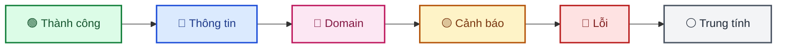
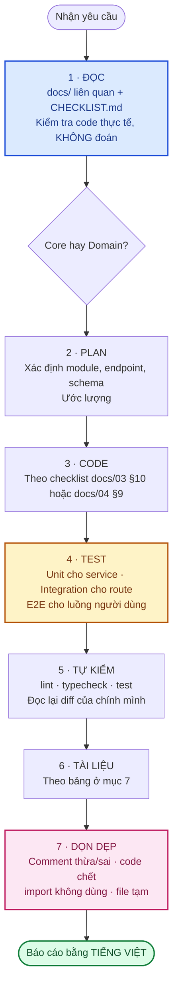

# CLAUDE.md — Quy ước làm việc trên dự án FLOWER

Hướng dẫn cho **AI assistant (Claude Code)** và **dev** khi làm việc trên repository này.
Đọc file này trước khi thực hiện bất kỳ thay đổi nào.

> Tài liệu kỹ thuật đầy đủ: [`docs/`](docs/) — bắt đầu từ [`docs/README.md`](docs/README.md).
> Theo dõi tiến độ: [`CHECKLIST.md`](CHECKLIST.md).

---

## 1. 🇻🇳 Ngôn ngữ — tiếng Việt là mặc định

**Luôn báo cáo và viết tài liệu bằng tiếng Việt.**

| Loại nội dung | Ngôn ngữ |
|---|---|
| Báo cáo, giải thích, trả lời người dùng | **Tiếng Việt** |
| Tài liệu trong `docs/` | **Tiếng Việt** |
| Comment trong code | **Tiếng Việt** |
| Thông điệp lỗi hiển thị cho người dùng | **Tiếng Việt** |
| Tên biến, tên hàm, tên file | Tiếng Anh (`camelCase`) |
| Mã lỗi (`code`) | Tiếng Anh `UPPER_SNAKE_CASE` — dành cho máy đọc |
| Commit message, tên nhánh | Tiếng Anh (quy ước ngành) |

### Quy tắc với thuật ngữ kỹ thuật

**Giữ nguyên thuật ngữ tiếng Anh**, kèm bản dịch hoặc chú thích ở **lần xuất hiện đầu tiên trong
mỗi tài liệu**:

```markdown
✅ ĐÚNG:
Hệ thống dùng **RBAC** (*Role-Based Access Control* — phân quyền dựa trên vai trò).
Cơ chế **fail-fast** (*hỏng sớm*): thiếu biến bắt buộc thì dừng ngay lúc khởi động.
Chống **IDOR** (*Insecure Direct Object Reference* — truy cập tài nguyên của người khác
bằng cách đoán ID).

❌ SAI — dịch cứng, mất nghĩa gốc, người đọc không tra cứu tiếp được:
Hệ thống dùng "kiểm soát truy cập dựa trên vai trò".
Cơ chế "thất bại nhanh".

❌ SAI — dùng thuật ngữ trần, người mới không hiểu:
Hệ thống dùng RBAC với fail-fast và chống IDOR.
```

**Không dịch**: `middleware`, `endpoint`, `token`, `cookie`, `service`, `controller`, `repository`,
`migration`, `seed`, `commit`, `merge`, `deploy`, `build`, `cache`, `query`, `schema`, `slug`,
`rate limit`, `presigned URL`, `webhook`, tên công nghệ (`Prisma`, `Express`, `Next.js`).

---

## 2. 📊 Sơ đồ — luôn dùng Mermaid

**Mọi sơ đồ trong dự án phải viết bằng Mermaid**, không dùng ASCII art, không chèn ảnh.

Lý do: Mermaid render trực tiếp trên GitHub/GitLab/VS Code/GitBook, sửa được bằng text,
theo dõi được thay đổi qua Git diff.

### Chọn loại sơ đồ

| Nhu cầu | Loại |
|---|---|
| Luồng xử lý, cây quyết định, kiến trúc | `flowchart TD` / `flowchart LR` |
| Tương tác giữa nhiều thành phần theo thời gian | `sequenceDiagram` |
| Quan hệ bảng dữ liệu | `erDiagram` |
| Vòng đời một đối tượng | `stateDiagram-v2` |
| Lộ trình theo thời gian | `gantt` |
| Tỉ lệ | `pie showData` |
| Ma trận 2 chiều (rủi ro, ưu tiên) | `quadrantChart` |
| Phân nhóm ý | `mindmap` |

### 🎨 Bảng màu chuẩn — BẮT BUỘC tuân thủ

Mermaid ở **dark mode** mặc định tô chữ màu sáng. Nếu chỉ đặt `fill` sáng mà không đặt `color`,
chữ sáng nằm trên nền sáng → **không đọc được**. Vì vậy **luôn đặt cả `fill`, `stroke` và `color`**
để sơ đồ hiển thị giống hệt nhau ở cả light lẫn dark mode.

| Vai trò | Cú pháp đầy đủ |
|---|---|
| 🟢 Thành công / hoàn thành | `fill:#dcfce7,stroke:#15803d,stroke-width:2px,color:#14532d` |
| 🔵 Backend / thông tin | `fill:#dbeafe,stroke:#1d4ed8,stroke-width:2px,color:#1e3a8a` |
| 🩷 Frontend / domain | `fill:#fce7f3,stroke:#be185d,stroke-width:2px,color:#831843` |
| 🟡 Cảnh báo / đang làm | `fill:#fef3c7,stroke:#b45309,stroke-width:2px,color:#78350f` |
| 🔴 Lỗi / chặn / rủi ro | `fill:#fee2e2,stroke:#b91c1c,stroke-width:2px,color:#7f1d1d` |
| ⚪ Trung tính | `fill:#f3f4f6,stroke:#4b5563,stroke-width:2px,color:#1f2937` |

Cả 6 cặp đều đạt **WCAG AAA** (tỉ lệ tương phản chữ/nền > 8:1).



### Cạm bẫy cú pháp

| ❌ Sai | ✅ Đúng | Lý do |
|---|---|---|
| `A["file ' vs \""]` | `A["nháy đơn vs nháy kép"]` | Mermaid **không hỗ trợ** escape bằng `\` trong nhãn |
| `rect rgb(254,226,226)` bọc `Note` | Dùng ký hiệu `❌`/`✅` trong nội dung Note | Màu nền cố định vỡ ở dark mode |
| Xuống dòng bằng `\n` | `<br/>` | |
| `style X fill:#dcfce7` | Kèm luôn `stroke` + `color` | Không đọc được ở dark mode |

### Kiểm tra trước khi commit

```bash
npm install --no-save --prefix /tmp/mermaid-check mermaid@11 jsdom@26
NODE_PATH=/tmp/mermaid-check/node_modules node scripts/check-mermaid.mjs
```

Script duyệt mọi sơ đồ trong `docs/` và báo file + số thứ tự sơ đồ bị lỗi cú pháp.

---

## 3. 🧹 Dọn dẹp — giữ repo sạch

### Comment

**Comment phải giải thích VÌ SAO, không mô tả CÁI GÌ.** Code đã nói *cái gì* rồi.

```ts
// ❌ XOÁ — thừa, lặp lại điều code đã nói
// Lấy user theo id
const user = await prisma.user.findUnique({ where: { id } });

// ❌ XOÁ — comment đã lỗi thời, sai so với code
// access_token hết hạn sau 15 phút   ← thực tế là 5 phút

// ❌ XOÁ — code bị comment lại thay vì xoá (Git đã giữ lịch sử)
// const oldLogic = ...

// ✅ GIỮ — giải thích quyết định thiết kế và hệ quả
// Gửi email TRƯỚC khi ghi mật khẩu mới vào DB — nếu gửi thất bại (vd chưa cấu hình SMTP),
// mật khẩu cũ của user vẫn còn nguyên thay vì bị ghi đè bằng chuỗi ngẫu nhiên không ai biết.

// ✅ GIỮ — ghi lại bug đã từng xảy ra để người sau không lặp lại
// Path '/api/v1' (không hẹp hơn) — phải bao phủ cả /api/v1/account/sessions. Từng để
// '/api/v1/auth' hẹp hơn, khiến revokeOtherSessions xoá NHẦM cả phiên đang dùng.
```

**Khi sửa code, kiểm tra comment xung quanh có còn đúng không.** Comment sai còn tệ hơn không có
comment — nó khiến người đọc sau tin vào thông tin sai.

### Tài liệu tạm thời

**Không tạo** file tài liệu tạm trong repo: `NOTES.md`, `TODO.md`, `PLAN.md`, `SUMMARY.md`,
`ANALYSIS.md`, `report-*.md`, file nháp ở thư mục gốc.

| Nội dung | Chỗ đúng |
|---|---|
| Việc cần làm | [`CHECKLIST.md`](CHECKLIST.md) |
| Nợ kỹ thuật, vấn đề phát hiện được | [`docs/12-danh-gia-va-de-xuat.md`](docs/12-danh-gia-va-de-xuat.md) |
| Quyết định kiến trúc | [`docs/02`](docs/02-kien-truc-tong-quan.md) / [`03`](docs/03-backend.md) / [`04`](docs/04-frontend.md) |
| Chi tiết một module | `docs/modules/<tên>.md` |
| Trao đổi với khách hàng | `docs/gitbook/` |
| File nháp, kết quả trung gian | **Thư mục scratchpad ngoài repo** — không commit |

**Không để `// TODO` trơ trọi** trong code mà không có nơi theo dõi — TODO không ai đọc lại.
Ghi vào `CHECKLIST.md` hoặc `docs/12` kèm mã (`BE-xx`, `FE-xx`, `OPS-xx`).

### Dọn khi gặp

Khi sửa một file mà thấy: comment thừa/sai, code chết, import không dùng, file tạm sót lại —
**dọn luôn trong cùng PR**, đừng để lần sau.

---

## 4. ⚙️ Biến môi trường

**`.env.example` là tài liệu, không chỉ là danh sách biến.**

### Quy tắc bắt buộc

1. **Mọi biến** mà code đọc phải có trong `.env.example` — kể cả biến tuỳ chọn có giá trị mặc định.
2. Mỗi biến phải kèm:
   - **Đánh dấu mức độ**: `[BẮT BUỘC]` / `[tuỳ chọn]` / `[tính năng]`
   - **Ý nghĩa**: biến này dùng để làm gì
   - **Cách lấy giá trị**: các bước cụ thể, có link tới trang nhà cung cấp
   - **Giá trị mặc định** (nếu có)
   - **Hệ quả khi sai**: điều gì hỏng nếu cấu hình sai
3. Thêm/đổi biến trong code → **cập nhật `.env.example` ngay trong cùng PR**, kèm
   [`docs/09`](docs/09-moi-truong-va-bien-cau-hinh.md).
4. **Không bao giờ commit** `.env`, `.env.local`, hay giá trị secret thật.

### Mẫu

```bash
# [BẮT BUỘC] Khoá ký access token. Chuỗi ngẫu nhiên ≥ 32 ký tự.
# Sinh giá trị:  node -e "console.log(require('crypto').randomBytes(48).toString('base64url'))"
# ĐỔI GIÁ TRỊ NÀY = vô hiệu hoá toàn bộ access token đang lưu hành (mọi người phải đăng nhập lại).
# Mỗi môi trường (dev/staging/production) dùng một giá trị KHÁC NHAU.
JWT_ACCESS_SECRET=change-me-access-secret
```

File tham chiếu: [`backend/.env.example`](backend/.env.example) ·
[`frontend/.env.local.example`](frontend/.env.local.example).

> ⚠️ Frontend: mọi biến `NEXT_PUBLIC_*` được **nhúng vào bundle JavaScript** gửi tới trình duyệt.
> Ai mở DevTools cũng đọc được. **Tuyệt đối không** đặt secret vào biến `NEXT_PUBLIC_*`.

---

## 5. 🏗️ Quy ước kiến trúc

Đầy đủ ở [`docs/02`](docs/02-kien-truc-tong-quan.md), [`docs/03`](docs/03-backend.md),
[`docs/04`](docs/04-frontend.md). Những điều **không được vi phạm**:

### Backend

| Quy tắc | Vi phạm nghĩa là |
|---|---|
| Controller **mỏng** — chỉ đọc `req`, gọi service, trả `ApiResponse` | Business logic trong controller |
| Service **không** đụng `req`/`res` | Service nhận `req` |
| Lỗi nghiệp vụ → `throw new AppError(...)` | `res.status(400).json(...)` rải rác |
| Controller async → bọc `asyncHandler` | `try/catch` lặp lại từng controller |
| Input → validate bằng zod qua `validate()` | Tin dữ liệu client gửi lên |
| Quyền → `authorize('permission.code')` | `requireRole('admin')` hard-code role |
| `errorHandler` đăng ký **cuối cùng** trong `app.ts` | Lỗi không được chuẩn hoá |
| `modules/core/` **không** import từ `modules/domain/` | Phá ranh giới tái sử dụng |
| `*.repository.ts` chỉ tạo khi truy vấn thực sự phức tạp | Over-engineering |
| Thao tác nhạy cảm → `auditLog.record(...)` | Mất khả năng truy vết |

### Frontend

| Quy tắc | Vi phạm nghĩa là |
|---|---|
| Component **không** gọi axios trực tiếp | Bỏ qua tầng service/hook |
| `*.service.ts` **không** import React | Không dùng lại được ngoài component |
| Zustand chỉ giữ **UI state** | Hai nguồn sự thật cho dữ liệu server |
| Loading/error → dùng React Query | `useState` tự quản |
| Màu → dùng design token | Hard-code mã màu |
| Next.js 16 dùng **`proxy.ts`**, không phải `middleware.ts` | Route guard không chạy |

### Bảo mật — tuyệt đối

- **Backend luôn kiểm tra quyền lại**, kể cả khi UI đã ẩn nút. Ẩn nút là trải nghiệm, không phải
  bảo mật.
- **Không log** password, token, cookie, secret, toàn bộ `req.body`/`req.headers`.
- **Không trả** `passwordHash`, `refreshTokenHash`, stack trace ra response.
- **Không nuốt lỗi** bằng `catch {}` rỗng — trừ 2 ngoại lệ đã ghi chú rõ lý do trong code
  (gửi email ở luồng chống dò tài khoản, và ghi audit log).

---

## 6. 🧪 Kiểm thử

**Mọi thay đổi logic phải có test.** Chi tiết: [`docs/08`](docs/08-kiem-thu.md).

```bash
cd backend  && npm run lint && npm run typecheck && npm test
cd frontend && npm run lint && npm run typecheck && npm test
```

| Nguyên tắc | Chi tiết |
|---|---|
| Tên test mô tả **hành vi + lý do** | "chặn tự khoá chính mình", không phải "test 1" |
| Test cả **nhánh thất bại** | 401 / 403 / 404 / 409 / 422 |
| Với quy tắc bảo mật: chứng minh **backend chặn** | Không chỉ test UI ẩn nút |
| Assert vào **hợp đồng API** | Status, `code`, cấu trúc body — không phải chi tiết cài đặt |
| `beforeEach` reset mock | Không để state rò rỉ giữa các test |

Test unit + integration chạy **không cần database** (Prisma được mock ở tầng resolve).

---

## 7. 📝 Khi thay đổi lan ra ngoài code

| Thay đổi | Bắt buộc cập nhật kèm trong cùng PR |
|---|---|
| Thêm/sửa endpoint | [`docs/06-api-reference.md`](docs/06-api-reference.md) |
| Thêm permission | `core.seed.ts` hoặc `domain.seed.ts` + [`docs/05`](docs/05-database-va-rbac.md) |
| Thêm biến môi trường | `.env.example` (kèm hướng dẫn) + [`docs/09`](docs/09-moi-truong-va-bien-cau-hinh.md) |
| Đổi schema | `prisma migrate dev` + [`docs/05`](docs/05-database-va-rbac.md) |
| Thêm module | `docs/modules/<tên>.md` + link vào [`docs/README.md`](docs/README.md) |
| Đổi quy ước kiến trúc | [`docs/02`](docs/02-kien-truc-tong-quan.md) / [`03`](docs/03-backend.md) / [`04`](docs/04-frontend.md) |
| Phát hiện nợ kỹ thuật | [`docs/12`](docs/12-danh-gia-va-de-xuat.md) kèm mã + ưu tiên + ước lượng |
| Hoàn thành hạng mục | [`CHECKLIST.md`](CHECKLIST.md) |
| Điều ảnh hưởng khách hàng | `docs/gitbook/` |

---

## 8. 🚦 Quy trình khi nhận việc



### Nguyên tắc khi làm việc

| Nên | Không nên |
|---|---|
| Kiểm tra code thực tế trước khi kết luận | Đoán trạng thái dự án |
| Báo cáo trung thực: test hỏng thì nói hỏng | Báo "xong" khi chưa verify |
| Nêu vấn đề phát hiện được kèm ước lượng | Âm thầm sửa ngoài phạm vi được giao |
| Làm đúng phạm vi được yêu cầu | Tự ý mở rộng hoặc thu hẹp |
| Hỏi khi hai cách hiểu dẫn tới kết quả khác nhau | Hỏi những điều tự tra được trong code |

---

## 9. 📚 Bản đồ nhanh

| Cần gì | Xem ở đâu |
|---|---|
| Chạy dự án lần đầu | [`docs/00-bat-dau.md`](docs/00-bat-dau.md) |
| Hiểu kiến trúc | [`docs/02`](docs/02-kien-truc-tong-quan.md) → [`03`](docs/03-backend.md) → [`04`](docs/04-frontend.md) |
| Tra endpoint | [`docs/06-api-reference.md`](docs/06-api-reference.md) |
| Hiểu phân quyền | [`docs/05`](docs/05-database-va-rbac.md) + [`docs/modules/core-rbac.md`](docs/modules/core-rbac.md) |
| Viết test | [`docs/08-kiem-thu.md`](docs/08-kiem-thu.md) |
| Cấu hình biến môi trường | [`docs/09`](docs/09-moi-truong-va-bien-cau-hinh.md) |
| Triển khai production | [`docs/10`](docs/10-trien-khai-van-hanh.md) |
| Biết việc gì đang dở | [`CHECKLIST.md`](CHECKLIST.md) |
| Biết có nợ kỹ thuật gì | [`docs/12`](docs/12-danh-gia-va-de-xuat.md) |
