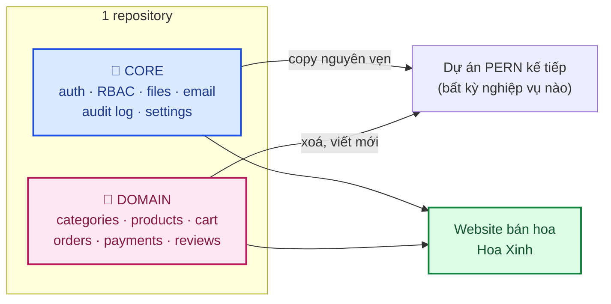
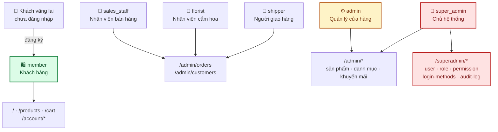

# 01 · Tổng quan sản phẩm

Dự án **FLOWER (Hoa Xinh)** là website thương mại điện tử bán hoa tươi, đồng thời là
**source base tái sử dụng (_reusable source base_)** cho các dự án PERN
(**P**ostgreSQL · **E**xpress · **R**eact · **N**ode) khác.

---

## 1. Hai mục tiêu song song

| Mục tiêu        | Nội dung                                                                                          |
| --------------- | ------------------------------------------------------------------------------------------------- |
| **Sản phẩm**    | Cửa hàng hoa online: khách đặt hoa giao theo **ngày giờ cụ thể**, admin quản lý sản phẩm/đơn hàng |
| **Source base** | Phần 🔧 Core dùng lại được cho dự án PERN khác mà **không phải sửa code** — chỉ đổi `.env`        |

Ranh giới core/domain là quyết định kiến trúc quan trọng nhất của repo này —
chi tiết ở [02 · Kiến trúc tổng quan §2](02-kien-truc-tong-quan.md).

---

## 2. Người dùng hệ thống (_actors_)

| Vai trò       | Phạm vi   | Khu vực truy cập                                                                           |
| ------------- | --------- | ------------------------------------------------------------------------------------------ |
| `super_admin` | 🔧 Core   | Toàn quyền + **duy nhất** quản lý tài khoản, role, permission, cấu hình đăng nhập          |
| `admin`       | 🔧 Core   | Nghiệp vụ cửa hàng (sản phẩm, danh mục, đơn, khuyến mãi). **Không** quản lý được tài khoản |
| `sales_staff` | 🌸 Domain | Xử lý đơn, chăm sóc khách. Không xoá sản phẩm, không xem báo cáo tài chính                 |
| `florist`     | 🌸 Domain | Hàng đợi soạn hoa, cập nhật trạng thái "đã soạn xong"                                      |
| `shipper`     | 🌸 Domain | Đơn được phân công, cập nhật trạng thái giao                                               |
| `member`      | 🔧 Core   | Chỉ thao tác trên dữ liệu của chính mình                                                   |

Ma trận quyền đầy đủ: [05 · Database & RBAC §2.4](05-database-va-rbac.md#24-ma-trận-vai-trò--quyền-mặc-định-seed).

---

## 3. Phạm vi chức năng & trạng thái

### 3.1. 🔧 Core — nền tảng

| Nhóm          | Chức năng                                                  |            Backend             |            Frontend            |
| ------------- | ---------------------------------------------------------- | :----------------------------: | :----------------------------: |
| **Xác thực**  | Đăng ký / đăng nhập email + mật khẩu                       |               ✅               |               ✅               |
|               | Magic link (đăng nhập qua email, dùng 1 lần)               |               ✅               |               ✅               |
|               | Google OAuth (verify ID token)                             |               ✅               | 🟡 cần `GOOGLE_CLIENT_ID` thật |
|               | Quên mật khẩu / đặt lại mật khẩu                           |               ✅               |               ✅               |
|               | Refresh token _rotation_, cookie `httpOnly`                |               ✅               |               ✅               |
| **Tài khoản** | Xem/sửa hồ sơ, đổi mật khẩu, avatar                        |               ✅               |               ✅               |
|               | Quản lý thiết bị + đăng xuất từ xa                         |               ✅               |               ✅               |
| **RBAC**      | Phân quyền theo permission code, tra DB mỗi request        |               ✅               |               ✅               |
|               | Quản lý user (block/unblock/xoá/reset password/đổi role)   |               ✅               |               ✅               |
|               | CRUD Custom Role + gán permission                          |               ✅               |               ✅               |
|               | CRUD Permission                                            |               ✅               |               ✅               |
|               | Bật/tắt phương thức đăng nhập                              |               ✅               |               ✅               |
| **Audit Log** | Ghi mọi thao tác nhạy cảm (ai/khi nào/trước/sau)           |               ✅               |     ⬜ chưa có màn tra cứu     |
| **Files**     | Upload trực tiếp lên Cloudinary (chữ ký HMAC), đánh dấu tái sử dụng   |               ✅               |     🟡 mới dùng cho avatar     |
|               | Màn quản lý tài nguyên (cây thư mục, grid/list)            | 🟡 API có, chưa có folder CRUD |               ⬜               |
| **Email**     | Abstraction Resend / Nodemailer-SMTP                       |               ✅               |               —                |
| **Jobs**      | Backup DB → Cloudinary (2 ngày/lần), dọn file mồ côi (10 ngày/lần) |               ✅               |               —                |

### 3.2. 🌸 Domain — nghiệp vụ shop hoa

| Nhóm           | Chức năng                                                           | Trạng thái |
| -------------- | ------------------------------------------------------------------- | :--------: |
| **Danh mục**   | CRUD danh mục dạng cây, slug tự sinh, chống vòng lặp cha-con        |     ✅     |
| **Sản phẩm**   | CRUD, nhiều ảnh, biến thể size/giá, tồn kho                         |     ⬜     |
| **Giỏ hàng**   | Guest cart, thêm/sửa/xoá                                            |     ⬜     |
| **Đơn hàng**   | Đặt hàng, **chọn ngày giờ giao**, thiệp chúc, sổ địa chỉ người nhận |     ⬜     |
| **Thanh toán** | COD, chuyển khoản, VNPay/Momo                                       |     ⬜     |
| **Đánh giá**   | Review + rating sau khi nhận hàng                                   |     ⬜     |
| **Khuyến mãi** | Mã giảm giá, chương trình theo dịp lễ                               |     ⬜     |
| **Nội dung**   | Blog, banner, newsletter                                            |     ⬜     |
| **Nhắc lịch**  | Lưu ngày sinh nhật/kỷ niệm, gửi email nhắc trước                    |     ⬜     |
| **Realtime**   | Socket.io cập nhật trạng thái đơn                                   |     ⬜     |

> Tiến độ chi tiết theo từng hạng mục — xem [`CHECKLIST.md`](../CHECKLIST.md).
> Tiến độ dạng khách hàng đọc được — xem [gitbook/03-tien-do.md](gitbook/03-tien-do.md).

---

## 4. Điểm khác biệt nghiệp vụ so với e-commerce thông thường

Đây là các ràng buộc **bắt buộc** phải giữ khi thiết kế phần domain:

| Đặc thù                       | Vì sao quan trọng                                        | Ảnh hưởng kỹ thuật                                                                         |
| ----------------------------- | -------------------------------------------------------- | ------------------------------------------------------------------------------------------ |
| **Giao theo ngày giờ cụ thể** | Hoa phải tươi, đúng dịp — giao trễ 1 ngày là mất giá trị | `order_deliveries.delivery_date` + `delivery_time_slot`, index theo ngày để dựng lịch giao |
| **Người đặt ≠ người nhận**    | Đặt hoa tặng người khác là mặc định, không phải ngoại lệ | Sổ địa chỉ người nhận tách khỏi địa chỉ tài khoản                                          |
| **Thiệp chúc kèm đơn**        | Lời nhắn là một phần sản phẩm                            | `order_items.card_message`                                                                 |
| **Cao điểm theo dịp lễ**      | 14/2, 8/3, 20/10 — tải tăng đột biến vài ngày            | Phải chịu được _burst traffic_, chống _race condition_ tồn kho                             |
| **Đặt hoa theo yêu cầu**      | Khách mô tả tông màu/ngân sách, florist thiết kế         | Đơn không gắn cứng với `product_id`                                                        |
| **Hàng dễ hỏng**              | Tồn kho tính theo ngày, không tích luỹ                   | Không dùng mô hình tồn kho tuyến tính đơn giản                                             |

---

## 5. Công nghệ

| Hạng mục     | Lựa chọn                                                                       | Lý do                                         |
| ------------ | ------------------------------------------------------------------------------ | --------------------------------------------- |
| Frontend     | Next.js 16 (App Router) + React 19 + TypeScript                                | Cần SEO cho trang sản phẩm                    |
| Styling      | TailwindCSS 4 + design system "Soft Petal"                                     | Token hoá màu/font ở `globals.css`            |
| Form         | `react-hook-form` + `zod`                                                      | Validate dùng chung schema với backend        |
| Server state | `@tanstack/react-query`                                                        | Cache, mutation, invalidation                 |
| Client state | `zustand`                                                                      | Chỉ UI state — **không** cache dữ liệu server |
| Backend      | Node.js + Express 4 + TypeScript strict                                        | Modular + MVC + Service Layer                 |
| ORM          | Prisma 5                                                                       | Migration, transaction, type-safe query       |
| Database     | PostgreSQL (Neon khi dev, VPS + Docker khi scale)                              |                                               |
| File storage | Cloudinary                                                                     | Upload trực tiếp qua chữ ký (không đi qua server), dùng chung cho ảnh/file **và** backup DB |
| Email        | Resend (production) / Nodemailer + SMTP (fallback)                             | Đổi qua `EMAIL_PROVIDER`                      |
| Cron         | `node-cron` trong tiến trình Node                                              | Chưa cần queue riêng (Redis/BullMQ)           |
| Test         | Vitest + Supertest (backend), Vitest + Testing Library + Playwright (frontend) | Xem [08 · Kiểm thử](08-kiem-thu.md)           |

---

## 6. Lộ trình

| Giai đoạn              | Nội dung                                                                               | Ước lượng |      Trạng thái      |
| ---------------------- | -------------------------------------------------------------------------------------- | --------- | :------------------: |
| **1 — Foundation**     | TypeScript strict, error/response chuẩn, API versioning, request ID, graceful shutdown | 1 tuần    |          ✅          |
| **2 — Authentication** | 3 phương thức đăng nhập, session, refresh rotation, quên mật khẩu                      | 1.5 tuần  |          ✅          |
| **3 — RBAC**           | Users, roles, permissions, audit log, SuperAdmin UI                                    | 1.5 tuần  |          ✅          |
| **4 — Infrastructure** | Cloudinary (`files` → `media` + `StorageService`), System Settings tổng quát, cleanup jobs     | 1 tuần    |          🟡          |
| **5 — Domain**         | Products, cart, orders, payments — nghiệp vụ thật của shop hoa                         | 4–5 tuần  | 🟡 mới có categories |
| **6 — Quality**        | Testing, OpenAPI/Swagger, logging, security review                                     | 1.5 tuần  |  🟡 test đã có nền   |
| **7 — Production**     | Docker, VPS, reverse proxy, backup, monitoring, CI/CD                                  | 1 tuần    |          ⬜          |

Ước lượng chi tiết theo hạng mục (dành cho khách hàng):
[gitbook/04-estimate.md](gitbook/04-estimate.md).
