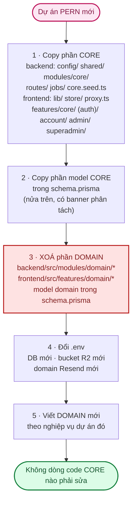
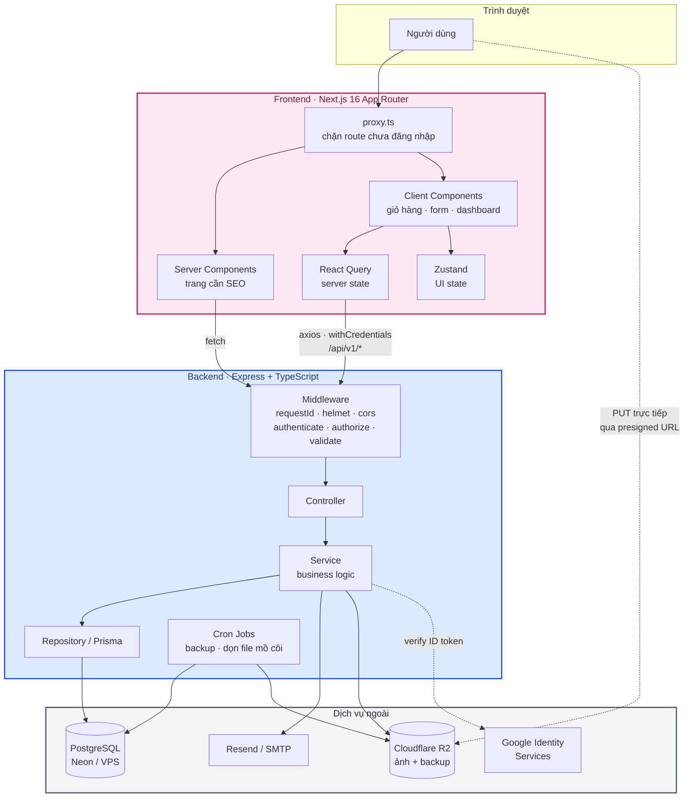
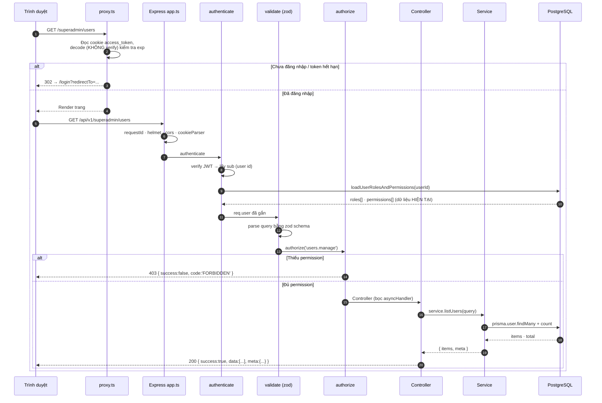
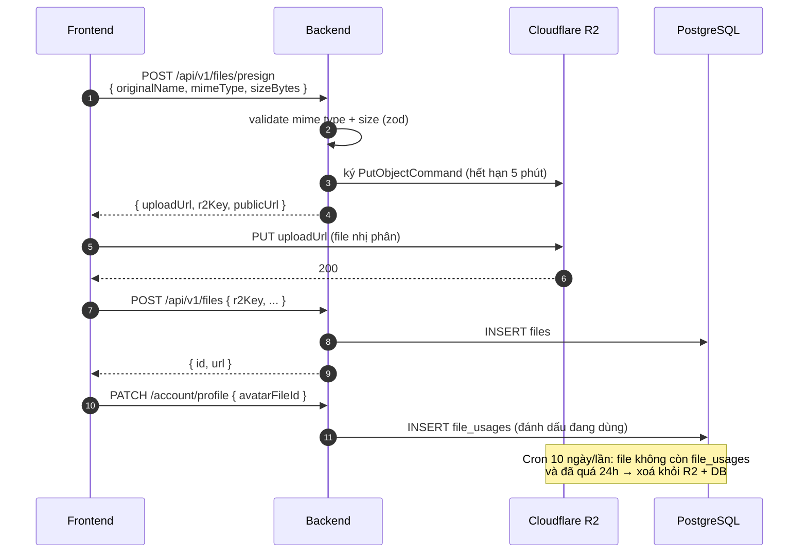

# 02 · Kiến trúc tổng quan

Chuẩn kỹ thuật chung cho **Reusable PERN Stack Source Base**. Tài liệu này mô tả bức tranh lớn;
chi tiết đi sâu nằm ở [03 · Backend](03-backend.md), [04 · Frontend](04-frontend.md),
[05 · Database & RBAC](05-database-va-rbac.md).

---

## 1. Nguyên tắc chung

- **KISS · DRY · YAGNI · SOLID vừa đủ** — giải pháp đơn giản nhất giải quyết đúng vấn đề *hiện tại*,
  không thiết kế thừa cho tình huống chưa xảy ra.
- **Security by default** (*mặc định an toàn*), **Separation of Concerns** (*tách bạch trách nhiệm*),
  **Single Responsibility** (*mỗi thành phần một việc*), **Convention over Configuration**
  (*ưu tiên quy ước thay vì cấu hình*).
- **Không over-engineering** (*thiết kế thừa*): không tạo `BaseController`/`BaseService`/`BaseRepository`
  nếu abstraction đó không giải quyết vấn đề thực tế. `*.repository.ts` chỉ tạo khi truy vấn đủ phức tạp
  và được dùng lại nhiều nơi — không máy móc cho mọi module.
- **Không biến source base thành một framework riêng.**
- Khi có nhiều cách triển khai, ưu tiên cách **đơn giản và dễ bảo trì nhất**. Nếu một yêu cầu có nguy cơ
  over-engineering, đề xuất phương án đơn giản hơn **trước khi** code.

---

## 2. Chiến lược tái sử dụng — Core vs Domain

Mọi module (backend lẫn frontend) gắn nhãn rõ 1 trong 2 loại:

| Loại | Định nghĩa | Ví dụ trong dự án Flower Shop |
|---|---|---|
| 🔧 **Core** | Không phụ thuộc nghiệp vụ cụ thể — giữ nguyên khi copy sang dự án PERN khác | Auth (3 phương thức), users/roles/permissions, files/media, email, audit log, settings, routing skeleton |
| 🌸 **Domain** | Đặc thù nghiệp vụ của dự án hiện tại — viết mới hoàn toàn cho mỗi dự án | Categories, products, occasions, cart, orders, payments, reviews, promotions, blog |

Giữ **1 repository duy nhất** (`backend/`, `frontend/`), không tách repo hay dùng *monorepo tooling*
(Turborepo/Nx) ở quy mô hiện tại — chỉ tổ chức thư mục để ranh giới core/domain rõ ràng.

### 2.1. Khi bắt đầu một dự án mới từ source base này



**Kiểm chứng ranh giới**: nếu một file trong `modules/core/` phải `import` từ `modules/domain/`
thì ranh giới đã bị phá — sửa lại ngay. Chiều ngược lại (domain import core) là **hợp lệ và mong muốn**.

---

## 3. Sơ đồ hệ thống

### 3.1. Tổng quan các thành phần



**Điểm đáng chú ý**: ảnh **không đi qua server Express**. Backend chỉ cấp *presigned URL*,
trình duyệt `PUT` thẳng lên R2 — tiết kiệm băng thông và RAM của API.

### 3.2. Luồng một request điển hình



> **Vì sao tra role/permission từ DB ở *mỗi* request thay vì nhúng vào JWT?**
> Đổi lấy một truy vấn nhỏ có index, ta được: quyền đổi trong DB **có hiệu lực ngay ở request kế tiếp**,
> không phải đợi token hết hạn hay bắt người dùng đăng nhập lại. Đây là đánh đổi có chủ đích —
> xem [modules/core-rbac.md](modules/core-rbac.md).

---

## 4. Cấu trúc thư mục

```
FLOWER/
├── README.md                 # trang bìa repo
├── CLAUDE.md                 # quy ước làm việc (AI + dev)
├── CHECKLIST.md              # theo dõi tiến độ
├── .gitbook.yaml             # cấu hình sync GitBook → docs/gitbook/
├── docs/                     # 📚 TOÀN BỘ tài liệu (bạn đang ở đây)
│   ├── modules/              #    tài liệu chi tiết từng module
│   └── gitbook/              #    tài liệu cho khách hàng
│
├── backend/                  # Express API — xem 03-backend.md
│   ├── src/
│   │   ├── config/           # 🔧 env (validate + fail-fast), prisma, r2
│   │   ├── shared/           # 🔧 hạ tầng dùng chung — KHÔNG chứa business logic
│   │   │   ├── errors/       #    AppError, ValidationError
│   │   │   ├── middleware/   #    asyncHandler, authenticate, authorize,
│   │   │   │                 #    errorHandler, requestId, validate
│   │   │   ├── response/     #    ApiResponse: ok() / created() / paginated()
│   │   │   ├── logger/       #    logger gắn requestId
│   │   │   └── utils/        #    hash, jwt, rbac, slugify
│   │   ├── modules/
│   │   │   ├── core/         # 🔧 auth, users, roles, permissions,
│   │   │   │                 #    settings, files, email, audit-log
│   │   │   └── domain/       # 🌸 categories (+ products, orders... sau này)
│   │   ├── routes/v1/        # gom router → /api/v1/*
│   │   ├── types/            # augmentation Express (req.user, req.requestId)
│   │   ├── jobs/             # 🔧 cron: backup DB, dọn file mồ côi
│   │   ├── app.ts            # đăng ký middleware + route, KHÔNG listen()
│   │   └── server.ts         # entrypoint: listen + graceful shutdown + cron
│   ├── prisma/
│   │   ├── schema.prisma     # model core nửa trên, domain nửa dưới
│   │   └── seed/             # core.seed.ts · domain.seed.ts
│   ├── tests/                # unit + integration — xem 08-kiem-thu.md
│   └── .env.example
│
└── frontend/                 # Next.js — xem 04-frontend.md
    ├── src/
    │   ├── app/              # App Router
    │   ├── components/       # ui/ · layout/ · admin/ · shell/ · account/
    │   ├── features/
    │   │   ├── core/         # 🔧 *.service.ts (axios) + *.hooks.ts (React Query)
    │   │   └── domain/       # 🌸
    │   ├── lib/              # 🔧 axios, jwt decode, errors, redirect
    │   ├── store/            # 🔧 zustand
    │   └── proxy.ts          # 🔧 Next.js 16 "proxy" (tên cũ: middleware.ts)
    ├── tests/                # unit component/hook
    └── e2e/                  # Playwright
```

> ⚠️ **Lưu ý lịch sử**: thư mục hạ tầng backend từng tên là `src/core/`, đã đổi thành **`src/shared/`**
> để không nhầm với `src/modules/core/` (hai khái niệm khác nhau: `shared/` là hạ tầng kỹ thuật,
> `modules/core/` là nhóm module nghiệp-vụ-trung-lập). Tài liệu cũ nào còn ghi `core/middleware/...`
> nghĩa là `shared/middleware/...`.

---

## 5. Hạ tầng theo môi trường

| Môi trường | Database | File storage | Chạy ở đâu |
|---|---|---|---|
| **Development** | Neon Postgres (*serverless*, free tier) | R2 bucket `-dev` | Máy local, không cần Docker |
| **Staging** | Neon Postgres (branch riêng) | R2 bucket `-staging` | Render/Railway hoặc VPS |
| **Production nhỏ** | Managed Postgres (Neon/Supabase) | R2 bucket `-prod` | Vercel (FE) + Render/Railway (BE) |
| **Production lớn** | VPS + Docker + PostgreSQL tự quản lý | R2 bucket `-prod` | VPS + Docker Compose + reverse proxy |

Chi tiết cấu hình từng môi trường: [10 · Triển khai & vận hành](10-trien-khai-van-hanh.md).

- **Backup**: `pg_dump` **2 ngày/lần** lên R2 (prefix `backups/`), **tự xoá sau 30 ngày** — job
  `jobs/backupDatabase.job.ts`, chỉ đăng ký khi `NODE_ENV=production`.
- **Soft delete** (*xoá mềm*) chỉ dùng khi phù hợp (`users`, `products`, `files`) — không lạm dụng
  cho mọi bảng.

---

## 6. Lưu trữ file (R2) & Media



- Không hard-code R2 vào business logic — mọi thao tác file đi qua `files.service.ts`.
  *(Kế hoạch Phase 4: bóc thành `StorageService` với `upload()/delete()/getUrl()/exists()/move()`
  để đổi R2 → S3/MinIO/Cloudinary mà không sửa business logic.)*
- **Orphan detection** (*phát hiện file mồ côi*): file không còn `file_usages` nào trỏ tới **và**
  đã quá ngưỡng an toàn 24h → cron dọn. Ngưỡng 24h tránh xoá nhầm ảnh vừa upload nhưng form chưa submit.

Chi tiết: [modules/core-files.md](modules/core-files.md).

---

## 7. Email

Abstraction qua `modules/core/email/email.service.ts` — business logic không gọi thẳng
Resend/Nodemailer.

| Phương án | Khi dùng | Nhược điểm |
|---|---|---|
| **Resend** (mặc định production) | Đã có domain riêng, verify DKIM/SPF | Cần sở hữu + cấu hình DNS |
| **Nodemailer + SMTP** (thay thế) | Chưa có domain riêng | Dễ vào spam, Gmail SMTP giới hạn ~500 email/ngày |

Đổi provider **chỉ qua biến `EMAIL_PROVIDER`**, không sửa code gọi.
Mọi lần gửi đều ghi bảng `email_logs` (`sent` / `failed` + `error`) để tra cứu khi khách báo
không nhận được email. Chi tiết: [modules/core-email.md](modules/core-email.md).

---

## 8. Authentication & RBAC — tóm tắt convention

- **3 phương thức đăng nhập bắt buộc**: email/password, Google OAuth (verify *ID token* qua
  `google-auth-library`, **không** dùng luồng redirect passport), magic link (token hash, dùng 1 lần,
  hết hạn ngắn).
- **Session**: access token JWT **ngắn hạn** (mặc định 5 phút) + refresh token **đối lập, rotation,
  thu hồi được** — cả hai qua cookie `httpOnly`. Không dùng JWT dài hạn làm session duy nhất.
- **RBAC permission-based**: `authorize('users.manage')`, **không** hard-code role
  (`requireRole('Admin')`). Role chỉ là tập hợp permission.
- **Tối thiểu 3 System Role** `super_admin`/`admin`/`member` — không xoá/đổi code được.
- **SuperAdmin User Management**: không tự block/đổi role/xoá chính mình, không tự tạo/gán
  `super_admin` qua chức năng thông thường — enforce ở **backend**, không dựa vào UI.

Chi tiết: [modules/core-auth.md](modules/core-auth.md), [modules/core-rbac.md](modules/core-rbac.md),
[07 · Bảo mật](07-bao-mat.md).

---

## 9. Background Jobs

Cron chạy **trong tiến trình Node** (`node-cron`, `jobs/index.ts`), chỉ đăng ký khi
`NODE_ENV=production`:

| Job | Lịch | Việc |
|---|---|---|
| `backupDatabase` | `0 3 */2 * *` (~2 ngày/lần, 03:00) | `pg_dump` → R2 `backups/` |
| `cleanupOldBackups` | `30 3 */2 * *` | Xoá backup > 30 ngày |
| `cleanupOrphanFiles` | `0 4 */10 * *` (~10 ngày/lần) | Xoá file mồ côi khỏi R2 + DB |

**Không thêm Redis/BullMQ ngay từ đầu** — chỉ dùng khi workload thực sự cần queue mạnh
(gửi email hàng loạt, xử lý ảnh nặng). Hạn chế đã biết của cách hiện tại và hướng khắc phục:
[12 · Đánh giá & đề xuất](12-danh-gia-va-de-xuat.md).

---

## 10. System Settings (Phase 4 — chưa triển khai)

Hiện tại chỉ có bảng `login_method_settings` (bật/tắt 3 phương thức đăng nhập).
Phase 4 mở rộng thành bảng `system_settings` dạng key-value tổng quát:

```
site_name · site_logo · timezone · maintenance_mode · registration_enabled
login_email_enabled · login_google_enabled · login_magic_link_enabled
```

`modules/core/settings/` sẽ đảm nhiệm cả hai.

---

## 11. Code quality & công cụ

| Hạng mục | Trạng thái |
|---|---|
| TypeScript **strict mode** (cả `noUncheckedIndexedAccess`) | ✅ backend + frontend |
| ESLint flat config + `typescript-eslint` | ✅ |
| **Prettier** | ⬜ chưa cấu hình — xem [12 · Đề xuất](12-danh-gia-va-de-xuat.md) |
| Vitest (unit + integration) | ✅ |
| Playwright (E2E) | ✅ cấu hình sẵn, cần môi trường thật để chạy |
| OpenAPI / Swagger | ⬜ — [06 · API Reference](06-api-reference.md) là bản viết tay tạm thời |
| CI/CD (GitHub Actions) | ⬜ — mẫu ở [10 · Triển khai](10-trien-khai-van-hanh.md) |

---

## 12. Docker & Monorepo

- **Development không bắt buộc Docker** toàn stack (FE/BE chạy local, DB Neon, R2 Cloudflare).
- **Production lớn**: VPS + Docker (backend + Postgres + worker) + reverse proxy (Nginx/Caddy).
- **Không bắt buộc monorepo tooling** (Turborepo/Nx) ở quy mô nhỏ/vừa — chỉ cân nhắc khi thực sự tách
  nhiều app frontend dùng chung nhiều package.

---

## 13. Frontend — chọn Next.js hay React + Vite

| Loại app | Công nghệ |
|---|---|
| Public/SEO (storefront, landing, content site) | **Next.js + TypeScript** |
| Internal (admin, dashboard, tool nội bộ) | **React + Vite + TypeScript** |

Dự án lớn có thể tách `apps/client/` (Next.js) và `apps/admin/` (React/Vite) độc lập, dùng chung
backend API. Hiện tại **gộp chung một Next.js app** vì quy mô chưa đủ lớn để trả giá cho việc tách.
