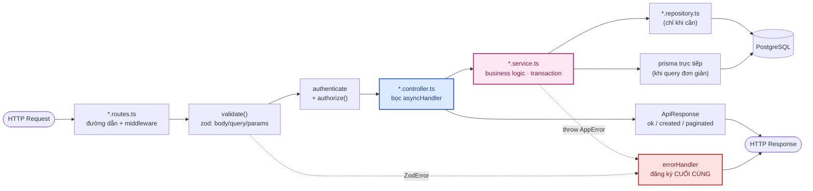
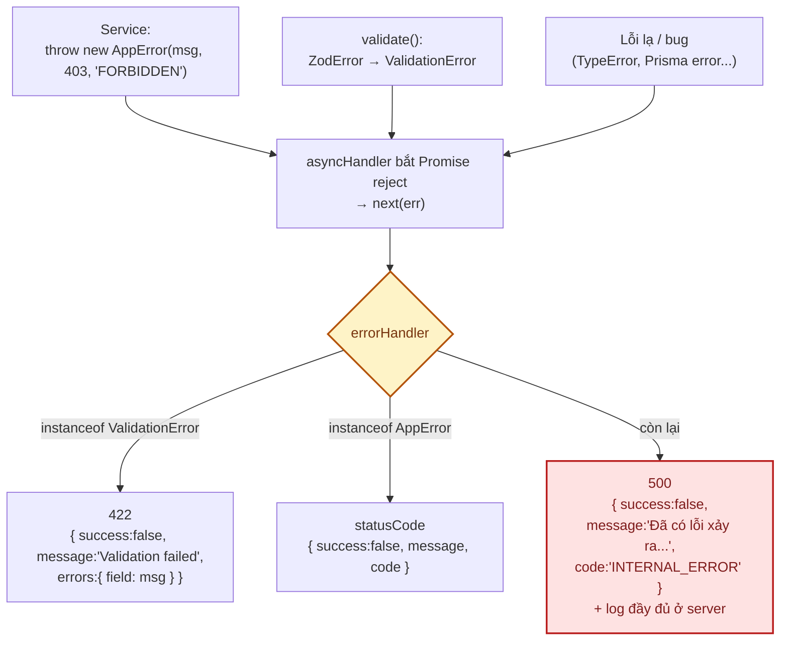
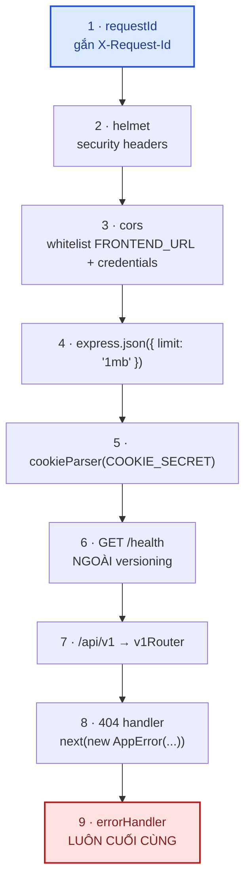
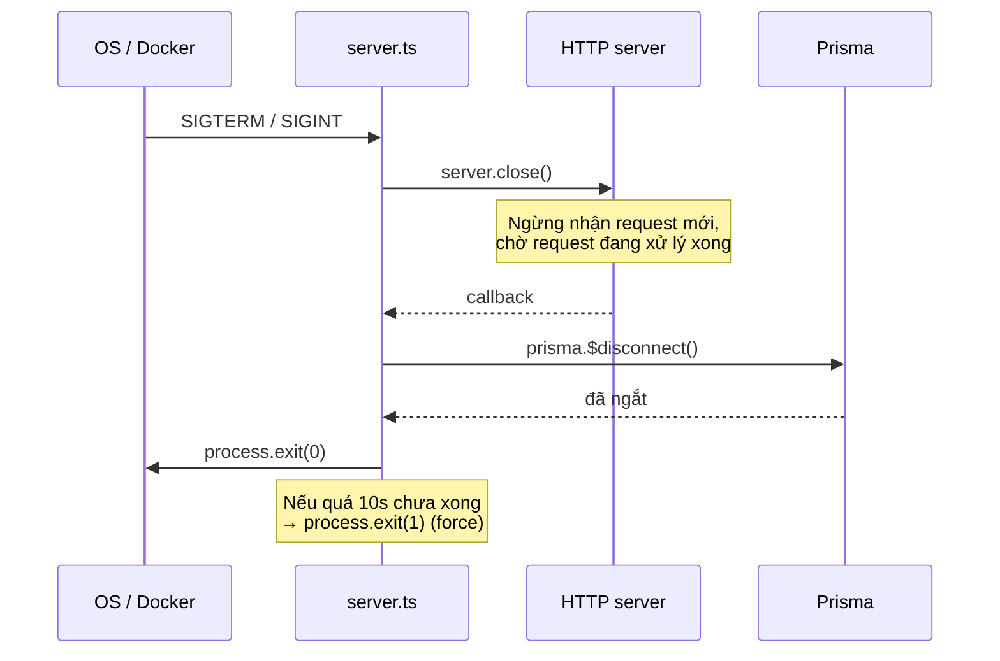
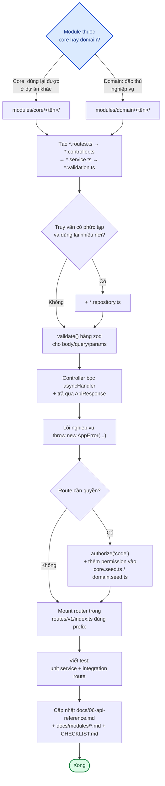

# 03 · Backend — Kiến trúc & quy ước

**Stack**: Node.js · Express 4 · TypeScript (strict) · Prisma 5 · Zod.
**Kiến trúc**: Modular + MVC + Service Layer.

Đọc trước: [02 · Kiến trúc tổng quan](02-kien-truc-tong-quan.md).

---

## 1. Luồng xử lý

```
Request → Route → Middleware → Controller → Service → Repository/Prisma → Database
```



### Trách nhiệm từng tầng

| Tầng | Được làm | **Không** được làm |
|---|---|---|
| **Route** | Khai báo path, gắn middleware (`validate`, `authorize`), trỏ tới controller | Chứa logic |
| **Controller** | Đọc `req`, gọi service, trả response qua `ApiResponse` | Business logic, gọi Prisma trực tiếp, `res.status(...).json(...)` thủ công |
| **Service** | Business logic, transaction, business rule, `throw new AppError(...)` | Đụng vào `req`/`res` (trừ kiểu dữ liệu đầu vào thuần) |
| **Repository** | Truy vấn phức tạp, dùng lại nhiều nơi (vd `auth.repository.ts`) | Business rule |

> **Repository là tuỳ chọn, không bắt buộc.** `roles`, `permissions`, `categories` gọi Prisma thẳng
> trong service vì truy vấn đơn giản. Chỉ tách repository khi cùng một truy vấn xuất hiện ở ≥ 2 service
> hoặc truy vấn phức tạp tới mức che mất business logic.

---

## 2. Cấu trúc một module

```
modules/<core|domain>/<tên>/
├── <tên>.routes.ts        # bắt buộc — path + middleware
├── <tên>.controller.ts    # bắt buộc — mỏng, bọc asyncHandler
├── <tên>.service.ts       # bắt buộc — business logic
├── <tên>.validation.ts    # bắt buộc khi có input — zod schema + type inferred
└── <tên>.repository.ts    # tuỳ chọn — chỉ khi truy vấn đủ phức tạp
```

Module tách 2 mặt (public vs quản trị) thì tách file routes, **dùng chung** controller/service:

```
categories.routes.ts         → GET /api/v1/categories (công khai, storefront)
categories.admin.routes.ts   → CRUD /api/v1/admin/categories (cần categories.manage)
categories.controller.ts     → dùng chung
categories.service.ts        → dùng chung
```

---

## 3. Error handling

Một class lỗi chuẩn + **một** error handler duy nhất. **Không** try/catch lặp lại trong controller.



```ts
// shared/errors/AppError.ts
export class AppError extends Error {
  readonly statusCode: number;
  readonly code: string;
  readonly isOperational = true; // lỗi nghiệp vụ đã lường trước, khác lỗi hệ thống (bug)
  constructor(message: string, statusCode = 400, code = 'BAD_REQUEST') { /* ... */ }
}
```

**Quy tắc bắt buộc**

1. Trong service, `throw new AppError(...)` thay vì `return null/false` mập mờ.
2. **Không** throw string, **không** nuốt lỗi bằng `catch {}` rỗng — trừ 2 ngoại lệ có chủ đích được
   ghi chú rõ trong code:
   - gửi email ở `requestMagicLink` / `forgotPassword` (nếu lỗi văng ra, response sẽ khác nhánh
     "email không tồn tại" và **làm lộ email nào có tài khoản**);
   - ghi `audit_logs` (best-effort, không được rollback nghiệp vụ chính).
3. **Không bao giờ** trả stack trace hay chi tiết lỗi hệ thống cho client — kể cả ở môi trường dev.
4. `errorHandler` **luôn đăng ký cuối cùng** trong `app.ts`.

### Bảng mã lỗi (`code`)

| Code | HTTP | Ý nghĩa |
|---|---|---|
| `VALIDATION_ERROR` | 422 | Input không hợp lệ — kèm `errors` theo từng field |
| `UNAUTHENTICATED` | 401 | Chưa đăng nhập / thiếu token |
| `INVALID_TOKEN` | 401 | Token sai hoặc hết hạn |
| `INVALID_CREDENTIALS` | 401 | Sai email/mật khẩu |
| `SESSION_EXPIRED` | 401 | Refresh token hết hạn/đã thu hồi |
| `INVALID_MAGIC_LINK` / `INVALID_RESET_TOKEN` | 401 | Link hết hạn hoặc đã dùng |
| `INVALID_GOOGLE_TOKEN` | 401 | Không verify được ID token Google |
| `INVALID_CURRENT_PASSWORD` | 401 | Sai mật khẩu hiện tại khi đổi mật khẩu |
| `FORBIDDEN` | 403 | Thiếu permission |
| `ACCOUNT_BLOCKED` | 403 | Tài khoản bị khoá |
| `LOGIN_METHOD_DISABLED` | 403 | Phương thức đăng nhập đang tắt |
| `CANNOT_GRANT_SUPER_ADMIN` | 403 | Chặn leo thang quyền |
| `SYSTEM_ROLE_LOCKED` / `SYSTEM_PERMISSION_LOCKED` | 403 | Đụng vào System Role/Permission |
| `NOT_FOUND` | 404 | Không tìm thấy tài nguyên |
| `FILE_NOT_FOUND` / `PARENT_NOT_FOUND` / `ROLE_NOT_FOUND` | 404 | Không tìm thấy (cụ thể hơn) |
| `EMAIL_TAKEN` / `PERMISSION_CODE_TAKEN` | 409 | Trùng dữ liệu unique |
| `ROLE_IN_USE` / `PERMISSION_IN_USE` / `CATEGORY_HAS_CHILDREN` | 409 | Còn ràng buộc, không xoá được |
| `CANNOT_TARGET_SELF` | 400 | Không thao tác lên chính mình |
| `AT_LEAST_ONE_LOGIN_METHOD_REQUIRED` | 400 | Không được tắt hết phương thức đăng nhập |
| `CATEGORY_CYCLE` | 400 | Cây danh mục tạo vòng lặp |
| `INTERNAL_ERROR` | 500 | Lỗi không lường trước — chi tiết chỉ có ở log server |

---

## 4. Response format chuẩn

Mọi API trả về đúng một trong các dạng sau (xử lý tập trung ở `shared/response/ApiResponse.ts`):

**Thành công**
```json
{ "success": true, "message": "Success", "data": {} }
```

**Danh sách có phân trang** — dùng `paginated()`
```json
{
  "success": true, "message": "Success", "data": [],
  "meta": { "page": 1, "limit": 20, "total": 100, "totalPages": 5 }
}
```

**Lỗi validate** — 422, từ `validate()`
```json
{ "success": false, "message": "Validation failed", "errors": { "email": "Email không hợp lệ" } }
```

**Lỗi nghiệp vụ** — từ `AppError`
```json
{ "success": false, "message": "Bạn không có quyền thực hiện thao tác này", "code": "FORBIDDEN" }
```

API hỗ trợ:

```ts
ok(res, data, message?, statusCode?)            // 200
created(res, data, message?)                    // 201
paginated(res, items, meta, message?)           // 200 + meta
buildPaginationMeta(page, limit, total)         // tính totalPages
```

---

## 5. Middleware

Thứ tự đăng ký trong `app.ts` — **quan trọng, không đảo**:



| Middleware | File | Việc |
|---|---|---|
| `requestId` | `shared/middleware/requestId.ts` | Sinh/nhận `X-Request-Id`, trả về header, dùng để trace log xuyên tầng |
| `authenticate` | `shared/middleware/authenticate.ts` | Verify JWT (cookie `access_token` hoặc `Authorization: Bearer`) → lấy `sub`, rồi **tra role/permission hiện tại từ DB** gắn vào `req.user` |
| `authorize(...perms)` | `shared/middleware/authorize.ts` | Yêu cầu **đủ tất cả** permission truyền vào |
| `validate({body,query,params})` | `shared/middleware/validate.ts` | Parse bằng zod và **gán ngược giá trị đã coerce** vào `req` |
| `asyncHandler` | `shared/middleware/asyncHandler.ts` | Bọc controller async — mọi Promise reject tự `next(err)` |
| `errorHandler` | `shared/middleware/errorHandler.ts` | Chuẩn hoá mọi lỗi thành response thống nhất |

### Về `validate()`

Middleware này **gán ngược** giá trị đã parse: query string `"1"` thành `number 1`, `"true"` thành
`boolean true`. Controller dùng luôn, không parse lại:

```ts
// validation
export const listUsersQuerySchema = z.object({
  page: z.coerce.number().int().min(1).default(1),
  limit: z.coerce.number().int().min(1).max(100).default(20),
});

// controller — req.query đã là { page: number, limit: number }
export const list = asyncHandler(async (req, res) => {
  const { items, meta } = await service.listUsers(req.query as unknown as ListUsersQuery);
  paginated(res, items, meta);
});
```

---

## 6. Routing & versioning

**Versioning bắt buộc**: mọi route mount dưới `/api/v1` (`routes/v1/index.ts`).
Ngoại lệ duy nhất: `GET /health` (load balancer / uptime monitor cần path cố định).

```ts
// routes/v1/index.ts — gom theo mức độ truy cập tăng dần
v1Router.use('/auth', authRouter);                                  // công khai
v1Router.use('/account', authenticate, usersRouter);                // cần đăng nhập
v1Router.use('/files', authenticate, filesRouter);                  // + files.manage cho ghi/xoá

v1Router.use('/superadmin/users', authenticate, usersAdminRouter);  // chỉ super_admin
v1Router.use('/superadmin/roles', authenticate, rolesRouter);
v1Router.use('/superadmin/permissions', authenticate, permissionsRouter);
v1Router.use('/superadmin/login-methods', authenticate, loginMethodsRouter);
v1Router.use('/superadmin/audit-logs', authenticate, auditLogRouter);

v1Router.use('/categories', categoriesRouter);                      // công khai — storefront
v1Router.use('/admin/categories', authenticate, categoriesAdminRouter);
```

### `/admin/*` vs `/superadmin/*` — **không dùng thay thế nhau**

| Prefix | Dành cho | Ai vào được |
|---|---|---|
| `/api/v1/superadmin/*` | **Quản trị hệ thống**: user, role, permission, cấu hình đăng nhập, audit log | Chỉ `super_admin` (qua permission `is_restricted`) |
| `/api/v1/admin/*` | **Nghiệp vụ domain**: sản phẩm, danh mục, đơn hàng | `admin` và `super_admin`, tuỳ permission cụ thể |

`authenticate` đặt ở tầng `v1Router.use(...)` để **không route nào "quên"**;
`authorize(...)` đặt trong từng router con (thường là `router.use(authorize('x.manage'))` ở đầu file).

---

## 7. Config & fail-fast

`config/env.ts` đọc và validate biến môi trường **lúc khởi động**. Thiếu biến bắt buộc →
ném lỗi rõ ràng và tiến trình dừng ngay, thay vì lỗi mập mờ giữa chừng một request nào đó.

```ts
function required(name: string, fallback?: string): string {
  const value = process.env[name] ?? fallback;
  if (value === undefined) throw new Error(`Missing required environment variable: ${name}`);
  return value;
}
```

Biến **bắt buộc**: `DATABASE_URL`, `JWT_ACCESS_SECRET`, `JWT_REFRESH_SECRET`.
Toàn bộ danh sách + ý nghĩa: [09 · Môi trường & biến cấu hình](09-moi-truong-va-bien-cau-hinh.md).

`config/prisma.ts` dùng **singleton** để `tsx watch` reload không mở thêm connection pool mới.

---

## 8. `app.ts` vs `server.ts` — vì sao tách

| File | Trách nhiệm |
|---|---|
| `app.ts` | Tạo và cấu hình Express app, **không gọi `listen()`** |
| `server.ts` | `listen()` + graceful shutdown + đăng ký cron |

Tách như vậy để **test import thẳng `app`** và chạy Supertest mà không cần mở cổng thật —
xem [08 · Kiểm thử](08-kiem-thu.md).

### Graceful shutdown



---

## 9. Logging

`shared/logger/logger.ts` — logger tối giản, không phụ thuộc thư viện ngoài.

```ts
logger.info('...');                          // không có request context
logger.withRequestId(req.requestId).error('...');   // gắn ID để trace xuyên tầng
```

- Level qua `LOG_LEVEL` (`error` < `warn` < `info` < `debug`, mặc định `info`).
- **Không bao giờ log** password, token (JWT/magic link/reset), cookie, secret,
  toàn bộ `req.body` hay `req.headers`.
- Khi cần log tập trung ở production, thay lớp này bằng `pino`/`winston` —
  interface `logger.*` giữ nguyên nên nơi gọi không phải sửa. Xem [12 · Đề xuất](12-danh-gia-va-de-xuat.md).

---

## 10. Checklist tạo module backend mới



**Dạng checklist để copy vào PR:**

- [ ] Đặt đúng `modules/core/` hoặc `modules/domain/`
- [ ] Đủ file `*.routes.ts` / `*.controller.ts` / `*.service.ts` / `*.validation.ts`
- [ ] Validate mọi input bằng zod qua `validate()`
- [ ] Controller bọc `asyncHandler`, trả response qua `ApiResponse`
- [ ] Lỗi nghiệp vụ dùng `AppError` — không `res.status(...)` rải rác
- [ ] Route cần quyền → `authorize('code')` **và** thêm permission vào seed tương ứng
- [ ] Mount trong `routes/v1/index.ts` đúng prefix (`/admin` hay `/superadmin`)
- [ ] Thao tác nhạy cảm → ghi `auditLog.record(...)`
- [ ] Có test unit cho service + integration cho route
- [ ] Cập nhật [06 · API Reference](06-api-reference.md) và [`CHECKLIST.md`](../CHECKLIST.md)

---

## 11. Những quy ước dễ làm sai

| Sai | Đúng |
|---|---|
| `res.status(400).json({ error: 'x' })` trong controller | `throw new AppError('x', 400, 'CODE')` trong service |
| `try/catch` trong mỗi controller | Bọc `asyncHandler`, để `errorHandler` xử lý |
| Nhúng `roles`/`permissions` vào JWT payload | JWT chỉ chứa `sub`; role/permission tra DB mỗi request |
| `requireRole('admin')` | `authorize('users.manage')` — permission-based |
| Service nhận `req`/`res` | Service nhận dữ liệu thuần (đã validate) |
| Gọi `prisma` trong controller | Gọi qua service |
| Tạo `*.repository.ts` cho mọi module | Chỉ khi truy vấn thực sự phức tạp/dùng lại |
| Quên `authenticate` khi mount router mới | Mount ở `routes/v1/index.ts` theo nhóm đã có sẵn `authenticate` |
| Tạo permission mới qua UI rồi tưởng đã có hiệu lực | Permission chỉ chặn được khi có route gọi `authorize('code')` |
