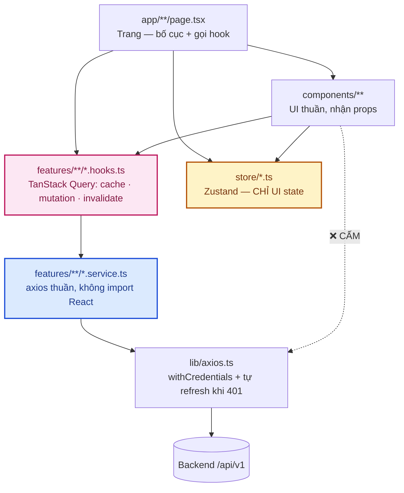
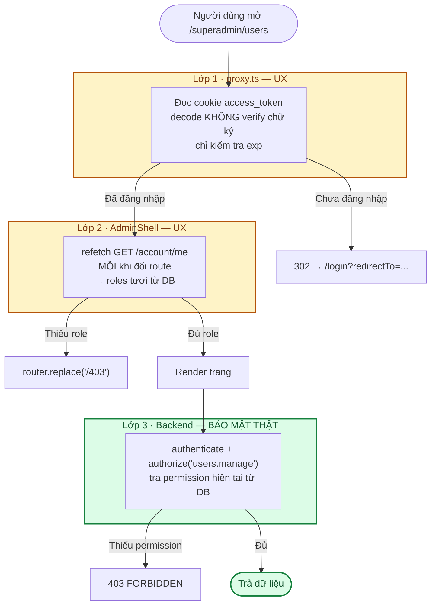
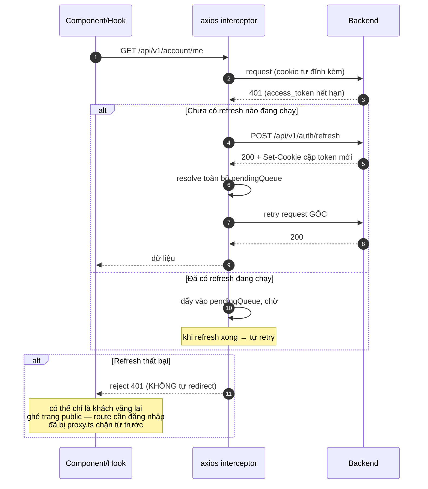

# 04 · Frontend — Kiến trúc & quy ước

**Stack**: Next.js 16 (App Router) · React 19 · TypeScript strict · TailwindCSS 4 ·
TanStack Query · Zustand · react-hook-form + zod.

> ⚠️ **Next.js 16 có nhiều thay đổi phá vỡ (_breaking changes_)** so với v14/v15 —
> đáng chú ý nhất: `middleware.ts` đổi tên thành **`proxy.ts`** và export hàm `proxy`.
> Khi không chắc về API, đọc tài liệu đi kèm trong `frontend/node_modules/next/dist/docs/`
> thay vì suy đoán.

---

## 1. Nguyên tắc

**Tách rõ 4 lớp: UI ≠ API ≠ Business Logic ≠ State.**



| Quy tắc                                                  | Lý do                                                                   |
| -------------------------------------------------------- | ----------------------------------------------------------------------- |
| Component **không tự gọi axios** — luôn qua custom hook  | Cache/loading/error được React Query quản lý thống nhất                 |
| `*.service.ts` **không import React**                    | Dùng lại được ngoài component (test, script)                            |
| Zustand **chỉ giữ UI state**, không cache dữ liệu server | Hai nguồn sự thật cho cùng dữ liệu là nguồn gốc của bug lệch trạng thái |
| `useState` cho loading/error của request                 | ❌ — đó là việc của React Query                                         |

---

## 2. Cấu trúc thư mục

```
frontend/src/
├── app/                          # App Router
│   ├── layout.tsx                # root: font, Providers, Toaster, ConfirmDialog
│   ├── providers.tsx             # QueryClientProvider (1 client / tab)
│   ├── error.tsx                 # Error Boundary route con (FE-01)
│   ├── global-error.tsx          # Error Boundary root layout (FE-01) — tự khai <html>/<body>
│   ├── (storefront)/             # 🌸 PUBLIC — route group, không đổi URL
│   │   ├── loading.tsx           #    skeleton trang chủ (FE-04)
│   │   ├── danh-muc/[slug]/loading.tsx
│   │   └── san-pham/[slug]/loading.tsx
│   ├── (auth)/                   # 🔧 PUBLIC — /login /register /magic-link
│   │                             #    /forgot-password /reset-password
│   ├── (dashboard)/              # 🔧 route group gộp /admin + /superadmin
│   │   ├── layout.tsx            #    → AdminShell (sidebar không remount khi đổi trang)
│   │   ├── admin/                #    🔧 khung + 🌸 nội dung
│   │   └── superadmin/           #    🔧 chỉ super_admin
│   ├── account/                  # 🔧 PROTECTED — route THẬT (không phải route group)
│   │                             #    để proxy.ts match được theo prefix
│   ├── 403/                      # đích redirect khi đã đăng nhập nhưng thiếu quyền
│   └── not-found.tsx
├── components/
│   ├── ui/                       # Button, FormField, Switch, Toaster, ConfirmDialog...
│   ├── layout/                   # Nav, Footer, UserMenu (storefront)
│   ├── shell/                    # DashboardShell (khung sidebar dùng chung)
│   ├── admin/                    # AdminShell, PageHeader, StatusBadge, PermissionPicker
│   └── account/                  # AccountTabs
├── features/
│   ├── core/                     # 🔧 auth · account · files
│   │                             #    admin-users · admin-roles
│   │                             #    admin-permissions · admin-login-methods
│   └── domain/                   # 🌸 categories (+ products, cart, orders...)
├── lib/                          # axios · jwt (decode) · errors · redirect
├── store/                        # useCartStore · useToastStore · useConfirmStore
└── proxy.ts                      # 🔧 chặn route sớm (Next.js 16)
```

**Mỗi feature = đúng 2 file** (thêm component riêng nếu cần):

```
features/core/admin-users/
├── adminUsers.service.ts   # axios thuần
└── adminUsers.hooks.ts     # useQuery / useMutation + toast + invalidate
```

---

## 3. Bảo vệ route — 3 lớp, chỉ 1 lớp là bảo mật thật



| Lớp | File                                   | Kiểm tra gì                                   | Có phải bảo mật?                   |
| --- | -------------------------------------- | --------------------------------------------- | ---------------------------------- |
| 1   | `src/proxy.ts`                         | **Chỉ** "đã đăng nhập chưa" (`exp` của JWT)   | ❌ UX — decode không verify chữ ký |
| 2   | `components/admin/AdminShell.tsx`      | Role, qua `useMe()` refetch mỗi lần đổi route | ❌ UX                              |
| 3   | Backend `authenticate` + `authorize()` | Permission hiện tại trong DB                  | ✅ **Đây mới là bảo mật**          |

**Vì sao `proxy.ts` không kiểm tra role?** JWT không nhúng role/permission (xem
[modules/core-rbac.md](modules/core-rbac.md)). Kể cả có nhúng, token cũ vẫn có thể lệch với DB —
chặn theo dữ liệu cũ sẽ khiến đổi role trong DB không có hiệu lực ngay sau khi F5.

**Vì sao `AdminShell` phải `refetch` chứ không đọc cache?** Cache `useMe()` có `staleTime` 30 giây.
Nếu role vừa bị hạ trong 30 giây đó, cache cũ sẽ cho render nội dung trang thật một nhịp trước khi
phát hiện mất quyền. Vì vậy `authorized` chỉ dựa trên kết quả refetch **ứng đúng `pathname` hiện tại**.

**Vì sao `/account` là route thật, không phải route group?** Route group `(account)` không xuất hiện
trong URL nên `proxy.ts` không match được theo prefix. `/admin` và `/superadmin` nằm trong route group
`(dashboard)` — group này không đổi URL, nên `proxy.ts` vẫn match `/admin/...` bình thường.

---

## 4. `lib/axios.ts` — tự động refresh khi 401



Ba chi tiết dễ viết sai, đã xử lý sẵn trong code:

1. **`withCredentials: true`** — token nằm ở cookie `httpOnly` do backend set; **không** tự gắn
   `Authorization` header.
2. **Request "chính" (request kích hoạt refresh) phải tự retry**, không đẩy vào `pendingQueue` —
   hàng đợi vừa bị xoá rỗng ngay trước đó, đẩy vào sẽ không ai resolve và promise treo vĩnh viễn.
3. **Không tự redirect khi refresh thất bại** — 401 ở trang public là chuyện bình thường.
   Bỏ qua `/api/v1/auth/*` để không lặp vô hạn.

---

## 5. State management

| Loại state                        | Công cụ               | Ví dụ                                                              |
| --------------------------------- | --------------------- | ------------------------------------------------------------------ |
| **Server state** (dữ liệu từ API) | TanStack Query        | `useMe()`, `useCategories()`, `useAdminUsers()`                    |
| **UI/client state**               | Zustand               | `useCartStore` (giỏ hàng, persist localStorage), `useToastStore`, `useConfirmStore` |
| **Form state**                    | react-hook-form + zod | `useForm({ resolver: zodResolver(schema) })`                       |

Cấu hình `QueryClient` (ở `app/providers.tsx`): `staleTime: 30_000`, `retry: 1`.
`useMe()` đặt riêng `retry: false` vì 401 ở đây thường là "chưa đăng nhập", không phải lỗi tạm thời.

> ⚠️ `useMe()` là **nguồn duy nhất** cho thông tin người dùng hiện tại (tên, email, avatar, roles) —
> KHÔNG lưu bản sao trong Zustand để "tiện đọc ở menu". Từng có `useAuthStore` giữ song song một bản
> `user` set lúc đăng nhập nhưng không đồng bộ khi hồ sơ đổi qua đường khác (đổi tên/avatar) — đúng 2
> nguồn sự thật cảnh báo ở trên. Đã xoá hẳn (docs/12 FE-02, 11/09/2026); nơi nào cần hiển thị thông
> tin người dùng, gọi `useMe()` trực tiếp.

### Quy ước `queryKey`

```
['account', 'me']                      # hồ sơ người dùng hiện tại
['account', 'sessions']                # danh sách thiết bị
['auth', 'login-methods']              # phương thức đăng nhập đang bật
['admin', 'users', params]             # danh sách user (có filter/paging)
['admin', 'roles'] / ['admin', 'permissions']
['admin', 'categories', params]
```

Sau mutation: `invalidateQueries` theo **prefix** (`['admin', 'categories']`) để bắt hết mọi biến thể
tham số. Sau khi đăng xuất: `queryClient.clear()` để không rò rỉ dữ liệu sang tài khoản kế tiếp.

---

## 6. Design system "Soft Petal"

- Token màu/font khai báo **một chỗ** ở `src/app/globals.css` (`@theme` của Tailwind 4).
- Font qua `next/font/google` trong `app/layout.tsx`:
  **Cormorant Garamond** (`--font-display`, tiêu đề) + **DM Sans** (`--font-sans`, nội dung).
- Component dùng token (`bg-rose`, `text-ink`, `text-ink-muted`, `font-display`), **không hard-code
  mã màu** — đổi bảng màu ở một chỗ là áp dụng toàn app.
- Bản thiết kế gốc (canvas) ở `.design/` — chỉ là tài liệu tham chiếu, không phải code chạy.

---

## 7. Component dùng chung

| Component                                               | Vai trò                                                                  |
| ------------------------------------------------------- | ------------------------------------------------------------------------ |
| `ui/Button`                                             | Nút chuẩn, có biến thể                                                   |
| `ui/FormField`                                          | Label + input + thông báo lỗi (đã gắn `id` để label liên kết đúng input) |
| `ui/Switch`                                             | Toggle bật/tắt                                                           |
| `ui/Toaster` + `useToastStore`                          | Thông báo ngắn toàn app                                                  |
| `ui/ConfirmDialog` + `useConfirmStore`                  | Hộp thoại xác nhận trước thao tác phá huỷ                                |
| `shell/DashboardShell`                                  | Khung sidebar dùng chung                                                 |
| `admin/AdminShell`                                      | Bọc `DashboardShell` + kiểm tra role + menu theo quyền                   |
| `admin/PermissionPicker`                                | Tick chọn permission khi tạo/sửa role                                    |
| `admin/PageHeader`, `admin/StatusBadge`, `admin/Avatar` | Thành phần nhỏ dùng lại                                                  |

---

## 8. Xử lý lỗi ở frontend

```ts
import { getErrorMessage } from '@/lib/errors';

onError: (error) => push(getErrorMessage(error, 'Không lưu được thay đổi'), 'error'),
```

`getErrorMessage` đọc `error.response.data.message` do backend trả về — hiển thị đúng thông điệp
nghiệp vụ ("Vẫn còn danh mục con...") thay vì một câu chung chung cho mọi lỗi.

Với lỗi validate (422), backend trả `errors: { field: message }` — map vào `setError` của
react-hook-form để hiện lỗi ngay dưới từng ô nhập.

---

## 9. Checklist tạo feature frontend mới

- [ ] Xác định core hay domain → `features/core/` hoặc `features/domain/`
- [ ] `<tên>.service.ts` — axios thuần, không import React
- [ ] `<tên>.hooks.ts` — `useQuery`/`useMutation`, đặt `queryKey` theo quy ước §5
- [ ] Mutation có `onSuccess` (invalidate + toast) và `onError` (`getErrorMessage`)
- [ ] Trang đặt đúng route group; route cần đăng nhập phải nằm trong matcher của `proxy.ts`
- [ ] Form dùng react-hook-form + zod, schema đặt cùng feature
- [ ] Không hard-code màu — dùng design token
- [ ] Thao tác phá huỷ (xoá) đi qua `ConfirmDialog`
- [ ] Có test cho service (mock axios) và/hoặc component

---

## 10. Những quy ước dễ làm sai

| Sai                                              | Đúng                                                     |
| ------------------------------------------------ | -------------------------------------------------------- |
| Gọi `api.get(...)` thẳng trong component         | Qua `*.service.ts` → `*.hooks.ts`                        |
| Lưu danh sách user vào Zustand                   | Để React Query cache; Zustand chỉ giữ UI state           |
| `useState` cho `loading`/`error` của request     | Dùng `isPending`/`error` của React Query                 |
| Tin `roles` từ JWT để ẩn/hiện chức năng nhạy cảm | Lấy từ `useMe()`; và backend luôn kiểm tra lại           |
| Tạo `middleware.ts`                              | Next.js 16 dùng **`proxy.ts`**, export hàm `proxy`       |
| Redirect ngay khi gặp 401 trong interceptor      | Để caller xử lý — `proxy.ts` đã chặn route cần đăng nhập |
| Hard-code `#e11d48`                              | Dùng token `text-rose` / `var(--color-rose)`             |
| Quên `queryClient.clear()` khi logout            | Xoá cache để không rò dữ liệu sang tài khoản khác        |
