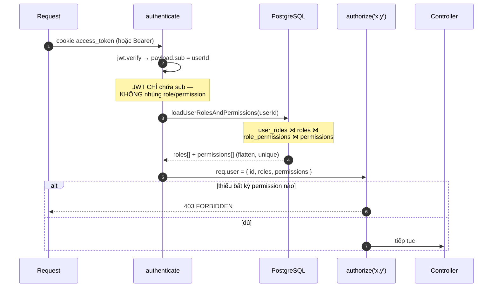
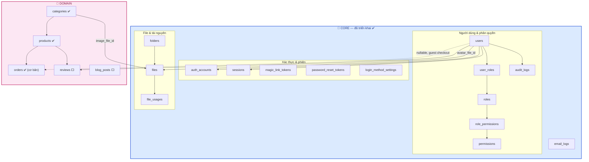
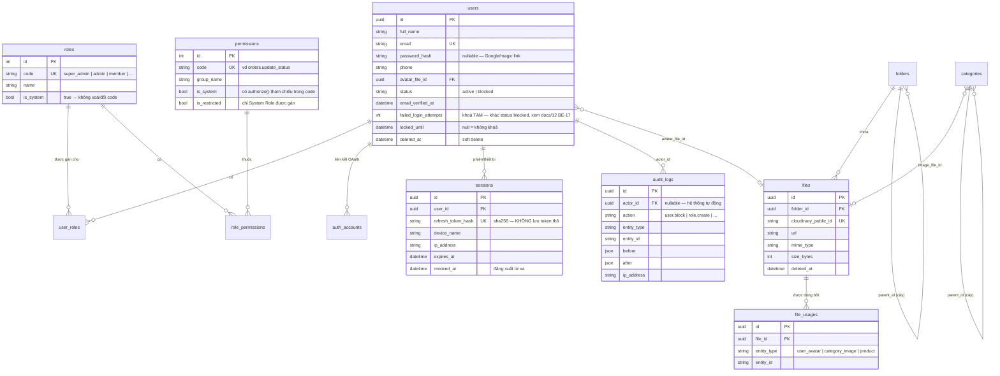
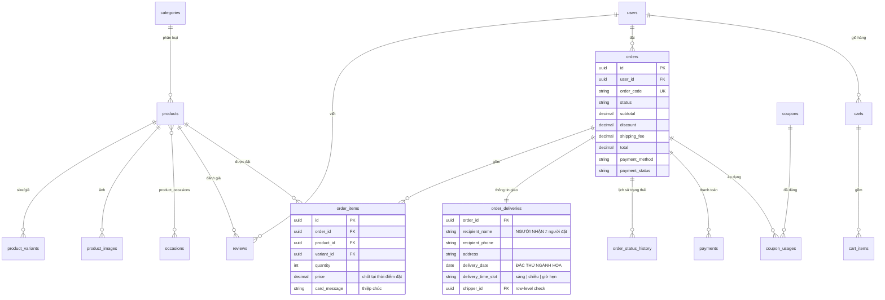

# 05 · Database & Phân quyền (RBAC)

Schema database và hệ thống phân quyền **RBAC** (*Role-Based Access Control* — phân quyền dựa trên vai trò) của dự án.

Đọc trước: [02 · Kiến trúc tổng quan](02-kien-truc-tong-quan.md) · [03 · Backend](03-backend.md).
Đọc kèm: [07 · Bảo mật](07-bao-mat.md) · [modules/core-rbac.md](modules/core-rbac.md).

> **Ký hiệu trạng thái bảng**: ✅ đã có trong `prisma/schema.prisma` và đã chạy migration —
> ⬜ thiết kế đã chốt nhưng **chưa tạo bảng**, sẽ thêm khi triển khai module tương ứng.

> Schema này chia 2 phần theo chiến lược tái sử dụng ở [Kiến trúc §2](02-kien-truc-tong-quan.md#2-chiến-lược-tái-sử-dụng--core-vs-domain): **Core** (§3.1–3.3 — giữ nguyên khi copy sang dự án PERN khác) và **Domain** (§3.4–3.6 — đặc thù nghiệp vụ shop hoa, viết mới cho từng dự án).

---

## 1. Nguyên tắc thiết kế

- Chuẩn hoá (normalize) đến 3NF cho dữ liệu giao dịch (orders, products...), tránh trùng lặp.
- Dùng `id` dạng `BIGSERIAL`/`UUID` làm khoá chính (khuyến nghị UUID cho `users`, `orders` để không lộ số lượng đơn hàng qua ID).
- Timestamp chuẩn: mọi bảng có `created_at`, `updated_at` (trừ bảng thuần many-to-many).
- Xoá mềm (soft delete) cho `products`, `users`, `blog_posts` bằng cột `deleted_at` để không mất dữ liệu lịch sử đơn hàng khi sản phẩm bị gỡ.
- Phân quyền tách rời khỏi bảng `users` (không hard-code role bằng enum) để dễ mở rộng khi shop có thêm vai trò nhân viên mới.

---

## 2. Hệ thống Vai trò & Phân quyền (RBAC)

### 2.1. Vì sao cần RBAC chi tiết cho shop hoa

Chuẩn chung của dự án (**core** — giữ nguyên ở mọi dự án) luôn có **tối thiểu 3 System Role**: `super_admin`, `admin`, `member`. Một shop hoa vận hành thật cần thêm vài vai trò vận hành nội bộ (**domain** — seed riêng cho dự án này) nằm giữa `admin` và `member`:

| Vai trò       | Phạm vi   | Mô tả                                                                                                                                                                                           | Ai dùng                 |
| ------------- | --------- | ----------------------------------------------------------------------------------------------------------------------------------------------------------------------------------------------- | ----------------------- |
| `super_admin` | 🔧 Core   | Toàn quyền hệ thống: **là người duy nhất quản lý tài khoản người dùng** (block/unblock, reset password, đổi role), cấu hình thanh toán/API keys, bật/tắt phương thức đăng nhập, xem mọi báo cáo | Chủ shop / chủ hệ thống |
| `admin`       | 🔧 Core   | Quản lý sản phẩm, danh mục, khuyến mãi, xem báo cáo doanh thu. KHÔNG quản lý được tài khoản người dùng khác (đặc quyền riêng của `super_admin`)                                                 | Quản lý cửa hàng        |
| `sales_staff` | 🌸 Domain | Xử lý đơn hàng, chăm sóc khách hàng, xem/cập nhật trạng thái đơn, KHÔNG xoá sản phẩm, KHÔNG xem báo cáo tài chính                                                                               | Nhân viên bán hàng/CSKH |
| `florist`     | 🌸 Domain | Xem danh sách đơn cần chuẩn bị hoa, cập nhật trạng thái "đã soạn xong", KHÔNG truy cập thông tin thanh toán                                                                                     | Nhân viên cắm hoa       |
| `shipper`     | 🌸 Domain | Xem đơn được phân công giao, cập nhật trạng thái giao hàng (đang giao/đã giao/giao thất bại)                                                                                                    | Người giao hàng         |
| `member`      | 🔧 Core   | Vai trò mặc định của người dùng đăng ký — chỉ thao tác trên dữ liệu của chính mình (đơn hàng, địa chỉ, wishlist, review)                                                                        | Khách hàng              |

> Cả 6 role đều seed sẵn `is_system = true` trong dự án này (kể cả 3 role domain) để bảo vệ khỏi bị xoá nhầm khi vận hành — nhưng khi copy sang dự án khác, chỉ mang theo `super_admin`/`admin`/`member` (đặt trong `core.seed.ts`); `sales_staff`/`florist`/`shipper` thuộc `domain.seed.ts`, dự án mới tự định nghĩa vai trò domain riêng (không nhất thiết `is_system = true`, có thể để `super_admin` tạo qua UI như Custom Role thường).
>
> Thiết kế permission theo **code dạng chuỗi** (`orders.update_status`) thay vì hard-code role trong logic nghiệp vụ, để khi thêm vai trò mới chỉ cần cấu hình lại bảng `role_permissions`, không phải sửa code.

#### RBAC — Role & Permission

- Luôn có tối thiểu **3 System Role**: `super_admin`, `admin`, `member` (`is_system = true`, không xoá được, không đổi được `code`).
- `super_admin` tạo/sửa/xoá **Custom Role** tuỳ ý (`is_system = false`, vd `accountant`, `marketing`) và gán permission cho bất kỳ role nào — vì `role_permissions` là bảng n-n độc lập, `authorize()` chỉ so khớp permission code, không hard-code theo tên role.
- `super_admin` cũng tạo/sửa/xoá được **Permission** (bảng `permissions`), không chỉ gán permission có sẵn — xem quy tắc riêng ở mục "Permission tự tạo" bên dưới.
- **Không được xoá 3 System Role**, và **không được tạo permission/role để bypass lên `super_admin`** — thực thi qua cột `is_restricted` (xem bên dưới): permission "restricted" chỉ tồn tại ở role hệ thống, không role tự tạo nào gán được.

#### SuperAdmin — User Management

- Chỉ `super_admin` được quản lý user: **block/unblock**, **reset password**, **xoá (soft delete)**, **quản lý & gán role**.
- **Không được tự đổi role / block / xoá chính mình** (`targetUserId === req.user.id` → chặn ở tầng service cho cả 3 hành động).
- **Không được gán hoặc tạo thêm `super_admin`** thông qua các chức năng thông thường (`PATCH .../role` luôn từ chối `newRole === 'super_admin'`) — tài khoản `super_admin` chỉ tạo được qua seed/thao tác thủ công trực tiếp trên DB.
- Reset password: `super_admin` bấm "reset" → hệ thống sinh mật khẩu ngẫu nhiên, hash và lưu, gửi mật khẩu mới qua email (Resend) cho user — không hiển thị mật khẩu cho `super_admin` xem.
- **Mọi thao tác nhạy cảm đều ghi Audit Log** (ai, khi nào, giá trị trước/sau): block/unblock/xoá user, đổi role, gán role, reset password, tạo/sửa/xoá Custom Role, tạo/sửa/xoá Permission, gán Permission cho Role, bật/tắt phương thức đăng nhập.

#### Permission tự tạo — vẫn cần code enforce

`super_admin` tạo được permission mới (code, group_name, description) qua UI, nhưng **1 permission chỉ thật sự có tác dụng khi có route nào đó gọi `authorize('code-đó')` trong code** — tạo permission mới qua UI mà chưa có developer wire vào route thì permission đó chỉ nằm im (dùng để tổ chức/gán vào role, không chặn được gì). Đây không phải giới hạn có thể "sửa bằng UI" — nó là bản chất của mô hình permission thực thi trong code, cần nêu rõ cho `super_admin` biết khi tạo permission mới.

Để tránh phá vỡ các route đang hoạt động, `permissions` cũng có cờ `is_system` (song song với `is_restricted`):

- Permission **do hệ thống seed sẵn** (đã có `authorize()` tham chiếu trong code, vd `orders.update_status`) → `is_system = true`: chỉ sửa được `description`/`group_name`, **không đổi được `code`, không xoá được** — đổi/xoá sẽ làm route liên quan mất kiểm soát quyền (authorize luôn fail hoặc luôn pass tuỳ cách code xử lý permission không tồn tại).
- Permission `super_admin` **tự tạo mới** → `is_system = false`: sửa/xoá tự do, kèm cảnh báo nếu đang gán cho role nào.
- Permission "restricted" (`users.manage`, `settings.manage`, `roles.manage`, `permissions.manage`) luôn có cả `is_system = true` **và** `is_restricted = true`.

### 2.2. Bảng dữ liệu

```sql
-- Vai trò
roles
  id            SERIAL PRIMARY KEY
  code          VARCHAR(50) UNIQUE NOT NULL   -- 'super_admin', 'admin', 'sales_staff', 'florist', 'shipper', 'member'
  name          VARCHAR(100) NOT NULL          -- tên hiển thị
  description   TEXT
  is_system     BOOLEAN DEFAULT false          -- true = vai trò hệ thống, không cho xoá

-- Quyền hạn (đơn vị nhỏ nhất có thể cấp)
permissions
  id            SERIAL PRIMARY KEY
  code          VARCHAR(100) UNIQUE NOT NULL   -- 'products.create', 'orders.view_all'...
  group_name    VARCHAR(50) NOT NULL           -- 'products', 'orders', 'reports'... (để gom nhóm trên UI)
  is_system     BOOLEAN DEFAULT false          -- true = do code seed sẵn, có authorize() tham chiếu trong route → không cho đổi code/xoá qua UI
  is_restricted BOOLEAN DEFAULT false          -- true = chỉ gán được cho role is_system=true (chặn leo thang quyền qua role tự tạo)
  description   TEXT

-- Gán quyền cho vai trò (n-n)
role_permissions
  role_id        INT REFERENCES roles(id) ON DELETE CASCADE
  permission_id  INT REFERENCES permissions(id) ON DELETE CASCADE
  PRIMARY KEY (role_id, permission_id)

-- Gán vai trò cho user (n-n — cho phép 1 nhân viên có nhiều vai trò, vd sales kiêm florist ở shop nhỏ)
user_roles
  user_id   UUID REFERENCES users(id) ON DELETE CASCADE
  role_id   INT REFERENCES roles(id) ON DELETE CASCADE
  PRIMARY KEY (user_id, role_id)
```

> Với shop quy mô nhỏ có thể đơn giản hoá bằng cách thêm cột `role_id` trực tiếp vào `users` (1 user = 1 role). Thiết kế `user_roles` many-to-many ở trên chỉ nên dùng nếu dự tính nhân viên có thể kiêm nhiệm nhiều vai trò.

### 2.3. Danh sách permission đề xuất

Toàn bộ permission dưới đây được seed sẵn với `is_system = true` (đã có `authorize()` tham chiếu trong route tương ứng ở backend) — `super_admin` chỉnh được mô tả nhưng không đổi `code`/xoá qua UI. Permission `super_admin` tự tạo thêm sau này mặc định `is_system = false`.

| Phạm vi   | Nhóm        | Permission code              | Ý nghĩa                                                                                            |
| --------- | ----------- | ---------------------------- | -------------------------------------------------------------------------------------------------- |
| 🌸 Domain | products    | `products.manage` ✅          | Thêm/sửa/xoá sản phẩm, quản lý tồn kho — 1 permission gộp chung (đã cài, xem [modules/domain-products.md](modules/domain-products.md)), KHÔNG tách view/create/update/delete như bản thiết kế đầu, khớp cách `categories.manage` đang làm |
| 🌸 Domain | categories  | `categories.manage`          | Thêm/sửa/xoá danh mục, dịp lễ                                                                      |
| 🌸 Domain | orders      | `orders.view_own`            | Khách xem đơn của chính mình                                                                       |
| 🌸 Domain | orders      | `orders.view_all`            | Xem toàn bộ đơn hàng hệ thống                                                                      |
| 🌸 Domain | orders      | `orders.update_status`       | Cập nhật trạng thái đơn (chuẩn bị/giao/hoàn tất)                                                   |
| 🌸 Domain | orders      | `orders.assign_shipper`      | Phân công người giao hàng                                                                          |
| 🌸 Domain | orders      | `orders.cancel`              | Huỷ đơn hàng                                                                                       |
| 🌸 Domain | orders      | `orders.view_delivery_queue` | Xem hàng đợi cần soạn hoa (florist)                                                                |
| 🌸 Domain | orders      | `orders.view_shipping_queue` | Xem đơn cần giao (shipper)                                                                         |
| 🌸 Domain | customers   | `customers.view`             | Xem thông tin khách hàng                                                                           |
| 🌸 Domain | customers   | `customers.manage`           | Sửa/khoá tài khoản khách hàng                                                                      |
| 🌸 Domain | promotions  | `promotions.manage`          | Tạo/sửa mã giảm giá, chương trình sale                                                             |
| 🌸 Domain | reviews     | `reviews.moderate`           | Duyệt/ẩn đánh giá                                                                                  |
| 🌸 Domain | reports     | `reports.view`               | Xem thống kê doanh thu, báo cáo                                                                    |
| 🌸 Domain | blog        | `blog.manage`                | Quản lý bài viết blog, banner                                                                      |
| 🔧 Core   | users       | `users.manage` 🔒            | Block/unblock, reset password, đổi role user (**chỉ `super_admin`**, xem ràng buộc ở mục 2.1)      |
| 🔧 Core   | settings    | `settings.manage` 🔒         | Cấu hình hệ thống, API key thanh toán/email, **bật/tắt phương thức đăng nhập** (chỉ `super_admin`) |
| 🔧 Core   | roles       | `roles.manage` 🔒            | Tạo/sửa/xoá role tuỳ ý, gán permission cho role (chỉ `super_admin`)                                |
| 🔧 Core   | permissions | `permissions.manage` 🔒      | Tạo/sửa/xoá permission (chỉ `super_admin`)                                                         |
| 🔧 Core   | files       | `files.manage`               | Xem/xoá file trong màn hình quản lý tài nguyên (folder, ảnh mồ côi...)                             |
| 🔧 Core   | audit       | `audit.view`                 | Xem nhật ký Audit Log                                                                              |
| 🔧 Core   | contact     | `contact.manage` ✅          | Xem tin nhắn Liên hệ khách gửi, đánh dấu đã xử lý — đã cài, xem [modules/core-contact.md](modules/core-contact.md) |

🔒 = `is_restricted = true` — permission này chỉ được seed sẵn cho role `is_system = true` (mặc định chỉ `super_admin`), không thể gán qua UI tạo/sửa role tuỳ ý. Cột **Phạm vi** map trực tiếp với [Kiến trúc §2](02-kien-truc-tong-quan.md#2-chiến-lược-tái-sử-dụng--core-vs-domain): permission 🔧 Core giữ nguyên khi copy sang dự án khác, permission 🌸 Domain viết mới theo nghiệp vụ từng dự án.

### 2.4. Ma trận Vai trò × Quyền (mặc định seed)

| Permission                    | super_admin | admin |  sales_staff  |           florist            |         shipper          |            member             |
| ----------------------------- | :---------: | :---: | :-----------: | :--------------------------: | :----------------------: | :---------------------------: |
| products.manage               |     ✅      |  ✅   |       –       |              –               |            –             |               –               |
| categories.manage             |     ✅      |  ✅   |       –       |              –               |            –             |               –               |
| orders.view_own               |      –      |   –   |       –       |              –               |            –             |              ✅               |
| orders.view_all               |     ✅      |  ✅   |      ✅       |              –               |            –             |               –               |
| orders.update_status          |     ✅      |  ✅   |      ✅       | ✅ (chỉ trạng thái soạn hoa) | ✅ (chỉ trạng thái giao) |               –               |
| orders.assign_shipper         |     ✅      |  ✅   |      ✅       |              –               |            –             |               –               |
| orders.cancel                 |     ✅      |  ✅   |      ✅       |              –               |            –             | ✅ (trong khung giờ cho phép) |
| orders.view_delivery_queue    |     ✅      |  ✅   |       –       |              ✅              |            –             |               –               |
| orders.view_shipping_queue    |     ✅      |  ✅   |       –       |              –               |            ✅            |               –               |
| customers.view/manage         |     ✅      |  ✅   | ✅ (chỉ view) |              –               |            –             |               –               |
| promotions.manage             |     ✅      |  ✅   |       –       |              –               |            –             |               –               |
| reviews.moderate              |     ✅      |  ✅   |       –       |              –               |            –             |               –               |
| reports.view                  |     ✅      |  ✅   |       –       |              –               |            –             |               –               |
| blog.manage                   |     ✅      |  ✅   |       –       |              –               |            –             |               –               |
| files.manage                  |     ✅      |  ✅   |       –       |              –               |            –             |               –               |
| contact.manage                |     ✅      |  ✅   |       –       |              –               |            –             |               –               |
| users.manage                  |     ✅      |   –   |       –       |              –               |            –             |               –               |
| settings.manage               |     ✅      |   –   |       –       |              –               |            –             |               –               |
| roles.manage                  |     ✅      |   –   |       –       |              –               |            –             |               –               |
| permissions.manage            |     ✅      |   –   |       –       |              –               |            –             |               –               |
| audit.view                    |     ✅      |   –   |       –       |              –               |            –             |               –               |

> Ma trận này sẽ là dữ liệu **seed** ban đầu cho `role_permissions`. `super_admin` có thể chỉnh sửa quyền cho từng vai trò trực tiếp qua UI ở giai đoạn 4 (Advanced), không cần sửa code. Lưu ý: chỉnh sửa `role_permissions` khác với chỉnh sửa **role của một user** (mục 2.1) — thao tác sau chỉ `super_admin` được làm và có các ràng buộc chống leo thang quyền.

### 2.5. Áp dụng ở tầng Backend (Express)

```
Request → authenticate (verify JWT → lấy user id → TRA role/permission HIỆN TẠI từ DB)
        → authorize('orders.update_status')
        → Controller → Service
```



```ts
// shared/middleware/authorize.ts — yêu cầu ĐỦ TẤT CẢ permission truyền vào
export function authorize(...requiredPermissions: string[]) {
  return (req, _res, next) => {
    if (!req.user) return next(new AppError('Chưa đăng nhập', 401, 'UNAUTHENTICATED'));
    const hasAll = requiredPermissions.every((p) => req.user!.permissions.includes(p));
    if (!hasAll) return next(new AppError('Bạn không có quyền thực hiện thao tác này', 403, 'FORBIDDEN'));
    next();
  };
}

// routes — đặt authorize ở đầu router con, áp cho mọi route bên dưới
usersAdminRouter.use(authorize('users.manage'));
```

> **Quyết định kiến trúc**: role/permission **không** được nhúng vào JWT và **không** cache ở Redis —
> mỗi request tra lại DB (truy vấn nhỏ, đã có index trên `user_roles(user_id)` và `role_permissions(role_id)`).
> Đánh đổi một truy vấn để lấy tính đúng đắn: đổi role trong DB **có hiệu lực ngay ở request kế tiếp**,
> không phải đợi token hết hạn hay bắt người dùng đăng nhập lại. Xem [modules/core-rbac.md](modules/core-rbac.md).

**Chưa đủ — cần thêm kiểm tra phạm vi dữ liệu (*row-level check*)** cho các module domain sắp viết.
Permission chung chỉ trả lời "được làm hành động này không", không trả lời "được đụng vào **bản ghi nào**":

- `florist` chỉ được cập nhật đơn đang ở trạng thái "đang chuẩn bị", không được sửa giá/thanh toán.
- `shipper` chỉ thấy/sửa đơn **đã phân công cho chính mình** (`order_deliveries.shipper_id = req.user.id`).
- `member` chỉ thấy đơn có `orders.user_id = req.user.id`.

Đây là biện pháp chống **IDOR** (*Insecure Direct Object Reference* — truy cập trực tiếp tài nguyên của
người khác bằng cách đoán ID) — xem [07 · Bảo mật §2](07-bao-mat.md).

### 2.6. Áp dụng ở tầng Frontend (Next.js)

Frontend có **3 lớp chặn**, nhưng chỉ lớp backend là bảo mật thật — chi tiết ở
[04 · Frontend §3](04-frontend.md#3-bảo-vệ-route--3-lớp-chỉ-1-lớp-là-bảo-mật-thật):

| Lớp | Nơi | Kiểm tra | Bảo mật thật? |
|---|---|---|---|
| 1 | `src/proxy.ts` | **Chỉ** "đã đăng nhập chưa" (decode JWT lấy `exp`, không verify chữ ký) | ❌ UX |
| 2 | `components/admin/AdminShell.tsx` | Role, qua `useMe()` **refetch mỗi lần đổi route** | ❌ UX |
| 3 | Backend `authenticate` + `authorize()` | Permission hiện tại trong DB | ✅ |

- Permission chi tiết **luôn lấy từ `useMe()`** (React Query → `GET /api/v1/account/me`), không suy ra
  ở client và không đọc từ JWT.
- `useAuthStore` (Zustand) chỉ giữ thông tin hiển thị (tên, avatar) cho menu — **không** dùng để
  quyết định quyền.
- Ẩn nút/thao tác theo permission là việc của UX (vd nút "Xoá sản phẩm" chỉ hiện với `products.delete`),
  nhưng **backend vẫn phải kiểm tra lại** — không tin riêng phía client.

---

## 3. Schema Database đầy đủ

> ✅ = bảng đã có trong `prisma/schema.prisma` và đã chạy migration.
> ⬜ = thiết kế đã chốt, **chưa tạo bảng** — thêm khi triển khai module tương ứng.
> Nguồn sự thật là [`backend/prisma/schema.prisma`](../backend/prisma/schema.prisma), không phải bảng dưới đây.

### 3.1. Nhóm Người dùng, Phân quyền & Audit

| Bảng               | Cột chính                                                                                                                                                                                                               | Ghi chú                                                       |
| ------------------ | ----------------------------------------------------------------------------------------------------------------------------------------------------------------------------------------------------------------------- | ------------------------------------------------------------- |
| ✅ `users`            | id, full_name, email, password_hash (**nullable** — user chỉ dùng Google/magic link thì không có), phone, avatar_file_id (FK → `files`), status (active/blocked), email_verified_at, failed_login_attempts, locked_until, created_at, updated_at, deleted_at | `deleted_at` set khi `super_admin` "xoá" user (soft delete). `failed_login_attempts`/`locked_until` là khoá TẠM tự động sau nhiều lần sai (docs/12 BE-17) — khác `status: 'blocked'` (admin chủ động khoá vĩnh viễn); reset về 0/null khi đăng nhập đúng |
| ✅ `roles`            | id, code, name, description, is_system                                                                                                                                                                                  | Xem mục 2.2                                                   |
| ✅ `permissions`      | id, code, group_name, is_system, is_restricted, description                                                                                                                                                             | Xem mục 2.2/2.3                                               |
| ✅ `role_permissions` | role_id, permission_id                                                                                                                                                                                                  |                                                               |
| ✅ `user_roles`       | user_id, role_id                                                                                                                                                                                                        |                                                               |
| ✅ `audit_logs`       | id, actor_id (FK → users, nullable nếu hệ thống tự động), action (`user.block`, `role.create`, `permission.delete`...), entity_type, entity_id, before (JSONB), after (JSONB), ip_address, created_at                   | Ghi mọi thao tác nhạy cảm — xem [Bảo mật §2](07-bao-mat.md) |
| ⬜ `addresses`        | id, user_id, recipient_name, phone, address_line, ward, district, city, is_default                                                                                                                                      | Sổ địa chỉ người nhận                                         |
| ⬜ `special_dates`    | id, user_id, label, date, remind_days_before                                                                                                                                                                            | Nhắc lịch sinh nhật/kỷ niệm                                   |

### 3.2. Nhóm Xác thực & Phiên đăng nhập

Hỗ trợ đủ 3 phương thức đăng nhập (Google OAuth, email/password, magic link) với khả năng bật/tắt từng phương thức, cộng quản lý thiết bị/đăng xuất từ xa:

| Bảng                    | Cột chính                                                                                                                 | Ghi chú                                                                                                                  |
| ----------------------- | ------------------------------------------------------------------------------------------------------------------------- | ------------------------------------------------------------------------------------------------------------------------ |
| ✅ `auth_accounts`         | id, user_id, provider (`google`), provider_account_id, created_at                                                         | Liên kết tài khoản OAuth với `users`; `UNIQUE(provider, provider_account_id)`                                            |
| ✅ `magic_link_tokens`     | id, email, user_id (nullable — email chưa có account thì tạo mới lúc verify), token_hash, expires_at, used_at, created_at | Token **dùng 1 lần**: set `used_at` ngay khi verify; hết hạn ngắn (~15 phút)                                             |
| ✅ `password_reset_tokens` | id, user_id, token_hash, expires_at, used_at, created_at                                                                  | Dùng cho luồng "quên mật khẩu"; cũng dùng khi `super_admin` reset password hộ user                                       |
| ✅ `sessions`              | id, user_id, refresh_token_hash, device_name, ip_address, user_agent, last_active_at, expires_at, revoked_at, created_at  | 1 dòng = 1 thiết bị/phiên đăng nhập → phục vụ màn "quản lý thiết bị" và "đăng xuất từ xa" (set `revoked_at`)             |
| ✅ `login_method_settings` | id, method (`google_oauth` \| `email_password` \| `magic_link`), is_enabled, updated_by (user_id), updated_at             | Do `super_admin` cấu hình; **luôn phải còn ≥ 1 phương thức `is_enabled = true`** — validate ở service, không cho tắt hết |

> Không lưu token thô (magic link, reset password, refresh token) — chỉ lưu `*_hash` (sha256), so khớp hash khi verify, giống nguyên tắc lưu password.

### 3.3. Nhóm Quản lý File & Tài nguyên (Cloudinary)

| Bảng          | Cột chính                                                                                                                       | Ghi chú                                                                                                                |
| ------------- | -------------------------------------------------------------------------------------------------------------------------------- | ---------------------------------------------------------------------------------------------------------------------- |
| ✅ `folders`     | id, name, parent_id (cây thư mục), created_by, created_at                                                                        | Phục vụ màn hình quản lý tài nguyên theo folder                                                                        |
| ✅ `files`       | id, folder_id (nullable), cloudinary_public_id, url, mime_type, size_bytes, original_name, uploaded_by, created_at, deleted_at | `cloudinary_public_id` là định danh thật trên Cloudinary (`resource_type: "image"`) |
| ✅ `file_usages` | id, file_id, entity_type (`product`, `user_avatar`, `blog_post`...), entity_id, created_at                                       | 1 file được gắn vào nhiều nơi → **tái sử dụng ảnh cũ** thay vì upload trùng; `UNIQUE(file_id, entity_type, entity_id)` |

- File được coi là **mồ côi (orphan)** khi không còn dòng nào trong `file_usages` trỏ tới, và đã tạo quá một ngưỡng an toàn (vd 24h, để không xoá nhầm ảnh vừa upload nhưng form chưa submit xong).
- Cron job **10 ngày/lần**: quét file mồ côi → xoá trên Cloudinary + xoá record `files` (xem thêm [Kiến trúc §6](02-kien-truc-tong-quan.md#6-lưu-trữ-file-cloudinary--media), [Bảo mật](07-bao-mat.md)).
- Cột đổi tên từ `r2_key` sang `cloudinary_public_id` bằng `ALTER TABLE ... RENAME COLUMN` (migration
  `20260910100000_rename_r2_key_to_cloudinary_public_id`) — giữ nguyên dữ liệu, không phải drop+add.
  Với môi trường **đã có dữ liệu R2 thật** trước khi migrate: các dòng cũ sẽ có `cloudinary_public_id`
  mang giá trị THỰC RA là `r2Key` cũ, không phải `publicId` Cloudinary thật — job dọn mồ côi gọi
  `destroy()` cho các dòng này sẽ lỗi "not found" (bị bắt, ghi log, không crash job) nhưng cũng không
  dọn được. Cần xử lý riêng khi migrate dữ liệu thật sang production (ngoài phạm vi dev hiện tại).

### 3.4. Nhóm Sản phẩm

| Bảng                | Cột chính                                                                                   | Ghi chú                                                                                      |
| ------------------- | ------------------------------------------------------------------------------------------- | -------------------------------------------------------------------------------------------- |
| ✅ `categories`        | id, name, slug, description, image_file_id (FK → `files`), parent_id, sort_order, is_active | Danh mục con dạng cây; ảnh qua `image_file_id` (tái sử dụng module Files, không lưu URL thô) |
| ⬜ `occasions`         | id, name (Sinh nhật, Valentine...)                                                          | Tag dịp lễ                                                                                   |
| ✅ `products`          | id, name, slug, description, base_price (Int, VND không có đơn vị lẻ), category_id, is_active, deleted_at | **Không có tồn kho** — hoa tươi làm theo đơn/theo mẫu, không phải hàng lưu kho theo SKU cố định (chưa có `product_variants`, xem dòng dưới) — soft delete (`deleted_at`, khác `categories` hard delete) vì `order_items` sẽ tham chiếu sau này |
| ✅ `product_images`    | id, product_id, file_id (FK → `files`), sort_order                                          | Thư viện nhiều ảnh/sản phẩm (khác `categories` chỉ 1 ảnh đại diện) — ảnh qua `file_id`, không lưu URL thô, giống `categories.image_file_id` |
| ⬜ `product_variants`  | id, product_id, name (Nhỏ/Vừa/Lớn), price                                                   | Chưa làm — nếu làm, KHÔNG kèm tồn kho theo variant (lý do như `products` ở trên)             |
| ⬜ `product_occasions` | product_id, occasion_id                                                                     | n-n                                                                                          |
| ⬜ `reviews`           | id, product_id, user_id, rating, comment, images, is_approved, created_at                   |                                                                                              |
| ⬜ `wishlists`         | user_id, product_id                                                                         |                                                                                              |

### 3.5. Nhóm Giỏ hàng & Đơn hàng

| Bảng                   | Cột chính                                                                                                            | Ghi chú                                        |
| ---------------------- | -------------------------------------------------------------------------------------------------------------------- | ---------------------------------------------- |
| — `carts`/`cart_items`   | (không làm)                                                                                                           | Giỏ hàng lưu Ở CLIENT (Zustand + localStorage), không có bảng — xem [modules/domain-orders.md §1](modules/domain-orders.md#1-quyết-định-kiến-trúc-giỏ-hàng-ở-client-không-phải-bảng-carts) |
| ✅ `orders`               | id, user_id (nullable), order_code, status, subtotal, total, payment_method, recipient_name, recipient_phone, delivery_address, delivery_date, delivery_time_slot, note | **Giai đoạn cơ bản** — nhúng thẳng field giao hàng (không tách `order_deliveries`), chưa có `discount`/`shipping_fee`/`payment_status` (chưa coupon/ship/thanh toán online). `id` (UUID) đóng vai trò token tra cứu công khai, `order_code` chỉ để hiển thị — xem [modules/domain-orders.md §2](modules/domain-orders.md#2-schema--rút-gọn-so-với-bản-phác-thảo-đầy-đủ) |
| ✅ `order_items`          | id, order_id, product_id (nullable), product_name, unit_price, quantity, subtotal                                    | Snapshot tên/giá tại thời điểm đặt. Chưa có `variant_id`/`card_message` riêng (dùng chung `orders.note`) |
| ⬜ `order_deliveries`     | order_id, recipient_name, recipient_phone, address, delivery_date, delivery_time_slot, shipper_id                    | Tách ra khi có màn phân công shipper thật — hiện field này nằm thẳng trên `orders` |
| — `order_status_history` | (không làm)                                                                                                           | Dùng lại `AuditLog` chung (`action: 'order.update_status'`), không xây bảng lịch sử riêng |
| ⬜ `payments`             | id, order_id, provider, transaction_id, amount, status, paid_at                                                      | Chưa có — hiện chỉ COD (`orders.payment_method = 'cod'` cố định)                             |
| ⬜ `coupons`              | id, code, type, value, min_order_value, start_date, end_date, usage_limit                                            |                                                |
| ⬜ `coupon_usages`        | coupon_id, order_id, user_id                                                                                         |                                                |

### 3.6. Nhóm Nội dung & Thông báo

| Bảng            | Cột chính                                                                                                                            | Ghi chú                    |
| --------------- | ------------------------------------------------------------------------------------------------------------------------------------ | -------------------------- |
| ⬜ `blog_posts`    | id, author_id, title, slug, content, thumbnail_file_id, published_at                                                                 |                            |
| ⬜ `notifications` | id, user_id, type, message, is_read, created_at                                                                                      |                            |
| ✅ `email_logs`    | id, to_email, type (`welcome`, `magic_link`, `password_reset`, `order_confirmation`...), status, provider_message_id, error, sent_at | Audit email gửi qua Resend |
| ✅ `contact_messages` | id, name, phone, email (nullable), message, is_handled, created_at | Khách gửi qua form Liên hệ công khai (`POST /api/v1/contact`, có rate limit theo IP) — xem [modules/core-contact.md](modules/core-contact.md) |

### 3.7. Quan hệ chính (ERD)

#### Sơ đồ tổng quan — nhóm bảng và liên kết



#### Chi tiết — nhóm Core (đã có trong `schema.prisma`)



#### Chi tiết — nhóm Domain (⬜ thiết kế, chưa tạo bảng trừ `categories`, `products`, `product_images`,
`orders`, `order_items`)

> `orders`/`order_items` **đã tạo** nhưng ở bản RÚT GỌN hơn sơ đồ đầy đủ dưới đây (chưa `order_deliveries`
> riêng, chưa `payments`/`coupons`, kiểu tiền dùng `Int` như `products.base_price` chứ không phải
> `decimal`) — xem đúng schema đã build ở [§3.5](#35-nhóm-giỏ-hàng--đơn-hàng) và
> [modules/domain-orders.md](modules/domain-orders.md). Sơ đồ dưới vẫn giữ nguyên làm bản thiết kế đầy
> đủ cho các giai đoạn sau (thanh toán online, phân công shipper, coupon...).



### 3.8. Index quan trọng

- `users(email)` unique.
- `products(slug)` unique ✅, `products(deleted_at)` ✅, `products(category_id)` ✅ — đã có. Full-text index (`GIN`) trên `products(name, description)` ⬜ — chưa cần, thêm khi có tính năng tìm kiếm thật.
- `orders(order_code)` unique, `orders(user_id)`, `orders(status)`.
- `order_deliveries(delivery_date)` — phục vụ dashboard lịch giao hoa.
- `order_deliveries(shipper_id)` — truy vấn nhanh đơn của từng shipper.
- `role_permissions(role_id)`, `user_roles(user_id)` — tăng tốc kiểm tra quyền lúc auth.
- `sessions(user_id)`, `sessions(refresh_token_hash)` unique — tra cứu phiên nhanh lúc verify refresh token.
- `magic_link_tokens(token_hash)` unique, `password_reset_tokens(token_hash)` unique.
- `file_usages(entity_type, entity_id)` — tìm nhanh ảnh đang gắn với 1 sản phẩm/user cụ thể; `files(deleted_at)` — phục vụ job quét file mồ côi.
- `audit_logs(actor_id)`, `audit_logs(entity_type, entity_id)`, `audit_logs(created_at)` — tra cứu lịch sử theo người thực hiện, theo đối tượng bị tác động, hoặc theo mốc thời gian.

---

## 4. Seed dữ liệu ban đầu

Khi khởi tạo DB, cần seed sẵn (chia 2 file theo [Kiến trúc §2.1](02-kien-truc-tong-quan.md#21-khi-bắt-đầu-1-dự-án-mới-từ-source-base-này): `core.seed.ts` chạy giống nhau ở mọi dự án, `domain.seed.ts` viết riêng cho shop hoa):

**`core.seed.ts`**

1. 3 System Role: `super_admin`, `admin`, `member`.
2. Permission 🔧 Core ở mục 2.3 (`users.manage`, `settings.manage`, `roles.manage`, `permissions.manage`, `files.manage`, `audit.view`, `contact.manage`).
3. 1 tài khoản `super_admin` mặc định (đổi mật khẩu ngay sau lần đăng nhập đầu).
4. `login_method_settings`: cả 3 phương thức (`google_oauth`, `email_password`, `magic_link`) mặc định `is_enabled = true`.

**`domain.seed.ts`** (shop hoa) 5. Role `sales_staff`, `florist`, `shipper`. 6. Permission 🌸 Domain ở mục 2.3 (`products.*`, `orders.*`, `categories.manage`...). 7. Ma trận `role_permissions` theo mục 2.4 (gộp cả permission core lẫn domain). 8. Danh mục/dịp lễ mẫu (`categories`, `occasions`) nếu muốn có sẵn dữ liệu demo.

> ⚠️ **Cả 2 file PHẢI gán `role_permissions` kiểu THÊM (`createMany` + `skipDuplicates`), KHÔNG BAO
> GIỜ `deleteMany` trước khi gán lại** cho `admin`/`super_admin` — 2 role này bị **cả 2 file cùng
> gán** (core.seed.ts gán permission 🔧 Core, domain.seed.ts gán thêm permission 🌸 Domain). Bug thật
> đã xảy ra: `core.seed.ts` từng `deleteMany` rồi mới `createMany`, nên chạy lại `npm run seed:core`
> (vd sau khi thêm 1 permission core mới) **sau khi đã chạy `seed:domain`** xoá sạch mọi permission
> domain của admin/super_admin — `/admin/categories` và `/admin/products` báo 403 dù trước đó vẫn
> chạy bình thường. Khắc phục bằng cách chạy lại `npm run seed:domain`, và sửa `core.seed.ts` bỏ hẳn
> bước `deleteMany`. Xem comment tại vòng lặp gán role trong `core.seed.ts`.

> ⚠️ **Đối chiếu mảng seed với bảng ma trận Vai trò × Quyền (mục 2.4) mỗi khi thêm permission mới** —
> đừng chỉ tin permission "trông có vẻ" đủ. Bug thật đã xảy ra: `domain.seed.ts`'s
> `ADMIN_DOMAIN_PERMISSIONS` thiếu `orders.update_status` từ trước (dù ma trận 2.4 ghi rõ admin/
> super_admin đều có quyền này) — hậu quả kể cả `super_admin` cũng bị `403 FORBIDDEN` khi đổi trạng
> thái đơn hàng sang bất kỳ giá trị nào ngoài `cancelled` (`orders.cancel` là permission KHÁC, không
> bị ảnh hưởng). Phát hiện khi build module Orders, test thủ công qua `curl` thật (test tự động mock
> permission nên không lộ bug này). Đã sửa + chạy lại `npm run seed:domain`. Xem
> [modules/domain-orders.md §3](modules/domain-orders.md#3-quyền-theo-giá-trị-không-phải-1-permission-cố-định-cho-route).

---

## 5. Triển khai bằng Prisma

Schema thật nằm ở **[`backend/prisma/schema.prisma`](../backend/prisma/schema.prisma)** — đó là nguồn
sự thật duy nhất, tài liệu này mô tả *ý định thiết kế*. Khi hai bên lệch nhau, sửa tài liệu theo schema.

File schema chia 2 nửa bằng banner comment:

```prisma
// =====================================================================
// CORE (reusable) — giữ nguyên khi copy source base sang dự án PERN khác
// =====================================================================
model User { ... }   model Role { ... }   model Permission { ... }
model Session { ... }   model File { ... }   model AuditLog { ... }   ...

// =====================================================================
// DOMAIN (flower shop specific) — thay thế bằng nghiệp vụ của dự án mới
// =====================================================================
model Category { ... }
```

### Quy ước bắt buộc trong schema

| Quy ước | Ví dụ | Lý do |
|---|---|---|
| `@map` cho mọi cột nhiều từ | `fullName String @map("full_name")` | Code dùng camelCase, DB dùng snake_case |
| `@@map` cho mọi model | `@@map("users")` | Tên bảng số nhiều, snake_case |
| Model core đặt **trên** banner, domain đặt **dưới** | | Copy sang dự án mới chỉ cần cắt nửa dưới |
| Token luôn lưu **hash**, không lưu bản thô | `refreshTokenHash String @unique @map("refresh_token_hash")` | Lộ DB không đồng nghĩa lộ session |
| Soft delete chỉ ở bảng thực sự cần | `deletedAt DateTime? @map("deleted_at")` | Không lạm dụng cho mọi bảng |
| `onDelete: Cascade` cho bảng nối n-n | `user_roles`, `role_permissions`, `file_usages` | Xoá cha thì bản ghi nối phải đi theo |

### Lệnh thường dùng

```bash
npx prisma migrate dev --name <mô-tả-ngắn>   # tạo + áp migration khi dev
npx prisma migrate deploy                    # áp migration ở staging/production
npx prisma generate                          # sinh lại Prisma Client sau khi đổi schema
npx prisma studio                            # xem/sửa dữ liệu bằng GUI
npm run seed:core && npm run seed:domain     # nạp dữ liệu ban đầu
```

> ⚠️ **Không bao giờ** sửa file migration đã commit. Cần đổi thì tạo migration mới.
> Migration đã chạy trên production là bất biến.

### Ghi chú về `noUncheckedIndexedAccess`

`tsconfig.json` bật `noUncheckedIndexedAccess: true` — truy cập phần tử mảng/đối tượng theo index trả về
kiểu `T | undefined`. Đây là chủ đích: buộc xử lý trường hợp thiếu dữ liệu thay vì để `undefined` lọt
xuống runtime. Khi chắc chắn có giá trị, dùng `!` kèm comment giải thích vì sao chắc chắn.
