# 06 · API Reference

Base URL: `http://localhost:4000` (dev) · mọi endpoint mount dưới **`/api/v1`**.
Ngoại lệ duy nhất không versioning: `GET /health`.

> Đây là tài liệu **viết tay** — vẫn hữu ích vì có giải thích bối cảnh/lý do (ràng buộc nghiệp vụ, đánh
> đổi thiết kế) mà 1 spec máy sinh không có, nhưng phần **request/response chi tiết theo từng trường**
> có thể lệch dần theo thời gian. Từ 11/09/2026, [`GET /docs`](http://localhost:4000/docs) (Swagger UI)
> và `GET /openapi.json` là **spec sinh trực tiếp từ chính các zod schema `*.validation.ts` đang chạy
> thật** — phần request (body/query/params) ở đó **không thể lệch code** (docs/12 BE-12). Khi cần biết
> chính xác 1 field/kiểu dữ liệu, ưu tiên tra ở đó; tài liệu này vẫn là nơi đọc hiểu tổng quan bằng
> tiếng Việt.

---

## 1. Quy ước chung

### Xác thực

Token nằm ở **cookie `httpOnly`**, trình duyệt tự đính kèm khi gọi với `withCredentials: true`.
Client không phải trình duyệt có thể dùng `Authorization: Bearer <access_token>`.

| Cookie | Nội dung | Thời hạn | `path` |
|---|---|---|---|
| `access_token` | JWT, payload chỉ chứa `sub` (user id) | `JWT_ACCESS_EXPIRES_IN` (mặc định 5 phút) | `/` |
| `refresh_token` | Chuỗi ngẫu nhiên 32 byte; DB chỉ lưu `sha256` | 30 ngày | `/api/v1` |

> `refresh_token` để `path=/api/v1` (không hẹp hơn) vì `/api/v1/account/sessions` cần đọc cookie này
> để biết phiên nào là "phiên hiện tại".

### Response

```jsonc
// Thành công
{ "success": true, "message": "Success", "data": {} }

// Danh sách có phân trang
{ "success": true, "message": "Success", "data": [],
  "meta": { "page": 1, "limit": 20, "total": 100, "totalPages": 5 } }

// Lỗi validate (422)
{ "success": false, "message": "Validation failed", "errors": { "email": "Email không hợp lệ" } }

// Lỗi nghiệp vụ
{ "success": false, "message": "Bạn không có quyền thực hiện thao tác này", "code": "FORBIDDEN" }
```

Bảng mã lỗi đầy đủ: [03 · Backend §3](03-backend.md#bảng-mã-lỗi-code).

### Header

| Header | Chiều | Ý nghĩa |
|---|---|---|
| `X-Request-Id` | vào (tuỳ chọn) / ra (luôn có) | ID trace request; gửi kèm khi báo lỗi để tra log server |

### Cột "Quyền" trong các bảng dưới

| Ký hiệu | Nghĩa |
|---|---|
| — | Công khai, không cần đăng nhập |
| 🔑 | Cần đăng nhập (bất kỳ role nào) |
| `permission.code` | Cần đăng nhập **và** có permission đó |

---

## 2. Bản đồ endpoint

```mermaid
flowchart LR
    ROOT["/api/v1"] --> AUTH["/auth<br/>— công khai"]
    ROOT --> ACC["/account<br/>🔑 authenticate"]
    ROOT --> FILES["/files<br/>🔑 + files.manage cho ghi/xoá"]
    ROOT --> FOLDERS["/folders<br/>🔑 files.manage"]
    ROOT --> CAT["/categories<br/>— công khai, storefront"]
    ROOT --> OCC["/occasions<br/>— công khai, storefront"]
    ROOT --> PROD["/products<br/>— công khai, storefront"]
    ROOT --> ORD["/orders<br/>— công khai, guest checkout, rate limit 10/15p"]
    ROOT --> REV["/reviews<br/>— công khai, chỉ đánh giá đã duyệt"]
    ROOT --> CPN["/coupons<br/>— công khai, validate mã giảm giá"]
    ROOT --> BLOGP["/blog<br/>— công khai, bài đã xuất bản"]
    ROOT --> NEWS["/newsletter<br/>— công khai, subscribe/unsubscribe"]
    ROOT --> SITECON["/site-content<br/>— công khai, banner Hero/hotline/Zalo/địa chỉ/giờ mở cửa"]
    ROOT --> CONTACT["/contact<br/>— công khai, rate limit 5/15p"]
    ROOT --> ADM["/admin/*<br/>🔑 nghiệp vụ domain"]
    ROOT --> SA["/superadmin/*<br/>🔑 quản trị hệ thống"]

    AUTH --> A1["register · login · logout · refresh<br/>magic-link/request · magic-link/verify<br/>google · forgot-password · reset-password<br/>login-methods"]
    ACC --> C1["me · profile · change-password<br/>sessions (list · revoke 1 · revoke khác)<br/>orders → orders.view_own (lịch sử đơn chính mình)<br/>addresses/wishlist/reviews/special-dates → 🔑 KHÔNG permission riêng"]
    ADM --> AD1["/admin/categories<br/>categories.manage"]
    ADM --> AD1b["/admin/occasions<br/>categories.manage"]
    ADM --> AD2["/admin/products<br/>products.manage"]
    ADM --> AD3["/admin/contact-messages<br/>contact.manage"]
    ADM --> AD4["/admin/orders<br/>orders.view_all · update_status · cancel<br/>delivery-queue → orders.view_delivery_queue"]
    ADM --> AD5["/admin/reviews<br/>reviews.moderate"]
    ADM --> AD6["/admin/coupons<br/>promotions.manage"]
    ADM --> AD7["/admin/blog · /admin/newsletter<br/>blog.manage"]
    ADM --> AD8["/admin/site-content<br/>site_content.manage (KHÁC settings.manage 🔒)"]
    ADM --> AD9["/admin/dashboard<br/>reports.view"]
    SA --> S1["/users → users.manage 🔒"]
    SA --> S2["/roles → roles.manage 🔒"]
    SA --> S3["/permissions → permissions.manage 🔒"]
    SA --> S4["/login-methods → settings.manage 🔒"]
    SA --> S5["/audit-logs → audit.view"]
    SA --> S6["/settings → settings.manage 🔒"]

    HEALTH["/health<br/>ngoài versioning"]
    DOCS["/docs · /openapi.json<br/>ngoài versioning — xem docs/12 BE-12"]

    style SA fill:#fee2e2,stroke:#b91c1c,stroke-width:2px,color:#7f1d1d
    style ADM fill:#fef3c7,stroke:#b45309,stroke-width:2px,color:#78350f
    style AUTH fill:#dcfce7,stroke:#15803d,stroke-width:2px,color:#14532d
```



---

## 3. Health

| Method | Path | Quyền | Mô tả |
|---|---|---|---|
| `GET` | `/health` | — | Health check cho load balancer / uptime monitor |

```json
{ "success": true, "data": { "status": "ok" } }
```

---

## 4. Auth — `/api/v1/auth`

| Method | Path | Quyền | Rate limit | Mô tả |
|---|---|---|---|---|
| `GET` | `/login-methods` | — | — | Phương thức đăng nhập đang bật (FE ẩn/hiện nút tương ứng) |
| `POST` | `/register` | — | 20 / 15 phút | Đăng ký bằng email + mật khẩu — **không** tự đăng nhập |
| `POST` | `/login` | — | 20 / 15 phút | Đăng nhập email + mật khẩu |
| `POST` | `/magic-link/request` | — | **5 / 15 phút** | Gửi liên kết đăng nhập qua email |
| `POST` | `/magic-link/verify` | — | — | Đăng nhập bằng token magic link (dùng 1 lần) |
| `POST` | `/google` | — | 20 / 15 phút | Đăng nhập bằng Google ID token |
| `POST` | `/refresh` | cookie `refresh_token` | — | Cấp cặp token mới (*rotation*) |
| `POST` | `/logout` | cookie `refresh_token` | — | Thu hồi phiên + xoá cookie |
| `POST` | `/forgot-password` | — | 20 / 15 phút | Gửi email đặt lại mật khẩu |
| `POST` | `/reset-password` | — | 20 / 15 phút | Đặt lại mật khẩu bằng token |

### `POST /api/v1/auth/register`

```jsonc
// Request
{ "fullName": "Nguyễn Văn A", "email": "a@example.com", "password": "matkhau123" }
// 200 — không set cookie, người dùng tự đăng nhập lại
{ "success": true, "message": "Đăng ký thành công, vui lòng đăng nhập.",
  "data": { "user": { "id": "uuid", "email": "a@example.com", "fullName": "Nguyễn Văn A", "...": "..." } } }
```

Ràng buộc: `fullName` ≥ 1 ký tự · `email` đúng định dạng · `password` ≥ 8 ký tự.
Lỗi: `409 EMAIL_TAKEN` · `403 LOGIN_METHOD_DISABLED`.

### `POST /api/v1/auth/login`

```jsonc
{ "email": "a@example.com", "password": "matkhau123" }
// 200 + Set-Cookie: access_token, refresh_token
{ "success": true, "message": "Success", "data": { "user": { "...": "..." } } }
```

Lỗi: `401 INVALID_CREDENTIALS` · `403 ACCOUNT_BLOCKED` · `403 LOGIN_METHOD_DISABLED` ·
`429 ACCOUNT_TEMPORARILY_LOCKED` (docs/12 BE-17 — sai mật khẩu ≥ 5 lần liên tiếp, cooldown tăng dần
1→2→4→...→30 phút; reset về 0 khi đăng nhập đúng. Trả 429 NGAY, không verify mật khẩu, kể cả gửi
đúng mật khẩu trong lúc đang khoá).

> Sai email và sai mật khẩu trả **cùng một** thông điệp — không tiết lộ email nào có tài khoản.
> Rate limit theo IP **và** theo email (docs/12 BE-16) — 2 lớp giới hạn tần suất, cộng thêm cơ chế
> khoá tạm ở trên; cả 3 ngưỡng hiện là hằng số trong code, chưa cấu hình được qua biến môi trường.

### `POST /api/v1/auth/magic-link/request`

```jsonc
{ "email": "a@example.com" }
// 200 — LUÔN thành công, kể cả email không tồn tại (chống dò tài khoản)
{ "success": true, "message": "Nếu email tồn tại, liên kết đăng nhập đã được gửi.", "data": null }
```

### `POST /api/v1/auth/magic-link/verify`

```jsonc
{ "token": "<token từ link trong email>" }
// 200 + Set-Cookie
{ "success": true, "data": { "user": { "...": "..." } } }
```

Token **dùng 1 lần**, TTL mặc định 15 phút. Email chưa có tài khoản → tự tạo tài khoản
(magic link kiêm luôn vai trò "đăng ký nhanh" — docs/12 BE-20, xác nhận hoạt động thật 11/09/2026).
Lỗi: `401 INVALID_MAGIC_LINK` · `403 REGISTRATION_DISABLED` (email mới nhưng `registration_enabled`
đang tắt — xem [modules/core-settings.md §6](modules/core-settings.md)).

### `POST /api/v1/auth/google`

```jsonc
{ "idToken": "<ID token từ Google Identity Services>" }
```

Backend verify ID token bằng `google-auth-library` với `audience = GOOGLE_CLIENT_ID`.
Lỗi: `401 INVALID_GOOGLE_TOKEN` · `403 LOGIN_METHOD_DISABLED`.

### `POST /api/v1/auth/refresh`

Không có body — đọc cookie `refresh_token`. Thu hồi token cũ, phát hành cặp mới (*rotation*).
Lỗi: `401 UNAUTHENTICATED` (thiếu cookie) · `401 SESSION_EXPIRED` (hết hạn / đã thu hồi / token đã xoay
vòng bị dùng lại) · `403 ACCOUNT_BLOCKED`.
Khi lỗi `401`/`403`, response **xoá cả 2 cookie** (`access_token`, `refresh_token`) để trình duyệt thôi
gửi lại token chết; lỗi `500` giữ nguyên cookie (docs/12 BE-24).

### `POST /api/v1/auth/forgot-password` · `/reset-password`

```jsonc
// forgot-password — luôn trả 200 dù email không tồn tại
{ "email": "a@example.com" }

// reset-password
{ "token": "<token từ email>", "newPassword": "matkhaumoi123" }
```

Lỗi: `401 INVALID_RESET_TOKEN` (sai / hết hạn / đã dùng).

---

## 5. Account — `/api/v1/account` 🔑

| Method | Path | Quyền | Mô tả |
|---|---|---|---|
| `GET` | `/me` | 🔑 | Hồ sơ + **`roles`/`permissions` hiện tại từ DB** |
| `PATCH` | `/profile` | 🔑 | Sửa `fullName`, `phone`, `avatarFileId` |
| `POST` | `/change-password` | 🔑 | Đổi mật khẩu |
| `GET` | `/sessions` | 🔑 | Danh sách thiết bị đang đăng nhập |
| `DELETE` | `/sessions/:id` | 🔑 | Đăng xuất **một** thiết bị |
| `DELETE` | `/sessions` | 🔑 | Đăng xuất **tất cả thiết bị khác** (giữ phiên hiện tại) |

### `GET /api/v1/account/me`

```jsonc
{ "success": true, "data": {
    "id": "uuid", "fullName": "Nguyễn Văn A", "email": "a@example.com",
    "phone": null, "avatarFileId": null, "avatarFile": null,
    "status": "active", "emailVerifiedAt": null,
    "roles": ["super_admin"],
    "permissions": ["users.manage", "roles.manage", "categories.manage", "..."]
} }
```

`roles`/`permissions` luôn tra **mới từ DB** — frontend dùng để cập nhật menu ngay sau F5,
không cần đăng xuất/đăng nhập lại. Trường `passwordHash` **không bao giờ** xuất hiện trong response.

### `PATCH /api/v1/account/profile`

```jsonc
{ "fullName": "Tên mới", "phone": "0900000000", "avatarFileId": "uuid-file" }
```

Mọi trường đều tuỳ chọn. Đặt `avatarFileId` sẽ ghi `file_usages` (`entity_type = user_avatar`),
ảnh cũ tự hết được tính là đang dùng và sẽ bị cron dọn sau.

### `POST /api/v1/account/change-password`

```jsonc
{ "currentPassword": "cu123456", "newPassword": "moi12345678" }
```

Tài khoản chưa từng có mật khẩu (chỉ đăng nhập Google/magic link) được phép đặt mật khẩu mới mà
không cần `currentPassword` khớp. Lỗi: `401 INVALID_CURRENT_PASSWORD`.

### `GET /api/v1/account/sessions`

```jsonc
{ "success": true, "data": [
  { "id": "uuid", "deviceName": "Chrome trên macOS", "ipAddress": "1.2.3.4",
    "lastActiveAt": "2026-09-09T02:00:00.000Z", "createdAt": "...", "isCurrent": true }
] }
```

---

## 5b. Addresses — `/api/v1/account/addresses` 🌸 🔑

Sổ địa chỉ người nhận — thuần dữ liệu cá nhân, **KHÔNG có permission riêng** (chỉ cần đăng nhập, giống
`/account/profile` ở trên) — xem [modules/domain-addresses.md](modules/domain-addresses.md).

| Method | Path | Mô tả |
|---|---|---|
| `GET` | `/` | Sổ địa chỉ của chính mình — mặc định trước, cũ nhất trước |
| `POST` | `/` | Thêm địa chỉ mới |
| `PATCH` | `/:id` | Sửa địa chỉ (chỉ địa chỉ của CHÍNH MÌNH — `404` nếu không phải) |
| `DELETE` | `/:id` | Xoá địa chỉ (chỉ địa chỉ của CHÍNH MÌNH) |

```jsonc
POST /api/v1/account/addresses
{ "recipientName": "Trần Thị B", "recipientPhone": "0900000000",
  "addressLine": "123 Đường Hoa", "ward": "Phường 1", "district": "Quận 1", "city": "TP.HCM" }
```

- Địa chỉ **ĐẦU TIÊN** của user tự động là mặc định (`isDefault: true`) dù không truyền `isDefault`.
- Đặt `isDefault: true` cho 1 địa chỉ sẽ tự **unset** địa chỉ mặc định cũ (chỉ 1 địa chỉ mặc định/user).
- `PATCH`/`DELETE` theo `:id` **luôn** kiểm tra địa chỉ đó thuộc đúng user đang đăng nhập
  (`where: { id, userId }`) — `404 NOT_FOUND` nếu `id` tồn tại nhưng thuộc user khác (chống IDOR,
  không phân biệt "không tồn tại" và "không phải của mình" để tránh lộ thông tin id nào tồn tại).
- Xoá địa chỉ mặc định **không** tự đôn địa chỉ khác lên — khách tự chọn lại nếu cần.

---

## 5c. Special Dates — `/api/v1/account/special-dates` 🌸 🔑

Nhắc lịch sinh nhật/kỷ niệm — thuần dữ liệu cá nhân, **KHÔNG có permission riêng**, xem
[modules/domain-special-dates.md](modules/domain-special-dates.md).

| Method | Path | Mô tả |
|---|---|---|
| `GET` | `/` | Danh sách ngày đặc biệt của chính mình |
| `POST` | `/` | Thêm ngày mới |
| `PATCH` | `/:id` | Sửa (chỉ ngày của CHÍNH MÌNH — `404` nếu không phải) |
| `DELETE` | `/:id` | Xoá (chỉ ngày của CHÍNH MÌNH) |

```jsonc
POST /api/v1/account/special-dates
{ "label": "Sinh nhật mẹ", "date": "2000-05-15", "remindDaysBefore": 5 }
```

- `date` chỉ **THÁNG-NGÀY** có ý nghĩa (lặp lại hằng năm) — năm nhập vào không ảnh hưởng gì.
- Bỏ trống `remindDaysBefore` → mặc định nhắc trước **3 ngày**.
- Job nền hằng ngày (`jobs/sendSpecialDateReminders.job.ts`) gửi email nhắc đúng vào ngày
  (ngày dịp lễ sắp tới − `remindDaysBefore`) trùng hôm nay — xem
  [modules/domain-special-dates.md §2](modules/domain-special-dates.md).
- `PATCH`/`DELETE` theo `:id` chống IDOR giống `addresses` — `404 NOT_FOUND` nếu `id` thuộc user khác.

---

## 6. Files — `/api/v1/files` 🔑

| Method | Path | Quyền | Mô tả |
|---|---|---|---|
| `POST` | `/presign` | 🔑 | Lấy chữ ký để upload thẳng lên Cloudinary |
| `POST` | `/` | 🔑 | Lưu metadata sau khi upload xong (server tự tra lại metadata thật từ Cloudinary) |
| `GET` | `/` | `files.manage` | Danh sách file (phân trang) |
| `DELETE` | `/:id` | `files.manage` | Xoá mềm (Cloudinary object bị purge ở lượt cron sau) |

### `POST /api/v1/files/presign`

```jsonc
// Request — zod validate mime/size chỉ để phản hồi sớm cho UX, KHÔNG phải ràng buộc mật mã học
{ "originalName": "hoa-hong.jpg", "mimeType": "image/jpeg", "sizeBytes": 204800, "folderId": null }
// Response
{ "success": true, "data": {
    "uploadUrl": "https://api.cloudinary.com/v1_1/<cloud_name>/image/upload",
    "publicId": "uploads/2026-09-09/<uuid>",
    "timestamp": 1757404800,
    "signature": "<HMAC-SHA1 hex>",
    "apiKey": "<CLOUDINARY_API_KEY>",
    "allowedFormats": "jpg,jpeg,png,webp,gif,pdf",
    "folderId": null
} }
```

Ràng buộc: `mimeType` ∈ `image/jpeg` · `image/png` · `image/webp` · `image/gif` · `application/pdf`;
`sizeBytes` ≤ **10 MB** (chỉ ở tầng zod, không chặn được ở bước upload thật lên Cloudinary — xem
[modules/core-files.md §4](modules/core-files.md#4-bảo-mật)). Chữ ký chỉ ràng buộc **định dạng**
(`allowedFormats`) — tính cục bộ bằng HMAC-SHA1, không có "hạn 5 phút" như presigned URL S3 trước đây.
`publicId` là UUID ngẫu nhiên, **không có phần mở rộng** (Cloudinary tự nhận diện định dạng thật) và
không dùng tên gốc — tránh *path traversal* và trùng tên.

Frontend dùng response này để tự dựng `FormData` (file, `apiKey`, `timestamp`, `signature`,
`publicId`, `allowedFormats`) và `POST` thẳng lên `uploadUrl`.

### `POST /api/v1/files`

```jsonc
{ "publicId": "uploads/2026-09-09/<uuid>", "originalName": "hoa-hong.jpg", "folderId": null }
// 201 — server gọi Cloudinary Admin API lấy url/mimeType/sizeBytes THẬT, không tin client khai
// 404 FILE_NOT_FOUND nếu publicId không tồn tại trên Cloudinary
// 422 FILE_TOO_LARGE nếu > 10MB (file bị xoá luôn trên Cloudinary, không tạo bản ghi DB)
```

### `GET /api/v1/files?folderId=&view=grid|list&page=1&limit=24`

Trả về dạng phân trang (`data` + `meta`). `limit` tối đa 100, mặc định 24. **Bỏ trống `folderId`** =
chỉ file ở **cấp gốc** (`folderId = null`) — khớp đúng quy ước của `GET /folders` (§6b) — không phải
liệt kê lẫn lộn toàn bộ file mọi thư mục.

---

## 6b. Folders — `/api/v1/folders` 🔑 (docs/12 BE-19)

Cây thư mục cho màn quản lý tài nguyên (file/ảnh) — mọi route đều cần `files.manage`.

| Method | Path | Quyền | Mô tả |
|---|---|---|---|
| `GET` | `/?parentId=` | `files.manage` | Danh sách thư mục con của `parentId`; bỏ trống = cấp gốc |
| `POST` | `/` | `files.manage` | Tạo thư mục |
| `PATCH` | `/:id` | `files.manage` | Sửa tên và/hoặc di chuyển (`parentId`) |
| `DELETE` | `/:id` | `files.manage` | Xoá — **chỉ khi thư mục rỗng** |

```jsonc
// POST / — tạo thư mục gốc hoặc thư mục con
{ "name": "Ảnh sản phẩm", "parentId": null }
// 201
{ "success": true, "data": {
    "id": "uuid", "name": "Ảnh sản phẩm", "parentId": null, "createdBy": "uuid",
    "createdAt": "...", "_count": { "folders": 0, "files": 0 }
} }
```

Lỗi: `404 PARENT_NOT_FOUND` (thư mục cha không tồn tại) · `400 FOLDER_CYCLE` (chọn chính nó hoặc
thư mục con làm cha — logic giống hệt `assertNoCycle` của Categories) · `409 FOLDER_NOT_EMPTY` (xoá
thư mục còn thư mục con hoặc file bên trong — phải chuyển/xoá trước).

> ✅ **Cập nhật 11/09/2026**: màn hình UI "Quản lý tài nguyên" (cây thư mục lazy-load + xem file dạng
> lưới/danh sách) đã xây xong — `/admin/resources`, xem [modules/core-files.md](modules/core-files.md#5-màn-hình-quản-lý-tài-nguyên).

---

## 7. Categories 🌸

| Method | Path | Quyền | Mô tả |
|---|---|---|---|
| `GET` | `/api/v1/categories` | — | Danh mục đang bật, cho storefront |
| `GET` | `/api/v1/admin/categories?includeInactive=` | `categories.manage` | Danh sách đầy đủ |
| `POST` | `/api/v1/admin/categories` | `categories.manage` | Tạo danh mục |
| `PATCH` | `/api/v1/admin/categories/:id` | `categories.manage` | Sửa danh mục |
| `DELETE` | `/api/v1/admin/categories/:id` | `categories.manage` | Xoá danh mục |

### `GET /api/v1/categories` (công khai)

Chỉ trả trường cần hiển thị — **không** lộ `sortOrder`/timestamps nội bộ:

```jsonc
{ "success": true, "data": [
  { "id": "uuid", "name": "Hoa sinh nhật", "slug": "hoa-sinh-nhat",
    "description": null, "parentId": null, "imageFile": null }
] }
```

### `POST /api/v1/admin/categories`

```jsonc
{ "name": "Hoa cưới", "slug": "hoa-cuoi", "description": "...",
  "imageFileId": "uuid", "parentId": null, "sortOrder": 0, "isActive": true }
```

- Bỏ trống `slug` → tự sinh từ `name` (bỏ dấu tiếng Việt: "Hoa cưới" → `hoa-cuoi`).
- Slug trùng → tự thêm hậu tố `-2`, `-3`...
- **Đổi `name` không tự đổi `slug`** — tránh gãy link đã chia sẻ; chỉ đổi khi sửa `slug` thủ công.

Lỗi: `400 CATEGORY_CYCLE` (chọn danh mục con làm cha) · `404 PARENT_NOT_FOUND` ·
`409 CATEGORY_HAS_CHILDREN` (xoá khi còn con).

---

## 8. Products 🌸

| Method | Path | Quyền | Mô tả |
|---|---|---|---|
| `GET` | `/api/v1/products?categoryId=&page=&limit=` | — | Sản phẩm đang bật, cho storefront (phân trang) |
| `GET` | `/api/v1/products/:slug` | — | Chi tiết 1 sản phẩm đang bật theo `slug`, cho trang chi tiết storefront |
| `GET` | `/api/v1/admin/products?includeInactive=&categoryId=&page=&limit=` | `products.manage` | Danh sách đầy đủ (phân trang) |
| `POST` | `/api/v1/admin/products` | `products.manage` | Tạo sản phẩm |
| `PATCH` | `/api/v1/admin/products/:id` | `products.manage` | Sửa sản phẩm |
| `DELETE` | `/api/v1/admin/products/:id` | `products.manage` | Xoá mềm sản phẩm |

### `GET /api/v1/products` (công khai)

Trả về dạng phân trang (`data` + `meta`), mỗi sản phẩm kèm `category` và `images` (đã sắp theo
`sortOrder`) — **KHÔNG** có `isActive`/`createdAt`/`updatedAt`/`categoryId` (nội bộ, và `categoryId`
dư thừa vì đã có object `category`), khác `GET /api/v1/admin/products` trả đủ trường:

```jsonc
{ "success": true, "data": [
  { "id": "uuid", "name": "Bó hoa hồng đỏ", "slug": "bo-hoa-hong-do",
    "description": null, "basePrice": 350000,
    "category": { "id": "uuid", "name": "Hoa bó", "slug": "hoa-bo" },
    "images": [{ "id": "uuid", "sortOrder": 0, "file": { "id": "uuid", "url": "https://res.cloudinary.com/..." } }],
    "variants": [{ "id": "uuid", "name": "Nhỏ", "price": 350000, "sortOrder": 0 },
                 { "id": "uuid", "name": "Lớn", "price": 550000, "sortOrder": 1 }] }
], "meta": { "page": 1, "limit": 24, "total": 1, "totalPages": 1 } }
```

`basePrice` là số nguyên VND (không có đơn vị lẻ, không dùng kiểu Decimal) — xem
[modules/domain-products.md](modules/domain-products.md). `description` là **HTML đã sanitize** (rich
text — xem [modules/domain-products.md §9](modules/domain-products.md#9-mô-tả-dạng-rich-text)), không
phải văn bản thuần — client tự chịu trách nhiệm render đúng (hoặc dùng
`stripHtml()` để lấy bản tóm tắt văn bản thuần nếu chỉ cần preview). `variants` mảng RỖNG = sản phẩm
không có biến thể, dùng thẳng `basePrice` — có biến thể thì mỗi biến thể là 1 mốc giá riêng (KHÔNG có
tồn kho theo biến thể), xem [modules/domain-products.md §2.5](modules/domain-products.md#25-biến-thể-sizegiá-riêng--product_variants).

### `GET /api/v1/products/:slug` (công khai)

Cùng shape 1 phần tử của `GET /api/v1/products` (không có `isActive`/`createdAt`/`updatedAt`/
`categoryId`). `404 NOT_FOUND` khi `slug` không tồn tại, hoặc sản phẩm đã ẩn (`isActive: false`)
hay đã xoá mềm — storefront không phân biệt 2 trường hợp này với người dùng (cùng hiện trang 404).

### `POST /api/v1/admin/products`

```jsonc
{ "name": "Bó hoa hồng đỏ", "slug": "bo-hoa-hong-do",
  "description": "<p>Bó hoa gồm <strong>10 bông hồng đỏ</strong> tươi.</p>",
  "basePrice": 350000, "categoryId": "uuid", "isActive": true,
  "imageFileIds": ["uuid-1", "uuid-2"],
  "variants": [{ "name": "Nhỏ", "price": 350000 }, { "name": "Lớn", "price": 550000 }] }
```

- `description`: server **sanitize lại** bằng allowlist thẻ trước khi lưu (bỏ mọi thẻ/attribute
  không nằm trong danh sách cho phép, kể cả `<script>`/`onclick`/`href`) — gửi gì cũng an toàn, không
  cần tự sanitize phía client trước khi gửi.

- Bỏ trống `slug` → tự sinh từ `name`, trùng thì tự thêm hậu tố `-2`, `-3`... (giống categories).
- **Đổi `name` không tự đổi `slug`** — chỉ đổi khi sửa `slug` thủ công.
- `imageFileIds`: **toàn bộ** bộ ảnh hiện tại, ĐÚNG thứ tự hiển thị — gửi lại ở `PATCH` là **thay thế**
  hoàn toàn bộ ảnh cũ, không phải thêm vào. Bỏ trống field này (không gửi) ở `PATCH` thì không đụng gì
  tới bộ ảnh hiện có; gửi mảng rỗng `[]` thì xoá hết ảnh.
- `variants`: **toàn bộ** danh sách biến thể mong muốn — gửi kèm `id` (của 1 biến thể ĐANG THUỘC sản
  phẩm này) để SỬA giữ nguyên `id` đó, bỏ `id` (hoặc `id` không thuộc sản phẩm này) để TẠO MỚI; biến
  thể hiện có nhưng vắng mặt trong danh sách gửi lên sẽ bị XOÁ. Bỏ trống field này (không gửi) ở
  `PATCH` thì không đụng gì tới biến thể hiện có; gửi mảng rỗng `[]` thì xoá hết biến thể (sản phẩm
  quay lại dùng thẳng `basePrice`). Xem chi tiết cơ chế đồng bộ ở
  [modules/domain-products.md §2.5](modules/domain-products.md#25-biến-thể-sizegiá-riêng--product_variants).

Lỗi: `404 CATEGORY_NOT_FOUND` (categoryId không tồn tại) · `404 OCCASION_NOT_FOUND` (một hoặc nhiều
`occasionId` không tồn tại) · `404 NOT_FOUND` (PATCH/DELETE sản phẩm không tồn tại hoặc đã xoá mềm
trước đó).

> Xoá là **soft delete** (`deletedAt`) — khác categories (hard delete) — vì sản phẩm được `order_items`
> tham chiếu (xem §9 Orders); đơn hàng cũ vẫn hiển thị đúng tên/giá dù sản phẩm đã ngừng bán.

> **Không có `stock`/tồn kho** — hoa tươi làm theo đơn/theo mẫu tại thời điểm đặt, không phải hàng lưu
> kho theo SKU cố định. Ẩn tạm sản phẩm dùng `isActive`, không phải "hết hàng".

---

## 8b. Occasions 🌸

Tag **dịp lễ** (Sinh nhật, Valentine, Khai trương...) — 1 sản phẩm gắn được **nhiều** dịp lễ cùng lúc
(n-n, khác `categoryId` chỉ 1-n), xem [modules/domain-occasions.md](modules/domain-occasions.md).

| Method | Path | Quyền | Mô tả |
|---|---|---|---|
| `GET` | `/api/v1/occasions` | — | Dịp lễ đang bật, cho storefront |
| `GET` | `/api/v1/admin/occasions?includeInactive=` | `categories.manage` | Danh sách đầy đủ |
| `POST` | `/api/v1/admin/occasions` | `categories.manage` | Tạo dịp lễ |
| `PATCH` | `/api/v1/admin/occasions/:id` | `categories.manage` | Sửa dịp lễ |
| `DELETE` | `/api/v1/admin/occasions/:id` | `categories.manage` | Xoá dịp lễ |

> Dùng LẠI permission `categories.manage` — không tách `occasions.manage` riêng, xem
> [modules/domain-occasions.md §2](modules/domain-occasions.md#2-vì-sao-dùng-lại-permission-categoriesmanage).

### `GET /api/v1/occasions` (công khai)

```jsonc
{ "success": true, "data": [
  { "id": "uuid", "name": "Sinh nhật", "slug": "sinh-nhat" }
] }
```

Không có trường "nội bộ" nào cần giấu (không giá, không ảnh) — `list()` (admin) trả cùng shape này
kèm thêm `sortOrder`, `isActive`, `createdAt`, `updatedAt`.

### `POST /api/v1/admin/occasions`

```jsonc
{ "name": "Sinh nhật", "slug": "sinh-nhat", "sortOrder": 0, "isActive": true }
```

Bỏ trống `slug` → tự sinh từ `name` (bỏ dấu tiếng Việt), trùng thì tự thêm hậu tố `-2`, `-3`... Đổi
`name` sau này KHÔNG tự đổi `slug`.

### `DELETE /api/v1/admin/occasions/:id`

**Hard delete** — KHÔNG chặn dù còn sản phẩm đang gắn dịp lễ này (khác Categories chặn xoá khi còn
danh mục con): `product_occasions` xoá theo `onDelete: Cascade`, sản phẩm chỉ bị GỠ TAG, không ảnh
hưởng gì khác.

### Gắn dịp lễ cho sản phẩm

Xem `occasionIds` trong `POST`/`PATCH /api/v1/admin/products` ở §8 — gửi TOÀN BỘ danh sách
`occasionId` mong muốn, ngữ nghĩa THAY THẾ giống `imageFileIds`.

---

## 9. Orders 🌸

Giai đoạn **cơ bản** — guest checkout (không cần đăng nhập), thanh toán COD, cửa hàng xác nhận qua điện
thoại. Chưa có thanh toán online/`payments`, chưa có `carts`/`cart_items` ở backend (giỏ hàng lưu phía
client, xem [modules/domain-orders.md](modules/domain-orders.md)).

| Method | Path | Quyền | Mô tả |
|---|---|---|---|
| `POST` | `/api/v1/orders` | — (guest checkout) | Tạo đơn hàng — rate limit 10/15 phút theo IP |
| `GET` | `/api/v1/orders/:id` | — | Tra cứu 1 đơn theo `id` (UUID đóng vai trò token, xem dưới) |
| `GET` | `/api/v1/account/orders?page=&limit=` | `orders.view_own` | Lịch sử đơn của khách **đã đăng nhập** — chỉ trả đơn của chính mình (row-level check, xem dưới) |
| `GET` | `/api/v1/admin/orders?status=&page=&limit=` | `orders.view_all` | Danh sách đơn (phân trang) |
| `GET` | `/api/v1/admin/orders/:id` | `orders.view_all` | Chi tiết 1 đơn |
| `GET` | `/api/v1/admin/orders/delivery-queue?date=` | `orders.view_delivery_queue` | Lịch giao hoa theo ngày (dashboard florist) — xem dưới |
| `PATCH` | `/api/v1/admin/orders/:id/status` | `orders.update_status` hoặc `orders.cancel` — xem dưới | Đổi trạng thái đơn |
| `POST` | `/api/v1/admin/orders/:id/log-call` | `orders.update_status` | Ghi nhận 1 lần gọi điện xác minh đơn — xem dưới |

### `POST /api/v1/orders` (công khai)

```jsonc
{ "items": [{ "productId": "uuid", "variantId": "uuid", "quantity": 2 }],
  "recipientName": "Trần Thị B", "recipientPhone": "0900000000",
  "deliveryAddress": "123 Đường Hoa, Q1", "deliveryDate": "2026-12-25",
  "deliveryTimeSlot": "chieu", "note": "Giao trước 17h" }
```

- `recipientName`/`recipientPhone` là **người NHẬN hoa** (có thể khác người đặt) — cũng là số điện
  thoại cửa hàng gọi lại xác nhận, vì giai đoạn này chưa thu thập riêng thông tin người đặt/email.
- `deliveryDate` dạng `YYYY-MM-DD`, phải từ hôm nay trở đi (422 nếu ở quá khứ).
- `deliveryTimeSlot`: `sang` | `chieu` | `toi`.
- `variantId` (tuỳ chọn): sản phẩm có biến thể thì gửi kèm để chốt đúng giá biến thể; bỏ trống thì
  dùng `basePrice` của sản phẩm. Cùng `productId` nhưng khác `variantId` là **2 dòng đơn riêng**
  (giá khác nhau), không gộp chung.
- Giá/tên sản phẩm (và tên biến thể nếu có) được **chốt (snapshot)** vào đơn tại thời điểm đặt — sản
  phẩm/biến thể sau đó đổi giá/tên/bị ẩn/xoá không ảnh hưởng đơn đã tạo.
- `409 PRODUCT_UNAVAILABLE` khi có sản phẩm trong giỏ không còn tồn tại/đã ẩn/đã xoá, **hoặc** khi
  `variantId` không tồn tại/không thuộc đúng `productId` gửi kèm (chống gửi `variantId` của sản phẩm
  khác để mua giá rẻ hơn) — giỏ hàng phía client (localStorage) có thể đã cũ so với dữ liệu server.
- Đã đăng nhập (cookie `access_token` hợp lệ) thì đơn tự gắn `userId`; không đăng nhập vẫn đặt được
  bình thường (`userId: null`).
- `website` (tuỳ chọn): **honeypot chống bot** — field ẩn bằng CSS ở form thật, người dùng thật không
  bao giờ điền được. Gửi kèm bất kỳ giá trị nào (kể cả chỉ khoảng trắng) → `422 INVALID_SUBMISSION`,
  không tạo đơn. Xem [modules/domain-orders.md](modules/domain-orders.md#9-chống-spam-form-honeypot).

### `GET /api/v1/orders/:id` (công khai)

`id` (UUID) đóng vai trò **token tra cứu** — ai có link đều xem được, không cần đăng nhập/quyền gì,
giống trang xác nhận đơn hàng khách của các nền tảng thương mại điện tử khác. `orderCode` (vd
`HX2609100001`) chỉ để **hiển thị/đọc qua điện thoại**, KHÔNG dùng làm khoá tra cứu — dễ đoán hơn UUID
nên không đủ an toàn để đóng vai trò quyền truy cập (chống IDOR, xem [07 §2](07-bao-mat.md)).
`404 NOT_FOUND` khi `id` không tồn tại.

### `GET /api/v1/account/orders` (docs/12 §5.1 — row-level check)

Yêu cầu đăng nhập + permission `orders.view_own` (seed sẵn cho role `member`, xem
[05 §2.4](05-database-va-rbac.md#24-ma-trận-vai-trò--quyền-mặc-định-seed)). **Luôn lọc theo
`userId = req.user.id` ngay trong câu truy vấn** — không có tham số nào truyền vào để xem đơn của
người khác; khác `/admin/orders` (permission `orders.view_all`, thấy mọi đơn). Trả về dạng phân
trang (`data` + `meta`), sắp xếp mới nhất trước. Đơn đặt lúc CHƯA đăng nhập (guest checkout,
`userId: null`) không hiện ở đây — tra cứu qua `GET /api/v1/orders/:id` (link đã lưu).

### `GET /api/v1/admin/orders/delivery-queue` (dashboard florist)

Permission **RIÊNG** `orders.view_delivery_queue` — `florist` có quyền này nhưng **KHÔNG** có
`orders.view_all` (không dùng được `/admin/orders` bình thường). Bắt buộc query `date` (dạng
`YYYY-MM-DD`, `422` nếu thiếu/sai định dạng) — trả **toàn bộ** đơn của đúng 1 ngày đó, sắp theo khung
giờ giao (sáng → chiều → tối), loại trừ đơn đã huỷ. Không phân trang (trả thẳng mảng trong `data`,
không có `meta`) — 1 ngày hiếm khi có quá nhiều đơn cần soạn hoa.

```jsonc
GET /api/v1/admin/orders/delivery-queue?date=2026-12-25
{ "success": true, "data": [ { "id": "uuid", "orderCode": "HX2612250001", "status": "confirmed",
  "deliveryTimeSlot": "sang", "recipientName": "...", "items": [...], "...": "..." } ] }
```

Xem [modules/domain-orders.md §4b](modules/domain-orders.md#4b-lịch-giao-hoa-theo-ngày-dashboard-florist).

### `PATCH /api/v1/admin/orders/:id/status`

```jsonc
{ "status": "confirmed" } // 'pending'|'confirmed'|'preparing'|'delivering'|'completed'|'cancelled'
```

Quyền phụ thuộc **giá trị `status` gửi lên** (đúng ma trận [05 §2.4](05-database-va-rbac.md#24-ma-trận-vai-trò--quyền-mặc-định-seed)),
không phải 1 permission cố định cho cả route:

- `status: "cancelled"` → cần `orders.cancel`.
- Mọi giá trị khác → cần `orders.update_status`.

Ràng buộc: `409 ORDER_STATUS_FINAL` khi đơn đã `completed`/`cancelled` (không đổi tiếp được) ·
`409 ORDER_CANNOT_CANCEL` khi huỷ đơn đang `delivering` · `409 ORDER_CALL_NOT_CONFIRMED` khi chuyển
sang `confirmed` nhưng chưa ghi nhận cuộc gọi nào (xem `POST .../log-call` dưới) · `403 FORBIDDEN` khi
thiếu đúng permission cho giá trị `status` đang gửi · `404 NOT_FOUND` khi đơn không tồn tại.

### `POST /api/v1/admin/orders/:id/log-call`

```jsonc
{ "confirmed": true, "note": "Khách xác nhận đặt hoa" } // note tuỳ chọn, tối đa 500 ký tự
```

Ghi nhận **1 lần gọi điện xác minh đơn** (docs/07 nợ bảo mật "SĐT giả") — KHÔNG đổi `status`. Chỉ
cập nhật 3 field "mới nhất" (`callConfirmedAt`/`lastCallAt`/`lastCallNote`) để hiển thị nhanh ở
`/admin/orders`, và ghi `AuditLog` (`action: "order.call_logged"`) — lịch sử đầy đủ nhiều lần gọi (kể
cả không bắt máy) xem qua `/superadmin/audit-logs`, không có endpoint danh sách riêng.
`confirmed: true` là điều kiện **bắt buộc** trước khi `PATCH .../status` cho phép chuyển đơn sang
`confirmed` — chặn thật ở tầng service, không chỉ ẩn nút UI. 3 field này **không xuất hiện** ở
`GET /orders/:id` công khai hay `POST /orders` (route dùng chung hàm `getById`/`create` với `ORDER_SELECT`
gốc, không có 3 field admin) — chỉ có ở response admin (`listAdmin`/`delivery-queue`/`log-call`, dùng
`ADMIN_ORDER_SELECT`), tránh lộ ghi chú nội bộ ra trang khách xem. Xem
[modules/domain-orders.md §11](modules/domain-orders.md#11-xác-minh-đơn-qua-cuộc-gọi-điện-thoại).

### Realtime (Socket.io) — cùng cổng HTTP, không phải REST

Trạng thái đơn cập nhật LIVE cho cả khách (`/don-hang/:id`) và quản trị (`/admin/orders`,
`/admin/orders/delivery-queue`), xem [modules/domain-orders.md §10](modules/domain-orders.md#10-realtime-trạng-thái-đơn-socketio).

| Client emit | Server yêu cầu | Server emit lại |
|---|---|---|
| `order:watch` (payload: `orderId` string) | Không cần đăng nhập — `orderId` là token | — |
| `admin:watch` (không payload) | Cookie `access_token` hợp lệ + `orders.view_all` hoặc `orders.view_delivery_queue` | — |
| — | — | `order:created` (tới room `admin:orders`) |
| — | — | `order:status_changed` (tới room `admin:orders` VÀ `order:<id>`) |

---

## 9b. Wishlist — `/api/v1/account/wishlist` 🌸 🔑

Danh sách yêu thích — bảng nối n-n thuần, **KHÔNG có permission riêng** (giống Addresses ở §5b) —
xem [modules/domain-wishlist.md](modules/domain-wishlist.md).

| Method | Path | Mô tả |
|---|---|---|
| `GET` | `/` | Danh sách sản phẩm yêu thích của chính mình |
| `POST` | `/` | Thêm sản phẩm — body `{ "productId": "uuid" }` |
| `DELETE` | `/:productId` | Gỡ sản phẩm |

**Idempotent** — thêm sản phẩm đã có, hoặc gỡ sản phẩm chưa từng có, đều trả về bình thường (không
báo lỗi). `404 PRODUCT_NOT_FOUND` khi `productId` không tồn tại/đã xoá mềm.

---

## 9c. Reviews 🌸

Đánh giá sản phẩm — **cần duyệt** trước khi hiện công khai, xem
[modules/domain-reviews.md](modules/domain-reviews.md).

| Method | Path | Quyền | Mô tả |
|---|---|---|---|
| `GET` | `/api/v1/reviews?productId=&page=&limit=` | — | Đánh giá **ĐÃ DUYỆT** của 1 sản phẩm (công khai) |
| `GET` | `/api/v1/account/reviews?page=&limit=` | 🔑 | Đánh giá của chính mình (mọi trạng thái) |
| `POST` | `/api/v1/account/reviews` | 🔑 | Viết đánh giá |
| `GET` | `/api/v1/admin/reviews?isApproved=&productId=` | `reviews.moderate` | Hàng đợi duyệt |
| `PATCH` | `/api/v1/admin/reviews/:id` | `reviews.moderate` | Duyệt/ẩn — body `{ "isApproved": true }` |
| `DELETE` | `/api/v1/admin/reviews/:id` | `reviews.moderate` | Xoá đánh giá |

```jsonc
POST /api/v1/account/reviews
{ "productId": "uuid", "rating": 5, "comment": "Hoa rất đẹp!" }
```

- Mặc định `isApproved: false` (chờ duyệt) — **chưa** hiện ở `GET /api/v1/reviews` tới khi admin duyệt.
- Mỗi user chỉ đánh giá **1 lần/sản phẩm** — `409 REVIEW_ALREADY_EXISTS` nếu gửi lần 2.
- `404 PRODUCT_NOT_FOUND` khi `productId` không tồn tại/đã xoá mềm.
- `GET /api/v1/reviews` (công khai) **bắt buộc** `productId` — không có "xem tất cả đánh giá toàn shop".

---

## 9d. Coupons — Mã giảm giá 🌸

Mã giảm giá áp dụng ở thanh toán — **1 đơn tối đa 1 mã**, xem
[modules/domain-coupons.md](modules/domain-coupons.md).

| Method | Path | Quyền | Mô tả |
|---|---|---|---|
| `POST` | `/api/v1/coupons/validate` | — | Xem trước số tiền được giảm (công khai, guest checkout dùng được) |
| `GET` | `/api/v1/admin/coupons?includeInactive=&page=&limit=` | `promotions.manage` | Danh sách mã |
| `GET` | `/api/v1/admin/coupons/:id` | `promotions.manage` | Chi tiết 1 mã |
| `POST` | `/api/v1/admin/coupons` | `promotions.manage` | Tạo mã |
| `PATCH` | `/api/v1/admin/coupons/:id` | `promotions.manage` | Sửa mã |
| `DELETE` | `/api/v1/admin/coupons/:id` | `promotions.manage` | Xoá mã — `409 COUPON_IN_USE` nếu `usedCount > 0` |

```jsonc
POST /api/v1/coupons/validate
{ "code": "SALE10", "subtotal": 500000 }
// → { "code": "SALE10", "type": "percent", "value": 10, "discountAmount": 50000 }
```

- `POST /orders` nhận thêm `couponCode` tuỳ chọn — backend **re-validate lại TOÀN BỘ** trong cùng
  transaction tạo đơn (không tin kết quả `/coupons/validate` gọi trước đó), xem
  [modules/domain-coupons.md §2](modules/domain-coupons.md).
- Mã lỗi validate: `404 COUPON_NOT_FOUND` · `409 COUPON_INACTIVE` / `COUPON_NOT_STARTED` /
  `COUPON_EXPIRED` / `COUPON_USAGE_LIMIT_REACHED` / `COUPON_MIN_ORDER_NOT_MET`.
- `Order` trả thêm `couponCode` (snapshot, `null` nếu không dùng mã) và `discountAmount`.

---

## 9e. Blog 🌸

Bài viết blog — `publishedAt` null = draft, xem [modules/domain-blog.md](modules/domain-blog.md).

| Method | Path | Quyền | Mô tả |
|---|---|---|---|
| `GET` | `/api/v1/blog?page=&limit=` | — | Bài **ĐÃ XUẤT BẢN** (`publishedAt <= now()`, công khai) |
| `GET` | `/api/v1/blog/:slug` | — | Chi tiết 1 bài đã xuất bản |
| `GET` | `/api/v1/admin/blog?page=&limit=` | `blog.manage` | Danh sách — lấy CẢ draft |
| `POST` | `/api/v1/admin/blog` | `blog.manage` | Tạo bài |
| `PATCH` | `/api/v1/admin/blog/:id` | `blog.manage` | Sửa bài |
| `DELETE` | `/api/v1/admin/blog/:id` | `blog.manage` | Xoá (soft delete) |

## 9f. Newsletter 🌸

Đăng ký nhận email — chỉ giai đoạn THU THẬP, chưa gửi campaign, xem
[modules/domain-blog.md §3](modules/domain-blog.md).

| Method | Path | Quyền | Mô tả |
|---|---|---|---|
| `POST` | `/api/v1/newsletter/subscribe` | — | Đăng ký (công khai, idempotent) |
| `POST` | `/api/v1/newsletter/unsubscribe` | — | Hủy đăng ký (công khai, luôn trả thành công) |
| `GET` | `/api/v1/admin/newsletter?isActive=&page=&limit=` | `blog.manage` | Danh sách người đăng ký |
| `DELETE` | `/api/v1/admin/newsletter/:id` | `blog.manage` | Xoá THẬT (khác unsubscribe) |

## 9g. Site Content 🌸

Banner Hero, hotline, Zalo, địa chỉ, giờ mở cửa — nội dung storefront admin/super_admin tự sửa (KHÁC
`settings.manage` của `/superadmin/settings`, chỉ super_admin), xem
[modules/domain-site-content.md](modules/domain-site-content.md).

| Method | Path | Quyền | Mô tả |
|---|---|---|---|
| `GET` | `/api/v1/site-content` | — | Toàn bộ 5 giá trị hiện tại (công khai) |
| `PATCH` | `/api/v1/admin/site-content/:key` | `site_content.manage` | Sửa 1 giá trị — `key` ∈ `hero_banner`, `hotline`, `zalo_link`, `address`, `open_hours` |

- Key-value chung bảng `system_settings` với module core/settings, chỉ khác namespace key — không có
  migration riêng.
- `hero_banner` lưu dạng `fileId` (tham chiếu `files.id`), response trả kèm `{ fileId, url }` — đúng
  pattern `site_logo` ở `/superadmin/settings`. `null` → storefront tự fallback ảnh tĩnh có sẵn.

## 9h. Dashboard tổng quan 🌸

Số liệu trang `/admin` (Tổng quan) — tái dùng permission `reports.view` đã seed sẵn, xem
[modules/domain-dashboard.md](modules/domain-dashboard.md).

| Method | Path | Quyền | Mô tả |
|---|---|---|---|
| `GET` | `/api/v1/admin/dashboard/overview?period=7d\|30d\|3m` | `reports.view` | Doanh thu, đơn hàng, khách hàng, sản phẩm, đánh giá chờ duyệt, top 5 sản phẩm bán chạy |
| `GET` | `/api/v1/admin/dashboard/revenue-chart?period=7d\|30d\|3m` | `reports.view` | Mảng `{ date, revenue }` đủ mọi ngày trong khoảng (ngày trống = 0) |

- `revenue`/`customers.newInPeriod`/`topProducts`/biểu đồ tính theo `period`, so với kỳ liền trước
  cùng độ dài (`changePercent`, `null` nếu kỳ trước không có doanh thu để so sánh).
- `orders.byStatus` **KHÔNG lọc theo period** — là ảnh chụp hàng đợi vận hành hiện tại, khác số liệu
  xu hướng ở trên.
- Mọi tính toán loại trừ đơn `status: 'cancelled'` (trừ chính `orders.byStatus`, vốn cần đếm cả đơn
  đã huỷ để hiển thị đúng).

---

## 10. Contact 🔧

| Method | Path | Quyền | Rate limit | Mô tả |
|---|---|---|---|---|
| `POST` | `/api/v1/contact` | — | 5 / 15 phút theo IP | Khách gửi form Liên hệ |
| `GET` | `/api/v1/admin/contact-messages?isHandled=&page=&limit=` | `contact.manage` | — | Danh sách tin nhắn (phân trang) |
| `PATCH` | `/api/v1/admin/contact-messages/:id` | `contact.manage` | — | Đánh dấu đã/chưa xử lý |

### `POST /api/v1/contact` (công khai)

```jsonc
{ "name": "Nguyễn Thị A", "phone": "0912345678", "email": "a@example.com", "message": "Cho hỏi giá bó hoa cưới" }
// 201
{ "success": true, "message": "Đã gửi liên hệ, chúng tôi sẽ phản hồi sớm nhất", "data": { "id": "uuid", "...": "..." } }
```

- `email` tuỳ chọn — bỏ trống hoặc gửi `""` đều được, lưu thành `null`.
- Ghi vào DB **trước**, gửi email thông báo tới `CONTACT_EMAIL` là **best-effort** (lỗi gửi email
  không làm hỏng response — request vẫn 201 vì đã lưu DB xong, giống cách `magic-link`/`reset-password`
  nuốt lỗi gửi mail, xem [07 · Bảo mật §1](07-bao-mat.md)). Nội dung khách nhập được escape HTML trước
  khi chèn vào email (chống XSS trong email nội bộ) — xem [modules/core-contact.md](modules/core-contact.md).
- Rate limit 5 lần/15 phút theo IP — vượt quá trả `429`.

Lỗi: `422` (thiếu `name`/`phone`/`message`, hoặc `email` sai định dạng).

---

## 11. SuperAdmin — Users · `/api/v1/superadmin/users` 🔒 `users.manage`

| Method | Path | Mô tả |
|---|---|---|
| `GET` | `/?status=&role=&search=&page=&limit=` | Danh sách user (phân trang) |
| `PATCH` | `/:id/block` | Khoá tài khoản |
| `PATCH` | `/:id/unblock` | Mở khoá |
| `DELETE` | `/:id` | Xoá mềm |
| `POST` | `/:id/reset-password` | Sinh mật khẩu mới + gửi email |
| `PATCH` | `/:id/role` | Đổi role |

### Ràng buộc chống leo thang quyền (enforce ở **service**, không chỉ ở UI)


> `reset-password` **không** chặn chính mình — SuperAdmin tự reset mật khẩu của mình là hợp lệ.

### `GET /api/v1/superadmin/users`

```jsonc
{ "success": true, "data": [
  { "id": "uuid", "fullName": "...", "email": "...", "status": "active",
    "createdAt": "...", "roles": [{ "role": { "code": "member", "name": "Member" } }] }
], "meta": { "page": 1, "limit": 20, "total": 42, "totalPages": 3 } }
```

Filter: `status` ∈ `active|blocked` · `role` = role code · `search` tìm trong `fullName`/`email`
(không phân biệt hoa thường). Mặc định `limit=20`, tối đa 100. Không trả user đã xoá mềm.

### `DELETE /api/v1/superadmin/users/:id`

Xoá mềm: đặt `deletedAt`, `status = blocked`, **thu hồi toàn bộ session**, và đổi email thành
`<email>.deleted.<id>` để giải phóng địa chỉ email cho lần đăng ký sau (vì `email` có ràng buộc
`UNIQUE` toàn cục).

### `POST /api/v1/superadmin/users/:id/reset-password`

Sinh mật khẩu ngẫu nhiên, **gửi email trước rồi mới ghi DB** — email lỗi thì mật khẩu cũ còn nguyên,
tránh tình trạng tài khoản bị đặt mật khẩu mà không ai biết. Mật khẩu bản rõ **không** log,
**không** trả về response.

---

## 12. SuperAdmin — Roles · `/api/v1/superadmin/roles` 🔒 `roles.manage`

| Method | Path | Mô tả |
|---|---|---|
| `GET` | `/` | Danh sách role + permission + số user đang gán |
| `POST` | `/` | Tạo Custom Role (`isSystem = false`) |
| `PATCH` | `/:id` | Sửa tên/mô tả/permission |
| `DELETE` | `/:id` | Xoá Custom Role |

```jsonc
// POST /
{ "code": "accountant", "name": "Kế toán", "description": "...", "permissionIds": [5, 8, 12] }
```

`code` phải khớp `^[a-z][a-z0-9_]*$`.

> 🔐 **Chốt chặn "shadow super_admin"**: mọi permission có `isRestricted = true`
> (`users.manage`, `settings.manage`, `roles.manage`, `permissions.manage`) **luôn bị lọc bỏ** khỏi
> `permissionIds` ở tầng service — kể cả khi client cố tình gửi kèm. Không chỉ ẩn ở UI.

Lỗi: `403 SYSTEM_ROLE_LOCKED` (sửa/xoá System Role) · `409 ROLE_IN_USE` (còn user đang gán).

---

## 13. SuperAdmin — Permissions · `/api/v1/superadmin/permissions` 🔒 `permissions.manage`

| Method | Path | Mô tả |
|---|---|---|
| `GET` | `/?assignable=true` | Danh sách permission; `assignable=true` loại bỏ permission `isRestricted` |
| `POST` | `/` | Tạo permission mới (`isSystem = false`) |
| `PATCH` | `/:id` | Sửa `code`/`groupName`/`description` |
| `DELETE` | `/:id` | Xoá permission |

```jsonc
{ "code": "products.export", "groupName": "products", "description": "Xuất danh sách sản phẩm" }
```

`code` phải khớp `^[a-z][a-z0-9_]*\.[a-z][a-z0-9_]*$` (dạng `group.action`).

> ⚠️ **Permission tạo qua UI chưa chặn được gì.** Nó chỉ có tác dụng khi developer thêm
> `authorize('code-đó')` vào một route trong code. Đây là bản chất của mô hình permission thực thi
> trong code, không phải giới hạn sửa được bằng UI — UI cần hiển thị rõ cảnh báo này.

Lỗi: `409 PERMISSION_CODE_TAKEN` · `403 SYSTEM_PERMISSION_LOCKED` (đổi `code`/xoá permission
`isSystem`) · `409 PERMISSION_IN_USE` (còn role đang gán).

---

## 14. SuperAdmin — Login Methods · `/api/v1/superadmin/login-methods` 🔒 `settings.manage`

| Method | Path | Mô tả |
|---|---|---|
| `GET` | `/` | Trạng thái 3 phương thức đăng nhập |
| `PATCH` | `/:method` | Bật/tắt một phương thức |

`:method` ∈ `google_oauth` · `email_password` · `magic_link`. Body: `{ "isEnabled": false }`.

> 🔐 **Luôn phải còn ≥ 1 phương thức bật** sau khi áp thay đổi — chặn ở service, không chỉ ở UI.
> Vi phạm → `400 AT_LEAST_ONE_LOGIN_METHOD_REQUIRED`. Nếu không có chốt này, tắt hết phương thức
> sẽ khoá cứng toàn bộ hệ thống, kể cả super_admin.

---

## 14b. SuperAdmin — System Settings · `/api/v1/superadmin/settings` 🔒 `settings.manage`

Bảng key-value tổng quát (docs/12, Phase 4) — khác `login-methods` ở §14 (bảng riêng, không gộp
trong lần này, xem [modules/core-settings.md §4](modules/core-settings.md)).

| Method | Path | Mô tả |
|---|---|---|
| `GET` | `/` | Danh sách toàn bộ cấu hình hiện có |
| `PATCH` | `/:key` | Sửa 1 giá trị |

`:key` ∈ `site_name` · `site_logo` · `timezone` · `registration_enabled`. Body: `{ "value": ... }` —
**kiểu của `value` khác nhau theo từng `key`** (validate lại ở tầng service, vì 1 route dùng chung cho
mọi key nên không validate tĩnh theo key cụ thể được):

```jsonc
// site_name — string
{ "value": "Hoa Xinh" }
// site_logo — id file (uuid) đã upload qua POST /files, hoặc null để gỡ logo
{ "value": "uuid-cua-file" }
// timezone — string định dạng IANA
{ "value": "Asia/Ho_Chi_Minh" }
// registration_enabled — boolean
{ "value": false }
```

```jsonc
// GET / — response, LƯU Ý: site_logo trả { fileId, url } | null (đã join thêm url để hiển thị),
// KHÔNG giống định dạng gửi lên ở PATCH (chỉ fileId thô)
{ "success": true, "data": [
  { "key": "site_logo", "value": { "fileId": "uuid", "url": "https://res.cloudinary.com/..." }, "updatedAt": "..." },
  { "key": "site_name", "value": "Hoa Xinh", "updatedAt": "..." },
  { "key": "registration_enabled", "value": true, "updatedAt": "..." }
] }
```

- `registration_enabled = false` chặn **tạo tài khoản mới** ở mọi phương thức (email/mật khẩu, Google
  tự tạo lần đầu) — **không** ảnh hưởng người dùng đã có tài khoản đăng nhập lại (khác
  `login_method_settings` — cái đó khoá riêng từng kênh ĐĂNG NHẬP, kể cả cho user đã tồn tại).
  Lỗi: `403 REGISTRATION_DISABLED`.
- `site_logo` tham chiếu `files.id` — set/gỡ giá trị này cũng tự cập nhật `file_usages`
  (`entity_type = "system_setting"`, `entity_id = "site_logo"`) để cron dọn file mồ côi không xoá
  nhầm logo đang dùng.
- **Chưa có** `maintenance_mode` — cần middleware chặn toàn site + lối thoát riêng cho super_admin
  (nếu không sẽ tự khoá mình ra ngoài), rủi ro/độ phức tạp cao hơn hẳn phần còn lại của bảng này nên
  chưa làm trong lần này.

---

## 15. SuperAdmin — Audit Logs · `/api/v1/superadmin/audit-logs` 🔒 `audit.view`

| Method | Path | Mô tả |
|---|---|---|
| `GET` | `/?actorId=&entityType=&from=&to=&page=&limit=` | Nhật ký thao tác nhạy cảm |

`from`/`to` theo định dạng ISO 8601 (`2026-09-01T00:00:00.000Z`).

```jsonc
{ "success": true, "data": [
  { "id": "uuid", "action": "user.block", "entityType": "user", "entityId": "uuid",
    "before": { "status": "active" }, "after": { "status": "blocked" },
    "ipAddress": "1.2.3.4", "createdAt": "...",
    "actor": { "id": "uuid", "fullName": "Super Admin", "email": "..." } }
], "meta": { "...": "..." } }
```

Danh sách `action` đang ghi: [modules/core-audit-log.md](modules/core-audit-log.md).

---

## 16. Endpoint dự kiến (🌸 Domain — chưa triển khai)

`GET /api/v1/products` (§8) đã triển khai nhưng **đơn giản hơn** bản phác thảo cũ — có
`categoryId`/`occasionId`/`page`/`limit`, CHƯA có `search`/`minPrice`/`maxPrice`. `GET
/api/v1/products/:slug` đã triển khai (§8). Occasions (§8b) đã triển khai đầy đủ CRUD + gắn tag n-n
với sản phẩm. Orders (§9) đã triển khai **giai đoạn cơ bản** — guest checkout, COD, đổi trạng thái
đơn. Còn thiếu (giai đoạn thanh toán online):

```
POST   /api/v1/payments/webhook/:provider  # verify chữ ký HMAC + idempotency
PATCH  /api/v1/admin/orders/:id/assign-shipper  # orders.assign_shipper — chưa có màn phân công
GET    /api/v1/admin/orders/shipping-queue      # orders.view_shipping_queue (shipper)
```

> ✅ **Cập nhật 11/09/2026**: `GET /api/v1/account/orders` (khách xem đơn của chính mình, đã triển
> khai — xem §9).
>
> ✅ **Cập nhật 12/09/2026**: `GET /api/v1/admin/orders/delivery-queue` (lịch giao hoa theo ngày,
> dashboard florist) đã triển khai — xem §9. Addresses (§5b), Wishlist (§9b), Reviews (§9c) cũng đã
> triển khai đầy đủ.

Khi triển khai, tuân theo checklist ở [03 · Backend §10](03-backend.md#10-checklist-tạo-module-backend-mới)
và cập nhật lại tài liệu này.
