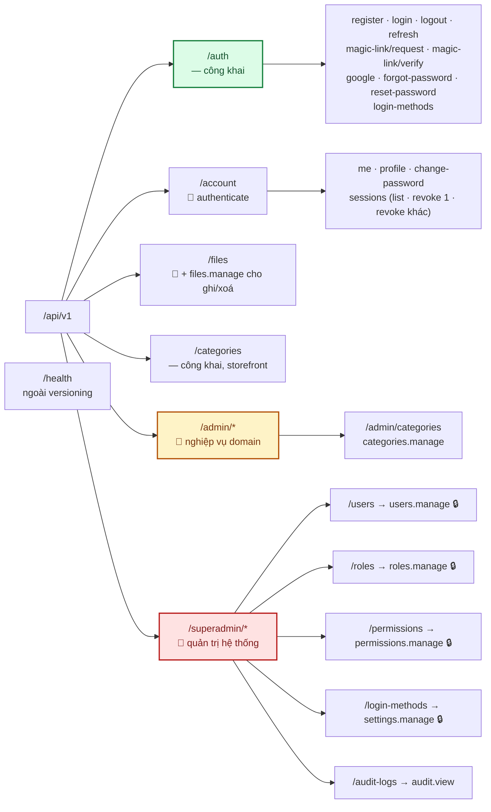

# 06 · API Reference

Base URL: `http://localhost:4000` (dev) · mọi endpoint mount dưới **`/api/v1`**.
Ngoại lệ duy nhất không versioning: `GET /health`.

> Đây là tài liệu **viết tay**, có thể lệch với code khi có thay đổi. Nguồn sự thật là các file
> `*.routes.ts` + `*.validation.ts` trong `backend/src/modules/`.
> Kế hoạch thay bằng **OpenAPI/Swagger** sinh tự động — xem [12 · Đề xuất](12-danh-gia-va-de-xuat.md).

---

## 1. Quy ước chung

### Xác thực

Token nằm ở **cookie `httpOnly`**, trình duyệt tự đính kèm khi gọi với `withCredentials: true`.
Client không phải trình duyệt có thể dùng `Authorization: Bearer <access_token>`.

| Cookie | Nội dung | Thời hạn | `path` |
|---|---|---|---|
| `access_token` | JWT, payload chỉ chứa `sub` (user id) | `JWT_ACCESS_EXPIRES_IN` (mặc định 5 phút) | `/` |
| `refresh_token` | Chuỗi ngẫu nhiên 32 byte; DB chỉ lưu `sha256` | 30 ngày | `/api/v1` |

> `refresh_token` để `path=/api/v1` (không hẹp hơn) vì `/api/v1/account/sessions` cần đọc cookie này
> để biết phiên nào là "phiên hiện tại".

### Response

```jsonc
// Thành công
{ "success": true, "message": "Success", "data": {} }

// Danh sách có phân trang
{ "success": true, "message": "Success", "data": [],
  "meta": { "page": 1, "limit": 20, "total": 100, "totalPages": 5 } }

// Lỗi validate (422)
{ "success": false, "message": "Validation failed", "errors": { "email": "Email không hợp lệ" } }

// Lỗi nghiệp vụ
{ "success": false, "message": "Bạn không có quyền thực hiện thao tác này", "code": "FORBIDDEN" }
```

Bảng mã lỗi đầy đủ: [03 · Backend §3](03-backend.md#bảng-mã-lỗi-code).

### Header

| Header | Chiều | Ý nghĩa |
|---|---|---|
| `X-Request-Id` | vào (tuỳ chọn) / ra (luôn có) | ID trace request; gửi kèm khi báo lỗi để tra log server |

### Cột "Quyền" trong các bảng dưới

| Ký hiệu | Nghĩa |
|---|---|
| — | Công khai, không cần đăng nhập |
| 🔑 | Cần đăng nhập (bất kỳ role nào) |
| `permission.code` | Cần đăng nhập **và** có permission đó |

---

## 2. Bản đồ endpoint



---

## 3. Health

| Method | Path | Quyền | Mô tả |
|---|---|---|---|
| `GET` | `/health` | — | Health check cho load balancer / uptime monitor |

```json
{ "success": true, "data": { "status": "ok" } }
```

---

## 4. Auth — `/api/v1/auth`

| Method | Path | Quyền | Rate limit | Mô tả |
|---|---|---|---|---|
| `GET` | `/login-methods` | — | — | Phương thức đăng nhập đang bật (FE ẩn/hiện nút tương ứng) |
| `POST` | `/register` | — | 20 / 15 phút | Đăng ký bằng email + mật khẩu — **không** tự đăng nhập |
| `POST` | `/login` | — | 20 / 15 phút | Đăng nhập email + mật khẩu |
| `POST` | `/magic-link/request` | — | **5 / 15 phút** | Gửi liên kết đăng nhập qua email |
| `POST` | `/magic-link/verify` | — | — | Đăng nhập bằng token magic link (dùng 1 lần) |
| `POST` | `/google` | — | 20 / 15 phút | Đăng nhập bằng Google ID token |
| `POST` | `/refresh` | cookie `refresh_token` | — | Cấp cặp token mới (*rotation*) |
| `POST` | `/logout` | cookie `refresh_token` | — | Thu hồi phiên + xoá cookie |
| `POST` | `/forgot-password` | — | 20 / 15 phút | Gửi email đặt lại mật khẩu |
| `POST` | `/reset-password` | — | 20 / 15 phút | Đặt lại mật khẩu bằng token |

### `POST /api/v1/auth/register`

```jsonc
// Request
{ "fullName": "Nguyễn Văn A", "email": "a@example.com", "password": "matkhau123" }
// 200 — không set cookie, người dùng tự đăng nhập lại
{ "success": true, "message": "Đăng ký thành công, vui lòng đăng nhập.",
  "data": { "user": { "id": "uuid", "email": "a@example.com", "fullName": "Nguyễn Văn A", "...": "..." } } }
```

Ràng buộc: `fullName` ≥ 1 ký tự · `email` đúng định dạng · `password` ≥ 8 ký tự.
Lỗi: `409 EMAIL_TAKEN` · `403 LOGIN_METHOD_DISABLED`.

### `POST /api/v1/auth/login`

```jsonc
{ "email": "a@example.com", "password": "matkhau123" }
// 200 + Set-Cookie: access_token, refresh_token
{ "success": true, "message": "Success", "data": { "user": { "...": "..." } } }
```

Lỗi: `401 INVALID_CREDENTIALS` · `403 ACCOUNT_BLOCKED` · `403 LOGIN_METHOD_DISABLED`.

> Sai email và sai mật khẩu trả **cùng một** thông điệp — không tiết lộ email nào có tài khoản.

### `POST /api/v1/auth/magic-link/request`

```jsonc
{ "email": "a@example.com" }
// 200 — LUÔN thành công, kể cả email không tồn tại (chống dò tài khoản)
{ "success": true, "message": "Nếu email tồn tại, liên kết đăng nhập đã được gửi.", "data": null }
```

### `POST /api/v1/auth/magic-link/verify`

```jsonc
{ "token": "<token từ link trong email>" }
// 200 + Set-Cookie
{ "success": true, "data": { "user": { "...": "..." } } }
```

Token **dùng 1 lần**, TTL mặc định 15 phút. Email chưa có tài khoản → tự tạo tài khoản
(magic link kiêm luôn vai trò "đăng ký nhanh"). Lỗi: `401 INVALID_MAGIC_LINK`.

### `POST /api/v1/auth/google`

```jsonc
{ "idToken": "<ID token từ Google Identity Services>" }
```

Backend verify ID token bằng `google-auth-library` với `audience = GOOGLE_CLIENT_ID`.
Lỗi: `401 INVALID_GOOGLE_TOKEN` · `403 LOGIN_METHOD_DISABLED`.

### `POST /api/v1/auth/refresh`

Không có body — đọc cookie `refresh_token`. Thu hồi token cũ, phát hành cặp mới (*rotation*).
Lỗi: `401 UNAUTHENTICATED` (thiếu cookie) · `401 SESSION_EXPIRED`.

### `POST /api/v1/auth/forgot-password` · `/reset-password`

```jsonc
// forgot-password — luôn trả 200 dù email không tồn tại
{ "email": "a@example.com" }

// reset-password
{ "token": "<token từ email>", "newPassword": "matkhaumoi123" }
```

Lỗi: `401 INVALID_RESET_TOKEN` (sai / hết hạn / đã dùng).

---

## 5. Account — `/api/v1/account` 🔑

| Method | Path | Quyền | Mô tả |
|---|---|---|---|
| `GET` | `/me` | 🔑 | Hồ sơ + **`roles`/`permissions` hiện tại từ DB** |
| `PATCH` | `/profile` | 🔑 | Sửa `fullName`, `phone`, `avatarFileId` |
| `POST` | `/change-password` | 🔑 | Đổi mật khẩu |
| `GET` | `/sessions` | 🔑 | Danh sách thiết bị đang đăng nhập |
| `DELETE` | `/sessions/:id` | 🔑 | Đăng xuất **một** thiết bị |
| `DELETE` | `/sessions` | 🔑 | Đăng xuất **tất cả thiết bị khác** (giữ phiên hiện tại) |

### `GET /api/v1/account/me`

```jsonc
{ "success": true, "data": {
    "id": "uuid", "fullName": "Nguyễn Văn A", "email": "a@example.com",
    "phone": null, "avatarFileId": null, "avatarFile": null,
    "status": "active", "emailVerifiedAt": null,
    "roles": ["super_admin"],
    "permissions": ["users.manage", "roles.manage", "categories.manage", "..."]
} }
```

`roles`/`permissions` luôn tra **mới từ DB** — frontend dùng để cập nhật menu ngay sau F5,
không cần đăng xuất/đăng nhập lại. Trường `passwordHash` **không bao giờ** xuất hiện trong response.

### `PATCH /api/v1/account/profile`

```jsonc
{ "fullName": "Tên mới", "phone": "0900000000", "avatarFileId": "uuid-file" }
```

Mọi trường đều tuỳ chọn. Đặt `avatarFileId` sẽ ghi `file_usages` (`entity_type = user_avatar`),
ảnh cũ tự hết được tính là đang dùng và sẽ bị cron dọn sau.

### `POST /api/v1/account/change-password`

```jsonc
{ "currentPassword": "cu123456", "newPassword": "moi12345678" }
```

Tài khoản chưa từng có mật khẩu (chỉ đăng nhập Google/magic link) được phép đặt mật khẩu mới mà
không cần `currentPassword` khớp. Lỗi: `401 INVALID_CURRENT_PASSWORD`.

### `GET /api/v1/account/sessions`

```jsonc
{ "success": true, "data": [
  { "id": "uuid", "deviceName": "Chrome trên macOS", "ipAddress": "1.2.3.4",
    "lastActiveAt": "2026-09-09T02:00:00.000Z", "createdAt": "...", "isCurrent": true }
] }
```

---

## 6. Files — `/api/v1/files` 🔑

| Method | Path | Quyền | Mô tả |
|---|---|---|---|
| `POST` | `/presign` | 🔑 | Lấy presigned URL để `PUT` thẳng lên R2 |
| `POST` | `/` | 🔑 | Lưu metadata sau khi upload xong |
| `GET` | `/` | `files.manage` | Danh sách file (phân trang) |
| `DELETE` | `/:id` | `files.manage` | Xoá mềm (R2 object bị purge ở lượt cron sau) |

### `POST /api/v1/files/presign`

```jsonc
// Request
{ "originalName": "hoa-hong.jpg", "mimeType": "image/jpeg", "sizeBytes": 204800, "folderId": null }
// Response
{ "success": true, "data": {
    "uploadUrl": "https://<account>.r2.cloudflarestorage.com/...?X-Amz-Signature=...",
    "r2Key": "uploads/2026-09-09/<uuid>.jpg",
    "publicUrl": "https://cdn.example.com/uploads/2026-09-09/<uuid>.jpg",
    "folderId": null
} }
```

Ràng buộc: `mimeType` ∈ `image/jpeg` · `image/png` · `image/webp` · `image/gif` · `application/pdf`;
`sizeBytes` ≤ **10 MB**. URL hết hạn sau **5 phút**. Tên file trên R2 là UUID ngẫu nhiên
(không dùng tên gốc — tránh *path traversal* và trùng tên).

### `POST /api/v1/files`

```jsonc
{ "r2Key": "uploads/2026-09-09/<uuid>.jpg", "originalName": "hoa-hong.jpg",
  "mimeType": "image/jpeg", "sizeBytes": 204800, "folderId": null }
// 201
```

### `GET /api/v1/files?folderId=&view=grid|list&page=1&limit=24`

Trả về dạng phân trang (`data` + `meta`). `limit` tối đa 100, mặc định 24.

---

## 7. Categories 🌸

| Method | Path | Quyền | Mô tả |
|---|---|---|---|
| `GET` | `/api/v1/categories` | — | Danh mục đang bật, cho storefront |
| `GET` | `/api/v1/admin/categories?includeInactive=` | `categories.manage` | Danh sách đầy đủ |
| `POST` | `/api/v1/admin/categories` | `categories.manage` | Tạo danh mục |
| `PATCH` | `/api/v1/admin/categories/:id` | `categories.manage` | Sửa danh mục |
| `DELETE` | `/api/v1/admin/categories/:id` | `categories.manage` | Xoá danh mục |

### `GET /api/v1/categories` (công khai)

Chỉ trả trường cần hiển thị — **không** lộ `sortOrder`/timestamps nội bộ:

```jsonc
{ "success": true, "data": [
  { "id": "uuid", "name": "Hoa sinh nhật", "slug": "hoa-sinh-nhat",
    "description": null, "parentId": null, "imageFile": null }
] }
```

### `POST /api/v1/admin/categories`

```jsonc
{ "name": "Hoa cưới", "slug": "hoa-cuoi", "description": "...",
  "imageFileId": "uuid", "parentId": null, "sortOrder": 0, "isActive": true }
```

- Bỏ trống `slug` → tự sinh từ `name` (bỏ dấu tiếng Việt: "Hoa cưới" → `hoa-cuoi`).
- Slug trùng → tự thêm hậu tố `-2`, `-3`...
- **Đổi `name` không tự đổi `slug`** — tránh gãy link đã chia sẻ; chỉ đổi khi sửa `slug` thủ công.

Lỗi: `400 CATEGORY_CYCLE` (chọn danh mục con làm cha) · `404 PARENT_NOT_FOUND` ·
`409 CATEGORY_HAS_CHILDREN` (xoá khi còn con).

---

## 8. SuperAdmin — Users · `/api/v1/superadmin/users` 🔒 `users.manage`

| Method | Path | Mô tả |
|---|---|---|
| `GET` | `/?status=&role=&search=&page=&limit=` | Danh sách user (phân trang) |
| `PATCH` | `/:id/block` | Khoá tài khoản |
| `PATCH` | `/:id/unblock` | Mở khoá |
| `DELETE` | `/:id` | Xoá mềm |
| `POST` | `/:id/reset-password` | Sinh mật khẩu mới + gửi email |
| `PATCH` | `/:id/role` | Đổi role |

### Ràng buộc chống leo thang quyền (enforce ở **service**, không chỉ ở UI)


> `reset-password` **không** chặn chính mình — SuperAdmin tự reset mật khẩu của mình là hợp lệ.

### `GET /api/v1/superadmin/users`

```jsonc
{ "success": true, "data": [
  { "id": "uuid", "fullName": "...", "email": "...", "status": "active",
    "createdAt": "...", "roles": [{ "role": { "code": "member", "name": "Member" } }] }
], "meta": { "page": 1, "limit": 20, "total": 42, "totalPages": 3 } }
```

Filter: `status` ∈ `active|blocked` · `role` = role code · `search` tìm trong `fullName`/`email`
(không phân biệt hoa thường). Mặc định `limit=20`, tối đa 100. Không trả user đã xoá mềm.

### `DELETE /api/v1/superadmin/users/:id`

Xoá mềm: đặt `deletedAt`, `status = blocked`, **thu hồi toàn bộ session**, và đổi email thành
`<email>.deleted.<id>` để giải phóng địa chỉ email cho lần đăng ký sau (vì `email` có ràng buộc
`UNIQUE` toàn cục).

### `POST /api/v1/superadmin/users/:id/reset-password`

Sinh mật khẩu ngẫu nhiên, **gửi email trước rồi mới ghi DB** — email lỗi thì mật khẩu cũ còn nguyên,
tránh tình trạng tài khoản bị đặt mật khẩu mà không ai biết. Mật khẩu bản rõ **không** log,
**không** trả về response.

---

## 9. SuperAdmin — Roles · `/api/v1/superadmin/roles` 🔒 `roles.manage`

| Method | Path | Mô tả |
|---|---|---|
| `GET` | `/` | Danh sách role + permission + số user đang gán |
| `POST` | `/` | Tạo Custom Role (`isSystem = false`) |
| `PATCH` | `/:id` | Sửa tên/mô tả/permission |
| `DELETE` | `/:id` | Xoá Custom Role |

```jsonc
// POST /
{ "code": "accountant", "name": "Kế toán", "description": "...", "permissionIds": [5, 8, 12] }
```

`code` phải khớp `^[a-z][a-z0-9_]*$`.

> 🔐 **Chốt chặn "shadow super_admin"**: mọi permission có `isRestricted = true`
> (`users.manage`, `settings.manage`, `roles.manage`, `permissions.manage`) **luôn bị lọc bỏ** khỏi
> `permissionIds` ở tầng service — kể cả khi client cố tình gửi kèm. Không chỉ ẩn ở UI.

Lỗi: `403 SYSTEM_ROLE_LOCKED` (sửa/xoá System Role) · `409 ROLE_IN_USE` (còn user đang gán).

---

## 10. SuperAdmin — Permissions · `/api/v1/superadmin/permissions` 🔒 `permissions.manage`

| Method | Path | Mô tả |
|---|---|---|
| `GET` | `/?assignable=true` | Danh sách permission; `assignable=true` loại bỏ permission `isRestricted` |
| `POST` | `/` | Tạo permission mới (`isSystem = false`) |
| `PATCH` | `/:id` | Sửa `code`/`groupName`/`description` |
| `DELETE` | `/:id` | Xoá permission |

```jsonc
{ "code": "products.export", "groupName": "products", "description": "Xuất danh sách sản phẩm" }
```

`code` phải khớp `^[a-z][a-z0-9_]*\.[a-z][a-z0-9_]*$` (dạng `group.action`).

> ⚠️ **Permission tạo qua UI chưa chặn được gì.** Nó chỉ có tác dụng khi developer thêm
> `authorize('code-đó')` vào một route trong code. Đây là bản chất của mô hình permission thực thi
> trong code, không phải giới hạn sửa được bằng UI — UI cần hiển thị rõ cảnh báo này.

Lỗi: `409 PERMISSION_CODE_TAKEN` · `403 SYSTEM_PERMISSION_LOCKED` (đổi `code`/xoá permission
`isSystem`) · `409 PERMISSION_IN_USE` (còn role đang gán).

---

## 11. SuperAdmin — Login Methods · `/api/v1/superadmin/login-methods` 🔒 `settings.manage`

| Method | Path | Mô tả |
|---|---|---|
| `GET` | `/` | Trạng thái 3 phương thức đăng nhập |
| `PATCH` | `/:method` | Bật/tắt một phương thức |

`:method` ∈ `google_oauth` · `email_password` · `magic_link`. Body: `{ "isEnabled": false }`.

> 🔐 **Luôn phải còn ≥ 1 phương thức bật** sau khi áp thay đổi — chặn ở service, không chỉ ở UI.
> Vi phạm → `400 AT_LEAST_ONE_LOGIN_METHOD_REQUIRED`. Nếu không có chốt này, tắt hết phương thức
> sẽ khoá cứng toàn bộ hệ thống, kể cả super_admin.

---

## 12. SuperAdmin — Audit Logs · `/api/v1/superadmin/audit-logs` 🔒 `audit.view`

| Method | Path | Mô tả |
|---|---|---|
| `GET` | `/?actorId=&entityType=&from=&to=&page=&limit=` | Nhật ký thao tác nhạy cảm |

`from`/`to` theo định dạng ISO 8601 (`2026-09-01T00:00:00.000Z`).

```jsonc
{ "success": true, "data": [
  { "id": "uuid", "action": "user.block", "entityType": "user", "entityId": "uuid",
    "before": { "status": "active" }, "after": { "status": "blocked" },
    "ipAddress": "1.2.3.4", "createdAt": "...",
    "actor": { "id": "uuid", "fullName": "Super Admin", "email": "..." } }
], "meta": { "...": "..." } }
```

Danh sách `action` đang ghi: [modules/core-audit-log.md](modules/core-audit-log.md).

---

## 13. Endpoint dự kiến (🌸 Domain — chưa triển khai)

```
GET    /api/v1/products?category=&occasion=&search=&minPrice=&maxPrice=&page=&limit=
GET    /api/v1/products/:slug
POST   /api/v1/cart/items
POST   /api/v1/orders                  # tạo đơn từ giỏ + delivery info (ngày giờ giao)
GET    /api/v1/orders/:id              # row-level check: chỉ chủ đơn hoặc orders.view_all
PATCH  /api/v1/admin/orders/:id/status # orders.update_status + validate state machine
POST   /api/v1/payments/webhook/:provider  # verify chữ ký HMAC + idempotency
```

Khi triển khai, tuân theo checklist ở [03 · Backend §10](03-backend.md#10-checklist-tạo-module-backend-mới)
và cập nhật lại tài liệu này.
