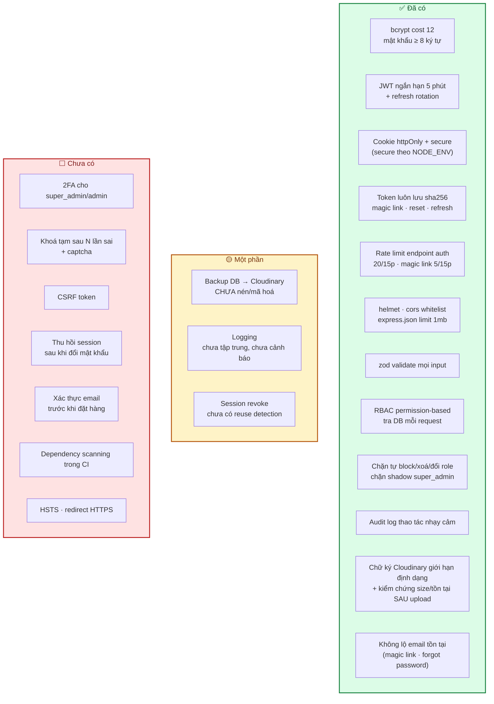

# 07 · Bảo mật

Rủi ro bảo mật và biện pháp phòng ngừa theo từng tầng (xác thực, phân quyền, API, thanh toán,
lưu trữ, hạ tầng, logic nghiệp vụ).

Đọc kèm: [05 · Database & RBAC](05-database-va-rbac.md) · [03 · Backend](03-backend.md) ·
[modules/core-auth.md](modules/core-auth.md).

> **Ký hiệu**: ✅ đã triển khai và kiểm chứng · 🟡 triển khai một phần · ⬜ chưa làm (còn là kế hoạch).

## 0. Tình trạng hiện tại — tóm tắt

Việc cần làm kèm mức độ ưu tiên: [12 · Đánh giá & đề xuất](12-danh-gia-va-de-xuat.md) và
[`CHECKLIST.md`](../CHECKLIST.md).

---

---

## 1. Xác thực (Authentication)

Hệ thống hỗ trợ 3 phương thức đăng nhập (email/password, Google OAuth, magic link) — schema chi tiết ở [Database & RBAC §3.2](05-database-va-rbac.md).

| Rủi ro | Biện pháp |
|---|---|
| Mật khẩu yếu / lộ mật khẩu | ✅ Hash bằng **bcrypt** (cost ≥ 12) hoặc **argon2**; bắt buộc độ dài tối thiểu 8 ký tự khi đăng ký |
| Brute-force đăng nhập | 🟡 Rate limit theo IP + email (`express-rate-limit`), khoá tạm tài khoản sau 5 lần sai (kèm cooldown tăng dần), captcha (reCAPTCHA/hCaptcha) sau vài lần thất bại |
| Đánh cắp session/token | ✅ Access token JWT **thời gian sống ngắn** (5 phút), refresh token lưu ở **httpOnly, Secure, SameSite=Strict cookie** (không lưu localStorage — tránh XSS đánh cắp token) |
| Refresh token bị lộ | 🟡 Refresh token **rotation**: mỗi lần dùng để cấp access token mới thì phát hành refresh token mới, thu hồi token cũ (set `sessions.revoked_at`); chỉ lưu `refresh_token_hash`, không lưu token thô |
| **Magic link bị lộ/đoán được** | ✅ Token magic link sinh ngẫu nhiên đủ dài (≥ 32 byte), chỉ lưu `token_hash` (sha256) trong DB, **hết hạn ngắn** (~15 phút), **dùng 1 lần** (set `used_at` ngay khi verify — verify lần 2 phải fail), gửi qua Resend với rate limit theo email (chống spam yêu cầu magic link liên tục) |
| Chiếm quyền tài khoản admin/nhân viên | ⬜ Bắt buộc **2FA (TOTP)** cho các vai trò `super_admin`, `admin` trở lên |
| OAuth Google bị giả mạo callback | ✅ Không dùng luồng redirect — backend verify **ID token** bằng `google-auth-library` với `audience = GOOGLE_CLIENT_ID`, nên không có callback để giả mạo. *(Nếu sau này chuyển sang luồng redirect thì mới cần `state` param + whitelist `redirect_uri`.)* Còn thiếu: chưa kiểm tra `payload.email_verified` trước khi liên kết tài khoản theo email — xem [12 · Đề xuất](12-danh-gia-va-de-xuat.md). <!-- ghi chú gốc: dùng state param + redirect_uri whitelist --> |
| Email/số điện thoại giả khi đăng ký | ⬜ Xác thực email (verification link) trước khi cho đặt hàng thanh toán online; OTP SMS khi cần |
| **Bị vô hiệu hoá hết phương thức đăng nhập** | ✅ Service `login-methods.update` luôn kiểm tra: sau khi áp thay đổi, phải còn **≥ 1** phương thức `is_enabled = true`, nếu không → trả lỗi 400 + cảnh báo rõ ràng trên UI SuperAdmin, không cho lưu |
| Chiếm phiên qua thiết bị bị đánh cắp | 🟡 Người dùng tự xem danh sách thiết bị (`GET /api/v1/account/sessions`) và **đăng xuất từ xa** từng thiết bị hoặc toàn bộ (revoke `sessions`); nên gửi email cảnh báo khi có đăng nhập từ thiết bị/IP lạ |

---

## 2. Phân quyền & Kiểm soát truy cập (Authorization)

Đã thiết kế RBAC chi tiết ở [Database & RBAC §2](05-database-va-rbac.md#2-hệ-thống-vai-trò--phân-quyền-rbac). Về mặt bảo mật cần lưu ý thêm:

- **Không bao giờ tin tưởng kiểm tra quyền ở frontend** — mọi permission check phải lặp lại ở backend (frontend chỉ ẩn UI cho trải nghiệm).
- **Chống IDOR (Insecure Direct Object Reference)**: khi truy vấn `GET /api/v1/orders/:id`, phải kiểm tra `orders.user_id === req.user.id` (trừ khi user có `orders.view_all`) — không chỉ dựa vào việc "biết ID" là được xem.
- **Row-level check cho nhân viên vận hành**: `shipper` chỉ được cập nhật đơn có `order_deliveries.shipper_id = req.user.id`; `florist` chỉ được sửa đơn đang ở trạng thái "đang chuẩn bị".
- **Nguyên tắc đặc quyền tối thiểu (least privilege)**: tài khoản `sales_staff` mặc định không có `products.delete`, `settings.manage`.
- **Quản lý user chỉ thuộc về `super_admin`** (permission `users.manage` chỉ gán cho role này) — service xử lý các API `PATCH /api/v1/superadmin/users/:id/role`, `/block`, `/unblock`, `DELETE /api/v1/superadmin/users/:id`, `/reset-password` phải chặn cứng ở tầng service (không chỉ dựa vào middleware `authorize`), với các ràng buộc bắt buộc:
  1. `targetUserId !== req.user.id` — không tự đổi role, **không tự block, không tự xoá** chính mình (áp dụng đồng nhất cho cả 3 hành động, không chỉ riêng đổi role).
  2. `newRole !== 'super_admin'` — không được gán hoặc nâng bất kỳ ai (kể cả chính mình) lên `super_admin` qua API; tài khoản `super_admin` chỉ tạo được qua seed hoặc thao tác thủ công trực tiếp trên DB.
- **Leo thang quyền qua Custom Role (shadow super_admin)**: hệ thống cho phép `super_admin` tạo role tuỳ ý — đây là điểm dễ bị lợi dụng nếu không chặn đúng chỗ. API `POST/PATCH /api/v1/superadmin/roles` phải **luôn lọc bỏ** mọi permission có `is_restricted = true` (`users.manage`, `settings.manage`, `roles.manage`, `permissions.manage`) khỏi payload trước khi ghi `role_permissions`, kể cả khi request cố tình gửi kèm — không chỉ ẩn ở UI. Việc kiểm tra này nằm ở tầng service, không tin payload từ client.
- **Rủi ro khi cho phép tạo Permission tuỳ ý**: 2 hướng cần chặn riêng —
  1. *Phá route đang chạy*: permission `is_system = true` (đã có `authorize('code')` tham chiếu trong code) không cho đổi `code` hoặc xoá qua API `PATCH/DELETE /api/v1/superadmin/permissions/:id` — nếu không, route liên quan sẽ mất kiểm soát quyền (tuỳ cách code xử lý permission không tồn tại: có thể *fail-open* cho qua hết, hoặc *fail-closed* chặn hết người dùng hợp lệ).
  2. *Permission mới không có tác dụng thật*: vì `authorize()` chỉ kiểm tra permission mà route đã khai báo, permission `super_admin` tự tạo qua UI **không tự động chặn được gì** cho tới khi developer thêm `authorize('permission-mới')` vào route tương ứng trong code — cần hiển thị rõ cảnh báo này trên UI để `super_admin` không hiểu nhầm là "tạo xong là có hiệu lực ngay".
- **Reset password bởi SuperAdmin**: sinh mật khẩu ngẫu nhiên đủ mạnh, hash trước khi lưu, gửi bản rõ **duy nhất một lần** qua email (Resend) — không log, không trả về trong response API, không hiển thị lại cho `super_admin`.
- **Audit log cho mọi thao tác nhạy cảm** — ghi vào bảng `audit_logs` (xem [Database & RBAC §3.1](05-database-va-rbac.md)): ai (`actor_id`), hành động (`action`), đối tượng (`entity_type`/`entity_id`), giá trị trước/sau (`before`/`after` JSONB), IP, thời điểm. Áp dụng cho: đổi giá sản phẩm, xoá sản phẩm, đổi role user, gán role, block/unblock/xoá user, reset password, tạo/sửa/xoá Custom Role, tạo/sửa/xoá Permission, gán Permission cho Role, bật/tắt phương thức đăng nhập, hoàn tiền đơn hàng. Ghi log là thao tác **best-effort, không chặn transaction chính** nếu ghi log lỗi (log lỗi ghi audit riêng, không rollback nghiệp vụ).

---

## 3. Bảo mật tầng API (Express)

| Hạng mục | Công cụ / cách làm |
|---|---|
| HTTP headers an toàn | ✅ `helmet` middleware (CSP, X-Frame-Options, X-Content-Type-Options...) |
| CORS | ✅ Whitelist chính xác domain frontend (`origin: process.env.FRONTEND_URL`), không dùng `*` khi có credentials |
| Validate input | ✅ `zod` validate toàn bộ body/query/params trước khi vào controller (`shared/middleware/validate.ts`) — chặn payload rác, giới hạn độ dài chuỗi |
| Chống SQL Injection | ✅ Dùng ORM (Prisma) với parameterized query; **không** nối chuỗi SQL thủ công |
| Chống NoSQL/JSON injection | ✅ Validate kiểu dữ liệu nghiêm ngặt nếu dùng JSONB trong Postgres |
| Chống XSS | 🟡 React/Next.js tự escape output; nếu render nội dung blog dạng HTML (`dangerouslySetInnerHTML`) phải sanitize bằng `DOMPurify` (hoặc `isomorphic-dompurify` khi chạy ở Server Component) trước khi lưu/hiển thị |
| CSRF | ⬜ Hiện dựa vào `SameSite=lax` + CORS whitelist (đủ chặn form cross-site cơ bản, **không** đủ khi có subdomain không tin cậy). Nếu dùng cookie cho auth: bật CSRF token cho các request thay đổi state (`csurf` hoặc double-submit cookie pattern) |
| Rate limiting API công khai | ⬜ Giới hạn `/api/v1/products`, `/api/v1/cart` theo IP để chống scraping/spam bot |
| Giới hạn kích thước request | ✅ `express.json({ limit: '1mb' })` tránh payload khổng lồ gây DoS |
| HTTPS bắt buộc | ⬜ Redirect HTTP→HTTPS, bật HSTS ở production |
| Upload ảnh sản phẩm/avatar | ✅ Giới hạn loại file (jpg/png/webp), đổi tên file ngẫu nhiên (không dùng tên gốc làm `publicId`), upload thẳng lên **Cloudinary** qua chữ ký HMAC-SHA1 (không đi qua server ứng dụng) — chữ ký chỉ ràng buộc được **định dạng** (`allowed_formats`), **không** ràng buộc được kích thước tối đa trong điều kiện ký (khác S3 trước đây); dung lượng được **xác minh SAU khi upload xong** bằng Cloudinary Admin API, trước khi ghi bản ghi DB — vượt hạn mức thì xoá luôn trên Cloudinary, không tạo rác lâu dài. Quét virus nếu cho khách upload ảnh review |

---

## 4. Bảo mật thanh toán

- **Không bao giờ lưu số thẻ/CVV trên server của mình** — dùng cổng thanh toán (VNPay/Momo/Stripe) theo mô hình hosted checkout hoặc tokenization, giữ hệ thống ngoài phạm vi PCI DSS.
- **Xác thực webhook**: mọi callback từ cổng thanh toán phải verify chữ ký (HMAC secret key) trước khi cập nhật `payment_status` — chặn giả mạo webhook để "đánh dấu đã thanh toán" khống.
- **Idempotency**: webhook có thể bị gọi lại nhiều lần — dùng `transaction_id` unique để tránh cộng tiền/xử lý đơn hai lần.
- **Đối soát**: log toàn bộ giao dịch thanh toán (amount, status, timestamp) để đối chiếu cuối ngày với cổng thanh toán.
- Với COD: giới hạn giá trị đơn tối đa hoặc yêu cầu xác thực OTP với đơn giá trị lớn để giảm rủi ro đơn ảo/bom hàng.

---

## 5. Bảo mật lưu trữ file & backup (Cloudinary)

- **Không phục vụ nội dung nhạy cảm qua URL công khai đoán được**: ảnh sản phẩm/avatar dùng
  `secure_url` Cloudinary trả về (công khai, dùng CDN cache bình thường); nội dung thật sự nhạy cảm
  (vd hoá đơn) nên cân nhắc signed URL có thời hạn của Cloudinary thay vì URL công khai mặc định.
- **Chữ ký upload có kiểm soát**: chữ ký (HMAC-SHA1, `api_sign_request`) chỉ cấp sau khi backend xác
  thực user, giới hạn **định dạng** (`allowed_formats`) trong điều kiện ký — **không** giới hạn được
  kích thước tối đa trong điều kiện ký (khác S3 presigned URL trước đây, xem
  [modules/core-files.md §1](modules/core-files.md#1-luồng-upload--file-không-đi-qua-server)); dung
  lượng được xác minh **sau khi upload xong** bằng Cloudinary Admin API, trước khi ghi bản ghi DB —
  vượt hạn mức thì xoá luôn trên Cloudinary, không tạo rác lâu dài.
- **Dọn file mồ côi (10 ngày/lần)**: cron job xoá file trong `files` không còn `file_usages` tham chiếu và đã quá ngưỡng an toàn (≥ 24h kể từ lúc upload) — vừa tiết kiệm dung lượng, vừa giảm bề mặt tấn công (file rác không ai quản lý). Trước khi xoá cứng trên Cloudinary, xoá record DB trong cùng transaction để tránh mất đồng bộ.
- **Backup PostgreSQL lên Cloudinary**: `pg_dump` định kỳ **2 ngày/lần**, đẩy lên với `public_id`
  prefix `backups/`, `resource_type: "raw"` (khác `"image"` của module Files — xem
  [modules/core-files.md](modules/core-files.md)); **CHƯA nén/mã hoá** trước khi upload (xem cảnh báo
  ở [§0](#0-tình-trạng-hiện-tại--tóm-tắt)), giới hạn quyền truy cập tài khoản Cloudinary ở mức tối
  thiểu (chỉ service account backup được ghi/đọc).
- **Retention tự động**: cron job riêng (`cleanupOldBackups`, không phải lifecycle rule của nhà cung
  cấp) quét theo `created_at` để **tự xoá backup cũ hơn 30 ngày** — tránh backup tồn đọng vô thời hạn
  vừa tốn chi phí vừa tăng rủi ro rò rỉ nếu tài khoản bị lộ.
- **Test khôi phục định kỳ**: backup vô dụng nếu chưa từng thử restore — lên lịch kiểm tra khôi phục thử (staging) theo quý.

---

## 6. Bảo mật dữ liệu & tuân thủ

- **Dữ liệu cá nhân khách hàng** (họ tên, SĐT, địa chỉ) cần tuân thủ **Nghị định 13/2023/NĐ-CP về bảo vệ dữ liệu cá nhân** (Việt Nam):
  - Có trang "Chính sách bảo mật" nêu rõ mục đích thu thập, thời gian lưu trữ.
  - Cho phép khách yêu cầu xoá tài khoản/dữ liệu cá nhân.
  - Xin sự đồng ý (checkbox) khi đăng ký nhận email marketing.
- **Mã hoá dữ liệu nhạy cảm**: số điện thoại, địa chỉ có thể mã hoá ở tầng ứng dụng (application-level encryption) nếu yêu cầu bảo mật cao, hoặc tối thiểu mã hoá ổ đĩa (encryption at rest) ở tầng database (Neon/VPS Postgres đều hỗ trợ encryption at rest).
- **Không log dữ liệu nhạy cảm**: mật khẩu, token (JWT/magic link/reset), số thẻ/OTP không bao giờ được ghi vào log server.
- **Xoá mềm (soft delete)** cho `users`/`products` để vẫn giữ được lịch sử đơn hàng hợp lệ khi dữ liệu gốc bị xoá, nhưng ẩn khỏi truy vấn thông thường.

---

## 7. Bảo mật logic nghiệp vụ (Business Logic Abuse)

| Rủi ro | Biện pháp |
|---|---|
| Lạm dụng mã giảm giá (dùng nhiều lần, chia sẻ mã cá nhân) | Giới hạn `usage_limit` tổng và `usage_limit_per_user`; kiểm tra qua bảng `coupon_usages` trước khi áp dụng |
| Race condition khi nhiều người mua cùng lúc sản phẩm sắp hết hàng | Dùng transaction + `SELECT ... FOR UPDATE` (row lock) khi trừ `stock`, hoặc kiểm tra tồn kho ngay trong câu `UPDATE ... WHERE stock >= quantity` |
| Đơn hàng ảo / spam checkout | Captcha ở bước đặt hàng cho guest, rate limit theo IP/session, xác thực số điện thoại với đơn giá trị cao |
| Sửa giá ở client trước khi gửi đơn | Server **luôn tính lại giá** từ dữ liệu `products`/`product_variants` trong DB tại thời điểm đặt hàng, không tin giá gửi từ frontend |
| Tự ý đổi trạng thái đơn hàng qua API | Validate state machine hợp lệ (vd không cho chuyển thẳng từ "đã đặt" sang "đã giao"), chỉ role có permission tương ứng mới đổi được |

---

## 8. Hạ tầng & DevOps

- **Biến môi trường**: toàn bộ secret (DB URL Neon/VPS, JWT secret, API key cổng thanh toán, `CLOUDINARY_API_SECRET`, `RESEND_API_KEY` hoặc mật khẩu SMTP tuỳ `EMAIL_PROVIDER`) nằm trong `.env`, **không commit vào Git** (`.gitignore` chuẩn ngay từ đầu). Ở production dùng secret manager (AWS Secrets Manager/Doppler/Vault).
- **Database user riêng cho ứng dụng** với quyền hạn tối thiểu (không dùng user chủ/superuser), chỉ mở cổng DB nội bộ (không public ra internet) khi tự quản lý trên VPS.
- **Dependency scanning**: chạy `npm audit` / Dependabot / Snyk định kỳ để phát hiện thư viện có lỗ hổng đã biết.
- **Docker**: build image tối giản (alpine), chạy container với user non-root, không để `node_modules` chứa devDependencies ở production image.
- **CI/CD**: chặn merge nếu có secret bị commit nhầm (dùng `gitleaks`/`trufflehog` trong pipeline).
- **Giám sát & cảnh báo**: log tập trung (vd. cấu hình đơn giản với Winston + một dịch vụ log), cảnh báo khi có nhiều lỗi 401/403 bất thường, nhiều đăng nhập thất bại liên tiếp, hoặc lượng đơn hàng tăng đột biến bất thường (dấu hiệu bot).

---

## 9. Checklist theo từng giai đoạn

> `[x]` = đã có trong code hiện tại (và có test bao phủ — xem [08 · Kiểm thử](08-kiem-thu.md)).
> `[ ]` = còn phải làm. Bảng theo dõi tổng hợp: [`CHECKLIST.md`](../CHECKLIST.md).

**Giai đoạn 1 — MVP**
- [x] Hash mật khẩu bcrypt, JWT access/refresh cơ bản, session lưu ở `sessions` (device tracking)
- [x] Magic link: token hash, hết hạn ngắn, dùng 1 lần, rate limit theo email
- [x] Validate input toàn bộ API (zod)
- [x] Helmet + CORS whitelist đúng domain
- [x] RBAC middleware `authenticate` + `authorize`; chặn cứng ràng buộc "không tự đổi role", "không tự nâng super_admin" ở tầng service
- [x] Chữ ký upload Cloudinary có kiểm soát định dạng (`allowed_formats`); dung lượng kiểm chứng sau upload qua Admin API trước khi ghi DB
- [x] `.env` không commit, có `.env.example`

**Giai đoạn 2 — Thanh toán**
- [ ] Verify chữ ký webhook thanh toán
- [ ] Idempotency xử lý webhook
- [ ] Rate limit đăng nhập + captcha checkout
- [ ] HTTPS + HSTS ở production
- [x] API đăng xuất từ xa (`DELETE /api/v1/account/sessions/:id`) hoạt động đúng — không cho revoke session của user khác
- [x] Validate luôn còn ≥ 1 `login_method` được bật khi SuperAdmin cập nhật cấu hình

**Giai đoạn 3 — Tăng trưởng**
- [ ] Giới hạn coupon per-user, chống race condition tồn kho
- [x] Audit log cho thao tác admin/superadmin (đổi role, gán role, block/unblock/xoá user, reset password, bật/tắt auth method, tạo/sửa/xoá Custom Role, tạo/sửa/xoá Permission)
- [x] API tạo/sửa role tuỳ ý luôn lọc bỏ permission `is_restricted` khỏi payload ở tầng service (test bằng cách cố tình gửi kèm `users.manage` trong request tạo role)
- [x] API tạo/sửa/xoá permission chặn đúng permission `is_system = true` (không đổi được `code`, không xoá được)
- [x] Test tự block/tự xoá/tự đổi role chính mình đều bị chặn (không chỉ test riêng đổi role)
- [ ] Cron job xoá file mồ côi (10 ngày/lần) chạy đúng, không xoá nhầm file mới upload
- [ ] Cron backup DB → Cloudinary (2 ngày/lần) + retention tự xoá sau 30 ngày hoạt động đúng
- [ ] Trang chính sách bảo mật + cơ chế xoá dữ liệu cá nhân

**Giai đoạn 4 — Mở rộng**
- [ ] 2FA cho tài khoản `super_admin`/`admin`
- [ ] Dependency scanning tự động trong CI
- [ ] Penetration test / security review trước khi scale lớn
- [ ] Khi chuyển DB sang VPS tự quản lý: harden Postgres (user riêng, không public port), cấu hình firewall

---

## 10. Tham khảo

- OWASP Top 10: https://owasp.org/www-project-top-ten/
- Nghị định 13/2023/NĐ-CP về bảo vệ dữ liệu cá nhân (Việt Nam)
- PCI DSS (nếu sau này cân nhắc tự xử lý thanh toán thẻ thay vì qua cổng trung gian)
