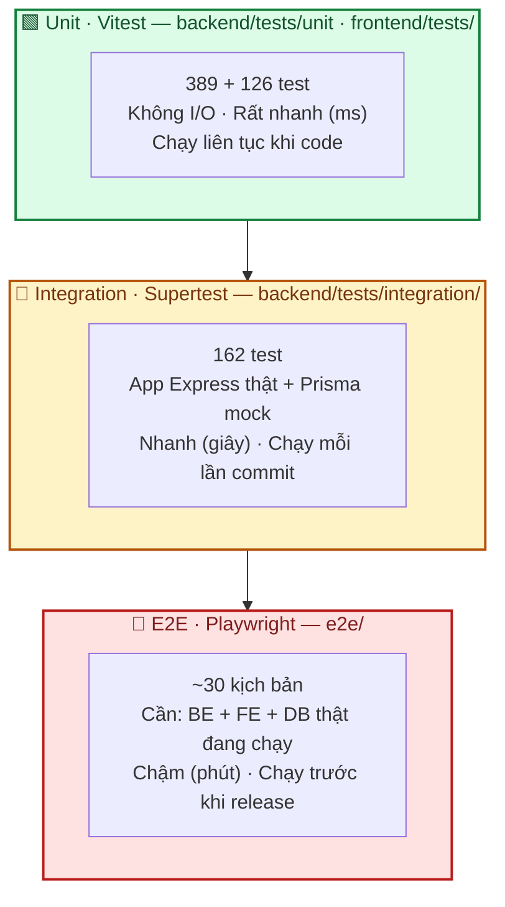
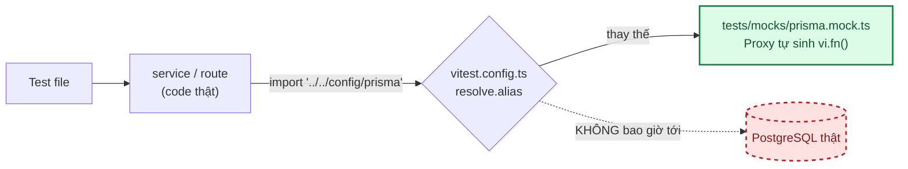
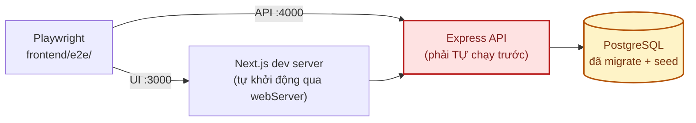

# 08 · Kiểm thử

Chiến lược test, cách chạy, và cách viết test mới cho dự án.

**Nguyên tắc**: không chạy theo coverage 100% máy móc. Ưu tiên phủ **quy tắc nghiệp vụ có hậu quả
nếu sai** — xác thực, phân quyền, chống leo thang quyền, không lộ dữ liệu, ràng buộc dữ liệu.

---

## 1. Kim tự tháp test của dự án



| Tầng | Công cụ | Ở đâu | Cần gì để chạy | Số test |
|---|---|---|---|---|
| **Unit — backend** | Vitest | `backend/tests/unit/` | Không cần gì | 389 |
| **Integration — backend** | Vitest + Supertest | `backend/tests/integration/` | Không cần gì (Prisma được mock) | 162 |
| **Unit/Component — frontend** | Vitest + Testing Library | `frontend/tests/` | Không cần gì | 126 |
| **E2E** | Playwright | `frontend/e2e/` | Backend + frontend + PostgreSQL **thật** | ~30 kịch bản |

> **Toàn bộ test unit + integration chạy được mà KHÔNG cần database.** Đây là lựa chọn có chủ đích:
> mọi người trong nhóm và CI đều chạy được ngay sau `npm install`, không phải dựng Postgres.
> Việc kiểm chứng với DB thật thuộc về tầng E2E.

---

## 2. Chạy test

```bash
# Backend — 555 test, khoảng 5 giây
cd backend
npm test                  # toàn bộ unit + integration
npm run test:unit         # chỉ unit
npm run test:integration  # chỉ integration
npm run test:watch        # chế độ theo dõi khi đang code
npm run test:coverage     # kèm báo cáo độ phủ (coverage/index.html)

# Frontend — 126 test, khoảng 2 giây
cd frontend
npm test
npm run test:watch
npm run test:coverage

# E2E — cần môi trường thật, xem §4
cd frontend
npm run test:e2e
npm run test:e2e:ui       # giao diện debug từng bước
```

Kiểm tra tổng thể trước khi commit:

```bash
cd backend  && npm run lint && npm run typecheck && npm test
cd frontend && npm run lint && npm run typecheck && npm test
```

---

## 3. Backend — cách hạ tầng test hoạt động

### 3.1. Prisma được thay bằng mock ở tầng resolve



`vitest.config.ts` thay **mọi** đường dẫn `config/prisma` (cả tương đối lẫn `@/`) bằng file mock,
nên **không** file test nào phải tự gọi `vi.mock` cho Prisma:

```ts
// vitest.config.ts
alias: [
  { find: /^(?:\.{1,2}\/)+config\/prisma$/, replacement: prismaMock },
  { find: /^@\/config\/prisma$/, replacement: prismaMock },
  { find: /^@\//, replacement: `${srcDir}/` },
]
```

Mock là một `Proxy` tự sinh `vi.fn()` khi được truy cập lần đầu — **không phải cập nhật file mock
mỗi lần schema Prisma thay đổi**:

```ts
import { db, resetPrismaMock } from "../../mocks/prisma.mock";

beforeEach(() => resetPrismaMock());

it("...", async () => {
  db.user.findUnique.mockResolvedValue({ id: "u1", status: "active" });
  // ...
  expect(db.user.update).toHaveBeenCalledWith({ where: { id: "u1" }, data: { status: "blocked" } });
});
```

`db` đã được gắn kiểu sẵn (`PrismaMockClient`) nên không phải `as any` ở mỗi dòng.

### 3.2. Biến môi trường cho test

`tests/setup.ts` gán sẵn các biến bắt buộc để `config/env.ts` không *fail-fast*. Đây là giá trị giả,
không kết nối tới dịch vụ thật nào.

### 3.3. Integration test — giả lập người dùng đã đăng nhập

`authenticate` luôn tra role/permission từ DB, nên helper `loginAs()` vừa tạo cookie JWT hợp lệ vừa
mớm sẵn kết quả truy vấn:

```ts
import { db, loginAs, SUPER_ADMIN_PERMISSIONS } from "./helpers";

const cookie = loginAs("superadmin-1", ["super_admin"], SUPER_ADMIN_PERMISSIONS);
const res = await request(app).get("/api/v1/superadmin/users").set("Cookie", cookie);
```

Vì `app.ts` **không gọi `listen()`** (xem [03 · Backend §8](03-backend.md)), Supertest dùng trực tiếp
`app` mà không phải mở cổng thật.

---

## 4. E2E — Playwright

### 4.1. Chuẩn bị môi trường

E2E chạy trên hệ thống thật, cần **3 thứ** cùng hoạt động:



```bash
# Terminal 1 — database + backend
cd backend
npx prisma migrate deploy
npm run seed:core && npm run seed:domain
npm run dev

# Terminal 2 — E2E (tự khởi động Next.js dev server)
cd frontend
npx playwright install chromium   # chỉ cần lần đầu
npm run test:e2e
```

Biến môi trường điều chỉnh được:

| Biến | Mặc định | Dùng khi |
|---|---|---|
| `E2E_BASE_URL` | `http://localhost:3000` | Test trên staging |
| `E2E_API_URL` | `http://localhost:4000` | Backend ở host khác |
| `E2E_SUPER_ADMIN_EMAIL` / `_PASSWORD` | Giá trị seed mặc định | Môi trường dùng tài khoản khác |
| `E2E_NO_SERVER` | (không đặt) | Frontend đã chạy sẵn, không cần Playwright khởi động |

### 4.2. Nguyên tắc viết E2E của dự án này

| Nguyên tắc | Vì sao |
|---|---|
| **Tự tạo dữ liệu, không dựa vào dữ liệu có sẵn** — `registerNewMember()` sinh email ngẫu nhiên | Test chạy lại nhiều lần trên cùng DB không đụng nhau |
| **Dọn dẹp sau khi tạo** (xoá category, khôi phục login-methods) | Không để rác ảnh hưởng lần chạy sau |
| **Kiểm tra cả UI lẫn API** trong cùng kịch bản (`page.request`) | UI có thể ẩn nút, nhưng bảo mật thật nằm ở API |
| **Chạy tuần tự** (`workers: 1`) | Các kịch bản auth dùng chung tài khoản seed |
| Dùng **selector theo vai trò/nhãn** (`getByRole`, `getByLabel`) | Không vỡ khi đổi class CSS |

### 4.3. Kịch bản E2E đang có

| File | Bao phủ |
|---|---|
| `e2e/auth.spec.ts` | Đăng nhập/đăng xuất, cookie httpOnly + Path, sai mật khẩu, đăng ký không tự đăng nhập, validate client, bảo vệ route, `redirectTo`, member vào `/superadmin` → `/403`, **API vẫn chặn độc lập với UI** |
| `e2e/superadmin.spec.ts` | Danh sách user, **không tự khoá/xoá chính mình**, **không gán super_admin**, khoá/mở khoá, tài khoản bị khoá không đăng nhập được, **permission `is_restricted` bị lọc khi tạo Custom Role**, không sửa/xoá System Role, không đổi code permission hệ thống, **không tắt được phương thức đăng nhập cuối cùng** |
| `e2e/account.spec.ts` | Sửa hồ sơ, đổi mật khẩu (mật khẩu cũ hết hiệu lực), danh sách thiết bị, **đăng xuất thiết bị khác không làm mất phiên hiện tại**, **chống IDOR khi thu hồi phiên** |
| `e2e/categories.spec.ts` | CRUD danh mục qua UI, slug tự sinh bỏ dấu, không xoá khi còn con, không tạo vòng lặp, storefront đọc công khai không lộ trường nội bộ |

---

## 5. Những gì đang được test

### 5.1. Backend

| Nhóm | Nội dung được kiểm chứng |
|---|---|
| **Utils** | `slugify` (bỏ dấu tiếng Việt, chữ `đ`, idempotent) · `hash` (bcrypt cost 12, có salt, sha256) · `jwt` (**payload chỉ có `sub`**, từ chối chữ ký sai/hết hạn) |
| **Middleware** | `asyncHandler` (Promise reject → `next`) · `authorize` (đủ **tất cả** permission; role không thay được permission) · `validate` (coerce, lỗi theo field, `_root`) · `requestId` · `errorHandler` (**không lộ stack trace**) |
| **`authenticate`** | Đọc cookie/Bearer, **tra DB mỗi request**, gộp permission từ nhiều role, phân biệt 401 `UNAUTHENTICATED` với `INVALID_TOKEN` |
| **Auth service** | Đăng ký/đăng nhập, **sai email và sai mật khẩu trả cùng thông điệp**, tài khoản bị khoá/xoá mềm, magic link (**hash, 1 lần, hết hạn**), refresh **rotation**, **lỗi gửi email không được văng ra ngoài** (chống dò email), quên/đặt lại mật khẩu |
| **Users admin** | **Chặn tự khoá/xoá/đổi role chính mình**, **chặn gán super_admin**, xoá mềm giải phóng email + thu hồi session, **reset password gửi email trước rồi mới ghi DB**, mật khẩu bản rõ không vào DB/log |
| **Roles** | **Lọc bỏ permission `is_restricted`** ở cả create lẫn update, khoá System Role, `ROLE_IN_USE` |
| **Permissions** | Không tự tạo permission `is_restricted`, khoá đổi `code` của permission hệ thống, `PERMISSION_IN_USE` |
| **Login methods** | **Luôn còn ≥ 1 phương thức bật**, tính trạng thái *sau* khi áp thay đổi |
| **Users self-service** | `getMe` trả role/permission tươi, **không bao giờ trả `passwordHash`**, **chống IDOR khi thu hồi phiên**, `revokeOtherSessions` giữ phiên hiện tại |
| **Files** | `publicId` là UUID (**không dùng tên file gốc**), chữ ký chỉ ràng buộc **định dạng** (`allowed_formats`) — kích thước xác minh **sau** upload qua Cloudinary Admin API trước khi ghi DB, `404 FILE_NOT_FOUND` khi `publicId` không tồn tại thật, xoá mềm không purge Cloudinary ngay |
| **Email** | Chọn provider theo env, ghi `email_logs` `sent`/`failed`, **không ghi nội dung email (có thể chứa token)** |
| **Audit log** | Ghi đủ before/after, **lỗi ghi log không làm hỏng nghiệp vụ chính** |
| **Categories** | Slug tự sinh + hậu tố khi trùng, **đổi tên không đổi slug**, **chống vòng lặp cha-con** (kể cả dữ liệu đã có vòng lặp sẵn) |
| **Integration** | Health check, request ID, helmet, **CORS whitelist**, giới hạn 1MB, 404 envelope, **ma trận 401/403/200 cho mọi endpoint quản trị**, cookie `HttpOnly` + `Path`, phân trang, validate qua HTTP thật |

### 5.2. Frontend

| Nhóm | Nội dung được kiểm chứng |
|---|---|
| `lib/jwt` | Decode base64url, **không verify chữ ký** (chỉ dùng cho UX), không vỡ với chuỗi rác |
| `lib/redirect` | **Chống open redirect** (`//evil.com`, `https://...`, path không bắt đầu bằng `/`) |
| `lib/errors` | Lấy đúng message nghiệp vụ backend trả về, fallback khi mất mạng |
| `lib/axios` | `withCredentials`, **refresh 1 lần rồi retry request gốc**, **nhiều 401 đồng thời chỉ refresh một lần**, không refresh cho `/auth/*`, không tự redirect khi refresh hỏng |
| `proxy.ts` | Chặn đúng nhánh route, `?redirectTo`, token hết hạn/rác, **không chặn theo role** (chủ đích) |
| Stores | `useAuthStore` chỉ giữ UI state, `useToastStore` (id riêng, tự tắt sau 3s) |
| Schemas | Rule **khớp với backend** (8 ký tự, thông điệp tiếng Việt giống hệt) |
| Services | Gọi đúng path `/api/v1/*`, bóc đúng envelope, không tự gắn `Authorization` |
| Hooks | `useMe` không retry khi 401, mutation invalidate đúng queryKey (**theo prefix**), toast thành công/lỗi |
| Components | `Button` (loading tự disable — chống double-submit), `FormField` (label ↔ input qua `id`), `Switch` (`role="switch"`, `type="button"`), `Toaster`, `ConfirmDialog` (resolve true/false) |

---

## 6. Viết test mới

### 6.1. Test service backend

```ts
import { beforeEach, describe, expect, it, vi } from "vitest";
import { db, resetPrismaMock } from "../../mocks/prisma.mock";
import * as auditLog from "@/modules/core/audit-log/auditLog.service";
import * as service from "@/modules/domain/products/products.service";

beforeEach(() => {
  resetPrismaMock();
  vi.spyOn(auditLog, "record").mockResolvedValue(undefined);
});

describe("create", () => {
  it("chặn tạo sản phẩm với giá âm", async () => {
    await expect(service.create("actor", { name: "X", basePrice: -1 } as never))
      .rejects.toMatchObject({ statusCode: 400, code: "INVALID_PRICE" });
  });
});
```

### 6.2. Test route backend

```ts
import request from "supertest";
import { app } from "@/app";
import { db, loginAs } from "./helpers";

it("member không xem được đơn của người khác", async () => {
  const cookie = loginAs("member-1", ["member"], ["orders.view_own"]);
  db.order.findUnique.mockResolvedValue({ id: "o1", userId: "nguoi-khac" });

  const res = await request(app).get("/api/v1/orders/o1").set("Cookie", cookie);
  expect(res.status).toBe(404);
});
```

### 6.3. Test hook frontend

```tsx
const queryClient = new QueryClient({ defaultOptions: { queries: { retry: false } } });
const wrapper = ({ children }) => <QueryClientProvider client={queryClient}>{children}</QueryClientProvider>;

const { result } = renderHook(() => useProducts(), { wrapper });
await waitFor(() => expect(result.current.isSuccess).toBe(true));
```

---

## 7. Quy tắc viết test của dự án

| Nên | Không nên |
|---|---|
| Tên test mô tả **hành vi + lý do** ("chặn tự khoá chính mình") | "test 1", "should work" |
| Mỗi test kiểm chứng **một** hành vi | Một test 20 assertion về nhiều thứ |
| Test cả **nhánh thất bại** (401/403/404/409/422) | Chỉ test happy path |
| Assert vào **hợp đồng API** (status, `code`, cấu trúc body) | Assert vào chi tiết cài đặt bên trong |
| Với quy tắc bảo mật: chứng minh **backend chặn**, không chỉ UI ẩn | Chỉ test UI không hiện nút |
| `beforeEach` reset mock | Để state rò rỉ giữa các test |
| Dùng `getByRole`/`getByLabel` ở E2E | Selector theo class CSS |

---

## 8. Còn thiếu — ưu tiên bổ sung

| Hạng mục | Ưu tiên | Ghi chú |
|---|---|---|
| **CI chạy test tự động** trên mỗi PR | 🔴 Cao | Mẫu workflow ở [10 · Triển khai §6](10-trien-khai-van-hanh.md) |
| Test cho `jobs/` (backup, dọn file mồ côi) | 🟡 Vừa | Cần mock `child_process.spawn` và client Cloudinary |
| Test cho seed (`core.seed.ts`, `domain.seed.ts`) | 🟡 Vừa | Chạy trên DB thật ở CI với Postgres service container |
| Integration test **với PostgreSQL thật** (Testcontainers) | 🟡 Vừa | Bắt được lỗi ràng buộc/migration mà mock bỏ sót |
| Test truy cập (a11y) tự động | 🟢 Thấp | `@axe-core/playwright` |
| Test hiệu năng / tải cao điểm dịp lễ | 🟢 Thấp | k6 hoặc Artillery, làm trước 14/2 và 8/3 |
| Visual regression | 🟢 Thấp | Playwright `toHaveScreenshot()` |
