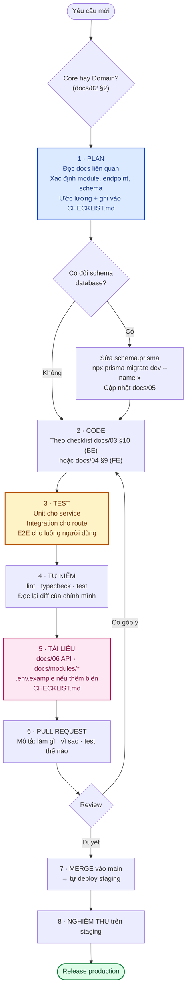
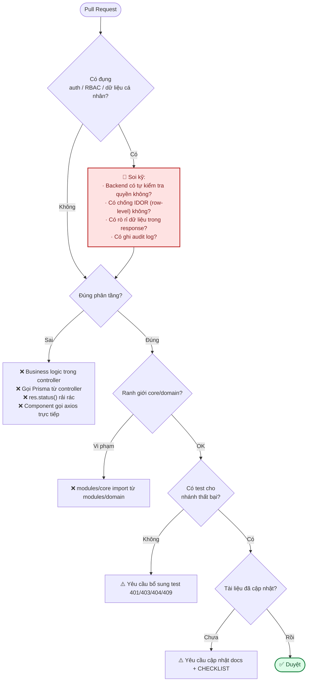

# 11 · Quy trình phát triển

Cách làm việc trên repo này: từ nhận yêu cầu → plan → code → review → merge → cập nhật tài liệu.

---

## 1. Vòng đời một hạng mục



---

## 2. Git

### 2.1. Nhánh

| Loại         | Đặt tên                 | Ví dụ                      |
| ------------ | ----------------------- | -------------------------- |
| Tính năng    | `feat/<mô-tả-ngắn>`     | `feat/products-crud`       |
| Sửa lỗi      | `fix/<mô-tả-ngắn>`      | `fix/session-revoke-idor`  |
| Tài liệu     | `docs/<mô-tả-ngắn>`     | `docs/api-reference`       |
| Tái cấu trúc | `refactor/<mô-tả-ngắn>` | `refactor/storage-service` |
| Hạ tầng      | `chore/<mô-tả-ngắn>`    | `chore/github-actions`     |

`main` luôn ở trạng thái **có thể deploy được**. Không commit thẳng vào `main`.

### 2.2. Commit message

Viết bằng **tiếng Anh**, thể mệnh lệnh, mô tả **kết quả** chứ không phải thao tác:

```
Add product CRUD module with variant support

Rework RBAC to be DB-driven so role changes take effect immediately

Fix session revoke allowing cross-user access
```

| Nên                                                    | Không nên                         |
| ------------------------------------------------------ | --------------------------------- |
| `Add pagination to superadmin users list`              | `update code` · `fix bug` · `wip` |
| Một commit = một thay đổi mạch lạc                     | Gộp 5 tính năng vào một commit    |
| Giải thích **vì sao** ở phần thân nếu không hiển nhiên | Chỉ liệt kê tên file đã sửa       |

> Commit message dùng tiếng Anh (quy ước ngành, tương thích công cụ); **tài liệu và báo cáo dùng
> tiếng Việt** — xem [`CLAUDE.md`](../CLAUDE.md).

### 2.3. Pull Request

Mẫu mô tả PR:

```markdown
## Làm gì

Thêm module `products` (CRUD + biến thể size/giá) cho khu vực admin.

## Vì sao

Hạng mục Phase 5 trong CHECKLIST.md — điều kiện tiên quyết cho giỏ hàng và đơn hàng.

## Thay đổi chính

- `backend/src/modules/domain/products/` — routes/controller/service/validation
- `schema.prisma` — model `Product`, `ProductVariant`, `ProductImage` + migration
- `frontend/src/features/domain/products/` — service + hooks
- `frontend/src/app/(dashboard)/admin/products/` — trang danh sách + form

## Kiểm thử

- 24 unit test cho service (bao gồm: chặn giá âm, slug trùng, xoá khi còn đơn hàng)
- 8 integration test cho route (401/403/422/409)
- 3 kịch bản E2E: tạo → sửa → xoá qua UI
- `npm run lint && npm run typecheck && npm test` xanh cả hai bên

## Tài liệu đã cập nhật

- `docs/06-api-reference.md` — nhóm endpoint Products
- `docs/modules/domain-products.md` — mới
- `docs/05-database-va-rbac.md` — đánh dấu ✅ cho 3 bảng
- `CHECKLIST.md` — tick mục "CRUD sản phẩm"

## Lưu ý cho người review

Permission `products.delete` chỉ gán cho `admin`/`super_admin` trong `domain.seed.ts` —
`sales_staff` cố tình **không** có quyền này.
```

---

## 3. Definition of Done — điều kiện coi là "xong"

Một hạng mục chỉ được tick ✅ trong [`CHECKLIST.md`](../CHECKLIST.md) khi **đủ tất cả**:

- [ ] Code chạy đúng với yêu cầu, đã tự thử trên máy
- [ ] `npm run lint` không lỗi
- [ ] `npm run typecheck` không lỗi
- [ ] `npm test` xanh, **có test mới cho phần vừa viết**
- [ ] Lỗi nghiệp vụ dùng `AppError`, response qua `ApiResponse`
- [ ] Input validate bằng zod
- [ ] Route cần quyền đã có `authorize()` **và** permission đã vào seed
- [ ] Thao tác nhạy cảm có ghi `auditLog.record(...)`
- [ ] Tài liệu đã cập nhật ([06 · API](06-api-reference.md), `docs/modules/*`, `.env.example`)
- [ ] `CHECKLIST.md` đã cập nhật
- [ ] PR được review và duyệt

> Một hạng mục "code xong nhưng chưa có test và chưa có tài liệu" là **🟡 đang làm**, không phải ✅.

---

## 4. Điểm cần soi khi review



**Danh sách kiểm tra nhanh cho người review**

| Nhóm          | Câu hỏi                                                                                                                                       |
| ------------- | --------------------------------------------------------------------------------------------------------------------------------------------- |
| **Bảo mật**   | Quyền được kiểm ở backend chứ không chỉ ẩn nút ở UI? Có chống IDOR? Response có lộ `passwordHash`/token/hash? Thao tác nhạy cảm có audit log? |
| **Kiến trúc** | Controller có mỏng? Service có nhận `req`/`res` không? Có tạo abstraction thừa? `modules/core` có import từ `modules/domain`?                 |
| **Lỗi**       | Dùng `AppError` với `code` đúng? Có `catch {}` rỗng không có lý do?                                                                           |
| **Dữ liệu**   | Migration có tương thích ngược? Index đã đủ cho truy vấn mới? Có `@map`/`@@map`?                                                              |
| **Test**      | Có test nhánh thất bại? Test có assert vào hợp đồng API thay vì chi tiết cài đặt?                                                             |
| **Tài liệu**  | API reference, module doc, `.env.example`, `CHECKLIST.md` đã cập nhật?                                                                        |
| **Ngôn ngữ**  | Comment và message lỗi tiếng Việt? Thuật ngữ kỹ thuật giữ nguyên tiếng Anh?                                                                   |

---

## 5. Khi thay đổi lan ra ngoài code

| Thay đổi                                        | Bắt buộc làm kèm trong cùng PR                                                                              |
| ----------------------------------------------- | ----------------------------------------------------------------------------------------------------------- |
| Thêm/sửa **endpoint**                           | Cập nhật [06 · API Reference](06-api-reference.md)                                                          |
| Thêm **permission**                             | Thêm vào `core.seed.ts` hoặc `domain.seed.ts` + [05 §2.3, §2.4](05-database-va-rbac.md)                     |
| Thêm **biến môi trường**                        | `.env.example` (kèm giải thích + cách lấy giá trị) + [09 §2](09-moi-truong-va-bien-cau-hinh.md)             |
| Đổi **schema**                                  | `prisma migrate dev` + cập nhật [05 §3](05-database-va-rbac.md) + đánh dấu ✅                               |
| Thêm **module**                                 | Tạo `docs/modules/<tên>.md` + link vào [docs/README.md](README.md)                                          |
| Đổi **quy ước kiến trúc**                       | Cập nhật [02](02-kien-truc-tong-quan.md) / [03](03-backend.md) / [04](04-frontend.md)                       |
| Thêm **rủi ro/quyết định** ảnh hưởng khách hàng | Cập nhật [gitbook/05-rui-ro.md](gitbook/05-rui-ro.md) hoặc [gitbook/07-trao-doi.md](gitbook/07-trao-doi.md) |
| Hoàn thành hạng mục                             | Tick trong [`CHECKLIST.md`](../CHECKLIST.md)                                                                |

---

## 6. Xử lý nợ kỹ thuật (_technical debt_)

Khi phát hiện vấn đề nhưng chưa sửa ngay:

1. Ghi vào [12 · Đánh giá & đề xuất](12-danh-gia-va-de-xuat.md) kèm **mức độ ưu tiên** và **ước lượng**.
2. Nếu ảnh hưởng bảo mật → ghi thêm vào [07 · Bảo mật](07-bao-mat.md) với ký hiệu 🟡/⬜.
3. Nếu ảnh hưởng tiến độ/chi phí của khách → ghi vào [gitbook/05-rui-ro.md](gitbook/05-rui-ro.md).
4. **Không** để `// TODO` trơ trọi trong code mà không có nơi theo dõi — TODO không ai đọc lại.

---

## 7. Quy ước code

| Hạng mục                       | Quy ước                                                                                                                  |
| ------------------------------ | ------------------------------------------------------------------------------------------------------------------------ |
| **Ngôn ngữ code**              | TypeScript strict, không `any` (dùng `unknown` + thu hẹp kiểu)                                                           |
| **Đặt tên file**               | Backend: `<module>.<vai-trò>.ts` (`auth.service.ts`). Frontend: `PascalCase.tsx` cho component, `camelCase.ts` cho logic |
| **Đặt tên biến**               | Tiếng Anh, `camelCase`; hằng số `UPPER_SNAKE_CASE`                                                                       |
| **Comment**                    | **Tiếng Việt**, giải thích **VÌ SAO** chứ không phải _cái gì_ — code đã nói _cái gì_ rồi                                 |
| **Message lỗi cho người dùng** | Tiếng Việt, cụ thể ("Vẫn còn danh mục con" thay vì "Bad request")                                                        |
| **Mã lỗi (`code`)**            | `UPPER_SNAKE_CASE` tiếng Anh — dùng cho máy đọc                                                                          |
| **Import**                     | Backend dùng đường dẫn tương đối; frontend dùng alias `@/`                                                               |
| **Độ dài dòng**                | ~110 ký tự                                                                                                               |

### Về comment

```ts
// ❌ Thừa — code đã nói rõ
// Lấy user theo id
const user = await prisma.user.findUnique({ where: { id } });

// ✅ Giải thích quyết định thiết kế và bối cảnh
// Gửi email TRƯỚC khi ghi mật khẩu mới vào DB — nếu gửi thất bại (vd chưa cấu hình SMTP),
// mật khẩu cũ của user vẫn còn nguyên thay vì bị ghi đè bằng chuỗi ngẫu nhiên không ai biết.
await emailService.sendEmail({ ... });
const passwordHash = await hashPassword(newPassword);
```

**Dọn comment không cần thiết** khi gặp: comment mô tả lại code, comment đã lỗi thời, code bị comment
lại thay vì xoá (Git đã giữ lịch sử rồi).

---

## 8. Nhịp cập nhật tiến độ

| Việc                      | Tần suất         | Ở đâu                                                                              |
| ------------------------- | ---------------- | ---------------------------------------------------------------------------------- |
| Tick hạng mục hoàn thành  | **Mỗi PR merge** | [`CHECKLIST.md`](../CHECKLIST.md)                                                  |
| Cập nhật trạng thái phase | Cuối mỗi tuần    | [`CHECKLIST.md`](../CHECKLIST.md) + [gitbook/03-tien-do.md](gitbook/03-tien-do.md) |
| Báo cáo cho khách hàng    | Hai tuần một lần | [gitbook/](gitbook/)                                                               |
| Rà soát rủi ro            | Hai tuần một lần | [gitbook/05-rui-ro.md](gitbook/05-rui-ro.md)                                       |
| Rà soát nợ kỹ thuật       | Cuối mỗi phase   | [12 · Đánh giá & đề xuất](12-danh-gia-va-de-xuat.md)                               |
| Rà soát bảo mật           | Cuối mỗi phase   | [07 · Bảo mật §9](07-bao-mat.md)                                                   |
