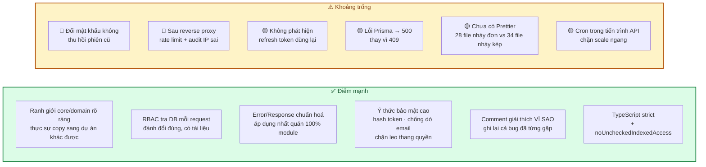
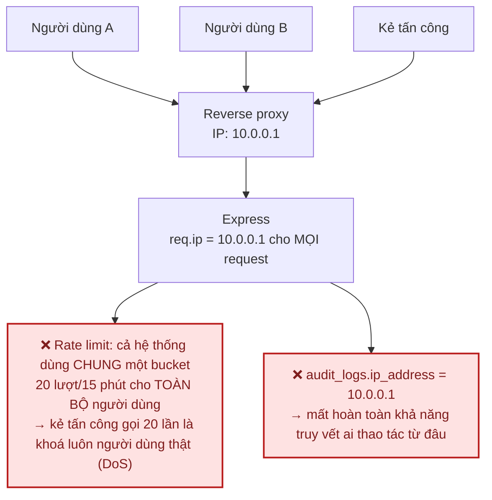
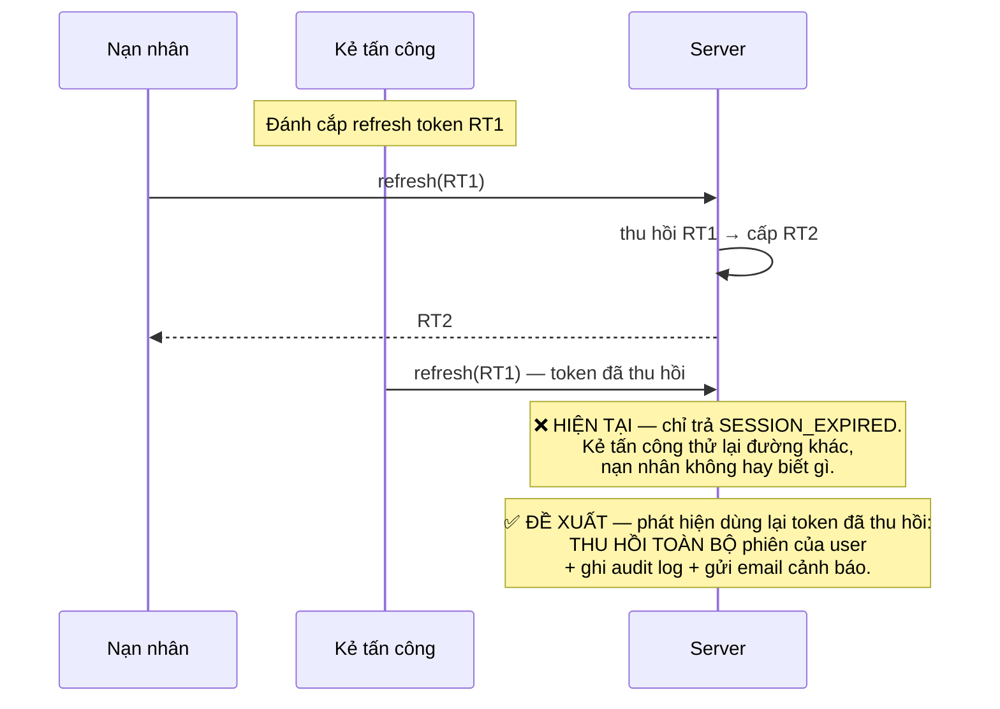
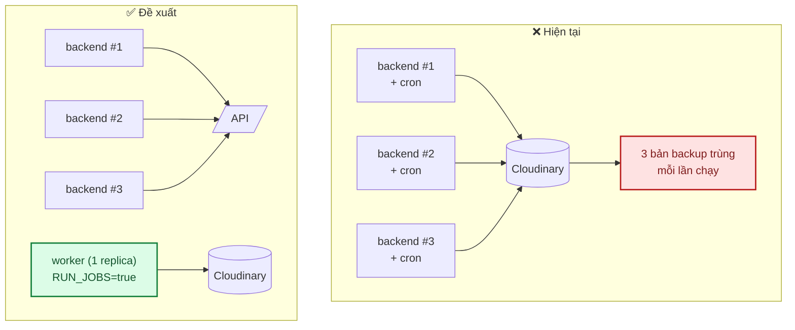
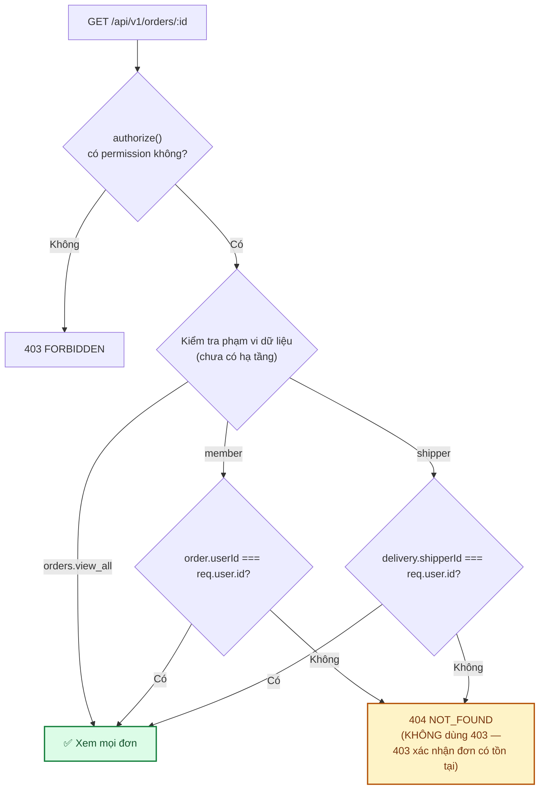
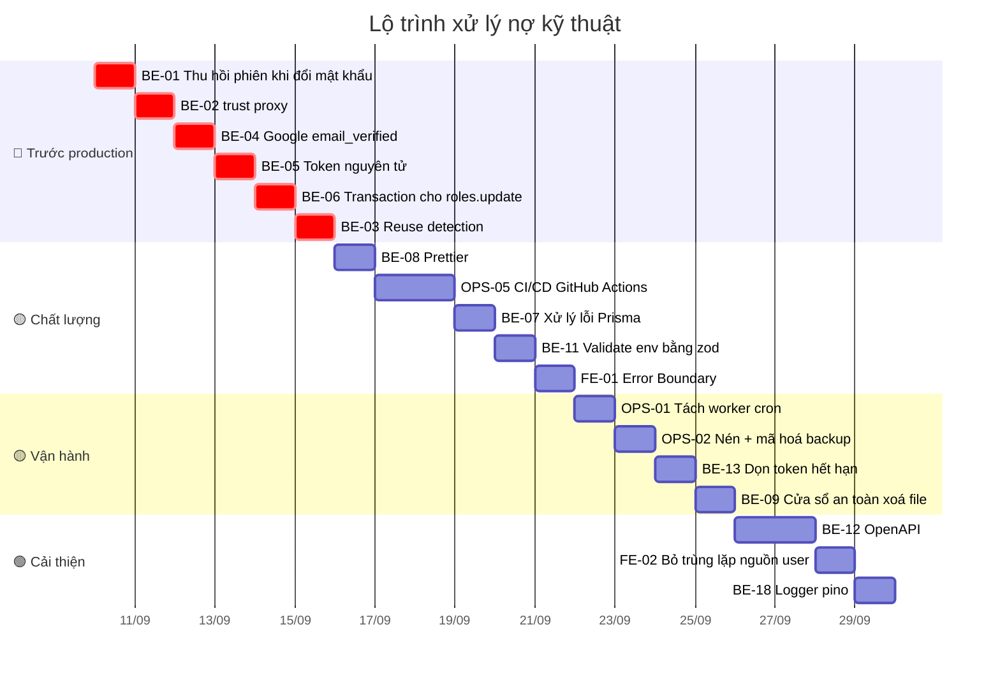

# 12 · Đánh giá source code & đề xuất

Kết quả rà soát toàn bộ backend + frontend (tháng 9/2026), kèm đề xuất xếp theo mức độ ưu tiên.

**Cách đọc**: mỗi vấn đề có mã (`BE-01`, `FE-01`, `OPS-01`) để tiện tham chiếu trong PR và
[`CHECKLIST.md`](../CHECKLIST.md).

| Mức | Ý nghĩa | Xử lý khi nào |
|---|---|---|
| 🔴 **Cao** | Ảnh hưởng bảo mật hoặc tính đúng đắn dữ liệu | Trước khi lên production |
| 🟡 **Vừa** | Ảnh hưởng chất lượng/bảo trì/khả năng mở rộng | Trong 1–2 phase tới |
| 🟢 **Thấp** | Cải thiện, không gấp | Khi có thời gian |

---

## 1. Đánh giá tổng thể



**Nhận định chung**: nền tảng vững hơn mức thường thấy ở dự án cùng quy mô. Kiến trúc phân tầng
đúng, quy ước nhất quán, và — điều hiếm gặp — **các quyết định đánh đổi đều được ghi lại lý do
ngay trong code**. Vấn đề còn lại chủ yếu là những chỗ "đúng ở dev nhưng sai ở production"
(reverse proxy, cron đa instance) và một số lỗ hổng phiên đăng nhập cần bịt trước khi mở cho
người dùng thật.

### Bảng điểm

| Tiêu chí | Điểm | Nhận xét |
|---|:---:|---|
| Kiến trúc & phân tầng | 9/10 | Modular + MVC + Service Layer đúng chuẩn, không over-engineering |
| Chuẩn hoá error/response | 10/10 | Nhất quán tuyệt đối, `asyncHandler` phủ 100% controller |
| Bảo mật | 7/10 | Nền tốt, còn thiếu vài chốt quan trọng (§2) |
| Khả năng bảo trì | 8/10 | Comment chất lượng cao; thiếu formatter thống nhất |
| Kiểm thử | 8/10 | 435 test unit/integration + ~30 E2E (vừa bổ sung); thiếu CI |
| Tài liệu | 9/10 | Đầy đủ, có sơ đồ; cần giữ đồng bộ với code |
| Sẵn sàng production | 5/10 | Chưa có CI/CD, Docker, giám sát, HTTPS |

---

## 2. 🔴 Ưu tiên cao — xử lý trước khi lên production

### BE-01 · Đổi mật khẩu không thu hồi phiên đăng nhập cũ

**Vấn đề.** Cả 3 luồng đổi mật khẩu đều **không** thu hồi session đang tồn tại:

| Luồng | File |
|---|---|
| Người dùng tự đổi | `backend/src/modules/core/users/users.service.ts` → `changePassword` |
| Quên mật khẩu → đặt lại | `backend/src/modules/core/auth/auth.service.ts` → `resetPassword` |
| SuperAdmin reset hộ | `backend/src/modules/core/users/users.admin.service.ts` → `resetPassword` |

**Vì sao nghiêm trọng.** Kịch bản thực tế: kẻ tấn công chiếm được phiên (máy công cộng, cookie bị
đánh cắp). Nạn nhân phát hiện, đổi mật khẩu — nhưng refresh token cũ **vẫn còn hiệu lực 30 ngày**.
Đổi mật khẩu là hành động người dùng tin rằng sẽ "đuổi" kẻ xâm nhập, nhưng thực tế thì không.
Với luồng SuperAdmin reset, mục đích thường chính là để cắt quyền truy cập — càng phải thu hồi.

**Đề xuất.** Thu hồi toàn bộ session sau khi mật khẩu đổi thành công (giữ lại phiên hiện tại ở
luồng tự đổi, để người dùng không bị đăng xuất khỏi chính thiết bị đang dùng):

```ts
// users.service.ts — changePassword
await prisma.user.update({ where: { id: userId }, data: { passwordHash } });
// Đổi mật khẩu = "đuổi" mọi thiết bị khác. Giữ phiên hiện tại để không tự đăng xuất chính mình.
await prisma.session.updateMany({
  where: { userId, revokedAt: null, ...(currentHash && { refreshTokenHash: { not: currentHash } }) },
  data: { revokedAt: new Date() },
});
```

Với `auth.service.resetPassword` và `users.admin.service.resetPassword`: thu hồi **tất cả**,
không chừa phiên nào.

**Ước lượng**: 2 giờ (gồm test).

---

### BE-02 · Thiếu `trust proxy` — rate limit và audit log sai sau reverse proxy

**Vấn đề.** `backend/src/app.ts` không gọi `app.set('trust proxy', ...)`. Khi chạy sau
Caddy/Nginx/Vercel/Render, `req.ip` trả về **IP của proxy**, không phải IP người dùng.

**Hệ quả — hai vấn đề riêng biệt, đều nghiêm trọng:**



**Đề xuất.**

```ts
// app.ts — đặt TRƯỚC mọi middleware khác
// Số hop tin cậy: 1 nếu chỉ có 1 reverse proxy đứng trước. KHÔNG dùng `true` (tin mọi hop)
// vì client tự đặt X-Forwarded-For sẽ giả mạo được IP.
if (env.isProd) app.set("trust proxy", 1);
```

Kèm biến `TRUST_PROXY_HOPS` để cấu hình theo hạ tầng thật.

**Ước lượng**: 1 giờ.

---

### BE-03 · Không phát hiện việc dùng lại refresh token (*reuse detection*)

**Vấn đề.** `refreshSession` có *rotation* đúng (thu hồi token cũ, cấp token mới), nhưng khi một
token **đã bị thu hồi** được gửi lại, hệ thống chỉ trả `SESSION_EXPIRED` và **không làm gì thêm**.

**Vì sao quan trọng.** Rotation chỉ có giá trị đầy đủ khi đi kèm reuse detection. Token cũ được
dùng lại là **tín hiệu gần như chắc chắn** rằng token đã bị đánh cắp (người dùng hợp lệ không bao
giờ dùng lại token đã xoay vòng).



**Đề xuất.** Khi tra thấy session có `revokedAt != null` ứng với hash gửi lên:
thu hồi mọi session của user đó, ghi `audit_logs` với action `auth.refresh_reuse_detected`,
và gửi email cảnh báo.

**Ước lượng**: 4 giờ.

---

### BE-04 · Google login không kiểm tra `email_verified`

**Vấn đề.** `auth.service.loginWithGoogle` liên kết tài khoản theo `payload.email` mà không kiểm
tra `payload.email_verified`:

```ts
user = await repo.findUserByEmail(payload.email);   // liên kết theo email
```

**Rủi ro.** Nếu Google trả về một email **chưa được xác minh** (xảy ra với một số cấu hình Google
Workspace), kẻ tấn công có thể đăng nhập vào tài khoản đã tồn tại của người khác.

**Đề xuất.**

```ts
if (!payload?.email || payload.email_verified !== true) {
  throw new AppError("Tài khoản Google chưa xác minh email", 401, "GOOGLE_EMAIL_UNVERIFIED");
}
```

**Ước lượng**: 1 giờ.

---

### BE-05 · Token dùng-một-lần chưa nguyên tử (*atomic*)

**Vấn đề.** `verifyMagicLink` và `resetPassword` đọc token rồi mới đánh dấu đã dùng — hai bước
tách rời:

```ts
const record = await repo.findMagicLinkTokenByHash(tokenHash);
if (!record || record.usedAt || record.expiresAt < new Date()) throw ...;
await repo.markMagicLinkUsed(record.id);   // ⚠️ khoảng trống giữa 2 bước
```

Hai request đồng thời với cùng token đều có thể vượt qua kiểm tra `usedAt` trước khi bất kỳ bước
đánh dấu nào hoàn tất — phá vỡ đảm bảo "dùng 1 lần".

**Đề xuất.** Gộp kiểm tra và đánh dấu vào một câu lệnh có điều kiện:

```ts
const result = await prisma.magicLinkToken.updateMany({
  where: { tokenHash, usedAt: null, expiresAt: { gt: new Date() } },
  data: { usedAt: new Date() },
});
if (result.count === 0) throw new AppError("Liên kết không hợp lệ hoặc đã hết hạn", 401, "INVALID_MAGIC_LINK");
```

Chỉ đúng **một** request thắng cuộc đua.

**Ước lượng**: 2 giờ (cả 2 luồng + test).

---

### BE-06 · `roles.service.update` không dùng transaction

**Vấn đề.** Cập nhật permission của role thực hiện `deleteMany` rồi `createMany` ngoài transaction:

```ts
await prisma.rolePermission.deleteMany({ where: { roleId: id } });
await prisma.rolePermission.createMany({ data: ... });   // ⚠️ nếu bước này lỗi
```

Lỗi ở bước hai → role **mất sạch permission**. Với role đang được nhiều nhân viên dùng, đây là sự
cố vận hành ngay lập tức.

**Đề xuất.** Bọc `prisma.$transaction([...])` — `users.admin.service.updateRole` đã làm đúng, chỉ
cần áp dụng nhất quán.

**Ước lượng**: 1 giờ.

---

## 3. 🟡 Ưu tiên vừa

### BE-07 · `errorHandler` không xử lý lỗi Prisma đã biết

Lỗi ràng buộc unique (`P2002`), không tìm thấy bản ghi (`P2025`), vi phạm khoá ngoại (`P2003`)
hiện rơi vào nhánh "lỗi lạ" → trả **500 `INTERNAL_ERROR`** thay vì mã lỗi có nghĩa.

Ví dụ: tạo permission trùng code trong lúc chạy đua sẽ trả 500 thay vì 409.

**Đề xuất.** Thêm nhánh trong `errorHandler`:

```ts
if (err instanceof Prisma.PrismaClientKnownRequestError) {
  const map: Record<string, [number, string, string]> = {
    P2002: [409, "DUPLICATE", "Dữ liệu đã tồn tại"],
    P2025: [404, "NOT_FOUND", "Không tìm thấy dữ liệu"],
    P2003: [409, "FOREIGN_KEY_CONSTRAINT", "Dữ liệu đang được tham chiếu ở nơi khác"],
  };
  const mapped = map[err.code];
  if (mapped) {
    const [status, code, message] = mapped;
    res.status(status).json({ success: false, message, code });
    return;
  }
}
```

**Ước lượng**: 2 giờ.

---

### BE-08 · Chưa cấu hình Prettier — style không thống nhất

**Số liệu đo được**: **28 file** dùng nháy đơn, **34 file** dùng nháy kép — lệch nhau ngay trong
cùng một module (`auth.controller.ts` dùng `"`, `auth.repository.ts` dùng `'`).

Hệ quả: diff Git nhiễu vì thay đổi style lẫn vào thay đổi logic, review tốn thời gian vô ích.

**Đề xuất.**

```jsonc
// .prettierrc (đặt ở thư mục gốc, dùng chung cho cả backend và frontend)
{
  "semi": true,
  "singleQuote": false,
  "trailingComma": "all",
  "printWidth": 110,
  "arrowParens": "always"
}
```

```bash
npm i -D prettier eslint-config-prettier
npx prettier --write "src/**/*.ts" "tests/**/*.ts"
```

Chạy format **một lần trong một commit riêng** (`chore: apply prettier`) để không trộn với thay đổi
logic, rồi thêm vào CI.

**Ước lượng**: 2 giờ.

---

### OPS-01 · Cron chạy trong tiến trình API — chặn scale ngang

`jobs/index.ts` đăng ký cron ngay trong tiến trình backend. Khi chạy **nhiều instance** (điều bắt
buộc để chịu tải dịp lễ), mỗi instance đều chạy backup → trùng lặp, tốn dung lượng Cloudinary, và các
job xoá file có thể giẫm chân nhau.



**Đề xuất.** Tách bằng biến môi trường `RUN_JOBS=true`, chỉ container `worker` đặt biến này:

```ts
// server.ts
if (env.isProd && process.env.RUN_JOBS === "true") registerJobs();
```

**Ước lượng**: 3 giờ (gồm cập nhật `docker-compose.yml`).

---

### OPS-02 · Backup chưa nén và chưa mã hoá

[07 · Bảo mật §5](07-bao-mat.md) yêu cầu "nén + **mã hoá** trước khi đẩy lên bucket", nhưng
`backupDatabase.job.ts` upload file `.dump` thô. Nếu bucket bị lộ, toàn bộ dữ liệu khách hàng
(tên, số điện thoại, địa chỉ giao hàng) lộ theo — vi phạm Nghị định 13/2023/NĐ-CP.

**Đề xuất.**
1. `pg_dump --format=custom --compress=9` (nén sẵn, không cần gzip riêng).
2. Mã hoá bằng `age` hoặc `gpg` với khoá công khai; khoá riêng **không** lưu trên máy chủ.
3. Bucket `backups` riêng, API token quyền hẹp hơn bucket ảnh công khai.

**Ước lượng**: 4 giờ (gồm diễn tập khôi phục).

---

### OPS-03 · `cleanupOldBackups` chỉ xử lý 1000 object đầu

`ListObjectsV2Command` trả tối đa 1000 object và code không phân trang qua `ContinuationToken`.
Với lịch hiện tại (2 ngày/lần, giữ 30 ngày ≈ 15 file) chưa chạm giới hạn, nhưng đây là **quả bom
hẹn giờ** nếu sau này tăng tần suất backup hoặc dùng chung bucket với ảnh.

**Đề xuất**: dùng `paginateListObjectsV2` của AWS SDK.

**Ước lượng**: 1 giờ.

---

### BE-09 · `cleanupOrphanFiles` xoá file mới xoá mềm ngay lập tức

Comment trong `files.service.softDeleteFile` nói Cloudinary object bị purge ở lượt cron sau "để có
khoảng đệm an toàn", nhưng job lại xoá **mọi** file có `deletedAt != null` bất kể xoá cách đây bao lâu:

```ts
{ deletedAt: { not: null } },   // không có điều kiện thời gian
```

Xoá nhầm một ảnh sản phẩm lúc 03:59 thì 04:00 cron chạy là mất vĩnh viễn — không có cửa sổ khôi phục.

**Đề xuất**: thêm điều kiện `deletedAt: { lt: cutoff }` giống nhánh file mồ côi, để có 24 giờ hối tiếc.

**Ước lượng**: 30 phút.

---

### BE-10 · `createFileRecord` không kiểm chứng `r2Key` — ✅ ĐÃ XỬ LÝ PHẦN LỚN (10/09/2026)

**Vấn đề gốc.** `POST /api/v1/files` nhận `r2Key` bất kỳ từ client mà không kiểm tra key đó có phải
do server vừa ký presigned URL hay không, cũng không kiểm tra object thật sự tồn tại trên R2. Người
dùng có thể tạo bản ghi trỏ tới object của người khác.

**Đã xử lý khi đổi nhà cung cấp lưu trữ sang Cloudinary (xem [modules/core-files.md §4](modules/core-files.md#4-bảo-mật)).**
`createFileRecord` giờ luôn gọi Cloudinary Admin API (`cloudinary.api.resource`) để xác nhận
`publicId` có tồn tại thật **trước khi** ghi DB, và lấy `mimeType`/`sizeBytes`/`url` từ dữ liệu
Cloudinary trả về — không tin metadata client tự khai (client giờ chỉ gửi `publicId` +
`originalName`, không còn gửi `mimeType`/`sizeBytes`). `publicId` không tồn tại → `404
FILE_NOT_FOUND`, không tạo được bản ghi rác.

**Viết trung thực, không tô hồng — phần chưa mạnh hơn flow cũ**: việc này **không** chứng minh được
`publicId` đó đúng là do **chính user gửi request** vừa upload — cả 2 đời flow (R2 lẫn Cloudinary)
đều chỉ dựa vào việc UUID khó đoán để chống đoán key của người khác, không có cơ chế sở hữu thật.
Nhưng cái mà `BE-10` gốc mô tả — tạo bản ghi DB với metadata bịa đặt hoặc trỏ tới object không tồn
tại — đã bị **chặn hoàn toàn**, nên coi vấn đề chính là đã đóng. Phần "chứng minh chủ sở hữu" còn lại
chuyển xuống mức ưu tiên thấp ở [modules/core-files.md §7](modules/core-files.md#7-việc-còn-lại) vì
tác động vẫn thấp (UUID khó đoán) — không cần xử lý gấp trước khi mở màn hình quản lý tài nguyên như
đánh giá cũ đặt ra.

---

### BE-11 · `config/env.ts` chỉ kiểm tra sự tồn tại, không kiểm tra giá trị

`required()` chỉ đảm bảo biến **có mặt**. `JWT_ACCESS_SECRET=x` (1 ký tự) vẫn khởi động bình thường —
một secret yếu tới mức vô nghĩa vẫn lọt qua.

**Đề xuất**: validate bằng `zod` (đã là dependency sẵn có):

```ts
const envSchema = z.object({
  DATABASE_URL: z.string().url(),
  JWT_ACCESS_SECRET: z.string().min(32, "JWT_ACCESS_SECRET phải ≥ 32 ký tự"),
  JWT_REFRESH_SECRET: z.string().min(32),
  PORT: z.coerce.number().int().positive().default(4000),
  FRONTEND_URL: z.string().url().default("http://localhost:3000"),
  EMAIL_PROVIDER: z.enum(["resend", "smtp"]).default("smtp"),
  // ...
});
```

Thêm kiểm tra ở production: từ chối khởi động nếu `COOKIE_SECRET` vẫn là `dev-only-secret`, hoặc
`JWT_ACCESS_SECRET === JWT_REFRESH_SECRET`.

**Ước lượng**: 3 giờ.

---

### BE-12 · Chưa có OpenAPI/Swagger

[06 · API Reference](06-api-reference.md) là tài liệu viết tay — chắc chắn sẽ lệch với code theo
thời gian.

**Đề xuất**: dùng `@asteasolutions/zod-to-openapi` để sinh spec **từ chính các zod schema đã có**
trong `*.validation.ts` — không phải viết lại lần hai, và không thể lệch.

**Ước lượng**: 8 giờ.

---

### BE-13 · Dữ liệu hết hạn tích tụ vô hạn

| Bảng | Vấn đề |
|---|---|
| `magic_link_tokens` | Token hết hạn/đã dùng không bao giờ bị xoá |
| `password_reset_tokens` | Tương tự |
| `sessions` | Session hết hạn/đã thu hồi giữ mãi |
| `audit_logs` | Tăng vô hạn — nhưng đây là dữ liệu tuân thủ, cần chính sách lưu trữ chứ không xoá tuỳ tiện |
| `email_logs` | Tăng vô hạn |

**Đề xuất**: thêm job `cleanupExpiredTokens` (hằng ngày) xoá token hết hạn > 7 ngày và session hết
hạn > 30 ngày. Với `audit_logs`: chuyển sang lưu trữ lạnh sau 12 tháng thay vì xoá.

**Ước lượng**: 3 giờ.

---

### FE-01 · Chưa có Error Boundary

Không có `app/error.tsx` hay `app/global-error.tsx`. Một lỗi render bất ngờ → **trang trắng**,
người dùng không biết chuyện gì và không có đường thoát.

**Đề xuất**: thêm `app/error.tsx` (thông điệp thân thiện + nút "Thử lại" + link về trang chủ) và
`app/global-error.tsx` cho lỗi ở tầng layout gốc.

**Ước lượng**: 2 giờ.

---

### FE-02 · Hai nguồn sự thật cho thông tin người dùng

`useAuthStore` (Zustand) và `useMe()` (React Query) cùng giữ thông tin người dùng hiện tại.
`useAuthStore` được set lúc đăng nhập nhưng **không** cập nhật khi hồ sơ đổi qua đường khác —
đúng loại tình huống mà chính [04 · Frontend §1](04-frontend.md) cảnh báo không nên làm.

**Đề xuất**: bỏ `user` khỏi `useAuthStore`, dùng `useMe()` làm nguồn duy nhất. Zustand chỉ giữ UI
state thuần (sidebar, modal, theme).

**Ước lượng**: 3 giờ.

---

### FE-03 · Comment lệch với code — ✅ ĐÃ SỬA (10/09/2026)

`frontend/src/lib/axios.ts` dòng 14 ghi *"access_token hết hạn sau 15 phút"* nhưng giá trị thật là
**5 phút** (`JWT_ACCESS_EXPIRES_IN=5m`). Comment sai còn tệ hơn không có comment — nó khiến người
đọc sau tin vào thông tin sai.

**Đã sửa**: comment nay ghi "hết hạn ngắn (mặc định 5 phút, xem `JWT_ACCESS_EXPIRES_IN` ở backend)" —
trỏ tới biến cấu hình thay vì lặp lại con số cứng, nên không lệch tiếp khi đổi cấu hình.

Cùng đợt dọn dẹp này cũng đã cập nhật **56 file** có comment trỏ tới đường dẫn cũ (`core/` → `shared/`)
hoặc tài liệu đã di chuyển (`ARCHITECTURE.md`/`DATABASE.md`/`SECURITY.md` → `docs/`).

---

## 4. 🟢 Ưu tiên thấp

| Mã | Vấn đề | Đề xuất | Ước lượng |
|---|---|---|---|
| `BE-14` | `tsconfig.json` khai báo `paths: { "@/*": ["src/*"] }` nhưng **không file nguồn nào dùng**, và runtime CommonJS cũng không resolve được nếu có dùng | Xoá khỏi `tsconfig.json`, hoặc thêm `tsconfig-paths` nếu muốn dùng thật | 30 phút |
| `BE-15` | `JWT_REFRESH_EXPIRES_IN` có trong `.env.example` nhưng code hard-code `refreshExpiresInDays: 30` | Đọc từ env cho đúng như tài liệu | 30 phút |
| `BE-16` | Rate limit chỉ theo IP, chưa theo email | Thêm `keyGenerator` kết hợp email cho `/login`, `/forgot-password` | 2 giờ |
| `BE-17` | Chưa khoá tạm tài khoản sau N lần đăng nhập sai (SECURITY.md §1 có yêu cầu) | Đếm số lần thất bại + cooldown tăng dần | 4 giờ |
| `BE-18` | `logger` tự viết, chưa xuất JSON có cấu trúc | Đổi sang `pino` — giữ nguyên interface `logger.*` nên nơi gọi không phải sửa | 3 giờ |
| `BE-19` | Chưa có `folders` CRUD dù schema đã có bảng | Bổ sung khi làm màn quản lý tài nguyên | 6 giờ |
| `FE-04` | Chưa có loading skeleton, trang nhảy layout khi tải | Thêm `loading.tsx` cho các route nặng | 3 giờ |
| `FE-05` | Chưa có `next/image` cho ảnh sản phẩm | Dùng khi làm module products (quan trọng với ảnh hoa) | 2 giờ |
| `FE-06` | Chưa có metadata SEO cho từng trang | Thêm `generateMetadata` cho trang sản phẩm/danh mục | 3 giờ |
| `OPS-04` | Chưa có `.nvmrc` / `engines` | Chốt phiên bản Node để tránh lệch môi trường | 15 phút |

---

## 5. Đề xuất kiến trúc cho giai đoạn tới

### 5.1. Trước khi viết module `orders` — chuẩn hoá kiểm tra phạm vi dữ liệu

Toàn bộ RBAC hiện tại là **permission-based** (làm được hành động gì). Module `orders` là nơi đầu
tiên cần thêm **row-level check** (được đụng vào bản ghi nào) — `shipper` chỉ thấy đơn của mình,
`member` chỉ thấy đơn của mình.



**Đề xuất**: viết một helper dùng chung ngay từ đầu, đừng lặp lại logic này ở từng service:

```ts
// shared/utils/ownership.ts
export function assertCanAccess(
  user: AuthUser,
  resource: { ownerId: string | null },
  bypassPermission: string,
): void {
  if (user.permissions.includes(bypassPermission)) return;
  if (resource.ownerId === user.id) return;
  // Trả NOT_FOUND chứ không phải FORBIDDEN — 403 vô tình xác nhận bản ghi đó có tồn tại.
  throw new AppError("Không tìm thấy dữ liệu", 404, "NOT_FOUND");
}
```

### 5.2. Chốt chặn tồn kho trước mùa cao điểm

Dịp 14/2 và 8/3 là lúc *race condition* tồn kho chắc chắn xảy ra. Quyết định trước, đừng để tới lúc
đó mới xử lý:

```sql
-- Kiểm tra và trừ trong CÙNG một câu lệnh — không đọc rồi mới ghi
UPDATE product_variants
SET stock = stock - $1
WHERE id = $2 AND stock >= $1
RETURNING stock;
-- Trả về 0 dòng = hết hàng, không cần khoá bảng
```

### 5.3. Chỉ tách `StorageService` khi thực sự cần — ✅ CẬP NHẬT (10/09/2026): điều kiện đã xảy ra, kết luận không đổi

[02 · Kiến trúc §6](02-kien-truc-tong-quan.md) đặt kế hoạch Phase 4 bóc `files.service` thành
`StorageService` với `upload()/delete()/getUrl()/exists()/move()`.

**Đánh giá gốc**: hiện tại `files.service.ts` đã cô lập R2 khá tốt — business logic không gọi thẳng
AWS SDK. Tách thêm một lớp nữa **chưa giải quyết vấn đề thực tế nào** (dự án chưa có kế hoạch đổi
khỏi R2), đúng loại over-engineering mà [02 §1](02-kien-truc-tong-quan.md) yêu cầu tránh.

**Đề xuất gốc**: **hoãn** tới khi thực sự cần đổi nhà cung cấp. Ưu tiên `BE-10` (kiểm chứng `r2Key`)
— đó mới là rủi ro thật.

**Cập nhật**: điều kiện "khi thực sự cần đổi nhà cung cấp" **đã xảy ra** — dự án đổi từ Cloudflare R2
sang Cloudinary (09/2026), cho cả module Files lẫn backup database. Việc đổi **vẫn không tách thêm**
`StorageService`: toàn bộ thay đổi nằm trong `files.service.ts` (đổi từ gọi AWS SDK sang gọi
Cloudinary SDK) và `jobs/backupDatabase.job.ts`, không phải sửa business logic ở module khác gọi vào
đây. Đây là **bằng chứng ủng hộ** lập luận cũ — `files.service` đã cô lập nhà cung cấp đủ tốt để đổi
provider chỉ cần sửa đúng 1-2 file — không phải bằng chứng ngược lại đòi phải tách thêm lớp.
`BE-10` (kiểm chứng `r2Key`/`publicId`) cũng đã được xử lý phần lớn trong cùng lần đổi này — xem
mục `BE-10` ở §3 phía trên.

### 5.4. Chưa cần Redis

`ARCHITECTURE` nhắc tới Redis cho cache/session. Đánh giá: RBAC tra DB mỗi request là truy vấn nhỏ
có index; ở quy mô hiện tại **chưa cần** Redis. Chỉ thêm khi đo được nghẽn thật (thời gian phản hồi
p95 tăng, DB đầy kết nối), không thêm vì "sẽ cần sau này".

---

## 6. Kế hoạch thực hiện đề xuất



### Tổng ước lượng

| Nhóm | Số hạng mục | Công sức |
|---|:---:|---|
| 🔴 Cao — bắt buộc trước production | 6 | **~11 giờ** (1.5 ngày) |
| 🟡 Vừa — chất lượng & vận hành | 13 | **~38 giờ** (5 ngày) |
| 🟢 Thấp — cải thiện | 10 | **~24 giờ** (3 ngày) |
| **Tổng** | **29** | **~73 giờ ≈ 9–10 ngày công** |

> Nhóm 🔴 chỉ tốn khoảng **1.5 ngày** nhưng bịt được các lỗ hổng phiên đăng nhập nghiêm trọng nhất.
> Đây là hạng mục có tỉ lệ giá trị/công sức cao nhất trong toàn bộ danh sách — nên làm ngay.

Theo dõi tiến độ từng mã ở [`CHECKLIST.md`](../CHECKLIST.md) mục *Nợ kỹ thuật*.
