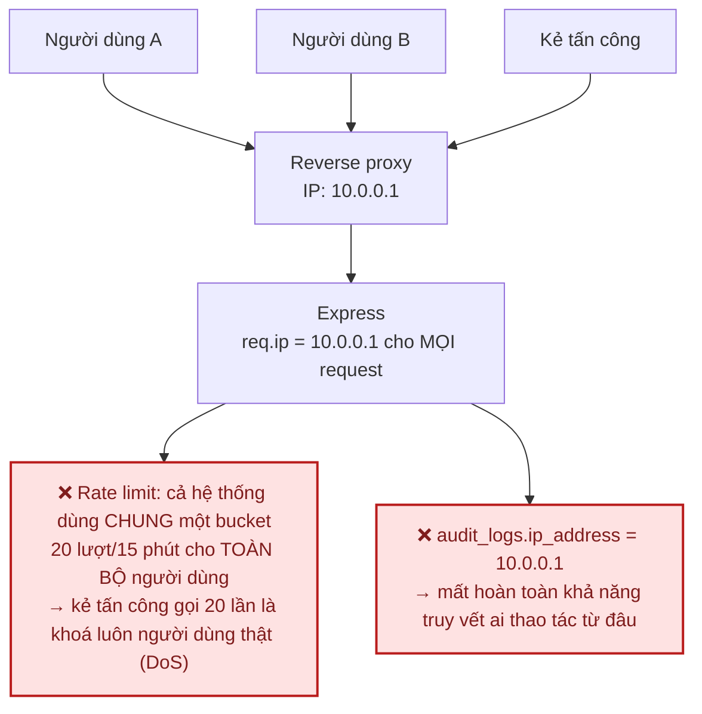
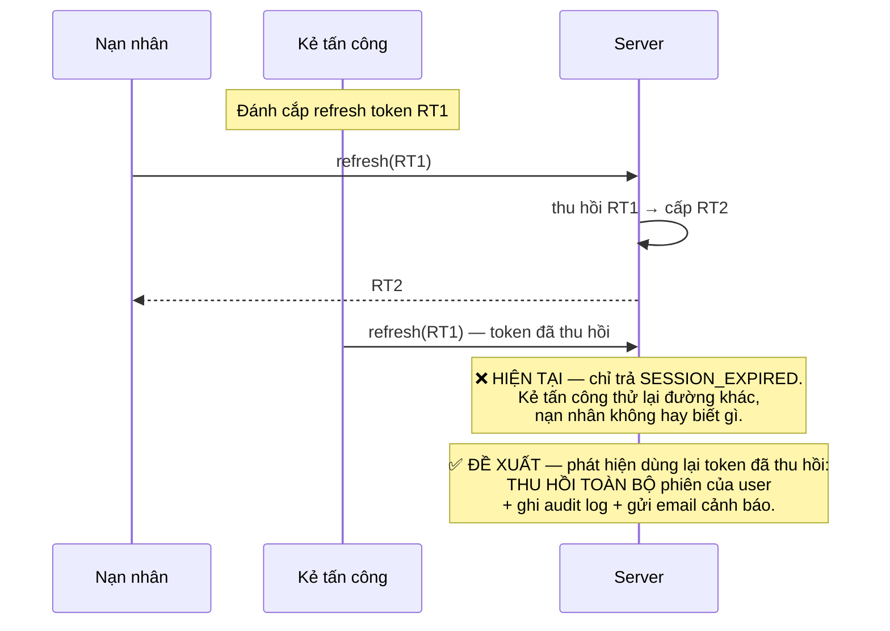
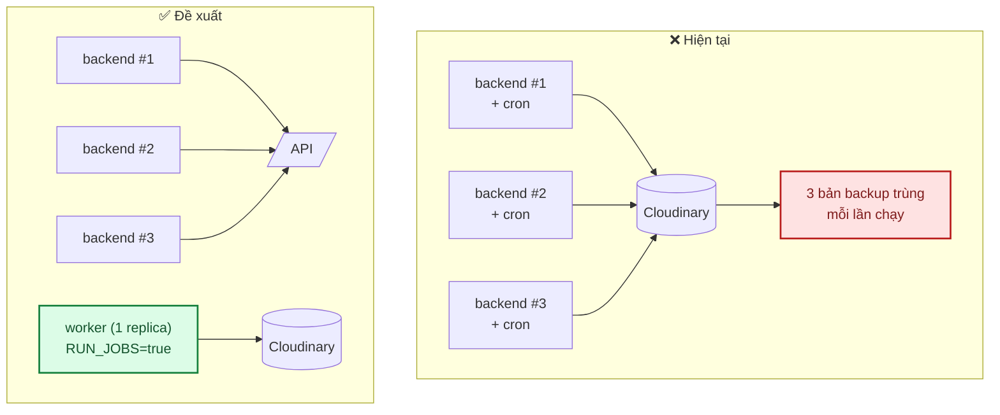
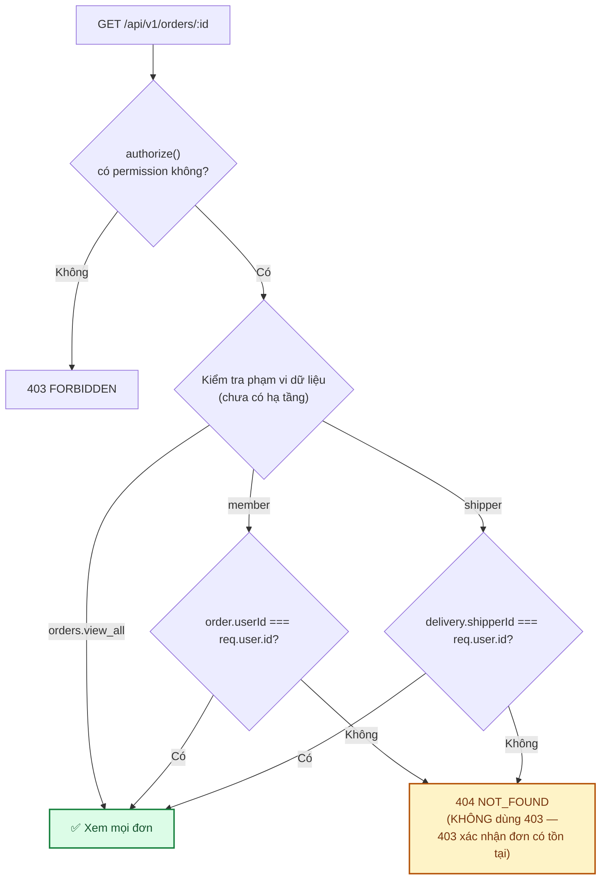
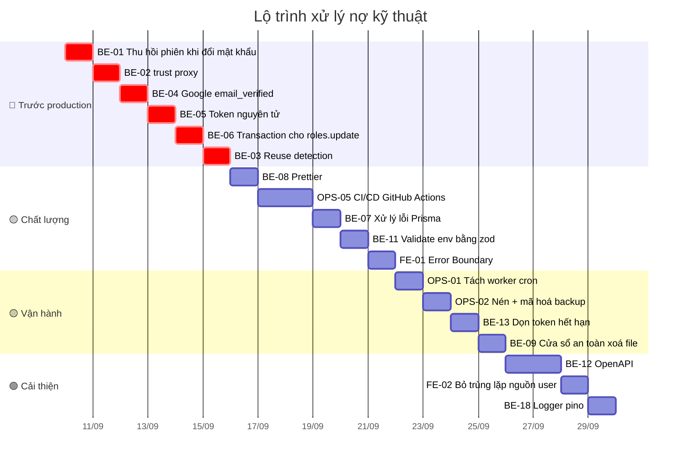

# 12 · Đánh giá source code & đề xuất

Kết quả rà soát toàn bộ backend + frontend (tháng 9/2026), kèm đề xuất xếp theo mức độ ưu tiên.

**Cách đọc**: mỗi vấn đề có mã (`BE-01`, `FE-01`, `OPS-01`) để tiện tham chiếu trong PR và
[`CHECKLIST.md`](../CHECKLIST.md).

| Mức | Ý nghĩa | Xử lý khi nào |
|---|---|---|
| 🔴 **Cao** | Ảnh hưởng bảo mật hoặc tính đúng đắn dữ liệu | Trước khi lên production |
| 🟡 **Vừa** | Ảnh hưởng chất lượng/bảo trì/khả năng mở rộng | Trong 1–2 phase tới |
| 🟢 **Thấp** | Cải thiện, không gấp | Khi có thời gian |

---

## 1. Đánh giá tổng thể

```mermaid
flowchart LR
    subgraph GOOD["✅ Điểm mạnh"]
        G1["Ranh giới core/domain rõ ràng<br/>thực sự copy sang dự án khác được"]
        G2["RBAC tra DB mỗi request<br/>đánh đổi đúng, có tài liệu"]
        G3["Error/Response chuẩn hoá<br/>áp dụng nhất quán 100% module"]
        G4["Ý thức bảo mật cao<br/>hash token · chống dò email<br/>chặn leo thang quyền"]
        G5["Comment giải thích VÌ SAO<br/>ghi lại cả bug đã từng gặp"]
        G6["TypeScript strict<br/>+ noUncheckedIndexedAccess"]
        G7["✅ BE-01→06 đã xử lý (10/09/2026)<br/>thu hồi phiên khi đổi mật khẩu · trust proxy<br/>phát hiện refresh token dùng lại · Google<br/>email_verified · token 1 lần nguyên tử · transaction"]
        G8["✅ BE-08 đã xử lý (10/09/2026)<br/>Prettier cả 2 package + script format/format:check"]
        G9["✅ BE-07, BE-09, BE-11, BE-13 đã xử lý (10/09/2026)<br/>lỗi Prisma → 409/404 có nghĩa · cửa sổ 24h<br/>trước khi xoá file mềm · validate GIÁ TRỊ biến<br/>môi trường bằng zod · job dọn token/session hết hạn"]
        G10["✅ FE-01, FE-02, OPS-02, OPS-03 đã xử lý (11/09/2026)<br/>Error Boundary · xoá useAuthStore trùng lặp<br/>nén + mã hoá backup (RSA/AES-256-GCM)<br/>phân trang next_cursor khi dọn backup cũ"]
        G11["✅ BE-14→19, OPS-04 đã xử lý (11/09/2026)<br/>rate limit theo email · khoá tạm sau 5 lần sai<br/>logger pino JSON có cấu trúc · CRUD folders<br/>.nvmrc/engines · dọn tsconfig paths chết"]
        G12["✅ FE-04→06 đã xử lý (11/09/2026)<br/>loading skeleton 3 route Server Component<br/>next/image toàn bộ ảnh Cloudinary<br/>generateMetadata sản phẩm/danh mục"]
        G13["✅ OPS-01 đã xử lý (11/09/2026)<br/>RUN_JOBS tách cron khỏi NODE_ENV<br/>scale ngang API mà cron chỉ chạy 1 nơi"]
        G14["✅ BE-12 đã xử lý (11/09/2026)<br/>OpenAPI/Swagger sinh từ zod schema thật<br/>GET /docs · GET /openapi.json"]
        G15["✅ Màn quản lý tài nguyên đã xây (11/09/2026)<br/>+ system_settings key-value tổng quát<br/>(site_name/logo/timezone/registration_enabled)"]
    end

    subgraph GAP["⚠️ Khoảng trống"]
        B7["🟡 BE-20: nhánh tự tạo tài khoản<br/>chết trong verifyMagicLink()<br/>(phát hiện khi làm registration_enabled)"]
    end

    style GOOD fill:#dcfce7,stroke:#15803d,stroke-width:2px,color:#14532d
    style GAP fill:#fef3c7,stroke:#b45309,stroke-width:2px,color:#78350f
```



**Nhận định chung**: nền tảng vững hơn mức thường thấy ở dự án cùng quy mô. Kiến trúc phân tầng
đúng, quy ước nhất quán, và — điều hiếm gặp — **các quyết định đánh đổi đều được ghi lại lý do
ngay trong code**. Toàn bộ 6 lỗ hổng phiên đăng nhập mức 🔴 (BE-01 → BE-06, 10/09/2026), **13/14
khoản nợ 🟡** (§3, 10-11/09/2026), và **toàn bộ 10/10 khoản nợ 🟢** (§4, 11/09/2026) đã được xử lý.
Còn duy nhất `BE-20` (§3, phát hiện 11/09/2026 khi làm `registration_enabled`) — cần quyết định sản
phẩm trước khi sửa, không phải lỗi bảo mật hay chặn production.

### Bảng điểm

| Tiêu chí | Điểm | Nhận xét |
|---|:---:|---|
| Kiến trúc & phân tầng | 9/10 | Modular + MVC + Service Layer đúng chuẩn, không over-engineering |
| Chuẩn hoá error/response | 10/10 | Nhất quán tuyệt đối, `asyncHandler` phủ 100% controller |
| Bảo mật | 9/10 | 6/6 lỗ hổng 🔴 đã xử lý (§2); còn vài khoản nợ 🟡 không khẩn |
| Khả năng bảo trì | 9/10 | Comment chất lượng cao; đã có Prettier thống nhất style (BE-08) |
| Kiểm thử | 8/10 | 602 test backend + 144 test frontend + ~30 E2E; thiếu CI |
| Tài liệu | 9/10 | Đầy đủ, có sơ đồ; cần giữ đồng bộ với code |
| Sẵn sàng production | 6/10 | Lỗ hổng phiên đăng nhập đã bịt; còn thiếu CI/CD, Docker, giám sát, HTTPS |

---

## 2. 🔴 Ưu tiên cao — xử lý trước khi lên production

### BE-01 · Đổi mật khẩu không thu hồi phiên đăng nhập cũ — ✅ ĐÃ XỬ LÝ (10/09/2026)

**Vấn đề.** Cả 3 luồng đổi mật khẩu đều **không** thu hồi session đang tồn tại:

| Luồng | File |
|---|---|
| Người dùng tự đổi | `backend/src/modules/core/users/users.service.ts` → `changePassword` |
| Quên mật khẩu → đặt lại | `backend/src/modules/core/auth/auth.service.ts` → `resetPassword` |
| SuperAdmin reset hộ | `backend/src/modules/core/users/users.admin.service.ts` → `resetPassword` |

**Vì sao nghiêm trọng.** Kịch bản thực tế: kẻ tấn công chiếm được phiên (máy công cộng, cookie bị
đánh cắp). Nạn nhân phát hiện, đổi mật khẩu — nhưng refresh token cũ **vẫn còn hiệu lực 30 ngày**.
Đổi mật khẩu là hành động người dùng tin rằng sẽ "đuổi" kẻ xâm nhập, nhưng thực tế thì không.
Với luồng SuperAdmin reset, mục đích thường chính là để cắt quyền truy cập — càng phải thu hồi.

**Đề xuất.** Thu hồi toàn bộ session sau khi mật khẩu đổi thành công (giữ lại phiên hiện tại ở
luồng tự đổi, để người dùng không bị đăng xuất khỏi chính thiết bị đang dùng):

```ts
// users.service.ts — changePassword
await prisma.user.update({ where: { id: userId }, data: { passwordHash } });
// Đổi mật khẩu = "đuổi" mọi thiết bị khác. Giữ phiên hiện tại để không tự đăng xuất chính mình.
await prisma.session.updateMany({
  where: { userId, revokedAt: null, ...(currentHash && { refreshTokenHash: { not: currentHash } }) },
  data: { revokedAt: new Date() },
});
```

Với `auth.service.resetPassword` và `users.admin.service.resetPassword`: thu hồi **tất cả**,
không chừa phiên nào.

**Ước lượng**: 2 giờ (gồm test).

**Đã xử lý.** Thêm `shared/utils/revokeSessions.ts` → `revokeAllUserSessions(userId, exceptRefreshTokenHash?)`
dùng chung cho cả 3 luồng — `users.service.ts::changePassword` (chừa phiên hiện tại, cần sửa
`users.controller.ts` truyền thêm `req.cookies?.refresh_token`), `auth.service.ts::resetPassword`
và `users.admin.service.ts::resetPassword` (thu hồi tất cả, không chừa phiên nào — đúng đề xuất).
`users.service.ts::revokeOtherSessions` cũng đổi sang gọi hàm dùng chung này (trước đó tự viết lặp
lại đúng logic). Kiểm chứng thật qua `curl`: đổi mật khẩu xong, phiên hiện tại vẫn gọi
`/account/me` được bình thường.

---

### BE-02 · Thiếu `trust proxy` — rate limit và audit log sai sau reverse proxy — ✅ ĐÃ XỬ LÝ (10/09/2026)

**Vấn đề.** `backend/src/app.ts` không gọi `app.set('trust proxy', ...)`. Khi chạy sau
Caddy/Nginx/Vercel/Render, `req.ip` trả về **IP của proxy**, không phải IP người dùng.

**Hệ quả — hai vấn đề riêng biệt, đều nghiêm trọng:**



**Đề xuất.**

```ts
// app.ts — đặt TRƯỚC mọi middleware khác
// Số hop tin cậy: 1 nếu chỉ có 1 reverse proxy đứng trước. KHÔNG dùng `true` (tin mọi hop)
// vì client tự đặt X-Forwarded-For sẽ giả mạo được IP.
if (env.isProd) app.set("trust proxy", 1);
```

Kèm biến `TRUST_PROXY_HOPS` để cấu hình theo hạ tầng thật.

**Ước lượng**: 1 giờ.

**Đã xử lý.** Đúng đề xuất: `env.trustProxyHops` (biến `TRUST_PROXY_HOPS`, mặc định 1) +
`if (env.isProd) app.set("trust proxy", env.trustProxyHops)` ở đầu `app.ts`, trước mọi middleware
khác. Chỉ bật ở production — dev/test không có proxy nào phía trước. Test phải dùng
`vi.resetModules()` + import động `@/app` với `NODE_ENV=production` giả lập, vì `env` là hằng số
tính 1 lần lúc module load (xem `tests/integration/app.test.ts`).

---

### BE-03 · Không phát hiện việc dùng lại refresh token (*reuse detection*) — ✅ ĐÃ XỬ LÝ (10/09/2026)

**Vấn đề.** `refreshSession` có *rotation* đúng (thu hồi token cũ, cấp token mới), nhưng khi một
token **đã bị thu hồi** được gửi lại, hệ thống chỉ trả `SESSION_EXPIRED` và **không làm gì thêm**.

**Vì sao quan trọng.** Rotation chỉ có giá trị đầy đủ khi đi kèm reuse detection. Token cũ được
dùng lại là **tín hiệu gần như chắc chắn** rằng token đã bị đánh cắp (người dùng hợp lệ không bao
giờ dùng lại token đã xoay vòng).



**Đề xuất.** Khi tra thấy session có `revokedAt != null` ứng với hash gửi lên:
thu hồi mọi session của user đó, ghi `audit_logs` với action `auth.refresh_reuse_detected`,
và gửi email cảnh báo.

**Ước lượng**: 4 giờ.

**Đã xử lý.** Đúng đề xuất, cộng thêm gửi email cảnh báo (`securityAlertTemplate`,
`type: "security_alert"`). `refreshSession` tra session KHÔNG lọc `revokedAt` (repo function mới
`findSessionByHash`, khác `findActiveSessionByHash` cũ đang dùng cho `logout`) để phân biệt "chưa
từng tồn tại" với "đã bị thu hồi". Phản hồi cho client **giống hệt** nhánh hết hạn (`401
SESSION_EXPIRED`) ở cả 2 trường hợp — không tiết lộ đã bị phát hiện. Kiểm chứng thật qua `curl`:
refresh 1 lần (thành công, xoay vòng) → gọi lại bằng token cũ (401 + thu hồi toàn bộ) → thử luôn
token MỚI vừa cấp cũng đã bị thu hồi theo, đúng như thiết kế.

---

### BE-04 · Google login không kiểm tra `email_verified` — ✅ ĐÃ XỬ LÝ (10/09/2026)

**Vấn đề.** `auth.service.loginWithGoogle` liên kết tài khoản theo `payload.email` mà không kiểm
tra `payload.email_verified`:

```ts
user = await repo.findUserByEmail(payload.email);   // liên kết theo email
```

**Rủi ro.** Nếu Google trả về một email **chưa được xác minh** (xảy ra với một số cấu hình Google
Workspace), kẻ tấn công có thể đăng nhập vào tài khoản đã tồn tại của người khác.

**Đề xuất.**

```ts
if (!payload?.email || payload.email_verified !== true) {
  throw new AppError("Tài khoản Google chưa xác minh email", 401, "GOOGLE_EMAIL_UNVERIFIED");
}
```

**Ước lượng**: 1 giờ.

**Đã xử lý** — tách thành 2 kiểm tra riêng (khác đề xuất gốc gộp chung 1 điều kiện): thiếu email →
vẫn `401 INVALID_GOOGLE_TOKEN` như cũ (không đổi hành vi nhánh này), email có nhưng
`email_verified !== true` → mã lỗi mới `401 GOOGLE_EMAIL_UNVERIFIED`, rõ ràng hơn cho người debug.
`loginWithGoogle` trước đó **chưa có test nào** — đã viết bộ test mới từ đầu (6 case, xem
`tests/unit/modules/auth.service.test.ts`), spy thẳng vào `OAuth2Client.prototype.verifyIdToken`
vì `googleClient` là instance singleton tạo 1 lần lúc module load.

---

### BE-05 · Token dùng-một-lần chưa nguyên tử (*atomic*) — ✅ ĐÃ XỬ LÝ (10/09/2026)

**Vấn đề.** `verifyMagicLink` và `resetPassword` đọc token rồi mới đánh dấu đã dùng — hai bước
tách rời:

```ts
const record = await repo.findMagicLinkTokenByHash(tokenHash);
if (!record || record.usedAt || record.expiresAt < new Date()) throw ...;
await repo.markMagicLinkUsed(record.id);   // ⚠️ khoảng trống giữa 2 bước
```

Hai request đồng thời với cùng token đều có thể vượt qua kiểm tra `usedAt` trước khi bất kỳ bước
đánh dấu nào hoàn tất — phá vỡ đảm bảo "dùng 1 lần".

**Đề xuất.** Gộp kiểm tra và đánh dấu vào một câu lệnh có điều kiện:

```ts
const result = await prisma.magicLinkToken.updateMany({
  where: { tokenHash, usedAt: null, expiresAt: { gt: new Date() } },
  data: { usedAt: new Date() },
});
if (result.count === 0) throw new AppError("Liên kết không hợp lệ hoặc đã hết hạn", 401, "INVALID_MAGIC_LINK");
```

Chỉ đúng **một** request thắng cuộc đua.

**Ước lượng**: 2 giờ (cả 2 luồng + test).

**Đã xử lý.** Đúng đề xuất — `auth.repository.ts` thay `findMagicLinkTokenByHash`+`markMagicLinkUsed`
(và cặp tương ứng cho password reset) bằng `consumeMagicLinkToken`/`consumePasswordResetToken`:
`updateMany({ where: { tokenHash, usedAt: null, expiresAt: { gt: now } } })` rồi kiểm `count`, đọc
lại record chỉ SAU KHI đã chắc thắng cuộc đua. Test mới mô phỏng 2 request đồng thời qua
`Promise.allSettled` — xác nhận đúng 1 request thành công, request còn lại nhận
`INVALID_MAGIC_LINK`/`INVALID_RESET_TOKEN`.

---

### BE-06 · `roles.service.update` không dùng transaction — ✅ ĐÃ XỬ LÝ (10/09/2026)

**Vấn đề.** Cập nhật permission của role thực hiện `deleteMany` rồi `createMany` ngoài transaction:

```ts
await prisma.rolePermission.deleteMany({ where: { roleId: id } });
await prisma.rolePermission.createMany({ data: ... });   // ⚠️ nếu bước này lỗi
```

Lỗi ở bước hai → role **mất sạch permission**. Với role đang được nhiều nhân viên dùng, đây là sự
cố vận hành ngay lập tức.

**Đề xuất.** Bọc `prisma.$transaction([...])` — `users.admin.service.updateRole` đã làm đúng, chỉ
cần áp dụng nhất quán.

**Ước lượng**: 1 giờ.

**Đã xử lý.** Đúng đề xuất — bọc y hệt dạng mảng (batch) mà `updateRole` đã dùng, mock `$transaction`
ở tầng test vốn đã hỗ trợ cả 2 dạng (mảng và callback) nên toàn bộ test cũ không cần sửa, chỉ thêm 1
test mới assert `db.$transaction` được gọi.

---

## 3. 🟡 Ưu tiên vừa

### BE-07 · `errorHandler` không xử lý lỗi Prisma đã biết — ✅ ĐÃ XỬ LÝ (10/09/2026)

Lỗi ràng buộc unique (`P2002`), không tìm thấy bản ghi (`P2025`), vi phạm khoá ngoại (`P2003`)
hiện rơi vào nhánh "lỗi lạ" → trả **500 `INTERNAL_ERROR`** thay vì mã lỗi có nghĩa.

Ví dụ: tạo permission trùng code trong lúc chạy đua sẽ trả 500 thay vì 409.

**Đã làm**: thêm nhánh trong `errorHandler` (`backend/src/shared/middleware/errorHandler.ts`) —
đúng theo đề xuất ban đầu, đặt SAU nhánh `AppError`/`ValidationError` và TRƯỚC nhánh "lỗi lạ":

```ts
if (err instanceof Prisma.PrismaClientKnownRequestError) {
  const mapped = KNOWN_PRISMA_ERRORS[err.code]; // P2002 → 409, P2025 → 404, P2003 → 409
  if (mapped) {
    const [status, code, message] = mapped;
    res.status(status).json({ success: false, message, code });
    return;
  }
}
```

Mã Prisma **không** nằm trong danh sách đã biết vẫn rơi xuống nhánh "lỗi lạ" như cũ (log đầy đủ,
trả 500) — chỉ 3 mã có nghĩa nghiệp vụ rõ ràng mới được xử lý riêng, tránh coi mọi lỗi Prisma là
"đã lường trước" trong khi thực ra là bug.

Test mới: 4 test trong `backend/tests/unit/shared/middleware.test.ts` (`describe("lỗi Prisma đã
biết")`) — P2002/P2025/P2003 trả đúng status/code, và mã lạ (`P9999`) vẫn 500 + có log.

**Ước lượng**: 2 giờ. **Thực tế**: ~1 giờ.

---

### BE-08 · Chưa cấu hình Prettier — style không thống nhất ✅ Đã xử lý (2026-09-10)

**Số liệu đo được**: **28 file** dùng nháy đơn, **34 file** dùng nháy kép — lệch nhau ngay trong
cùng một module (`auth.controller.ts` dùng `"`, `auth.repository.ts` dùng `'`).

Hệ quả: diff Git nhiễu vì thay đổi style lẫn vào thay đổi logic, review tốn thời gian vô ích.

**Đã làm** (khác đề xuất ban đầu ở một điểm, xem lý do bên dưới):

- Mỗi package (`backend/`, `frontend/`) có `.prettierrc.json` **riêng**, không dùng chung 1 file gốc
  — vì đo lại quy ước thực tế thì 2 package lệch nhau: backend đa số nháy kép (48 file `"` vs 33 file
  `'`), frontend đa số nháy đơn (71 file `'` vs 8 file `"`). Dùng chung 1 `singleQuote` sẽ format lại
  toàn bộ 1 trong 2 package ngược với quy ước sẵn có của package đó, gây diff nhiễu hơn là bớt nhiễu.
  - `backend/.prettierrc.json`: `singleQuote: false` (khớp số đông có sẵn, cũng là mặc định Prettier).
  - `frontend/.prettierrc.json`: `singleQuote: true` (khớp số đông có sẵn).
  - Cả hai: `semi: true`, `trailingComma: "all"`, `printWidth: 100`, `tabWidth: 2`.
- **Không thêm** `eslint-config-prettier`: cả 2 file cấu hình ESLint (`backend/eslint.config.*`,
  `frontend/eslint.config.*`) không bật rule định dạng nào (`quotes`, `semi`, `indent`...) — chỉ có
  rule logic (`@typescript-eslint/recommended`, `eslint-config-next`) — nên không có xung đột cần tắt.
  Đã xác nhận `npm run lint` sạch sau khi format ở cả 2 package.
- Thêm script `format` / `format:check` vào `package.json` mỗi package, chạy `npm run format` **một
  lần trong 1 commit riêng** (không trộn thay đổi logic), verify `lint`/`typecheck`/`test` không có
  regressions (backend 466/466, frontend 111/111 test pass).
- **Chưa làm** (nằm ngoài phạm vi mục này, xem `OPS-01`/CI nếu cần): thêm `format:check` vào CI.

**Ước lượng**: 2 giờ. **Thực tế**: ~2 giờ.

---

### OPS-01 · Cron chạy trong tiến trình API — chặn scale ngang — ✅ ĐÃ XỬ LÝ (11/09/2026)

`jobs/index.ts` đăng ký cron ngay trong tiến trình backend. Khi chạy **nhiều instance** (điều bắt
buộc để chịu tải dịp lễ), mỗi instance đều chạy backup → trùng lặp, tốn dung lượng Cloudinary, và các
job xoá file có thể giẫm chân nhau.



**Đề xuất.** Tách bằng biến môi trường `RUN_JOBS=true`, chỉ container `worker` đặt biến này:

```ts
// server.ts
if (env.isProd && process.env.RUN_JOBS === "true") registerJobs();
```

**Ước lượng**: 3 giờ (gồm cập nhật `docker-compose.yml`). **Thực tế**: ~2 giờ.

**Đã làm** — đúng như đề xuất, cộng validate qua zod thay vì đọc `process.env` trực tiếp (nhất quán
với toàn bộ biến khác trong `config/env.ts`):

- `backend/src/config/env.ts` — thêm `RUN_JOBS: z.enum(["true", "false"]).default("false")`, export
  `env.runJobs: boolean`. Mặc định `false` (opt-in bắt buộc) — không instance API nào vô tình chạy cron
  nếu quên cấu hình, tránh đúng lỗi trùng lặp mà việc tách worker này giải quyết.
- `backend/src/server.ts` — điều kiện đăng ký cron đổi từ `if (env.isProd)` thành
  `if (env.isProd && env.runJobs)`, có log riêng cho từng lý do không chạy (dev, hay prod nhưng
  `RUN_JOBS != true`) để dễ chẩn đoán khi triển khai sai cấu hình.
- `backend/.env.example`, [docs/09 §2, §5](09-moi-truong-va-bien-cau-hinh.md) — tài liệu hoá `RUN_JOBS`
  đầy đủ theo mẫu bắt buộc ở CLAUDE.md §4 (mức độ, ý nghĩa, mặc định, hệ quả khi sai).
- [docs/10 §3, §4, §5](10-trien-khai-van-hanh.md) — cập nhật checklist trước khi lên production, thêm
  service `worker` vào `docker-compose.yml` đề xuất (cùng image với `backend`, khác `RUN_JOBS`, không
  expose port, `deploy.replicas: 1`), cập nhật sơ đồ kiến trúc VPS+Docker.
- Test: `backend/tests/unit/config/env.test.ts` — 4 test mới (mặc định `false`, `RUN_JOBS=true`/`false`
  đọc đúng, giá trị ngoài `true`/`false` bị từ chối khởi động). **Đã kiểm chứng thật**: build rồi khởi
  động server thật với 3 tổ hợp (`production` không `RUN_JOBS` → không đăng ký cron; `production` +
  `RUN_JOBS=true` → đăng ký đủ 4 cron job; `development` → log nhắc bật `RUN_JOBS`), log ra đúng như kỳ
  vọng ở cả 3 trường hợp.
- **Chưa làm** (ngoài phạm vi — cần hạ tầng thật, không phải thay đổi code): dựng `Dockerfile` thật,
  chạy `docker-compose.yml` thật trên VPS. Bản thân file compose vẫn chỉ là "đề xuất" như đã ghi chú ở
  đầu docs/10 — Phase 7 (Production) chưa triển khai.

---

### OPS-02 · Backup chưa nén và chưa mã hoá — ✅ ĐÃ XỬ LÝ PHẦN 1+2 (11/09/2026)

[07 · Bảo mật §5](07-bao-mat.md) yêu cầu "nén + **mã hoá** trước khi đẩy lên bucket", nhưng
`backupDatabase.job.ts` upload file `.dump` thô. Nếu bucket bị lộ, toàn bộ dữ liệu khách hàng
(tên, số điện thoại, địa chỉ giao hàng) lộ theo — vi phạm Nghị định 13/2023/NĐ-CP.

**Đề xuất gốc.**
1. `pg_dump --format=custom --compress=9` (nén sẵn, không cần gzip riêng).
2. Mã hoá bằng `age` hoặc `gpg` với khoá công khai; khoá riêng **không** lưu trên máy chủ.
3. Bucket `backups` riêng, API token quyền hẹp hơn bucket ảnh công khai.

**Đã làm (1, 2)**:

- **Nén**: thêm `--compress=9` vào lệnh `pg_dump` trong `backupDatabase.job.ts`.
- **Mã hoá**: khác đề xuất gốc ở CÔNG CỤ (không dùng `age`/`gpg` qua CLI) — lý do: tránh thêm 1 binary
  bắt buộc phải cài trên máy chủ production (ngoài `pg_dump` đã sẵn có), giữ đúng nguyên tắc kiến
  trúc "hạn chế phụ thuộc ngoài không cần thiết". Thay vào đó dùng module `crypto` sẵn có của Node,
  cài đặt mã hoá lai (hybrid) RSA-OAEP + AES-256-GCM — về bản chất bảo mật tương đương `age`/`gpg`
  (khoá công khai trên server, khoá riêng giữ ngoài server, không ai đọc được backup nếu không có
  khoá riêng):
  - `backend/src/shared/utils/backupEncryption.ts` — `encryptBackupBuffer()`/`decryptBackupBuffer()`.
  - `backend/src/jobs/backupDatabase.job.ts` — mã hoá file `.dump` (nếu đã cấu hình
    `BACKUP_ENCRYPTION_PUBLIC_KEY`) trước khi upload, đặt tên `<file>.dump.enc`; **chưa cấu hình** thì
    vẫn backup (không chặn tính năng chính) nhưng log cảnh báo rõ ràng.
  - `backend/scripts/decrypt-backup.ts` (`npm run decrypt-backup`) — công cụ giải mã chạy **OFFLINE**,
    không nằm trong build/deploy của server, dùng khi cần khôi phục thật.
  - Biến môi trường mới `BACKUP_ENCRYPTION_PUBLIC_KEY` (base64 của khoá công khai PEM) — xem
    [docs/09 §3.4b](09-moi-truong-va-bien-cau-hinh.md) (hướng dẫn sinh khoá bằng `openssl`) và
    `.env.example`.
  - Test: `backend/tests/unit/shared/backupEncryption.test.ts` (6 test — roundtrip đúng dữ liệu gốc,
    roundtrip với file nhị phân ~500KB, 2 lần mã hoá cùng nội dung cho ciphertext khác nhau, ciphertext
    không chứa plaintext, phát hiện dữ liệu bị chỉnh sửa (tamper), sai khoá riêng thì giải mã thất bại)
    và `backend/tests/unit/jobs/backupDatabase.dump.test.ts` (5 test — pg_dump luôn có `--compress=9`,
    có/không cấu hình khoá thì upload đúng file tương ứng, dọn file tạm đầy đủ). **Đã kiểm chứng thủ
    công một lượt roundtrip thật** (sinh cặp khoá RSA thật, mã hoá → giải mã bằng đúng `npm run
    decrypt-backup`, so khớp bit-for-bit với bản gốc — không chỉ test qua mock).

**Chưa làm (3)**: tách bucket/tài khoản Cloudinary riêng cho backup, API token quyền hẹp hơn — đây là
hành động **vận hành/hạ tầng** (tạo tài khoản Cloudinary mới, cấu hình lại `CLOUDINARY_*`), không phải
thay đổi code, nằm ngoài khả năng tự thực hiện của một phiên làm việc trên mã nguồn. Ghi nhận là việc
còn lại, người vận hành cần làm thủ công khi triển khai production thật.

**Ước lượng**: 4 giờ (gồm diễn tập khôi phục). **Thực tế**: ~2.5 giờ cho phần 1+2 (chưa gồm diễn tập
khôi phục trên staging thật — chỉ kiểm chứng roundtrip mã hoá/giải mã, chưa chạy `pg_restore` với dữ
liệu production thật vì không có môi trường staging trong phiên làm việc này).

---

### OPS-03 · `cleanupOldBackups` chỉ xử lý 500 object đầu — ✅ ĐÃ XỬ LÝ (11/09/2026)

**Mô tả gốc đã lỗi thời**: mục này ban đầu viết khi lưu trữ backup còn ở Cloudflare R2
(`ListObjectsV2Command` trả tối đa 1000 object/lần, không phân trang qua `ContinuationToken`). Dự án
đã đổi nhà cung cấp lưu trữ sang Cloudinary từ 09/2026 (xem [10 · Triển khai §7](10-trien-khai-van-hanh.md))
— API tương ứng là `cloudinary.api.resources`, giới hạn **500 object/lần gọi** (tham số `max_results`),
phân trang qua `next_cursor` thay vì `ContinuationToken`. Bản chất vấn đề giống hệt: không lặp qua hết
trang thì object thứ 501 trở đi bị bỏ sót âm thầm (không lỗi, chỉ không được xét xoá).

Với lịch hiện tại (2 ngày/lần, giữ 30 ngày ≈ 15 file) chưa chạm giới hạn, nhưng đây là **quả bom
hẹn giờ** nếu sau này tăng tần suất backup hoặc dùng chung bucket/prefix với dữ liệu khác.

**Đã làm**: `backend/src/jobs/backupDatabase.job.ts` — tách hàm `listAllBackupResources()`, lặp
`do...while` gọi `cloudinary.api.resources({ ..., next_cursor })` cho tới khi response không còn trả
`next_cursor`, gộp toàn bộ kết quả trước khi lọc theo hạn 30 ngày.

Test mới: `backend/tests/unit/jobs/backupDatabase.job.test.ts` (3 test) — chỉ 1 trang gọi đúng 1 lần,
nhiều trang lặp đúng số lần và truyền lại đúng `next_cursor`, và backup còn mới ở trang sau vẫn được
GIỮ LẠI (không xoá nhầm chỉ vì object nằm ở trang khác).

**Ước lượng**: 1 giờ. **Thực tế**: ~1 giờ.

---

### BE-09 · `cleanupOrphanFiles` xoá file mới xoá mềm ngay lập tức — ✅ ĐÃ XỬ LÝ (10/09/2026)

Comment trong `files.service.softDeleteFile` nói Cloudinary object bị purge ở lượt cron sau "để có
khoảng đệm an toàn", nhưng job lại xoá **mọi** file có `deletedAt != null` bất kể xoá cách đây bao lâu:

```ts
{ deletedAt: { not: null } },   // không có điều kiện thời gian
```

Xoá nhầm một ảnh sản phẩm lúc 03:59 thì 04:00 cron chạy là mất vĩnh viễn — không có cửa sổ khôi phục.

**Đã xử lý**: `backend/src/jobs/cleanupOrphanFiles.job.ts` — đổi `{ deletedAt: { not: null } }` thành
`{ deletedAt: { lt: cutoff } }`, dùng chung `cutoff` (= `SAFETY_WINDOW_HOURS` = 24h) với nhánh file mồ
côi bên dưới. File vừa xoá mềm trong 24h gần nhất giờ được **giữ lại**, chỉ bị purge khỏi Cloudinary +
xoá bản ghi DB ở lượt cron sau khi đã đủ cửa sổ hối tiếc.

Test mới: `backend/tests/unit/jobs/cleanupOrphanFiles.job.test.ts` (3 test) — chứng minh truy vấn dùng
điều kiện `lt: cutoff` (không còn `not: null`), xoá đúng các file đủ điều kiện, và 1 file lỗi khi purge
Cloudinary không chặn các file còn lại trong cùng lượt chạy.

**Ước lượng**: 30 phút. **Thực tế**: ~30 phút.

---

### BE-10 · `createFileRecord` không kiểm chứng `r2Key` — ✅ ĐÃ XỬ LÝ PHẦN LỚN (10/09/2026)

**Vấn đề gốc.** `POST /api/v1/files` nhận `r2Key` bất kỳ từ client mà không kiểm tra key đó có phải
do server vừa ký presigned URL hay không, cũng không kiểm tra object thật sự tồn tại trên R2. Người
dùng có thể tạo bản ghi trỏ tới object của người khác.

**Đã xử lý khi đổi nhà cung cấp lưu trữ sang Cloudinary (xem [modules/core-files.md §4](modules/core-files.md#4-bảo-mật)).**
`createFileRecord` giờ luôn gọi Cloudinary Admin API (`cloudinary.api.resource`) để xác nhận
`publicId` có tồn tại thật **trước khi** ghi DB, và lấy `mimeType`/`sizeBytes`/`url` từ dữ liệu
Cloudinary trả về — không tin metadata client tự khai (client giờ chỉ gửi `publicId` +
`originalName`, không còn gửi `mimeType`/`sizeBytes`). `publicId` không tồn tại → `404
FILE_NOT_FOUND`, không tạo được bản ghi rác.

**Viết trung thực, không tô hồng — phần chưa mạnh hơn flow cũ**: việc này **không** chứng minh được
`publicId` đó đúng là do **chính user gửi request** vừa upload — cả 2 đời flow (R2 lẫn Cloudinary)
đều chỉ dựa vào việc UUID khó đoán để chống đoán key của người khác, không có cơ chế sở hữu thật.
Nhưng cái mà `BE-10` gốc mô tả — tạo bản ghi DB với metadata bịa đặt hoặc trỏ tới object không tồn
tại — đã bị **chặn hoàn toàn**, nên coi vấn đề chính là đã đóng. Phần "chứng minh chủ sở hữu" còn lại
chuyển xuống mức ưu tiên thấp ở [modules/core-files.md §7](modules/core-files.md#7-việc-còn-lại) vì
tác động vẫn thấp (UUID khó đoán) — không cần xử lý gấp trước khi mở màn hình quản lý tài nguyên như
đánh giá cũ đặt ra.

---

### BE-11 · `config/env.ts` chỉ kiểm tra sự tồn tại, không kiểm tra giá trị — ✅ ĐÃ XỬ LÝ (10/09/2026)

`required()` chỉ đảm bảo biến **có mặt**. `JWT_ACCESS_SECRET=x` (1 ký tự) vẫn khởi động bình thường —
một secret yếu tới mức vô nghĩa vẫn lọt qua.

**Đã làm**: viết lại `config/env.ts` bằng `z.object({...}).safeParse(process.env)` thay cho hàm
`required()` thủ công — đúng theo đề xuất ban đầu, kèm 2 kiểm tra bổ sung khi `NODE_ENV=production`:

```ts
const rawEnvSchema = z.object({
  DATABASE_URL: z.string().url("DATABASE_URL phải là connection string hợp lệ (postgresql://...)"),
  JWT_ACCESS_SECRET: z.string().min(32, "JWT_ACCESS_SECRET phải ≥ 32 ký tự"),
  JWT_REFRESH_SECRET: z.string().min(32, "JWT_REFRESH_SECRET phải ≥ 32 ký tự"),
  PORT: z.coerce.number().int().positive().default(4000),
  FRONTEND_URL: z.string().url().default("http://localhost:3000"),
  EMAIL_PROVIDER: z.enum(["resend", "smtp"]).default("smtp"),
  // ... toàn bộ biến còn lại, xem src/config/env.ts
});

// safeParse thất bại → throw liệt kê TỪNG lỗi theo tên biến (không chỉ biến đầu tiên).

// Chỉ ở production: từ chối khởi động nếu COOKIE_SECRET vẫn là 'dev-only-secret', hoặc
// JWT_ACCESS_SECRET === JWT_REFRESH_SECRET. Dev/test được phép dùng giá trị mặc định yếu.
```

Một điểm khác nhỏ so với đề xuất: **không** dùng `z.string().email()` cho `EMAIL_FROM` — giá trị thật
thường có dạng `"Tên hiển thị <email@domain>"` (RFC 5322), `.email()` sẽ từ chối nhầm định dạng này.

Test mới: `backend/tests/unit/config/env.test.ts` (9 test) — chứng minh secret ngắn/URL sai
định dạng/enum sai/số âm đều bị từ chối dù có mặt, giá trị mặc định đúng khi bỏ trống biến tuỳ chọn,
và 2 kiểm tra riêng ở production (không áp dụng ở dev/test).

**Ước lượng**: 3 giờ. **Thực tế**: ~3 giờ.

---

### BE-12 · Chưa có OpenAPI/Swagger — ✅ ĐÃ XỬ LÝ (11/09/2026)

[06 · API Reference](06-api-reference.md) là tài liệu viết tay — chắc chắn sẽ lệch với code theo
thời gian.

**Đề xuất**: dùng `@asteasolutions/zod-to-openapi` để sinh spec **từ chính các zod schema đã có**
trong `*.validation.ts` — không phải viết lại lần hai, và không thể lệch.

**Ước lượng**: 8 giờ. **Thực tế**: ~7 giờ.

**Đã làm** — đúng công cụ đề xuất (`@asteasolutions/zod-to-openapi` 7.3.4, bản tương thích zod v3;
7.x là nhánh cuối cùng hỗ trợ zod v3 — 8.x/9.x đã chuyển sang yêu cầu zod v4, dự án chưa nâng cấp),
cộng `swagger-ui-express` để có UI xem trực tiếp thay vì chỉ 1 file JSON:

- `backend/src/openapi/registry.ts` — `OpenAPIRegistry` dùng chung toàn app + gọi
  `extendZodWithOpenApi(z)` một lần duy nhất.
- `backend/src/openapi/components.ts` — hàm `registerRoute()` là **điểm DUY NHẤT** gọi
  `registry.registerPath()` trong toàn codebase: tự suy ra response 401/403/422 dựa trên
  `auth`/`request`, tự bọc response đúng envelope thật của `shared/response/ApiResponse.ts`
  (`{success, message, data}` hoặc `{success, message, data: [], meta}` khi `paginated: true`) và
  `shared/middleware/errorHandler.ts` (`ErrorResponse`/`ValidationErrorResponse`) — nhờ vậy 61
  endpoint đồng nhất tuyệt đối về shape, không phải tự dựng lại từng lần.
- `backend/src/openapi/schemas/shared.ts` — vài schema RESPONSE dùng lại nhiều nơi (`File`,
  `SafeUser`, `Permission`).
- **17 file `<module>.openapi.ts`** (1 file / 1 file `*.routes.ts`, đúng ranh giới module hiện có) —
  mỗi route gọi `registerRoute()`, phần `request.body/query/params` dùng **LẠI CHÍNH XÁC** schema từ
  `*.validation.ts` (không viết lại — đây là phần "không thể lệch" thật sự, vì `validate()` middleware
  ở route và `registerPath()` ở đây trỏ vào CÙNG MỘT object schema). Phần response là mô tả viết tay
  dựa trên `prisma/schema.prisma` + đọc lại `*.service.ts`/`*.controller.ts` thật — **không có cùng mức
  đảm bảo "không thể lệch"** như phần request, vì codebase chưa có schema đầu ra cho response (chỉ có
  input schema) — đây là đánh đổi có ý thức, ghi rõ trong mô tả `info.description` của chính spec sinh
  ra, để không âm thầm tự nhận "toàn bộ spec không thể lệch" khi chỉ đúng với 1 nửa (request).
- `backend/src/openapi/generate.ts` — import side-effect cả 17 file trên rồi sinh document bằng
  `OpenApiGeneratorV3`; sinh lại mỗi lần gọi (không cache), rẻ (< 100ms).
- `backend/src/openapi/routes.ts` + mount ở `app.ts`: `GET /openapi.json` (raw spec) và `GET /docs`
  (Swagger UI, đọc spec qua `/openapi.json`) — **ngoài versioning**, giống `/health`, vì đây là hạ tầng
  mô tả API chứ không phải bản thân API; mọi path bên trong document đã tự ghi rõ `/api/v1/...`.
- `docs/03-backend.md` §10 — thêm bước "thêm `*.openapi.ts`" vào checklist tạo module mới, để quy ước
  này không rơi rụng dần khi thêm endpoint sau này (bài học từ chính `docs/06` viết tay bị lệch).
- Test: `backend/tests/unit/openapi/components.test.ts` (9 test — cơ chế `registerRoute()`: route công
  khai không có 401, route cần đăng nhập có đủ 401, route có permission có đủ 401+403 và mô tả nhắc
  đúng permission, tự thêm 422 khi có request, không tự thêm 422 khi không có, `paginated` bọc đúng
  mảng + meta, `extraStatuses`, mã status tuỳ chỉnh) và `backend/tests/unit/openapi/generate.test.ts`
  (8 test — document sinh không lỗi, đủ 61/61 endpoint thật — con số PIN CỨNG để bắt lỗi quên import
  module mới vào `generate.ts`, security đúng cho route công khai/cần đăng nhập, response phân trang
  đúng shape, đủ 2 security scheme). `backend/tests/integration/app.test.ts` thêm 2 test gọi thật qua
  Express app (`GET /openapi.json`, `GET /docs`). **Đã kiểm chứng thật**: build + khởi động server
  thật, gọi `/openapi.json` xác nhận đúng 61 operation/49 path, dùng Playwright mở `/docs` thật trong
  trình duyệt — Swagger UI render đủ 17 nhóm tag/61 endpoint, không lỗi console, mở rộng 1 endpoint xác
  nhận request/response/example hiển thị đúng tiếng Việt.
- **Chưa làm** (nằm ngoài phạm vi hợp lý của việc "sinh spec từ zod schema có sẵn"): viết schema đầu
  RA (response) bằng zod cho từng service — codebase hiện không có lớp này, thêm vào là một thay đổi
  kiến trúc riêng (serialization layer), không phải việc của BE-12.

---

### BE-13 · Dữ liệu hết hạn tích tụ vô hạn — ✅ ĐÃ XỬ LÝ PHẦN LỚN (10/09/2026)

| Bảng | Vấn đề |
|---|---|
| `magic_link_tokens` | Token hết hạn/đã dùng không bao giờ bị xoá — **đã xử lý** |
| `password_reset_tokens` | Tương tự — **đã xử lý** |
| `sessions` | Session hết hạn/đã thu hồi giữ mãi — **đã xử lý** |
| `audit_logs` | Tăng vô hạn — nhưng đây là dữ liệu tuân thủ, cần chính sách lưu trữ chứ không xoá tuỳ tiện — **chưa làm** |
| `email_logs` | Tăng vô hạn — **chưa làm** |

**Đã làm**: job mới `backend/src/jobs/cleanupExpiredTokens.job.ts`, chạy hằng ngày lúc 02:00 (đăng ký
ở `jobs/index.ts`, trước `backupDatabase` lúc 03:00) — xoá `magic_link_tokens`/`password_reset_tokens`
có `expiresAt` quá hạn hơn 7 ngày (TTL các token này chỉ 15-30 phút, quá hạn 7 ngày chắc chắn không
còn dùng được), và `sessions` có `expiresAt` quá hạn HOẶC `revokedAt` quá 30 ngày (giữ 30 ngày để còn
tra cứu lịch sử đăng nhập gần đây khi cần).

**Chưa làm** (nằm ngoài phạm vi lần này, giữ nguyên trong danh sách nợ kỹ thuật): chính sách lưu trữ
lạnh cho `audit_logs` sau 12 tháng, và dọn `email_logs` — cả 2 cần quyết định chính sách rõ ràng hơn
(giữ bao lâu, lưu trữ ở đâu) trước khi viết code, không nằm trong phạm vi "xoá token/session hết hạn"
ban đầu.

Test mới: `backend/tests/unit/jobs/cleanupExpiredTokens.job.test.ts` (4 test) — chứng minh đúng
ngưỡng 7 ngày cho 2 loại token, đúng điều kiện `OR` (hết hạn HOẶC thu hồi) + ngưỡng 30 ngày cho
session, và cả 3 truy vấn chạy song song (`Promise.all`).

**Ước lượng**: 3 giờ. **Thực tế**: ~1.5 giờ (phần token/session; phần audit_logs/email_logs để sau).

---

### FE-01 · Chưa có Error Boundary — ✅ ĐÃ XỬ LÝ (11/09/2026)

Không có `app/error.tsx` hay `app/global-error.tsx`. Một lỗi render bất ngờ → **trang trắng**,
người dùng không biết chuyện gì và không có đường thoát.

**Đã làm**: thêm `frontend/src/app/error.tsx` (bọc mọi route con — thông điệp thân thiện + nút "Thử
lại" gọi `reset()` + link `next/link` về trang chủ, không lộ `error.message`/stack trace ra UI) và
`frontend/src/app/global-error.tsx` (bọc lỗi ở chính root layout — theo yêu cầu của Next.js, file này
PHẢI tự khai báo `<html>`/`<body>` vì nó THAY THẾ layout gốc hoàn toàn; cố tình dùng inline style +
không import font/`Providers` từ `layout.tsx`, vì chính những thứ đó có thể là nguyên nhân gây lỗi).

Test mới: `frontend/tests/components/error-boundary.test.tsx` (6 test) — cả 2 file hiện đúng UI,
nút "Thử lại" gọi `reset()`, và lỗi được log ra console để điều tra (không nuốt lỗi âm thầm).

**Ước lượng**: 2 giờ. **Thực tế**: ~2 giờ.

---

### FE-02 · Hai nguồn sự thật cho thông tin người dùng — ✅ ĐÃ XỬ LÝ (11/09/2026)

`useAuthStore` (Zustand) và `useMe()` (React Query) cùng giữ thông tin người dùng hiện tại.
`useAuthStore` được set lúc đăng nhập nhưng **không** cập nhật khi hồ sơ đổi qua đường khác —
đúng loại tình huống mà chính [04 · Frontend §1](04-frontend.md) cảnh báo không nên làm.

**Đã làm**: rà lại thấy `useAuthStore().user` **chưa từng được đọc để render ở bất kỳ đâu** — toàn
bộ UI (`Nav`, `AdminShell`, `DashboardShell`, trang profile...) đã dùng `useMe()` làm nguồn hiển thị
từ trước; `setUser()` chỉ được GHI (lúc đăng nhập/đăng xuất) mà không ai ĐỌC — đúng dạng "2 nguồn sự
thật" tiềm ẩn mà FE-02 cảnh báo, dù chưa gây bug quan sát được (chưa ai đọc nhánh lệch).

- Xoá hẳn `frontend/src/store/useAuthStore.ts` — không giữ store rỗng chỉ có `user`/`setUser`, vì
  không còn state UI thuần nào khác cần giữ ở đây (khác đề xuất ban đầu "Zustand chỉ giữ UI state
  thuần" — thực tế không có UI state nào khác cần store riêng cho auth, nên xoá gọn hơn giữ lại rỗng).
- `frontend/src/features/core/auth/auth.hooks.ts`: bỏ mọi `setUser(...)` ở `useLogin`,
  `useLoginWithGoogle`, `useVerifyMagicLink`, `useLogout` — `queryClient.invalidateQueries({queryKey:
  ['account', 'me']})` (đăng nhập) và `queryClient.clear()` (đăng xuất) đã đủ để mọi nơi dùng `useMe()`
  tự cập nhật, không cần đường ghi dữ liệu song song.
- `tests/unit/stores.test.ts`: xoá bộ test riêng cho `useAuthStore` (đã không còn tồn tại).

Không có thay đổi UI quan sát được (hành vi đăng nhập/đăng xuất giữ nguyên) — xác nhận qua
`typecheck`/`lint`/test đầy đủ (115/115 pass); **chưa** test lại bằng trình duyệt thật do không có
server dev đang chạy lúc thực hiện thay đổi này.

**Ước lượng**: 3 giờ. **Thực tế**: ~1 giờ (nhỏ hơn dự kiến vì phát hiện chỉ cần xoá, không cần viết
lại logic đọc dữ liệu ở nơi khác).

---

### FE-03 · Comment lệch với code — ✅ ĐÃ SỬA (10/09/2026)

`frontend/src/lib/axios.ts` dòng 14 ghi *"access_token hết hạn sau 15 phút"* nhưng giá trị thật là
**5 phút** (`JWT_ACCESS_EXPIRES_IN=5m`). Comment sai còn tệ hơn không có comment — nó khiến người
đọc sau tin vào thông tin sai.

**Đã sửa**: comment nay ghi "hết hạn ngắn (mặc định 5 phút, xem `JWT_ACCESS_EXPIRES_IN` ở backend)" —
trỏ tới biến cấu hình thay vì lặp lại con số cứng, nên không lệch tiếp khi đổi cấu hình.

Cùng đợt dọn dẹp này cũng đã cập nhật **56 file** có comment trỏ tới đường dẫn cũ (`core/` → `shared/`)
hoặc tài liệu đã di chuyển (`ARCHITECTURE.md`/`DATABASE.md`/`SECURITY.md` → `docs/`).

---

### BE-20 · `verifyMagicLink()` có nhánh "tự tạo tài khoản" không bao giờ chạy tới

Phát hiện khi làm `registration_enabled` (Phase 4, `system_settings` — xem
[docs/modules/core-settings.md §6](modules/core-settings.md)). Comment ở `auth.service.ts` và
[docs/06 §4](06-api-reference.md) đều mô tả: *"Email chưa từng có tài khoản → tự tạo tài khoản (magic
link kiêm luôn vai trò 'đăng ký nhanh')"*. Thực tế **không đúng**: `requestMagicLink()` chỉ tạo token
(và gửi email) khi `findUserByEmail()` tìm thấy user đã tồn tại —

```ts
// auth.service.ts — requestMagicLink()
const user = await repo.findUserByEmail(input.email);
if (user && user.status !== "blocked" && !user.deletedAt) {
  // ... chỉ tạo token + gửi email trong nhánh này
}
```

— nghĩa là email **chưa từng đăng ký** không bao giờ nhận được magic link nào để verify, nên nhánh
"tự tạo tài khoản" trong `verifyMagicLink()` (`if (!user) { user = await repo.createUserWithMemberRole(...) }`)
là **dead code** không thể chạm tới qua luồng thật hiện tại.

**Hai hướng sửa, chưa chọn hướng nào** (cần quyết định sản phẩm, không tự ý đổi hành vi đăng ký khi
đang làm việc khác):

1. Bỏ điều kiện `user &&` ở `requestMagicLink()` để email lạ cũng nhận được link — khớp đúng mô tả
   tài liệu hiện có. Response `requestMagicLink` **không đổi** (đã luôn trả 200 bất kể email tồn tại
   hay không, đúng nguyên tắc chống dò tài khoản) — chỉ đổi việc email lạ có thực sự nhận được mail
   hay không.
2. Xoá nhánh chết trong `verifyMagicLink()` + sửa lại comment/tài liệu cho khớp thực tế: magic link
   chỉ dùng để **đăng nhập** cho tài khoản đã tồn tại, không kiêm đăng ký.

`assertRegistrationEnabled()` (Phase 4) đã được thêm sẵn vào nhánh chết đó — phòng trường hợp hướng 1
được chọn sau này, cờ `registration_enabled` sẽ tự áp dụng đúng luôn mà không cần sửa gì thêm.

**Ước lượng khảo sát thêm + quyết định + sửa**: ~1 giờ.

---

## 4. 🟢 Ưu tiên thấp

| Mã | Vấn đề | Đề xuất | Ước lượng | Trạng thái |
|---|---|---|---|:---:|
| `BE-14` | `tsconfig.json` khai báo `paths: { "@/*": ["src/*"] }` nhưng **không file nguồn nào dùng**, và runtime CommonJS cũng không resolve được nếu có dùng | Xoá khỏi `tsconfig.json`, hoặc thêm `tsconfig-paths` nếu muốn dùng thật | 30 phút | ✅ *(11/09 — xoá khỏi `tsconfig.json` gốc; test VẪN dùng `@/` được vì chuyển `paths` sang riêng `tsconfig.test.json`, khớp alias thật ở `vitest.config.ts`)* |
| `BE-15` | `JWT_REFRESH_EXPIRES_IN` có trong `.env.example` nhưng code hard-code `refreshExpiresInDays: 30` | Đọc từ env cho đúng như tài liệu | 30 phút | ✅ *(11/09 — thêm vào zod schema, định dạng `<số>d`, `parseInt` sang số ngày; 4 test mới)* |
| `BE-16` | Rate limit chỉ theo IP, chưa theo email | Thêm `keyGenerator` kết hợp email cho `/login`, `/forgot-password` | 2 giờ | ✅ *(11/09 — limiter thứ 2 theo email, CHỒNG lên limiter theo IP thay vì thay thế; chặn tấn công đổi IP nhắm 1 tài khoản)* |
| `BE-17` | Chưa khoá tạm tài khoản sau N lần đăng nhập sai (SECURITY.md §1 có yêu cầu) | Đếm số lần thất bại + cooldown tăng dần | 4 giờ | ✅ *(11/09 — ngưỡng 5 lần, cooldown 2^N phút trần 30 phút; 2 cột mới `users.failed_login_attempts`/`locked_until`, migration `20260911050000_add_login_lockout` đã chạy trên DB dev thật; 7 test unit + 1 integration)* |
| `BE-18` | `logger` tự viết, chưa xuất JSON có cấu trúc | Đổi sang `pino` — giữ nguyên interface `logger.*` nên nơi gọi không phải sửa | 3 giờ | ✅ *(11/09 — 8 file gọi logger không cần sửa; production in JSON thô, dev/test dùng `pino-pretty`; `withRequestId` dùng pino `child()`; extra args gói vào field `detail` có cấu trúc thay vì nối chuỗi. Phát hiện phụ: `.env` local có JWT secret < 32 ký tự (placeholder chưa đổi) khiến dev server không khởi động được từ sau BE-11 — đã sửa)* |
| `BE-19` | Chưa có `folders` CRUD dù schema đã có bảng | Bổ sung khi làm màn quản lý tài nguyên | 6 giờ | ✅ *(11/09 — chỉ API: `modules/core/files/folders.*`, mount `/api/v1/folders`, quyền `files.manage`, chống vòng lặp cha-con giống Categories, chặn xoá thư mục không rỗng. 13 test unit + RBAC integration + smoke test tay trên DB thật (tạo/sửa/xoá/vòng lặp/xoá không rỗng đều đúng). Màn UI quản lý tài nguyên KHÔNG nằm trong 6h này — vẫn là việc riêng, xem docs/modules/core-files.md §7)* |
| `FE-04` | Chưa có loading skeleton, trang nhảy layout khi tải | Thêm `loading.tsx` cho các route nặng | 3 giờ | ✅ *(11/09 — 3 route Server Component thật sự fetch dữ liệu: trang chủ, `danh-muc/[slug]`, `san-pham/[slug]`; các trang admin là Client Component dùng React Query nên tự quản loading riêng, không cần `loading.tsx`. `next build` production xác nhận route tree hợp lệ)* |
| `FE-05` | Chưa có `next/image` cho ảnh sản phẩm | Dùng khi làm module products (quan trọng với ảnh hoa) | 2 giờ | ✅ *(11/09 — đổi toàn bộ `` ảnh Cloudinary sang `next/image` (9 chỗ: ProductCard, ProductGallery, giỏ hàng, admin categories/products, avatar hồ sơ); thêm `images.remotePatterns` cho `res.cloudinary.com` ở `next.config.ts`. Xác nhận thật: `next build` production sạch + gọi trực tiếp `/_next/image` với ảnh Cloudinary thật từ DB dev, nhận về PNG đã resize đúng tỷ lệ (200, không chỉ qua mock))* |
| `FE-06` | Chưa có metadata SEO cho từng trang | Thêm `generateMetadata` cho trang sản phẩm/danh mục | 3 giờ | ✅ *(11/09 — `generateMetadata` động cho `san-pham/[slug]` (title/description/og:image từ đúng sản phẩm, mô tả HTML được strip về text thuần) và `danh-muc/[slug]`; metadata tĩnh cho `ve-chung-toi`. **Chưa làm** `lien-he` — trang đó là Client Component (`'use client'`, có form), Next.js không cho export `metadata`/`generateMetadata` từ Client Component; cần tách phần form ra component riêng trước, nằm ngoài phạm vi 3h này. Xác nhận thật: khởi động cả 2 server, `curl` trực tiếp trang sản phẩm/danh mục thật trong DB dev, đọc đúng `<title>`/`<meta description>`/`og:*` — không chỉ qua mock. 6 test unit cho logic fallback (không có mô tả, không có ảnh, không tìm thấy))* |
| `OPS-04` | Chưa có `.nvmrc` / `engines` | Chốt phiên bản Node để tránh lệch môi trường | 15 phút | ✅ *(11/09 — `.nvmrc`=22 ở gốc repo, `engines.node` ≥20.9.0 ở cả 2 package.json)* |

---

## 5. Đề xuất kiến trúc cho giai đoạn tới

### 5.1. Trước khi viết module `orders` — chuẩn hoá kiểm tra phạm vi dữ liệu — ✅ ĐÃ XỬ LÝ 1/2 (11/09/2026)

> ✅ **Cập nhật (10/09/2026)**: module `orders` đã triển khai giai đoạn cơ bản (xem
> [modules/domain-orders.md](modules/domain-orders.md)) nhưng **CHƯA cần** helper row-level check dưới
> đây — `GET /api/v1/orders/:id` (tra cứu đơn) là **công khai**, dùng `id` (UUID) làm token sở hữu link
> thay vì so khớp `userId`, nên không đăng nhập cũng xem được đúng đơn của mình mà không cần row-level
> check. Đề xuất dưới đây **vẫn còn giá trị** cho 2 việc chưa làm: `GET /api/v1/account/orders` (khách
> xem lịch sử đơn khi đăng nhập, cần `order.userId === req.user.id`) và hàng đợi giao hàng của
> `shipper` (`delivery.shipperId === req.user.id`, chưa có vì chưa tách `order_deliveries`) — viết
> helper này khi bắt tay vào 1 trong 2 việc đó.
>
> ✅ **Cập nhật (11/09/2026)**: đã làm việc **thứ nhất** — `GET /api/v1/account/orders` (lịch sử đơn
> của khách đã đăng nhập). Khác nhỏ so với helper `assertCanAccess` đề xuất bên dưới: đây là endpoint
> **LIST** (nhiều bản ghi), nên row-level check đúng chỗ nhất là **lọc ngay trong câu truy vấn**
> (`prisma.order.findMany({ where: { userId } })`) thay vì gọi helper kiểm tra TỪNG bản ghi sau khi đã
> lấy về — helper `assertCanAccess` (kiểm tra 1 bản ghi cụ thể, trả `404` nếu không phải chủ sở hữu)
> vẫn đúng và còn giá trị cho việc thứ hai (**hàng đợi giao hàng của `shipper`** — chưa làm, cần bảng
> `order_deliveries` trước). Đã seed permission `orders.view_own` cho role `member` (trước đây có
> permission nhưng chưa gán cho ai — không role nào check được). Xác nhận thật trên DB dev: đăng ký 2
> tài khoản, đặt 1 đơn bằng tài khoản A, gọi endpoint bằng tài khoản B — B nhận danh sách RỖNG, không
> thấy đơn của A.

Toàn bộ RBAC hiện tại là **permission-based** (làm được hành động gì). Việc row-level check dưới đây
là bước tiếp theo cần có — `shipper` chỉ thấy đơn của mình, `member` chỉ thấy đơn của mình.



**Đề xuất**: viết một helper dùng chung ngay từ đầu, đừng lặp lại logic này ở từng service:

```ts
// shared/utils/ownership.ts
export function assertCanAccess(
  user: AuthUser,
  resource: { ownerId: string | null },
  bypassPermission: string,
): void {
  if (user.permissions.includes(bypassPermission)) return;
  if (resource.ownerId === user.id) return;
  // Trả NOT_FOUND chứ không phải FORBIDDEN — 403 vô tình xác nhận bản ghi đó có tồn tại.
  throw new AppError("Không tìm thấy dữ liệu", 404, "NOT_FOUND");
}
```

### 5.2. Chốt chặn tồn kho trước mùa cao điểm

Dịp 14/2 và 8/3 là lúc *race condition* tồn kho chắc chắn xảy ra. Quyết định trước, đừng để tới lúc
đó mới xử lý:

```sql
-- Kiểm tra và trừ trong CÙNG một câu lệnh — không đọc rồi mới ghi
UPDATE product_variants
SET stock = stock - $1
WHERE id = $2 AND stock >= $1
RETURNING stock;
-- Trả về 0 dòng = hết hàng, không cần khoá bảng
```

### 5.3. Chỉ tách `StorageService` khi thực sự cần — ✅ CẬP NHẬT (10/09/2026): điều kiện đã xảy ra, kết luận không đổi

[02 · Kiến trúc §6](02-kien-truc-tong-quan.md) đặt kế hoạch Phase 4 bóc `files.service` thành
`StorageService` với `upload()/delete()/getUrl()/exists()/move()`.

**Đánh giá gốc**: hiện tại `files.service.ts` đã cô lập R2 khá tốt — business logic không gọi thẳng
AWS SDK. Tách thêm một lớp nữa **chưa giải quyết vấn đề thực tế nào** (dự án chưa có kế hoạch đổi
khỏi R2), đúng loại over-engineering mà [02 §1](02-kien-truc-tong-quan.md) yêu cầu tránh.

**Đề xuất gốc**: **hoãn** tới khi thực sự cần đổi nhà cung cấp. Ưu tiên `BE-10` (kiểm chứng `r2Key`)
— đó mới là rủi ro thật.

**Cập nhật**: điều kiện "khi thực sự cần đổi nhà cung cấp" **đã xảy ra** — dự án đổi từ Cloudflare R2
sang Cloudinary (09/2026), cho cả module Files lẫn backup database. Việc đổi **vẫn không tách thêm**
`StorageService`: toàn bộ thay đổi nằm trong `files.service.ts` (đổi từ gọi AWS SDK sang gọi
Cloudinary SDK) và `jobs/backupDatabase.job.ts`, không phải sửa business logic ở module khác gọi vào
đây. Đây là **bằng chứng ủng hộ** lập luận cũ — `files.service` đã cô lập nhà cung cấp đủ tốt để đổi
provider chỉ cần sửa đúng 1-2 file — không phải bằng chứng ngược lại đòi phải tách thêm lớp.
`BE-10` (kiểm chứng `r2Key`/`publicId`) cũng đã được xử lý phần lớn trong cùng lần đổi này — xem
mục `BE-10` ở §3 phía trên.

### 5.4. Chưa cần Redis

`ARCHITECTURE` nhắc tới Redis cho cache/session. Đánh giá: RBAC tra DB mỗi request là truy vấn nhỏ
có index; ở quy mô hiện tại **chưa cần** Redis. Chỉ thêm khi đo được nghẽn thật (thời gian phản hồi
p95 tăng, DB đầy kết nối), không thêm vì "sẽ cần sau này".

---

## 6. Kế hoạch thực hiện đề xuất



### Tổng ước lượng

| Nhóm | Số hạng mục | Công sức |
|---|:---:|---|
| 🔴 Cao — bắt buộc trước production | 6 | **~11 giờ** (1.5 ngày) |
| 🟡 Vừa — chất lượng & vận hành | 13 | **~38 giờ** (5 ngày) |
| 🟢 Thấp — cải thiện | 10 | **~24 giờ** (3 ngày) |
| **Tổng** | **29** | **~73 giờ ≈ 9–10 ngày công** |

> Nhóm 🔴 chỉ tốn khoảng **1.5 ngày** nhưng bịt được các lỗ hổng phiên đăng nhập nghiêm trọng nhất.
> Đây là hạng mục có tỉ lệ giá trị/công sức cao nhất trong toàn bộ danh sách — nên làm ngay.

Theo dõi tiến độ từng mã ở [`CHECKLIST.md`](../CHECKLIST.md) mục *Nợ kỹ thuật*.
