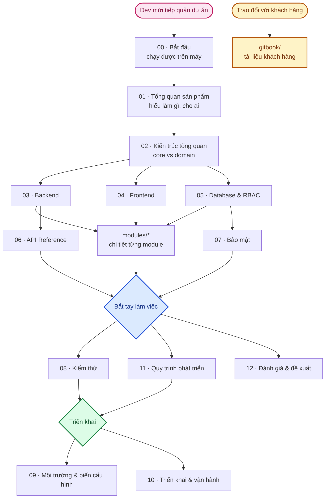

# 📚 Tài liệu dự án FLOWER (Hoa Xinh)

Toàn bộ tài liệu **kỹ thuật** của dự án nằm trong thư mục này, đánh số theo **thứ tự nên đọc**.
Tài liệu **trao đổi với khách hàng** nằm riêng ở [`docs/gitbook/`](gitbook/) (đồng bộ sang GitBook).

> **Quy ước ngôn ngữ**: tài liệu viết bằng tiếng Việt. Thuật ngữ kỹ thuật tiếng Anh (*technical term*)
> được **giữ nguyên** và chú thích nghĩa trong ngoặc ở lần xuất hiện đầu tiên của mỗi tài liệu.
> Xem [CLAUDE.md](../CLAUDE.md) ở thư mục gốc để biết đầy đủ quy ước làm việc.

---

## Lộ trình đọc

### 🚀 Ngày đầu tiên — chạy được dự án trên máy

| # | Tài liệu | Nội dung | Thời gian đọc |
|---|---|---|---|
| 00 | [Bắt đầu](00-bat-dau.md) | Cài đặt, chạy dev, tài khoản mặc định, xử lý lỗi thường gặp | 15 phút |
| 01 | [Tổng quan sản phẩm](01-tong-quan-san-pham.md) | Sản phẩm làm gì, cho ai, phạm vi (*scope*), trạng thái từng tính năng | 15 phút |

### 🏗️ Tuần đầu tiên — hiểu kiến trúc trước khi viết code

| # | Tài liệu | Nội dung | Thời gian đọc |
|---|---|---|---|
| 02 | [Kiến trúc tổng quan](02-kien-truc-tong-quan.md) | Nguyên tắc, chiến lược core/domain, sơ đồ hệ thống | 30 phút |
| 03 | [Backend](03-backend.md) | Modular + MVC, luồng request, error/response chuẩn, cách thêm module | 40 phút |
| 04 | [Frontend](04-frontend.md) | App Router, feature-based, state, bảo vệ route | 30 phút |
| 05 | [Database & RBAC](05-database-va-rbac.md) | Schema, ERD, hệ thống phân quyền | 40 phút |

### 🔧 Khi bắt tay vào việc

| # | Tài liệu | Nội dung |
|---|---|---|
| 06 | [API Reference](06-api-reference.md) | Danh sách endpoint, request/response mẫu, mã lỗi |
| 07 | [Bảo mật](07-bao-mat.md) | Rủi ro & biện pháp theo từng tầng, checklist theo giai đoạn |
| 08 | [Kiểm thử](08-kiem-thu.md) | Chiến lược test, cách chạy, cách viết test mới |
| 09 | [Môi trường & biến cấu hình](09-moi-truong-va-bien-cau-hinh.md) | Từng biến `.env`: ý nghĩa, cách lấy giá trị, bắt buộc hay không |
| 10 | [Triển khai & vận hành](10-trien-khai-van-hanh.md) | dev / staging / production, Docker, CI/CD, backup, giám sát |
| 11 | [Quy trình phát triển](11-quy-trinh-phat-trien.md) | Git flow, convention, Definition of Done, review |
| 12 | [Đánh giá & đề xuất](12-danh-gia-va-de-xuat.md) | Đánh giá source hiện tại + nợ kỹ thuật + đề xuất ưu tiên |

### 📦 Tài liệu chi tiết từng module

| Module | Loại | Tài liệu |
|---|---|---|
| Auth (xác thực) | 🔧 Core | [modules/core-auth.md](modules/core-auth.md) |
| RBAC (users / roles / permissions) | 🔧 Core | [modules/core-rbac.md](modules/core-rbac.md) |
| Files (lưu trữ Cloudinary) | 🔧 Core | [modules/core-files.md](modules/core-files.md) |
| Email | 🔧 Core | [modules/core-email.md](modules/core-email.md) |
| Audit Log (nhật ký thao tác) | 🔧 Core | [modules/core-audit-log.md](modules/core-audit-log.md) |
| Settings (phương thức đăng nhập) | 🔧 Core | [modules/core-settings.md](modules/core-settings.md) |
| Categories (danh mục) | 🌸 Domain | [modules/domain-categories.md](modules/domain-categories.md) |

---

## Bản đồ tài liệu

---

## Tài liệu ngoài thư mục này

| File | Mục đích |
|---|---|
| [`../README.md`](../README.md) | Trang bìa repo — giới thiệu ngắn + link vào đây |
| [`../CHECKLIST.md`](../CHECKLIST.md) | **Bảng theo dõi tiến độ** — cập nhật mỗi khi hoàn thành hạng mục |
| [`../CLAUDE.md`](../CLAUDE.md) | Quy ước làm việc cho AI assistant và dev |
| [`gitbook/`](gitbook/) | Tài liệu cho khách hàng (tiến độ, estimate, rủi ro) — sync GitBook |

---

## Quy ước trong tài liệu

| Ký hiệu | Ý nghĩa |
|---|---|
| 🔧 **Core** | Phần dùng lại được cho dự án PERN khác — copy nguyên khi bắt đầu dự án mới |
| 🌸 **Domain** | Phần đặc thù nghiệp vụ shop hoa — viết mới cho từng dự án |
| ✅ | Đã hoàn thành và đã kiểm chứng |
| 🟡 | Đang làm dở |
| ⬜ | Chưa bắt đầu |
| 🔒 | Permission `is_restricted` — chỉ System Role được gán |

Mọi sơ đồ trong tài liệu này dùng **Mermaid** (render trực tiếp trên GitHub/GitLab/VS Code).
