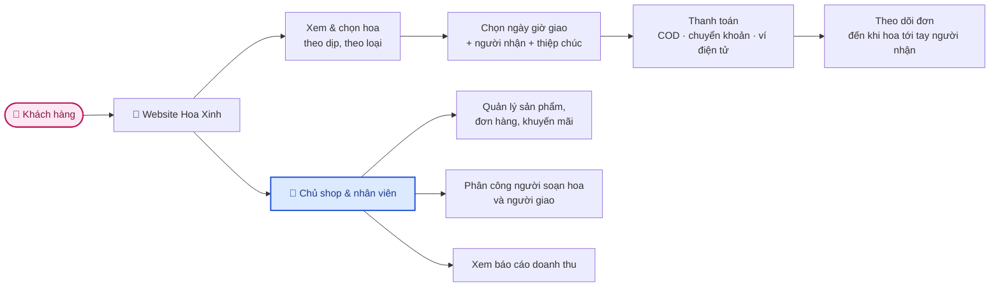
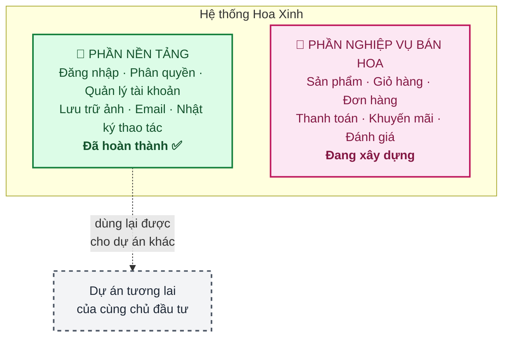

# 1. Giới thiệu sản phẩm

## 1.1. Hoa Xinh là gì

**Hoa Xinh** là website bán hoa tươi trực tuyến, cho phép khách hàng đặt hoa và **chọn chính xác ngày
giờ giao** — điểm khác biệt cốt lõi so với thương mại điện tử thông thường.

## 1.2. Phục vụ ai

| Nhóm người dùng | Họ làm gì trên hệ thống |
|---|---|
| 🛍️ **Khách hàng** | Xem hoa, đặt mua, chọn ngày giờ giao, theo dõi đơn, đánh giá |
| 💬 **Nhân viên bán hàng** | Xử lý đơn, chăm sóc khách, cập nhật trạng thái |
| 💐 **Nhân viên cắm hoa** | Xem danh sách đơn cần soạn, báo "đã soạn xong" |
| 🚚 **Người giao hàng** | Xem đơn được phân công, cập nhật trạng thái giao |
| ⚙️ **Quản lý cửa hàng** | Quản lý sản phẩm, danh mục, khuyến mãi, xem báo cáo |
| 🔐 **Chủ hệ thống** | Toàn quyền: quản lý tài khoản nhân viên, phân quyền, cấu hình |

Mỗi vai trò chỉ thấy và làm được **đúng phần việc của mình** — nhân viên giao hàng không xem được
báo cáo doanh thu, nhân viên bán hàng không xoá được sản phẩm.

## 1.3. Điều gì khiến bán hoa khác bán hàng thường

Đây là những đặc thù đã được tính vào thiết kế ngay từ đầu, không phải bổ sung sau:

| Đặc thù | Vì sao quan trọng | Hệ thống xử lý thế nào |
|---|---|---|
| **Giao đúng ngày giờ** | Hoa sinh nhật giao muộn một ngày là mất hết ý nghĩa | Khách chọn ngày + khung giờ khi đặt; hệ thống dựng lịch giao cho shop |
| **Người đặt ≠ người nhận** | Đặt hoa tặng người khác là chuyện thường, không phải ngoại lệ | Sổ địa chỉ người nhận tách riêng khỏi thông tin tài khoản |
| **Thiệp chúc kèm hoa** | Lời nhắn là một phần của món quà | Mỗi sản phẩm trong đơn có ô nhập lời chúc riêng |
| **Cao điểm theo dịp lễ** | 14/2, 8/3, 20/10 — lượng đơn tăng gấp nhiều lần trong vài ngày | Thiết kế chịu được tải đột biến; có kế hoạch chuẩn bị trước mỗi dịp |
| **Hoa dễ hỏng** | Không tích trữ được như hàng hoá thường | Tồn kho tính theo ngày, không cộng dồn |
| **Đặt theo yêu cầu** | Khách mô tả tông màu, ngân sách — thợ hoa thiết kế | Đơn hàng không bắt buộc gắn với sản phẩm có sẵn |

## 1.4. Công nghệ — nói ngắn gọn

| Câu hỏi thường gặp | Trả lời |
|---|---|
| **Website có lên Google được không?** | Có. Dùng công nghệ Next.js — trang sản phẩm và danh mục được máy chủ dựng sẵn nên Google đọc và xếp hạng tốt |
| **Có dùng được trên điện thoại?** | Có. Giao diện tự co giãn theo màn hình |
| **Dữ liệu có an toàn không?** | Mật khẩu được mã hoá một chiều, phiên đăng nhập có thời hạn ngắn, mọi thao tác quản trị đều được ghi nhật ký. Xem thêm [Rủi ro & phương án](05-rui-ro.md) |
| **Có backup không?** | Có. Sao lưu tự động 2 ngày/lần lên đám mây, giữ 30 ngày |
| **Sau này mở rộng được không?** | Được. Hệ thống thiết kế theo module, thêm chức năng mới không phải viết lại phần cũ |

## 1.5. Một điểm đáng chú ý về đầu tư

Phần nền tảng của hệ thống (đăng nhập, phân quyền, quản lý tài khoản, lưu trữ ảnh, gửi email, nhật ký
thao tác) được xây dựng **tách rời khỏi nghiệp vụ bán hoa**.

**Ý nghĩa với bạn**: nếu sau này bạn muốn làm một website khác (cửa hàng quà tặng, đặt bánh, dịch vụ
khác), phần nền tảng này dùng lại được nguyên vẹn — **tiết kiệm khoảng 6–8 tuần công** cho dự án
tiếp theo. Đây là lựa chọn thiết kế có chủ đích, không phát sinh chi phí thêm cho dự án hiện tại.
