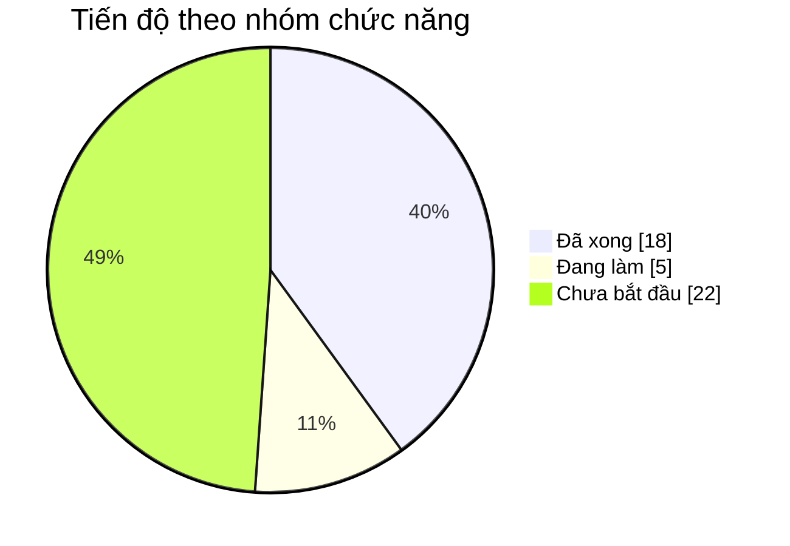
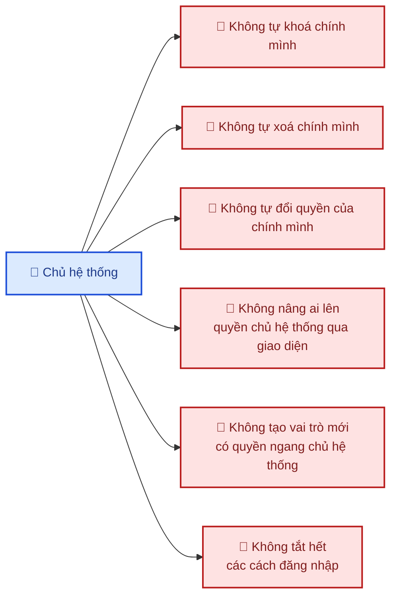

# 2. Phạm vi chức năng

## Cách đọc trạng thái

| Ký hiệu | Nghĩa |
|---|---|
| ✅ | **Đã xong** — đã lập trình, đã kiểm thử tự động, dùng được |
| 🟡 | **Đang làm** — một phần đã xong, chưa dùng được trọn vẹn |
| ⬜ | **Chưa bắt đầu** — đã có thiết kế, chưa lập trình |

---

## 2.1. Tổng quan mức độ hoàn thành

---

## 2.2. Dành cho khách hàng (Storefront)

### Tài khoản

| Chức năng | Trạng thái | Ghi chú |
|---|:---:|---|
| Đăng ký bằng email + mật khẩu | ✅ | |
| Đăng nhập bằng email + mật khẩu | ✅ | |
| Đăng nhập bằng Google | 🟡 | Đã lập trình xong, cần đăng ký ứng dụng với Google — [xem mục cần quyết định](07-trao-doi.md) |
| Đăng nhập bằng liên kết gửi qua email (không cần nhớ mật khẩu) | ✅ | Liên kết dùng 1 lần, hết hạn sau 15 phút |
| Quên mật khẩu / đặt lại mật khẩu | ✅ | |
| Xem & sửa hồ sơ (họ tên, số điện thoại, ảnh đại diện) | ✅ | |
| Đổi mật khẩu | ✅ | |
| **Xem các thiết bị đang đăng nhập & đăng xuất từ xa** | ✅ | Tính năng bảo mật ít website Việt Nam có |
| Sổ địa chỉ người nhận | ⬜ | |
| Lịch sử đơn hàng, đặt lại đơn cũ | ⬜ | |
| Danh sách yêu thích | ⬜ | |
| Nhắc lịch sinh nhật / kỷ niệm người thân | ⬜ | |

### Mua hàng

| Chức năng | Trạng thái | Ghi chú |
|---|:---:|---|
| Trang chủ | 🟡 | Giao diện đã xong, đang dùng dữ liệu mẫu |
| Danh mục sản phẩm | 🟡 | Quản trị đã xong; trang hiển thị cho khách chưa làm |
| Danh sách & tìm kiếm sản phẩm | ⬜ | |
| Lọc theo giá / màu / dịp / loại hoa | ⬜ | |
| Trang chi tiết sản phẩm | ⬜ | |
| Giỏ hàng (kể cả khi chưa đăng nhập) | ⬜ | |
| **Chọn ngày giờ giao hoa** | ⬜ | Chức năng cốt lõi của ngành hoa |
| Thiệp chúc kèm đơn | ⬜ | |
| Đặt hoa theo yêu cầu riêng | ⬜ | |
| Thanh toán khi nhận hàng (COD) | ⬜ | |
| Thanh toán online (VNPay / Momo) | ⬜ | [Cần quyết định chọn cổng nào](07-trao-doi.md) |
| Mã giảm giá | ⬜ | |
| Theo dõi trạng thái đơn hàng | ⬜ | |
| Đánh giá sản phẩm sau khi nhận | ⬜ | |

### Nội dung

| Chức năng | Trạng thái |
|---|:---:|
| Blog (ý nghĩa hoa, mẹo bảo quản) | ⬜ |
| Đăng ký nhận bản tin | ⬜ |
| Trang chính sách (đổi trả, giao hàng, bảo mật) | ⬜ |
| Form liên hệ / câu hỏi thường gặp | ⬜ |

---

## 2.3. Dành cho cửa hàng (Quản trị)

| Chức năng | Trạng thái | Ghi chú |
|---|:---:|---|
| **Quản lý danh mục** (dạng cây, có ảnh) | ✅ | Đã có đầy đủ thêm/sửa/xoá |
| Quản lý sản phẩm | ⬜ | Đang là hạng mục ưu tiên tiếp theo |
| Quản lý đơn hàng | ⬜ | |
| Lịch giao hoa theo ngày | ⬜ | |
| Phân công người soạn hoa / người giao | ⬜ | |
| Quản lý khuyến mãi | ⬜ | |
| Duyệt / ẩn đánh giá | ⬜ | |
| Quản lý banner & blog | ⬜ | |
| Báo cáo doanh thu, sản phẩm bán chạy | ⬜ | |
| **Upload & lưu trữ ảnh** | ✅ | Ảnh lưu trên đám mây, tự dọn ảnh không dùng đến |
| Màn hình quản lý kho ảnh (theo thư mục) | 🟡 | Chức năng nền đã có, giao diện chưa làm |

---

## 2.4. Dành cho chủ hệ thống

| Chức năng | Trạng thái | Ghi chú |
|---|:---:|---|
| **Quản lý tài khoản** (khoá / mở khoá / xoá) | ✅ | |
| **Đặt lại mật khẩu hộ người dùng** | ✅ | Mật khẩu mới gửi qua email, chủ hệ thống không xem được |
| **Phân quyền cho nhân viên** | ✅ | |
| **Tự tạo vai trò mới** (VD: kế toán, marketing) | ✅ | Không cần lập trình viên can thiệp |
| **Bật / tắt từng cách đăng nhập** | ✅ | Hệ thống tự chặn nếu tắt hết |
| **Nhật ký thao tác** (ai làm gì, lúc nào) | 🟡 | Đã ghi đầy đủ; màn hình tra cứu chưa làm |
| Cấu hình chung (tên shop, logo, múi giờ) | ⬜ | |

### Các quy tắc an toàn đã được cài đặt sẵn

Những quy tắc này được thực thi ở **máy chủ**, không thể lách bằng cách can thiệp trình duyệt:

**Vì sao cần những quy tắc này?** Chúng ngăn các sự cố vận hành phổ biến: chủ hệ thống lỡ tay tự
khoá tài khoản của mình rồi không vào lại được; một nhân viên được cấp quyền quá tay rồi tự nâng
mình lên toàn quyền; hoặc tắt nhầm hết các cách đăng nhập khiến cả hệ thống bị khoá cứng.

---

## 2.5. Phần kỹ thuật nền (không nhìn thấy nhưng cần có)

| Hạng mục | Trạng thái | Ý nghĩa với bạn |
|---|:---:|---|
| Sao lưu dữ liệu tự động 2 ngày/lần | ✅ | Mất dữ liệu vẫn khôi phục được |
| Tự xoá bản sao lưu cũ hơn 30 ngày | ✅ | Không phát sinh chi phí lưu trữ vô hạn |
| Tự dọn ảnh không còn dùng | ✅ | Tiết kiệm dung lượng |
| Gửi email tự động | ✅ | Cần đăng ký domain — [xem mục cần quyết định](07-trao-doi.md) |
| Ghi nhật ký lỗi để tra cứu sự cố | ✅ | Báo lỗi kèm mã là tra được nguyên nhân |
| **435 bài kiểm thử tự động** | ✅ | Sửa chỗ này không làm hỏng chỗ kia mà không ai biết |
| Kiểm thử giao diện tự động | ✅ | Mô phỏng thao tác người dùng thật |
| Tự động kiểm tra chất lượng khi lập trình viên nộp code | ⬜ | Sẽ làm ở giai đoạn chuẩn bị vận hành |
| Đưa hệ thống lên máy chủ thật | ⬜ | Giai đoạn cuối |
| Giám sát hệ thống & cảnh báo sự cố | ⬜ | Giai đoạn cuối |

---

## 2.6. Ngoài phạm vi (nếu cần sẽ báo giá riêng)

Các mục sau **không** nằm trong phạm vi đã thống nhất. Ghi ra đây để hai bên cùng rõ, tránh hiểu nhầm
về sau:

| Hạng mục | Ghi chú |
|---|---|
| Ứng dụng di động riêng (iOS / Android) | Website đã tối ưu cho điện thoại; ứng dụng riêng là dự án tách biệt |
| Tích hợp phần mềm kế toán / hoá đơn điện tử | Cần khảo sát phần mềm cụ thể bạn đang dùng |
| Đa ngôn ngữ (tiếng Anh) | Hiện chỉ tiếng Việt |
| Nhiều chi nhánh / nhiều kho | Thiết kế hiện tại cho một cửa hàng |
| Chatbot tư vấn tự động | Có thể thêm ở giai đoạn sau |
| Thiết kế logo / bộ nhận diện thương hiệu | Công việc thiết kế, không phải lập trình |
| Viết nội dung sản phẩm, chụp ảnh hoa | Cửa hàng cung cấp |
| Chạy quảng cáo, tối ưu SEO nâng cao | Hệ thống đã hỗ trợ sẵn về mặt kỹ thuật |
