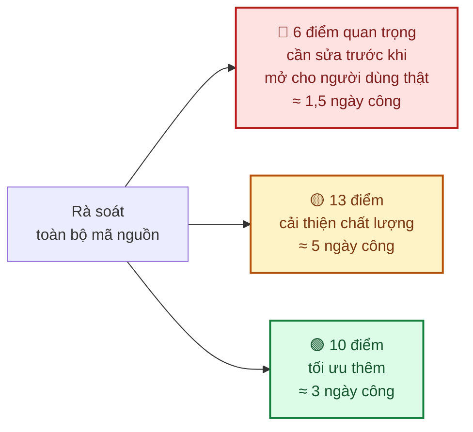
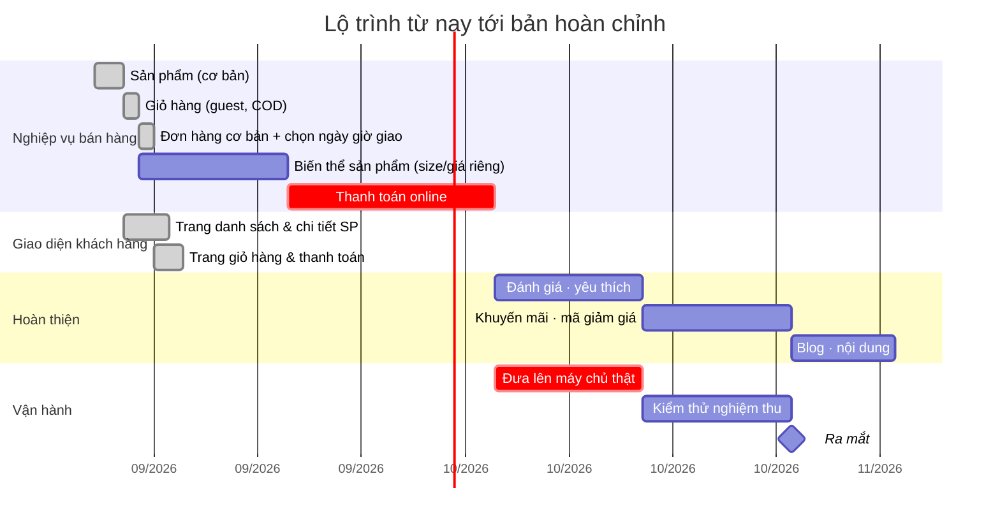

# 3. Tiến độ dự án

> **Cập nhật lần cuối: 11/09/2026** · Lần cập nhật tiếp theo: 23/09/2026

---

## 3.1. Tóm tắt

| Chỉ số | Giá trị |
|---|---|
| Giai đoạn hiện tại | **Phase 5 — Xây dựng nghiệp vụ bán hàng** |
| Hoàn thành tổng thể | **~42%** |
| Nền tảng kỹ thuật | ✅ Đã xong và đã kiểm thử |
| Nghiệp vụ bán hàng | 🟡 Danh mục, sản phẩm, giỏ hàng, đặt hàng (COD) đã dùng được — chưa thanh toán online |
| Số bài kiểm thử tự động đang chạy | **746** (backend 602 · giao diện 144) + ~30 kịch bản mô phỏng người dùng |
| Dự kiến bản dùng thử (MVP) | **Cuối tháng 12/2026** |
| Dự kiến bản hoàn chỉnh | **Cuối tháng 2/2027** |

---

## 3.2. Bảy giai đoạn

```mermaid
flowchart LR
    P1["1️⃣ Nền tảng<br/>kỹ thuật<br/>✅ XONG"] --> P2["2️⃣ Đăng nhập<br/>& tài khoản<br/>✅ XONG"]
    P2 --> P3["3️⃣ Phân quyền<br/>nhân viên<br/>✅ XONG"]
    P3 --> P4["4️⃣ Hạ tầng<br/>ảnh · email<br/>🟡 ĐANG LÀM"]
    P4 --> P5["5️⃣ Nghiệp vụ<br/>bán hoa<br/>🟡 ĐANG LÀM"]
    P5 --> P6["6️⃣ Kiểm thử<br/>& chất lượng<br/>🟡 ĐANG LÀM"]
    P6 --> P7["7️⃣ Đưa lên<br/>máy chủ thật<br/>⬜ CHƯA"]

    style P1 fill:#dcfce7,stroke:#15803d,stroke-width:2px,color:#14532d
    style P2 fill:#dcfce7,stroke:#15803d,stroke-width:2px,color:#14532d
    style P3 fill:#dcfce7,stroke:#15803d,stroke-width:2px,color:#14532d
    style P4 fill:#fef3c7,stroke:#b45309,stroke-width:2px,color:#78350f
    style P5 fill:#fef3c7,stroke:#b45309,stroke-width:2px,color:#78350f
    style P6 fill:#fef3c7,stroke:#b45309,stroke-width:2px,color:#78350f
    style P7 fill:#f3f4f6,stroke:#4b5563,stroke-width:2px,color:#1f2937
```

| Giai đoạn | Nội dung | Trạng thái | Hoàn thành |
|---|---|:---:|---|
| 1 — Nền tảng kỹ thuật | Khung hệ thống, chuẩn xử lý lỗi, cấu hình | ✅ | 08/2026 |
| 2 — Đăng nhập & tài khoản | 3 cách đăng nhập, quản lý phiên, quản lý thiết bị | ✅ | 08/2026 |
| 3 — Phân quyền | Vai trò, quyền hạn, nhật ký thao tác | ✅ | 09/2026 |
| 4 — Hạ tầng | Lưu trữ ảnh, gửi email, tác vụ tự động | 🟡 85% | 09/2026 |
| 5 — Nghiệp vụ bán hoa | Sản phẩm, giỏ hàng, đơn hàng, thanh toán | 🟡 20% | 12/2026 |
| 6 — Kiểm thử & chất lượng | Kiểm thử tự động, rà soát bảo mật | 🟡 79% | 01/2027 |
| 7 — Vận hành | Máy chủ, tự động triển khai, giám sát | ⬜ | 02/2027 |

---

## 3.3. Đã làm được gì trong kỳ vừa qua (26/08 – 09/09)

| Việc | Kết quả |
|---|---|
| **Bổ sung 577 bài kiểm thử tự động** | Toàn bộ phần nền tảng nay được kiểm tra tự động mỗi lần sửa code |
| **Bổ sung ~30 kịch bản mô phỏng người dùng thật** | Máy tự mở trình duyệt, đăng nhập, thao tác và kiểm tra kết quả |
| **Viết lại toàn bộ tài liệu kỹ thuật** | 13 tài liệu chính + 7 tài liệu chi tiết theo module, có sơ đồ minh hoạ |
| **Rà soát toàn bộ mã nguồn** | Phát hiện 29 điểm cần cải thiện, đã xếp thứ tự ưu tiên và ước lượng |
| Hoàn thiện quản lý danh mục sản phẩm | Thêm/sửa/xoá danh mục dạng cây, có ảnh |
| Bổ sung phân trang danh sách người dùng | |
| Chuẩn hoá lại tài liệu, gom về một nơi | Bạn đang đọc kết quả của việc này |

### Kết quả rà soát mã nguồn

**Về 6 điểm quan trọng**: đây là các lỗ hổng liên quan tới phiên đăng nhập — ví dụ *đổi mật khẩu
xong nhưng thiết bị cũ vẫn đăng nhập được*. Hiện chưa gây rủi ro vì hệ thống chưa mở cho người dùng
thật.

> ✅ **Cập nhật 10/09/2026**: cả 6 điểm đã được xử lý xong, sớm hơn kế hoạch ban đầu (đặt mục tiêu
> đầu kỳ tới). Có test tự động cho từng điểm và đã kiểm chứng thủ công trên hệ thống thật. Chi tiết
> kỹ thuật có trong tài liệu nội bộ của đội phát triển.

> Đây là kết quả của việc **chủ động rà soát**, không phải sự cố phát sinh. Tìm ra sớm khi hệ thống
> chưa có người dùng thật là thời điểm tốt nhất để sửa.

### Cập nhật bổ sung (10/09 – 11/09/2026)

Ngoài 6 điểm quan trọng ở trên, đội phát triển tranh thủ xử lý dứt điểm **toàn bộ** 23 điểm còn lại
của đợt rà soát (13 điểm 🟡 + 10 điểm 🟢) — sớm hơn nhiều so với kế hoạch ban đầu (vốn dự kiến rải
ra nhiều tuần) — và làm thêm vài việc ngoài phạm vi rà soát ban đầu:

| Việc | Kết quả |
|---|---|
| Xử lý dứt điểm 23/23 điểm cải thiện còn lại từ đợt rà soát | Toàn bộ danh sách nợ kỹ thuật đã phát hiện — không còn điểm nào đang mở |
| Khách đã đăng nhập xem được **lịch sử đơn hàng của chính mình** | Không cần lưu lại link xác nhận từng đơn như trước |
| Màn hình **tra cứu nhật ký thao tác** cho quản trị viên | Xem được ai làm gì, khi nào, từ đâu — phục vụ đối soát khi cần |
| **Tài liệu API tự động** (chuẩn OpenAPI/Swagger), sinh trực tiếp từ code | Đội kỹ thuật đối tác/tích hợp sau này tra cứu API chính xác, luôn khớp với hệ thống thật đang chạy |
| Tách hạ tầng để sẵn sàng chạy **nhiều máy chủ song song** khi lượng khách tăng cao (dịp lễ, Tết) | Chuẩn bị trước cho lúc cần mở rộng, không phải làm lại kiến trúc giữa chừng |

---

## 3.4. Kế hoạch kỳ tới (09/09 – 23/09)

| Việc | Ước lượng | Kết quả bạn sẽ thấy |
|---|---|---|
| ~~Sửa 6 điểm quan trọng từ đợt rà soát~~ | 1,5 ngày | ✅ Đã xong (10/09/2026) — an toàn hơn |
| Thiết lập kiểm tra tự động khi nộp code (CI/CD) | 2 ngày | ⬜ Chưa làm — chất lượng ổn định hơn theo thời gian |
| ~~**Xây dựng module Sản phẩm**~~ (thêm/sửa/xoá, nhiều ảnh — không quản lý tồn kho vì hoa tươi làm theo đơn) | 6 ngày | ✅ Đã xong (10/09/2026) — **có thể nhập sản phẩm thật vào hệ thống** |
| ~~Màn hình tra cứu nhật ký thao tác~~ | 1 ngày | ✅ Đã xong (11/09/2026) |

**Mốc quan trọng cuối kỳ — đã đạt sớm hơn dự kiến**: bạn đã đăng nhập được vào khu quản trị và
**nhập sản phẩm thật vào hệ thống** — hệ thống hiện chứa dữ liệu thật của cửa hàng thay vì chỉ có
dữ liệu mẫu. Việc còn lại trong kỳ này chỉ còn CI/CD (kiểm tra tự động khi nộp code).

---

## 3.5. Lộ trình tới khi ra mắt

### Các mốc chính

| Mốc | Dự kiến | Bạn làm được gì |
|---|---|---|
| **Nhập sản phẩm thật** | ✅ Đã đạt (10/09/2026) | Đưa danh mục hoa thật vào hệ thống |
| **Xem thử toàn bộ trang bán hàng** | ✅ Đã đạt (10/09/2026) | Duyệt hoa như khách hàng thật (trang chủ, danh mục, chi tiết sản phẩm) |
| **Đặt thử một đơn hàng đầu-cuối** | ✅ Đã đạt (10/09/2026) | Giỏ hàng → chọn ngày/khung giờ giao → thanh toán COD → xác nhận, cửa hàng xử lý qua `/admin/orders` — **chưa có** thanh toán online |
| **Bản dùng thử (MVP) trên máy chủ thật** | Cuối 12/2026 | Mời người quen dùng thử, thu phản hồi |
| **Bản hoàn chỉnh** | Cuối 02/2027 | Mở bán chính thức |

> Ba mốc đầu đã đạt sớm hơn 1–2 tháng so với kế hoạch ban đầu — module Sản phẩm + Orders (giai đoạn
> cơ bản) hoàn thành nhanh hơn dự kiến. Mốc tiếp theo (MVP) vẫn giữ nguyên **cuối 12/2026** vì còn phụ
> thuộc các việc lớn chưa làm: thanh toán online, đưa lên máy chủ thật (Phase 7, hiện 0%).

> ⚠️ **Lưu ý về mốc thời gian**: các mốc trên giả định 3 điều — (1) không phát sinh yêu cầu mới ngoài
> phạm vi, (2) các mục ở [Trao đổi & quyết định](07-trao-doi.md) được chốt đúng hạn, (3) đội phát
> triển duy trì nhân sự như hiện tại. Rủi ro làm chậm tiến độ được liệt kê tại
> [Rủi ro & phương án](05-rui-ro.md).

---

## 3.6. Điều cần bạn hỗ trợ

| Việc | Cần trước ngày | Vì sao |
|---|---|---|
| Chốt cổng thanh toán (VNPay / Momo / cả hai) | **30/09/2026** | Thủ tục đăng ký với nhà cung cấp mất 2–4 tuần |
| Cung cấp tên miền (domain) | **30/09/2026** | Cần để gửi email không bị vào thư mục spam |
| Cung cấp danh sách sản phẩm mẫu (10–20 loại hoa, có ảnh) | **15/10/2026** | Để dựng và kiểm thử trang bán hàng bằng dữ liệu thật |
| Chốt chính sách giao hàng (khu vực, phí, khung giờ) | **31/10/2026** | Ảnh hưởng trực tiếp tới thiết kế phần đặt hàng |

Chi tiết từng mục: [Trao đổi & quyết định](07-trao-doi.md).
