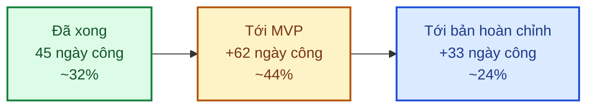
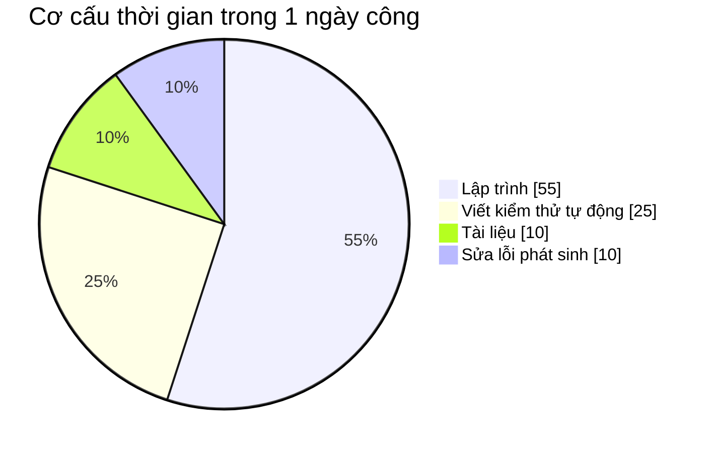

# 4. Ước lượng công việc

> **Đơn vị**: *ngày công* = 1 người làm việc 1 ngày (8 giờ). Số liệu tính cho **1 lập trình viên
> full-stack** làm việc toàn thời gian.
>
> Ước lượng là **dự báo, không phải cam kết**. Các yếu tố làm sai lệch được nêu ở [§4.5](#45-yếu-tố-làm-thay-đổi-ước-lượng).

---

## 4.1. Tổng quan

| | Ngày công | Quy đổi |
|---|---:|---|
| **Đã thực hiện** | ~45 | ~9 tuần |
| **Còn lại tới bản dùng thử (MVP)** | **62** | **~12,5 tuần** |
| **Còn lại tới bản hoàn chỉnh** | **95** | **~19 tuần** |

---

## 4.2. Chi tiết — tới bản dùng thử (MVP)

Bản MVP = khách hàng có thể **đặt hoa và thanh toán được**, cửa hàng **xử lý được đơn**.

### Nghiệp vụ bán hàng — 38 ngày công

| Hạng mục | Ngày công | Bao gồm |
|---|---:|---|
| **Sản phẩm** | 6 | Thêm/sửa/xoá, nhiều ảnh, biến thể kích cỡ–giá, tồn kho, danh mục |
| **Giỏ hàng** | 4 | Thêm/sửa/xoá, giữ giỏ khi chưa đăng nhập, tính tiền |
| **Đơn hàng** | 8 | Đặt hàng, **chọn ngày giờ giao**, người nhận, thiệp chúc, trạng thái đơn |
| **Thanh toán** | 7 | COD, chuyển khoản, tích hợp 1 cổng online, xác thực giao dịch |
| **Quản lý đơn cho cửa hàng** | 5 | Danh sách, lọc, cập nhật trạng thái, in phiếu giao, phân công |
| **Lịch giao hoa** | 3 | Xem đơn theo ngày, sắp xếp theo khung giờ |
| **Đánh giá & yêu thích** | 3 | Đánh giá sau khi nhận hàng, duyệt đánh giá |
| **Sổ địa chỉ người nhận** | 2 | |

### Giao diện khách hàng — 13 ngày công

| Hạng mục | Ngày công |
|---|---:|
| Trang danh sách sản phẩm + bộ lọc + tìm kiếm | 5 |
| Trang chi tiết sản phẩm | 3 |
| Trang giỏ hàng + thanh toán | 4 |
| Hoàn thiện trang chủ với dữ liệu thật | 1 |

### Kỹ thuật & vận hành — 11 ngày công

| Hạng mục | Ngày công | Ghi chú |
|---|---:|---|
| Sửa 6 điểm quan trọng từ đợt rà soát | 1,5 | Bảo mật phiên đăng nhập |
| Kiểm tra tự động khi nộp code | 2 | Giữ chất lượng ổn định lâu dài |
| Cải thiện chất lượng mã nguồn | 5 | 13 điểm mức trung bình |
| Đưa lên máy chủ thật + tên miền + bảo mật HTTPS | 2,5 | |

**Cộng: 62 ngày công ≈ 12,5 tuần làm việc**

---

## 4.3. Chi tiết — từ MVP tới bản hoàn chỉnh

| Hạng mục | Ngày công | Ghi chú |
|---|---:|---|
| Khuyến mãi & mã giảm giá | 5 | Gồm chương trình theo dịp lễ |
| Đặt hoa theo yêu cầu riêng | 4 | Khách mô tả tông màu, ngân sách |
| Nhắc lịch sinh nhật / kỷ niệm | 3 | Gửi email nhắc trước vài ngày |
| Blog & bản tin | 4 | |
| Màn hình quản lý kho ảnh | 3 | Cây thư mục, xem dạng lưới/danh sách |
| Báo cáo & thống kê | 4 | Doanh thu, sản phẩm bán chạy, biểu đồ dịp lễ |
| Thông báo thời gian thực trạng thái đơn | 3 | |
| Tối ưu tốc độ & SEO | 3 | |
| Kiểm thử nghiệm thu & sửa lỗi | 4 | |

**Cộng: 33 ngày công ≈ 6,5 tuần**

---

## 4.4. Cơ sở tính ước lượng

Con số không lấy từ cảm tính — dựa trên **tốc độ thực tế đã đo được** của dự án này:

| Căn cứ | Số liệu |
|---|---|
| Module danh mục (đã hoàn thành) | 2,5 ngày cho một module quản trị đầy đủ kèm kiểm thử |
| Module đăng nhập (đã hoàn thành) | 6 ngày cho 3 cách đăng nhập + quản lý phiên |
| Module phân quyền (đã hoàn thành) | 7 ngày cho vai trò + quyền + nhật ký + giao diện |

Từ đó suy ra: module đơn giản ≈ **2–3 ngày**, module phức tạp có nhiều ràng buộc nghiệp vụ
(đơn hàng, thanh toán) ≈ **7–8 ngày**.

**Mỗi ước lượng đã bao gồm**: lập trình + viết kiểm thử tự động + cập nhật tài liệu + sửa lỗi phát
sinh trong quá trình làm. Đây là lý do con số nhìn cao hơn "thời gian gõ code thuần" — nhưng cũng là
lý do phần đã làm xong không phải quay lại sửa.

---

## 4.5. Yếu tố làm thay đổi ước lượng

| Yếu tố | Ảnh hưởng | Cách kiểm soát |
|---|---|---|
| **Quyết định muộn** (cổng thanh toán, chính sách giao hàng) | +1 đến +3 tuần | Xem hạn chót ở [Trao đổi & quyết định](07-trao-doi.md) |
| **Yêu cầu mới ngoài phạm vi** | Tuỳ quy mô | Đội phát triển báo ước lượng bổ sung **trước khi** thực hiện |
| **Thủ tục với bên thứ ba** (đăng ký cổng thanh toán) | +2 đến +4 tuần | Nộp hồ sơ sớm, làm song song với lập trình |
| **Thay đổi thiết kế giao diện sau khi đã lập trình** | +3 đến +10 ngày/màn hình | Duyệt thiết kế trước khi lập trình |
| **Nghỉ lễ, ốm đau** | Theo thực tế | Đã tính hệ số ~10% dự phòng |

### Cách đọc con số cho đúng

| Mức tin cậy | Ý nghĩa |
|---|---|
| 🟢 **Cao** (±10%) | Hạng mục tương tự đã làm rồi: sản phẩm, giỏ hàng, đánh giá |
| 🟡 **Trung bình** (±25%) | Có ràng buộc nghiệp vụ phức tạp: đơn hàng + lịch giao |
| 🔴 **Thấp** (±50%) | Phụ thuộc bên thứ ba: **tích hợp cổng thanh toán** |

> Riêng **thanh toán online** là mục khó ước lượng nhất — thời gian phụ thuộc vào tài liệu kỹ thuật
> và tốc độ hỗ trợ của nhà cung cấp cổng thanh toán, nằm ngoài kiểm soát của đội phát triển.
> Xem [Rủi ro & phương án](05-rui-ro.md).

---

## 4.6. Chi phí vận hành hằng tháng (dự kiến)

Ngoài chi phí phát triển, hệ thống cần các dịch vụ sau khi chạy thật:

| Dịch vụ | Dùng để làm gì | Chi phí/tháng | Ghi chú |
|---|---|---|---|
| **Máy chủ** (VPS hoặc nền tảng đám mây) | Chạy website và hệ thống | 250.000 – 700.000 đ | Gói nhỏ đủ cho giai đoạn đầu |
| **Cơ sở dữ liệu** | Lưu đơn hàng, khách hàng, sản phẩm | 0 – 500.000 đ | Có gói miễn phí cho giai đoạn đầu |
| **Lưu trữ ảnh** (Cloudinary) | Ảnh sản phẩm | 0 – 250.000 đ | Có gói miễn phí cho giai đoạn đầu |
| **Gửi email** (Resend) | Email xác nhận đơn, đặt lại mật khẩu | 0 – 500.000 đ | Miễn phí 3.000 email/tháng |
| **Tên miền** | Địa chỉ website | ~25.000 đ | ~300.000 đ/năm |
| **Cổng thanh toán** | Nhận tiền online | Theo % giao dịch | Thường 1,5–2,5%/giao dịch |
| **Tổng ước tính** | | **~300.000 – 2.000.000 đ/tháng** | Tăng dần theo lượng truy cập |

> Giai đoạn đầu (ít khách) có thể vận hành với chi phí **dưới 500.000 đ/tháng** nhờ các gói miễn phí.
> Chi phí tăng theo lượng đơn hàng — nghĩa là tăng cùng doanh thu.

---

## 4.7. Cột mốc thanh toán (đề xuất)

Nếu hai bên làm việc theo hợp đồng chia giai đoạn, đề xuất mốc nghiệm thu như sau:

| Mốc | Nội dung nghiệm thu | % công việc |
|---|---|---|
| ✅ **Mốc 1** — đã đạt | Nền tảng: đăng nhập, phân quyền, quản lý tài khoản, kiểm thử tự động | 32% |
| **Mốc 2** — cuối 10/2026 | Sản phẩm + giỏ hàng + trang bán hàng cho khách | 25% |
| **Mốc 3** — cuối 12/2026 | Đơn hàng + thanh toán + bản dùng thử trên máy chủ thật | 25% |
| **Mốc 4** — cuối 02/2027 | Khuyến mãi, đánh giá, blog, báo cáo, bàn giao hoàn chỉnh | 18% |

Mỗi mốc đều có thể **kiểm chứng được**: bạn đăng nhập và tự thao tác trên hệ thống thật.
