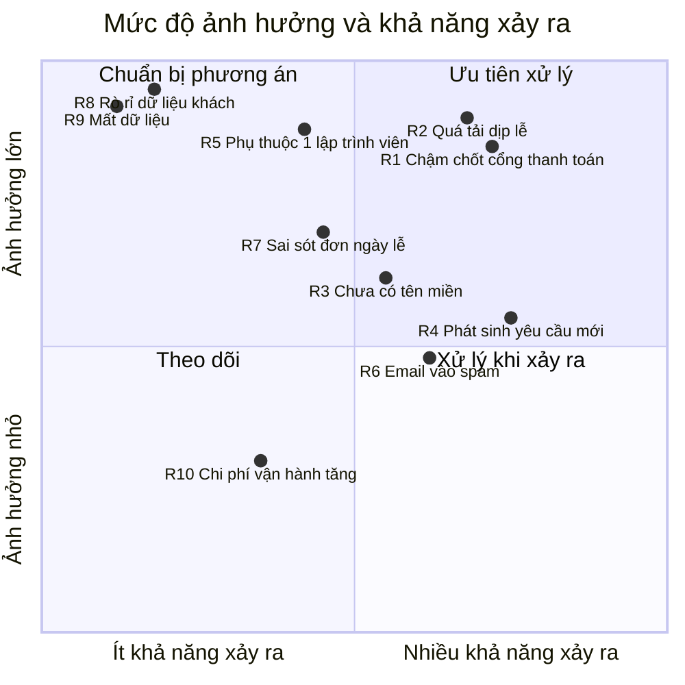

# 5. Rủi ro & phương án xử lý

Trang này liệt kê những gì **có thể làm chậm tiến độ, tăng chi phí, hoặc gây sự cố khi vận hành** —
kèm phương án đã chuẩn bị cho từng trường hợp.

> Nêu rủi ro sớm không phải để bi quan, mà để hai bên cùng chuẩn bị. Rủi ro đã biết và có phương án
> thì không còn là rủi ro — nó là kế hoạch.

---

## 5.1. Bản đồ rủi ro

---

## 5.2. Rủi ro tiến độ

### 🔴 R1 · Chậm chốt cổng thanh toán

| | |
|---|---|
| **Rủi ro** | Đăng ký VNPay/Momo cần hồ sơ doanh nghiệp và mất **2–4 tuần** xét duyệt. Chưa chốt được nhà cung cấp thì chưa nộp hồ sơ được. |
| **Ảnh hưởng** | Chậm mốc MVP **2–4 tuần** |
| **Khả năng** | Cao — hiện chưa có quyết định |
| **Phương án** | 1. Chốt nhà cung cấp trước **30/09/2026** và nộp hồ sơ ngay. 2. **Làm song song**: đội phát triển viết phần thanh toán theo chuẩn chung, tới khi có tài khoản chỉ cần cắm thông tin vào. 3. **Phương án dự phòng**: ra mắt MVP chỉ với **COD + chuyển khoản thủ công** — vẫn bán hàng được, bổ sung thanh toán online sau. |
| **Cần bạn** | Chốt nhà cung cấp — [xem mục quyết định](07-trao-doi.md) |

### 🟡 R2 · Yêu cầu phát sinh ngoài phạm vi

| | |
|---|---|
| **Rủi ro** | Trong quá trình dùng thử nảy ra ý tưởng mới ("thêm tích điểm", "thêm đặt hoa định kỳ"). Đây là chuyện **bình thường và tốt** — nhưng nếu chèn vào giữa chừng sẽ đẩy lùi mọi mốc phía sau. |
| **Ảnh hưởng** | Tuỳ quy mô yêu cầu |
| **Khả năng** | Cao |
| **Phương án** | 1. Mọi yêu cầu mới ghi vào [Trao đổi & quyết định](07-trao-doi.md). 2. Đội phát triển báo **ước lượng bổ sung** trước khi làm. 3. Bạn quyết định: làm ngay (dời mốc) hay đưa vào giai đoạn 2 (giữ mốc). 4. **Không âm thầm làm thêm rồi báo trễ hạn.** |

### 🟡 R3 · Phụ thuộc vào một lập trình viên

| | |
|---|---|
| **Rủi ro** | Dự án hiện do một người thực hiện. Người này nghỉ dài ngày hoặc rời dự án → công việc dừng. |
| **Ảnh hưởng** | Rất lớn nếu xảy ra |
| **Khả năng** | Thấp–trung bình |
| **Phương án đã thực hiện** | 1. ✅ **Tài liệu kỹ thuật đầy đủ** — 20 tài liệu có sơ đồ, đủ để người mới tiếp quản trong **1–2 tuần** thay vì 1–2 tháng. 2. ✅ **436 bài kiểm thử tự động** — người mới sửa code biết ngay có làm hỏng gì không. 3. ✅ **Quy ước thống nhất** — mọi module viết theo cùng một khuôn mẫu. 4. ✅ **Mã nguồn có chú thích giải thích lý do**, không chỉ mô tả code làm gì. |
| **Còn nên làm** | Cân nhắc bổ sung người thứ hai từ giai đoạn 2 để giảm phụ thuộc |

> Đây là lý do đội phát triển đầu tư mạnh vào tài liệu và kiểm thử ngay từ đầu, thay vì để "làm sau" —
> nó biến rủi ro lớn nhất của dự án nhỏ thành rủi ro có thể quản lý được.

### 🟡 R4 · Chưa có tên miền riêng

| | |
|---|---|
| **Rủi ro** | Không có tên miền thì không cấu hình được dịch vụ gửi email chuyên nghiệp (Resend yêu cầu domain đã xác minh). |
| **Ảnh hưởng** | Email xác nhận đơn hàng, đặt lại mật khẩu **dễ vào thư mục spam** |
| **Khả năng** | Trung bình |
| **Phương án** | 1. Mua tên miền sớm (~300.000 đ/năm), cấu hình mất ~1 ngày. 2. **Tạm thời**: dùng Gmail SMTP — chạy được nhưng dễ vào spam và giới hạn ~500 email/ngày. 3. Hệ thống đã thiết kế để **đổi qua lại giữa hai cách chỉ bằng một dòng cấu hình**, không phải sửa code. |

---

## 5.3. Rủi ro vận hành

### 🔴 R5 · Quá tải vào dịp lễ

| | |
|---|---|
| **Rủi ro** | 14/2, 8/3, 20/10 — lượng truy cập và đơn hàng tăng gấp nhiều lần trong 2–3 ngày. Website chậm hoặc sập đúng lúc cần nhất. |
| **Ảnh hưởng** | **Rất lớn** — mất doanh thu đúng ngày cao điểm, ảnh hưởng uy tín |
| **Khả năng** | Cao nếu không chuẩn bị |
| **Phương án** | **Trước 2 tuần**: chạy thử tải mô phỏng lượng khách cao điểm để tìm điểm nghẽn. **Trước 3 ngày**: tăng năng lực máy chủ (chi phí tăng tạm thời, giảm lại sau lễ). **Trước 1 tuần**: kiểm tra kỹ phần trừ tồn kho khi nhiều người mua cùng lúc. **Trước 3 ngày**: kiểm tra hạn mức gửi email của nhà cung cấp. **Trong ngày**: có người trực theo dõi hệ thống. |
| **Đã chuẩn bị** | Kiến trúc cho phép tăng số máy chủ mà không phải sửa code |

### 🟡 R6 · Sai sót đơn hàng ngày lễ

| | |
|---|---|
| **Rủi ro** | Ngày lễ nhiều đơn, nhân viên thao tác nhanh → nhầm địa chỉ, nhầm giờ giao, sót đơn. |
| **Ảnh hưởng** | Khiếu nại, hoàn tiền, mất khách |
| **Khả năng** | Trung bình–cao |
| **Phương án** | 1. Màn hình **lịch giao hoa theo ngày** — nhìn một lần thấy hết đơn phải giao hôm nay. 2. **Nhật ký thao tác** — truy được ai đã sửa gì, lúc nào. 3. Đơn chuyển trạng thái theo quy trình cố định, không nhảy cóc tuỳ tiện. 4. In phiếu giao hàng để nhân viên đối chiếu. |

### 🟡 R7 · Email vào thư mục spam

| | |
|---|---|
| **Rủi ro** | Email xác nhận đơn hàng vào spam → khách tưởng đặt hàng không thành công. |
| **Ảnh hưởng** | Khách gọi hỏi, mất niềm tin, có thể đặt trùng |
| **Khả năng** | Cao nếu chưa cấu hình domain đúng |
| **Phương án** | 1. Cấu hình đầy đủ xác thực email cho domain (SPF, DKIM, DMARC). 2. Dùng dịch vụ gửi email chuyên nghiệp thay vì Gmail. 3. ✅ **Đã có**: hệ thống ghi nhật ký mọi email gửi đi — tra được email nào gửi thành công, email nào thất bại và vì sao. 4. Hiển thị thông tin đơn hàng ngay trên website sau khi đặt, không phụ thuộc hoàn toàn vào email. |

---

## 5.4. Rủi ro bảo mật & dữ liệu

### 🔴 R8 · Rò rỉ thông tin khách hàng

| | |
|---|---|
| **Rủi ro** | Dữ liệu khách (tên, số điện thoại, địa chỉ) bị lộ. |
| **Ảnh hưởng** | **Nghiêm trọng** — vi phạm Nghị định 13/2023/NĐ-CP về bảo vệ dữ liệu cá nhân, tổn hại uy tín |
| **Khả năng** | Thấp |
| **Đã có** | ✅ Mật khẩu mã hoá một chiều (không ai đọc lại được, kể cả quản trị viên) ✅ Phiên đăng nhập hết hạn ngắn, thu hồi được từ xa ✅ Mọi dữ liệu nhập vào đều được kiểm tra chặt trước khi xử lý ✅ Phân quyền chặt — nhân viên chỉ thấy phần việc của mình ✅ Nhật ký mọi thao tác nhạy cảm ✅ Chống dò tài khoản (không tiết lộ email nào đã đăng ký) |
| **Còn phải làm** | Bật HTTPS trên máy chủ thật · Xác thực 2 lớp cho tài khoản quản trị · Mã hoá bản sao lưu · Rà soát bảo mật độc lập trước khi mở rộng |

### 🔴 R9 · Mất dữ liệu

| | |
|---|---|
| **Rủi ro** | Lỗi máy chủ, thao tác xoá nhầm, sự cố nhà cung cấp. |
| **Ảnh hưởng** | **Rất lớn** — mất đơn hàng, mất lịch sử khách hàng |
| **Khả năng** | Thấp |
| **Đã có** | ✅ Sao lưu tự động **2 ngày/lần** lên đám mây ✅ Giữ 30 bản gần nhất, tự xoá bản cũ ✅ Xoá tài khoản là **xoá mềm** — dữ liệu vẫn còn, khôi phục được ✅ Ảnh lưu tách khỏi máy chủ (mất máy chủ không mất ảnh) |
| **Còn phải làm** | **Diễn tập khôi phục mỗi quý** — bản sao lưu chưa từng thử khôi phục thì chưa chắc dùng được Mã hoá bản sao lưu |

> **Cam kết vận hành**: khi hệ thống chạy thật, mất tối đa **2 ngày dữ liệu** trong trường hợp xấu
> nhất. Cần chặt hơn (VD mất tối đa 1 giờ) thì tăng tần suất sao lưu — chi phí tăng không đáng kể,
> chỉ cần bạn nêu yêu cầu.

---

## 5.5. Rủi ro chi phí

### 🟢 R10 · Chi phí vận hành tăng theo lượng truy cập

| | |
|---|---|
| **Rủi ro** | Nhiều khách → tốn dung lượng lưu trữ, băng thông, email → chi phí tăng. |
| **Ảnh hưởng** | Nhỏ ở giai đoạn đầu |
| **Khả năng** | Trung bình |
| **Phương án** | 1. Bắt đầu bằng gói miễn phí/gói nhỏ (~300.000 đ/tháng). 2. ✅ **Đã có**: tự động dọn ảnh không dùng đến, tự xoá bản sao lưu cũ. 3. Chọn nhà cung cấp lưu trữ ảnh **không tính phí băng thông tải xuống** — khoản thường tốn nhất ở website nhiều ảnh. 4. Theo dõi chi phí hằng tháng, cảnh báo khi vượt ngưỡng. |

---

## 5.6. Rủi ro đã được xử lý xong

| Rủi ro | Cách đã xử lý |
|---|---|
| ~~Không biết code chạy đúng hay không~~ | ✅ 436 bài kiểm thử tự động chạy mỗi lần sửa code |
| ~~Người mới không hiểu hệ thống~~ | ✅ 20 tài liệu kỹ thuật có sơ đồ, đánh số theo thứ tự đọc |
| ~~Tắt nhầm hết cách đăng nhập → khoá cứng hệ thống~~ | ✅ Hệ thống chặn, luôn giữ ít nhất một cách đăng nhập |
| ~~Quản trị viên tự khoá/xoá chính mình~~ | ✅ Chặn ở máy chủ |
| ~~Nhân viên tự nâng quyền cho mình~~ | ✅ Chặn ở máy chủ, không lách được qua trình duyệt |
| ~~Ảnh rác chiếm dung lượng~~ | ✅ Tự dọn định kỳ |
| ~~Đổi vai trò nhân viên phải đăng xuất mới có hiệu lực~~ | ✅ Có hiệu lực ngay lập tức |

---

## 5.7. Theo dõi rủi ro

Trang này được **rà soát hai tuần một lần** cùng với [Tiến độ dự án](03-tien-do.md).

| Khi nào cập nhật | Làm gì |
|---|---|
| Phát hiện rủi ro mới | Thêm vào đây kèm phương án, thông báo cho bạn |
| Rủi ro đã xử lý xong | Chuyển xuống mục 5.6 |
| Rủi ro sắp xảy ra | Chủ động báo trước, không đợi tới lúc muộn |
