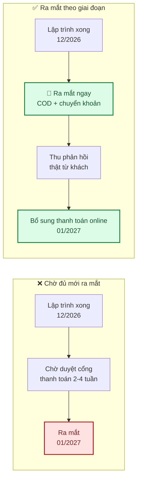
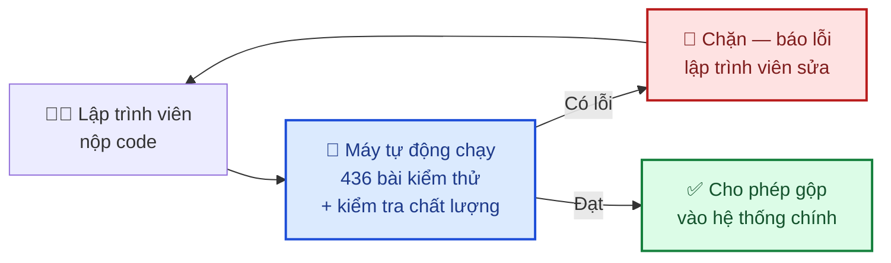

# 6. Đề xuất từ đội phát triển

Mỗi đề xuất gồm: **vấn đề → đề xuất → lợi ích → chi phí**. Bạn quyết định làm hay không; nếu không
làm, đội phát triển vẫn tiếp tục theo phương án hiện tại.

| Ký hiệu | Nghĩa |
|---|---|
| ⭐ **Nên làm** | Lợi ích rõ ràng, chi phí thấp |
| 💡 **Cân nhắc** | Tuỳ chiến lược kinh doanh của bạn |
| 📌 **Để sau** | Tốt nhưng chưa cấp thiết |

---

## 6.1. ⭐ Ra mắt sớm với COD, bổ sung thanh toán online sau

**Vấn đề.** Đăng ký cổng thanh toán mất 2–4 tuần xét duyệt, nằm ngoài kiểm soát của đội phát triển.
Chờ xong mới ra mắt là để cả hệ thống nằm không.

**Đề xuất.** Ra mắt bản dùng thử với **COD + chuyển khoản thủ công** trước, bổ sung thanh toán online
khi hồ sơ được duyệt.

| | |
|---|---|
| **Lợi ích** | Bán hàng sớm hơn ~1 tháng · Thu phản hồi thật trước khi hoàn thiện · Giảm rủi ro chậm tiến độ do bên thứ ba |
| **Chi phí** | 0 ngày công (thứ tự làm việc, không phải việc thêm) |
| **Đánh đổi** | Một số khách quen thanh toán online có thể ngại COD |

---

## 6.2. ⭐ Mua tên miền ngay trong tháng 9

**Vấn đề.** Không có tên miền → không cấu hình được dịch vụ gửi email chuyên nghiệp → email xác nhận
đơn hàng dễ vào thư mục spam → khách tưởng đặt hàng thất bại.

**Đề xuất.** Mua tên miền và cấu hình xác thực email ngay, kể cả khi website chưa xong.

| | |
|---|---|
| **Lợi ích** | Email vào hộp thư đến thay vì spam · Tên miền "nuôi" lâu có uy tín gửi thư tốt hơn · Có địa chỉ email chuyên nghiệp (`donhang@tenmien.vn`) |
| **Chi phí** | ~300.000 đ/năm + 1 ngày công cấu hình |
| **Rủi ro nếu bỏ qua** | Tỉ lệ email vào spam cao, khách gọi hỏi nhiều, có thể đặt trùng đơn |

---

## 6.3. ⭐ Thiết lập kiểm tra tự động khi nộp code

**Vấn đề.** Hiện lập trình viên phải tự nhớ chạy kiểm thử trước khi nộp code. Quên một lần là lỗi
lọt vào hệ thống.

**Đề xuất.** Cấu hình hệ thống tự động chạy toàn bộ 436 bài kiểm thử mỗi lần có code mới, **chặn
không cho gộp** nếu có bài nào thất bại.

| | |
|---|---|
| **Lợi ích** | Lỗi bị chặn **trước khi** vào hệ thống · Giá trị tăng dần theo thời gian dự án · Bảo vệ chất lượng khi có thêm người vào dự án |
| **Chi phí** | 2 ngày công, **miễn phí** với repository riêng tư của GitHub |
| **Khuyến nghị** | Làm **ngay trong tháng 9**, trước khi bắt đầu module đơn hàng |

---

## 6.4. ⭐ Sửa 6 điểm bảo mật phiên đăng nhập trước khi có người dùng thật

**Vấn đề.** Đợt rà soát mã nguồn phát hiện 6 điểm cần sửa, đáng chú ý nhất:
*đổi mật khẩu xong nhưng thiết bị cũ vẫn còn đăng nhập được*.

Kịch bản thực tế: khách đăng nhập ở máy tính quán net và quên đăng xuất. Về nhà đổi mật khẩu — nhưng
phiên ở quán net **vẫn dùng được thêm 30 ngày**. Người dùng tin rằng đổi mật khẩu là đã "đuổi" được
người lạ, thực tế thì không.

| | |
|---|---|
| **Lợi ích** | Bịt lỗ hổng bảo mật phiên đăng nhập trước khi có dữ liệu thật |
| **Chi phí** | **1,5 ngày công** |
| **Rủi ro nếu bỏ qua** | Không rủi ro ngay (chưa có người dùng thật), nhưng **bắt buộc** phải xong trước khi mở |
| **Khuyến nghị** | Đã lên lịch làm trong kỳ 09/09–23/09 |

---

## 6.5. 💡 Bổ sung lập trình viên thứ hai từ giai đoạn 2

**Vấn đề.** Dự án phụ thuộc một người. Người này nghỉ dài ngày → công việc dừng hoàn toàn.

**Đề xuất.** Bổ sung một lập trình viên từ giai đoạn 2 (khoảng tháng 11/2026).

| | |
|---|---|
| **Lợi ích** | Giảm rủi ro phụ thuộc · Rút ngắn tiến độ ~30% (không phải 50% — có chi phí phối hợp) · Hai người soi code nhau, chất lượng tốt hơn |
| **Chi phí** | Chi phí nhân sự tăng gấp đôi trong giai đoạn đó |
| **Điều kiện thuận lợi** | ✅ Tài liệu đầy đủ và ✅ 436 bài kiểm thử tự động — người mới hoà nhập trong **1–2 tuần**, không phải 1–2 tháng |
| **Khi nào nên** | Nếu bạn cần ra mắt **trước dịp 14/2/2027** |

---

## 6.6. 💡 Chuẩn bị riêng cho mùa cao điểm

**Vấn đề.** 14/2, 8/3, 20/10 — lượng đơn tăng gấp nhiều lần trong 2–3 ngày. Đây vừa là cơ hội doanh
thu lớn nhất, vừa là lúc dễ sập nhất.

**Đề xuất.** Coi mỗi dịp lễ là một **hạng mục công việc riêng**, không phải "để tới lúc đó tính".

| Thời điểm | Việc | Ngày công |
|---|---|---|
| Trước 2 tuần | Chạy thử tải mô phỏng lượng khách cao điểm | 2 |
| Trước 1 tuần | Kiểm tra kỹ phần trừ tồn kho khi nhiều người mua cùng lúc | 1 |
| Trước 3 ngày | Tăng năng lực máy chủ, kiểm tra hạn mức email | 0,5 |
| Trong ngày | Trực theo dõi hệ thống | 1 |
| Sau lễ | Giảm máy chủ về mức thường, tổng kết | 0,5 |

| | |
|---|---|
| **Lợi ích** | Không sập đúng ngày quan trọng nhất năm |
| **Chi phí** | **5 ngày công/dịp** + chi phí máy chủ tăng tạm thời (~500.000 đ cho 3 ngày) |
| **Khuyến nghị** | Bắt buộc cho dịp lễ đầu tiên sau khi ra mắt |

---

## 6.7. 💡 Xác thực 2 lớp cho tài khoản quản trị

**Vấn đề.** Tài khoản chủ hệ thống có toàn quyền: xem mọi đơn hàng, thông tin khách, đổi giá. Lộ mật
khẩu tài khoản này là lộ toàn bộ.

**Đề xuất.** Bắt buộc xác thực 2 lớp (mã 6 số từ ứng dụng Google Authenticator) cho vai trò quản trị.

| | |
|---|---|
| **Lợi ích** | Lộ mật khẩu vẫn không vào được nếu không có điện thoại · Tuân thủ thông lệ bảo mật cho tài khoản đặc quyền |
| **Chi phí** | **3 ngày công** |
| **Đánh đổi** | Đăng nhập thêm một bước; mất điện thoại cần quy trình khôi phục |
| **Khuyến nghị** | Sau khi ra mắt MVP, trước khi hệ thống có nhiều dữ liệu khách hàng thật |

---

## 6.8. 📌 Tự động sinh tài liệu API

**Vấn đề.** Tài liệu mô tả các "cổng giao tiếp" của hệ thống hiện viết tay — sẽ lệch với thực tế
theo thời gian.

**Đề xuất.** Sinh tài liệu tự động từ chính mã nguồn, luôn khớp 100%.

| | |
|---|---|
| **Lợi ích** | Tài liệu không bao giờ lệch · Cần thiết nếu sau này làm ứng dụng di động hoặc tích hợp với phần mềm khác |
| **Chi phí** | **1 ngày công** |
| **Khi nào cần** | Khi có kế hoạch làm app di động hoặc tích hợp bên thứ ba |

---

## 6.9. 📌 Tận dụng phần nền tảng cho dự án tiếp theo

Phần nền tảng (đăng nhập, phân quyền, quản lý tài khoản, lưu trữ ảnh, gửi email, nhật ký) được xây
**tách rời** khỏi nghiệp vụ bán hoa — xem [Giới thiệu sản phẩm §1.5](01-gioi-thieu.md).

**Ý nghĩa**: nếu sau này bạn làm website khác (cửa hàng quà tặng, đặt bánh, dịch vụ đặt lịch...),
phần này dùng lại nguyên vẹn.

| | |
|---|---|
| **Tiết kiệm cho dự án sau** | ~**6–8 tuần công** (khoảng 32% khối lượng của dự án hiện tại) |
| **Chi phí thêm cho dự án này** | **0** — đã được thiết kế như vậy từ đầu |
| **Điều kiện** | Dự án sau cũng dùng công nghệ tương tự |

---

## 6.10. Bảng tổng hợp

| # | Đề xuất | Chi phí | Nên làm khi nào |
|---|---|---|---|
| 6.4 | ⭐ Sửa 6 điểm bảo mật phiên đăng nhập | 1,5 ngày công | **Ngay — 09/2026** |
| 6.3 | ⭐ Kiểm tra tự động khi nộp code | 2 ngày công | **Ngay — 09/2026** |
| 6.2 | ⭐ Mua tên miền + cấu hình email | ~300.000 đ/năm + 1 ngày | **Trong 09/2026** |
| 6.1 | ⭐ Ra mắt sớm với COD | 0 | Khi lên kế hoạch ra mắt |
| 6.5 | 💡 Bổ sung lập trình viên thứ hai | Nhân sự | Nếu cần kịp 14/2/2027 |
| 6.6 | 💡 Chuẩn bị mùa cao điểm | 5 ngày công/dịp | Trước dịp lễ đầu tiên |
| 6.7 | 💡 Xác thực 2 lớp cho quản trị | 3 ngày công | Sau khi ra mắt MVP |
| 6.8 | 📌 Tự động sinh tài liệu API | 1 ngày công | Khi cần tích hợp bên ngoài |
| 6.9 | 📌 Tận dụng nền tảng cho dự án sau | 0 | Khi có dự án mới |

Phản hồi về các đề xuất trên, vui lòng ghi tại [Trao đổi & quyết định](07-trao-doi.md).
