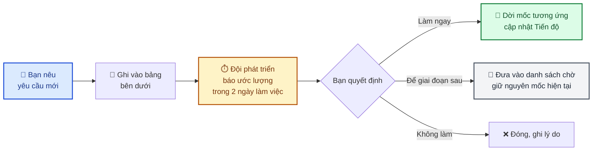

# 7. Trao đổi & quyết định

Trang này là **biên bản làm việc chung** giữa bạn và đội phát triển. Mọi quyết định ảnh hưởng tới
sản phẩm, tiến độ hoặc chi phí đều được ghi lại ở đây để hai bên cùng tra cứu về sau.

> **Vì sao cần trang này?** Trao đổi qua tin nhắn hay điện thoại rất dễ quên hoặc hiểu khác nhau.
> Ghi lại kèm ngày tháng giúp tránh tình huống "tôi tưởng đã thống nhất là..." sau vài tháng.

---

## 7.1. ⏳ Đang chờ bạn quyết định

### 🔴 Q1 · Chọn cổng thanh toán online

| | |
|---|---|
| **Cần quyết định trước** | **30/09/2026** |
| **Vì sao gấp** | Thủ tục đăng ký mất **2–4 tuần** xét duyệt. Chốt muộn → chậm mốc ra mắt tương ứng. |
| **Ảnh hưởng nếu chậm** | Chậm bản dùng thử 2–4 tuần, hoặc phải ra mắt chỉ với COD |

**Các phương án:**

| Phương án | Ưu điểm | Nhược điểm | Phí giao dịch |
|---|---|---|---|
| **VNPay** | Hỗ trợ hầu hết ngân hàng nội địa, quét mã QR phổ biến | Thủ tục giấy tờ nhiều hơn | ~1,1 – 2,2% |
| **Momo** | Nhiều người trẻ dùng, đăng ký nhanh hơn | Chủ yếu người dùng ví Momo | ~2,0 – 2,5% |
| **Cả hai** | Khách có nhiều lựa chọn, tăng tỉ lệ chốt đơn | Chi phí lập trình tăng ~3 ngày công | Theo từng cổng |
| **Chưa làm ngay** | Ra mắt sớm hơn 1 tháng | Khách phải chuyển khoản thủ công hoặc COD | 0 |

**Đội phát triển đề xuất**: chọn **VNPay trước** (phủ ngân hàng rộng nhất tại Việt Nam), bổ sung Momo
sau nếu thấy khách có nhu cầu. Song song đó, ra mắt bản dùng thử với COD mà không chờ —
xem [Đề xuất §6.1](06-de-xuat.md).

**Bạn cần cung cấp khi đã chọn**: giấy phép kinh doanh, thông tin tài khoản ngân hàng doanh nghiệp,
người đại diện ký hồ sơ.

- [ ] **Quyết định của bạn:** ................................................ (ngày: ......../......../2026)

---

### 🔴 Q2 · Tên miền cho website

| | |
|---|---|
| **Cần quyết định trước** | **30/09/2026** |
| **Vì sao** | Không có tên miền thì không cấu hình được email chuyên nghiệp → email xác nhận đơn dễ vào thư mục spam |
| **Chi phí** | ~300.000 đ/năm (đuôi `.vn` khoảng 750.000 đ/năm) |

**Câu hỏi cần bạn trả lời:**

1. Bạn **đã có** tên miền chưa? Nếu có: tên miền là gì, đang quản lý ở nhà cung cấp nào?
2. Nếu chưa: muốn dùng đuôi nào — `.vn` (uy tín trong nước, đắt hơn), `.com` (phổ biến quốc tế),
   hay `.shop`/`.store` (hợp ngành bán lẻ)?
3. Ai đứng tên sở hữu tên miền?

> ⚠️ **Lưu ý quan trọng**: tên miền nên đứng tên **bạn/công ty bạn**, không phải đứng tên đội phát
> triển hay bên trung gian. Đây là tài sản của bạn — nếu sau này đổi đơn vị phát triển, bạn vẫn giữ
> được website và địa chỉ khách đã quen.

- [ ] **Quyết định của bạn:** ................................................ (ngày: ......../......../2026)

---

### 🟡 Q3 · Chính sách giao hàng

| | |
|---|---|
| **Cần quyết định trước** | **31/10/2026** |
| **Vì sao** | Ảnh hưởng trực tiếp tới thiết kế phần đặt hàng — làm rồi mới đổi sẽ phải sửa lại |

**Cần bạn cung cấp:**

| Nội dung | Ví dụ |
|---|---|
| **Khu vực giao hàng** | Chỉ nội thành? Bao nhiêu quận/huyện? Có giao tỉnh không? |
| **Phí giao theo khu vực** | Nội thành 30.000 đ, ngoại thành 50.000 đ, miễn phí đơn trên 500.000 đ? |
| **Khung giờ giao** | Sáng (8–12h), chiều (13–18h), tối (18–21h)? Có giao theo giờ hẹn chính xác không? |
| **Đặt trước bao lâu** | Đặt hôm nay giao được hôm nay không? Cần đặt trước tối thiểu mấy tiếng? |
| **Ngày lễ** | Có phụ thu ngày lễ không? 14/2 có giới hạn số đơn/khung giờ không? |
| **Giao thất bại** | Người nhận vắng nhà thì xử lý thế nào? Giao lại? Hoàn tiền? |

> Câu hỏi **"đặt trước tối thiểu bao lâu"** là quan trọng nhất về mặt kỹ thuật — nó quyết định hệ
> thống chặn những khung giờ nào khi khách chọn ngày giờ giao.

- [ ] **Quyết định của bạn:** ................................................ (ngày: ......../......../2026)

---

### 🟢 Q4 · Dữ liệu sản phẩm mẫu

| | |
|---|---|
| **Cần trước** | **15/10/2026** |
| **Vì sao** | Để dựng và kiểm thử trang bán hàng bằng dữ liệu thật thay vì dữ liệu giả |

**Cần bạn cung cấp** — khoảng **10–20 sản phẩm** đại diện, mỗi sản phẩm gồm:

- Tên sản phẩm
- Mô tả ngắn (2–3 câu)
- Ảnh (tối thiểu 1 ảnh, tốt nhất 3–4 góc chụp)
- Giá theo từng kích cỡ (nhỏ / vừa / lớn) nếu có
- Thuộc danh mục nào, hợp dịp nào (sinh nhật, khai trương, chia buồn...)

> Không cần đầy đủ và hoàn hảo ngay — mục đích là để đội phát triển kiểm tra giao diện với **độ dài
> tên và mô tả thật**. Tên sản phẩm dài 60 ký tự hiển thị rất khác tên mẫu 15 ký tự.

- [ ] **Đã cung cấp:** ................................................ (ngày: ......../......../2026)

---

## 7.2. ✅ Quyết định đã chốt

| Ngày | Nội dung | Quyết định | Ghi chú |
|---|---|---|---|
| 08/2026 | Nền tảng công nghệ | Next.js + Node.js + PostgreSQL | Phù hợp yêu cầu SEO cho trang sản phẩm |
| 08/2026 | Có làm ứng dụng di động riêng không | **Không** — website tối ưu cho điện thoại | Ứng dụng riêng là dự án tách biệt nếu cần sau |
| 08/2026 | Số cách đăng nhập | **3 cách**: email/mật khẩu, Google, liên kết qua email | Chủ hệ thống bật/tắt được từng cách |
| 08/2026 | Nơi lưu ảnh sản phẩm | Cloudflare R2 | Không tính phí băng thông tải xuống — khoản tốn nhất với website nhiều ảnh |
| 09/2026 | Đổi nơi lưu ảnh sản phẩm & backup dữ liệu | **Cloudinary** (thay Cloudflare R2) | Gộp được cả lưu ảnh và backup database vào một dịch vụ, không ảnh hưởng tính năng hay chi phí đã trao đổi ở [§4.6](04-estimate.md) |
| 09/2026 | Tách phần nền tảng khỏi nghiệp vụ bán hoa | **Có** | Dùng lại được cho dự án sau, không phát sinh chi phí — [xem §1.5](01-gioi-thieu.md) |
| 09/2026 | Mức độ đầu tư cho kiểm thử tự động | **Cao** — 557 bài kiểm thử | Giảm rủi ro phụ thuộc một lập trình viên — [xem R3](05-rui-ro.md) |
| 09/2026 | Ngôn ngữ tài liệu | **Tiếng Việt**, giữ nguyên thuật ngữ kỹ thuật tiếng Anh kèm chú thích | Để người tiếp quản sau đọc được |

---

## 7.3. 📋 Yêu cầu phát sinh

Mọi yêu cầu **ngoài phạm vi đã thống nhất** ([xem §2.6](02-pham-vi-chuc-nang.md)) được ghi ở đây.

**Quy trình xử lý:**

> **Nguyên tắc**: đội phát triển **không âm thầm làm thêm rồi báo trễ hạn**. Mọi việc phát sinh đều
> có ước lượng và được bạn duyệt trước.

| # | Ngày nêu | Yêu cầu | Ước lượng | Quyết định | Trạng thái |
|---|---|---|---|---|---|
| — | — | *(Chưa có yêu cầu phát sinh nào)* | — | — | — |

---

## 7.4. ❓ Câu hỏi thường gặp

**Website có tự động lên Google không?**
Hệ thống đã tối ưu sẵn về mặt kỹ thuật (Google đọc được nội dung trang sản phẩm). Nhưng để lên thứ
hạng cao cần thêm nội dung tốt và thời gian — đó là công việc marketing, không phải lập trình.

**Tôi tự sửa được nội dung không, hay phải nhờ đội phát triển?**
Bạn tự làm được: thêm/sửa/xoá sản phẩm, danh mục, giá, ảnh, khuyến mãi, bài blog, banner. Chỉ khi
cần **chức năng mới** mới cần đội phát triển.

**Nếu tôi muốn đổi đơn vị phát triển sau này thì sao?**
Toàn bộ mã nguồn và tài liệu thuộc về bạn. Dự án có 20 tài liệu kỹ thuật kèm sơ đồ và 557 bài kiểm
thử tự động — một lập trình viên mới tiếp quản được trong **1–2 tuần**. Đây là lý do đội phát triển
đầu tư vào tài liệu ngay từ đầu.

**Dữ liệu khách hàng của tôi được lưu ở đâu?**
Trên máy chủ cơ sở dữ liệu riêng của dự án, sao lưu tự động 2 ngày/lần. Không chia sẻ với bên thứ ba.
Xem thêm [Rủi ro R8, R9](05-rui-ro.md).

**Nếu website bị sập thì bao lâu khôi phục được?**
Sự cố máy chủ: khôi phục trong vài giờ. Mất dữ liệu: khôi phục từ bản sao lưu gần nhất, mất tối đa
2 ngày dữ liệu. Cần chặt hơn thì tăng tần suất sao lưu — chi phí tăng không đáng kể.

**Tôi muốn xem tiến độ thường xuyên hơn hai tuần một lần?**
Được. Đội phát triển có thể cập nhật hằng tuần. Vui lòng nêu ở mục §7.3.

---

## 7.5. Cách sử dụng trang này

| Bạn muốn | Làm thế nào |
|---|---|
| Trả lời một câu hỏi ở §7.1 | Ghi vào dòng "Quyết định của bạn" hoặc phản hồi trực tiếp cho đội phát triển |
| Nêu yêu cầu mới | Đội phát triển sẽ ghi vào §7.3 kèm ước lượng |
| Xem lại đã thống nhất gì | Mục §7.2 |
| Hỏi điều chưa rõ | Liên hệ đội phát triển — câu hỏi hay gặp sẽ được bổ sung vào §7.4 |

**Nhịp cập nhật**: trang này cập nhật ngay khi có trao đổi mới, không đợi tới kỳ báo cáo hai tuần.
