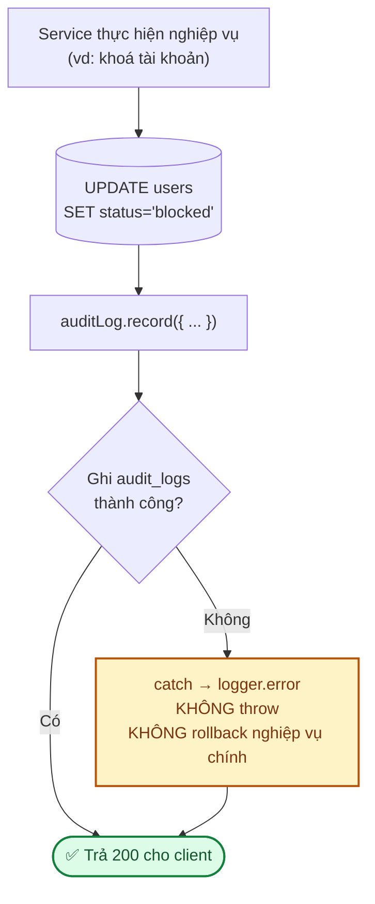
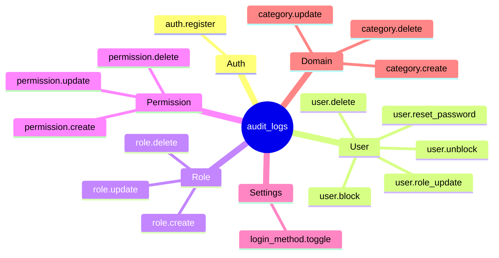

# Module: Audit Log 🔧 Core

Ghi lại **mọi thao tác nhạy cảm**: ai, khi nào, trên đối tượng nào, giá trị trước và sau.

| | |
|---|---|
| **Loại** | 🔧 Core |
| **Backend** | `modules/core/audit-log/` |
| **Frontend** | `features/core/audit-log/` · `app/(dashboard)/superadmin/audit-logs/page.tsx` |
| **Bảng DB** | `audit_logs` |
| **Endpoint** | `GET /api/v1/superadmin/audit-logs` (cần `audit.view`) |

---

## 1. Nguyên tắc: ghi log là *best-effort*

**Vì sao không rollback khi ghi log lỗi?** Nếu bảng `audit_logs` gặp sự cố, ta không muốn toàn bộ
thao tác quản trị dừng hoạt động theo. Đánh đổi: có thể mất một dòng log (được ghi vào `logger.error`
để còn biết), nhưng nghiệp vụ chính không bị gián đoạn — đúng yêu cầu ở
[07 · Bảo mật §2](../07-bao-mat.md).

---

## 2. Cấu trúc bản ghi

| Cột | Ý nghĩa | Ví dụ |
|---|---|---|
| `actor_id` | Ai thực hiện (nullable — hệ thống tự động) | `uuid của super_admin` |
| `action` | Hành động, dạng `entity.verb` | `user.block` |
| `entity_type` | Loại đối tượng bị tác động | `user` |
| `entity_id` | ID đối tượng (**luôn ép về chuỗi** — role/permission dùng id số) | `"42"` |
| `before` | Giá trị trước (JSONB) | `{ "status": "active" }` |
| `after` | Giá trị sau (JSONB) | `{ "status": "blocked" }` |
| `ip_address` | IP người thực hiện | `203.0.113.7` |
| `created_at` | Thời điểm | |

Index: `actor_id` · `(entity_type, entity_id)` · `created_at` — phục vụ 3 câu hỏi tra cứu thường gặp:
*ai đã làm gì*, *đối tượng này bị ai đụng vào*, *khoảng thời gian đó có gì xảy ra*.

> ⚠️ `ip_address` **sai** khi chạy sau reverse proxy mà thiếu `trust proxy` — mọi bản ghi sẽ ghi IP
> của proxy, mất hoàn toàn khả năng truy vết. Xem `BE-02` ở [12](../12-danh-gia-va-de-xuat.md).

---

## 3. Các `action` đang được ghi

Khi thêm module mới, ghi audit cho **mọi thao tác thay đổi dữ liệu quan trọng** —
xem checklist ở [03 · Backend §10](../03-backend.md).

---

## 4. Bảo mật

- **Không ghi mật khẩu vào `before`/`after`.** `user.reset_password` chỉ ghi hành động, cố ý **không**
  có trường `after` — có test kiểm chứng điều này.
- `before`/`after` là JSONB nên dễ vô tình nhét cả object có trường nhạy cảm vào. Khi ghi log một
  entity, **chọn lọc trường** thay vì truyền nguyên object.
- Audit log là **dữ liệu tuân thủ pháp lý** — không xoá tuỳ tiện. Khi bảng lớn, chuyển sang lưu trữ
  lạnh (*cold storage*) sau 12 tháng thay vì xoá (`BE-13`).

---

## 5. Kiểm thử

`backend/tests/unit/modules/auditLog.service.test.ts` — 8 test: ghi đủ trường · ép `entityId` về chuỗi ·
**lỗi ghi log không làm hỏng nghiệp vụ** · bỏ qua trường không truyền · lọc theo actor/entity/thời gian ·
sắp xếp mới nhất trước · phân trang.

Ngoài ra, các test service (`users.admin`, `roles`, `permissions`, `categories`, `loginMethods`) đều
assert rằng audit log **được gọi với đúng nội dung** sau mỗi thao tác.

---

## 6. Việc còn lại

| Việc | Ưu tiên | Ghi chú |
|---|:---:|---|
| ~~**Màn hình tra cứu** cho super_admin~~ | ✅ | `/superadmin/audit-logs` (11/09/2026) — lọc theo `entityType` (ô nhập tự do, tránh lệch khỏi danh sách action ở §3) và khoảng ngày, xem chi tiết `before`/`after` dạng JSON |
| Xuất CSV để đối soát | 🟢 | |
| Chính sách lưu trữ (cold storage sau 12 tháng) | 🟢 | `BE-13` |
| Cảnh báo tự động khi có chuỗi thao tác bất thường | 🟢 | vd nhiều `user.block` liên tiếp |
