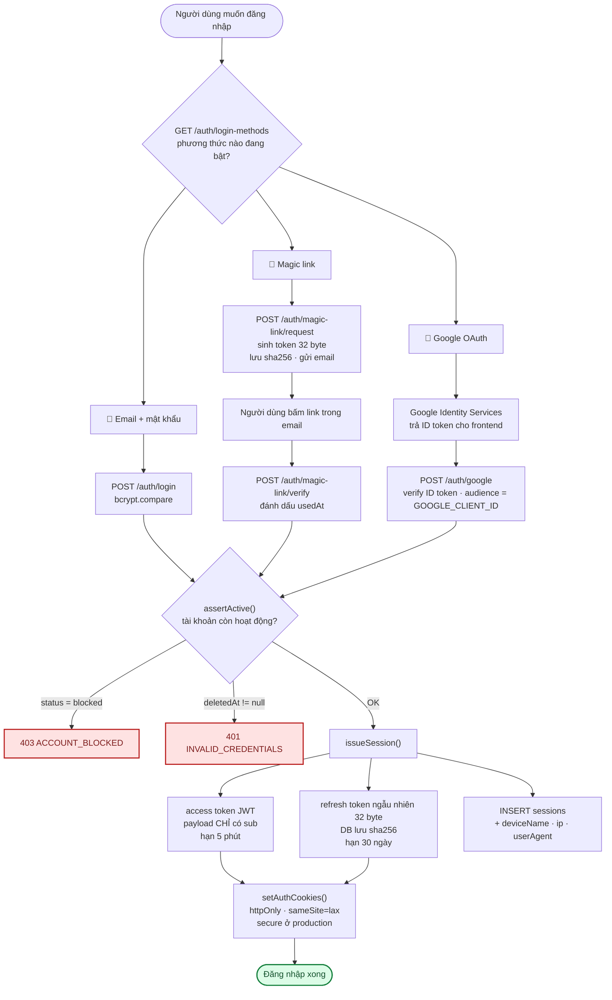
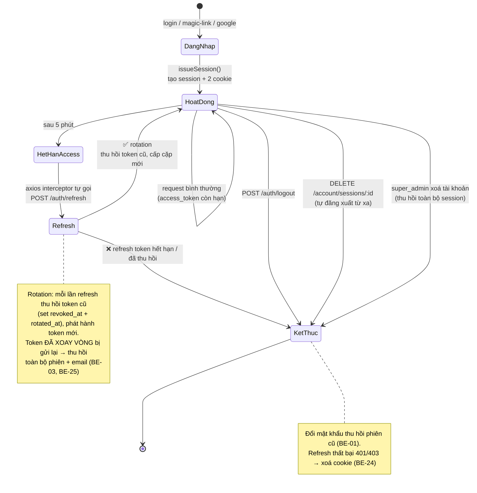
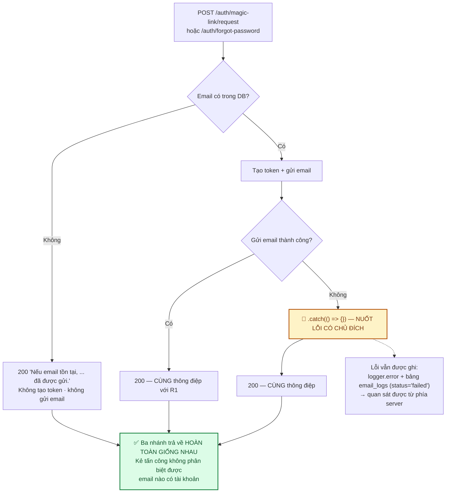

# Module: Auth 🔧 Core

Xác thực người dùng qua **3 phương thức** và quản lý phiên đăng nhập.

| | |
|---|---|
| **Loại** | 🔧 Core — copy nguyên khi sang dự án PERN khác |
| **Backend** | `backend/src/modules/core/auth/` |
| **Frontend** | `frontend/src/features/core/auth/`, `frontend/src/app/(auth)/` |
| **Bảng DB** | `users` · `auth_accounts` · `sessions` · `magic_link_tokens` · `password_reset_tokens` · `login_method_settings` |
| **Endpoint** | `/api/v1/auth/*` — xem [06 · API §4](../06-api-reference.md) |

---

## 1. Cấu trúc file

```
modules/core/auth/
├── auth.routes.ts       # đường dẫn + rate limit + validate
├── auth.controller.ts   # mỏng — gọi service, set cookie, trả response
├── auth.service.ts      # toàn bộ business logic (331 dòng — file lớn nhất module)
├── auth.repository.ts   # truy vấn dùng lại nhiều nơi (user, session, token)
├── auth.validation.ts   # zod schema + type inferred
├── cookie.util.ts       # set/clear cookie + parse thời hạn
└── device.util.ts       # rút gọn user-agent → tên thiết bị dễ đọc
```

> Đây là module **duy nhất** có `*.repository.ts` — vì cùng một tập truy vấn (tìm user theo email/id,
> tạo/thu hồi session, CRUD token) được dùng lại ở nhiều luồng khác nhau. Các module khác gọi Prisma
> thẳng trong service. Xem [03 · Backend §1](../03-backend.md).

---

## 2. Ba phương thức đăng nhập



Mỗi phương thức đều đi qua `assertMethodEnabled()` — super_admin tắt phương thức nào thì phương thức
đó trả `403 LOGIN_METHOD_DISABLED` ngay, **kể cả khi UI vẫn hiện nút**.

---

## 3. Vòng đời phiên đăng nhập



---

## 4. Quyết định thiết kế & lý do

| Quyết định | Lý do |
|---|---|
| **Access token chỉ chứa `sub`** | Role/permission tra DB mỗi request → đổi quyền có hiệu lực ngay. Xem [core-rbac.md](core-rbac.md) |
| **Access token 5 phút** | Ngắn để giảm thiệt hại nếu token bị lộ; interceptor tự refresh nên người dùng không thấy phiền |
| **Refresh token là chuỗi ngẫu nhiên, không phải JWT** | Thu hồi được ngay (JWT không thu hồi được nếu không có danh sách đen); DB chỉ lưu `sha256` |
| **Cookie `httpOnly`** | JavaScript không đọc được → XSS không đánh cắp được token |
| **`refresh_token` path `/api/v1`** | Phải đủ rộng để `/account/sessions` đọc được (cần biết phiên nào là "hiện tại"). Từng để `/api/v1/auth` hẹp hơn → `revokeOtherSessions` **xoá nhầm cả phiên đang dùng** |
| **`sameSite: 'lax'`** | Chặn cookie trong request POST cross-site (chống CSRF cơ bản) nhưng vẫn cho điều hướng top-level |
| **Đăng ký KHÔNG tự đăng nhập** | Rõ ràng về mặt UX; và tạo chỗ để chèn bước xác thực email sau này |
| **Google: verify ID token, không dùng redirect** | Đơn giản hơn nhiều (không cần callback URL, không cần `state` chống CSRF), phù hợp kiến trúc SPA |
| **Magic link kiêm đăng ký nhanh** | Email chưa có tài khoản → tạo mới luôn, `emailVerifiedAt` đặt sẵn (đã chứng minh sở hữu email) |

---

## 5. Chống dò tài khoản (*account enumeration*)

Đây là chi tiết dễ làm hỏng nhất trong module này:



> ⚠️ **Đừng "sửa" `.catch(() => {})` thành throw.** Đây là một trong hai ngoại lệ có chủ đích của quy
> tắc "không nuốt lỗi" ([03 · Backend §3](../03-backend.md)). Nếu để lỗi văng ra, nhánh "email có
> thật + SMTP hỏng" trả **500** trong khi nhánh "email không tồn tại" trả **200** — chênh lệch đó
> chính là kênh rò rỉ thông tin.

Tương tự với đăng nhập: sai email và sai mật khẩu trả **cùng một** `401 INVALID_CREDENTIALS` với
cùng thông điệp.

---

## 6. Rate limit

| Endpoint | Giới hạn | Lý do |
|---|---|---|
| `/register`, `/login`, `/google`, `/forgot-password`, `/reset-password` | 20 / 15 phút | Chống brute-force mật khẩu |
| `/magic-link/request` | **5 / 15 phút** | Mỗi lượt gửi một email — chặt hơn để chống spam hộp thư người khác |
| `/magic-link/verify`, `/refresh`, `/logout` | Không giới hạn | Cần token hợp lệ mới thao tác được |

> ⚠️ Rate limit hiện tính theo `req.ip`. Sau reverse proxy mà thiếu `trust proxy` thì **toàn bộ người
> dùng chia chung một bucket** — xem `BE-02` ở [12 · Đánh giá](../12-danh-gia-va-de-xuat.md).

---

## 7. Frontend

| File | Vai trò |
|---|---|
| `features/core/auth/auth.service.ts` | Gọi axios thuần |
| `features/core/auth/auth.hooks.ts` | `useLogin`, `useRegister`, `useLogout`, `useLoginWithGoogle`, `useRequestMagicLink`, `useVerifyMagicLink`, `useForgotPassword`, `useResetPassword`, `useRedirectTarget`, `useSessionExpiredHandler` |
| `features/core/auth/auth.schemas.ts` | Zod schema — **khớp thông điệp với backend** để trải nghiệm thống nhất |
| `features/core/auth/GoogleLoginButton.tsx` | Tích hợp Google Identity Services |
| `app/(auth)/*` | Trang login, register, magic-link, forgot/reset password |

Sau khi đăng nhập thành công (`useAfterAuthSuccess`): **`hardRedirect(target)`** — tải lại trang tại
đích lấy từ `?redirectTo=` (`useRedirectTarget()`, đọc qua `useSearchParams()`). Không dùng
`router.push`: Client Cache của Next.js còn giữ kết quả "redirect về /login" từ lúc chưa đăng nhập,
người dùng sẽ đứng im ở `/login` (docs/12 FE-08). Trang mới tự fetch `useMe()` từ đầu.

Trang login/register chỉ tự rời trang khi có kết quả `/account/me` **mới** (`isSuccess &&
isFetchedAfterMount`) — không tin user cũ còn trong cache.

Khi đăng xuất: **`queryClient.clear()`** — xoá sạch cache để không rò dữ liệu sang tài khoản đăng nhập
kế tiếp.

Khi phiên chết (refresh trả 401/403): `useSessionExpiredHandler()` (mount ở `Providers`) đặt
`['account','me']` = `null` để header về trạng thái chưa đăng nhập, và đưa về `/login?redirectTo=...`
nếu đang ở route cần đăng nhập (docs/12 FE-09).

---

## 8. Kiểm thử

| Tầng | File | Bao phủ |
|---|---|---|
| Unit | `backend/tests/unit/modules/auth.service.test.ts` | 67 test — mọi luồng đăng nhập, rotation, reuse detection (chỉ token đã xoay vòng), chống dò email, token dùng 1 lần |
| Unit | `backend/tests/unit/modules/auth.utils.test.ts` | 16 test — cookie path/httpOnly/maxAge, tên thiết bị |
| Unit | `backend/tests/unit/shared/authenticate.test.ts` | 8 test — cookie vs Bearer, tra DB, gộp permission |
| Integration | `backend/tests/integration/auth.routes.test.ts` | 25 test — envelope, cookie (kể cả xoá cookie khi refresh thất bại), validate qua HTTP thật |
| Unit/Component | `frontend/tests/unit/axios.test.ts`, `frontend/tests/components/session-expiry.test.tsx` | Interceptor refresh (hàng đợi không treo, báo hết phiên), header khi phiên chết, trang login khi bị đá về |
| E2E | `frontend/e2e/auth.spec.ts` | Đăng nhập/xuất, cookie httpOnly, redirectTo, 403 |

---

## 9. Việc còn lại

`BE-01`, `BE-03`→`BE-05`, `BE-16`, `BE-17`, `BE-24`, `BE-25`, `FE-08`, `FE-09` đã xử lý — chi tiết ở
[12 · Đánh giá](../12-danh-gia-va-de-xuat.md).

| Việc | Ưu tiên | Mã |
|---|:---:|---|
| Refresh đồng thời từ nhiều tab bị reuse detection báo nhầm (grace window) | 🟢 | `BE-26` |
| 2FA (TOTP) cho `super_admin`/`admin` | 🟢 | [07 §1](../07-bao-mat.md) |
| Xác thực email trước khi đặt hàng | 🟢 | [07 §1](../07-bao-mat.md) |
