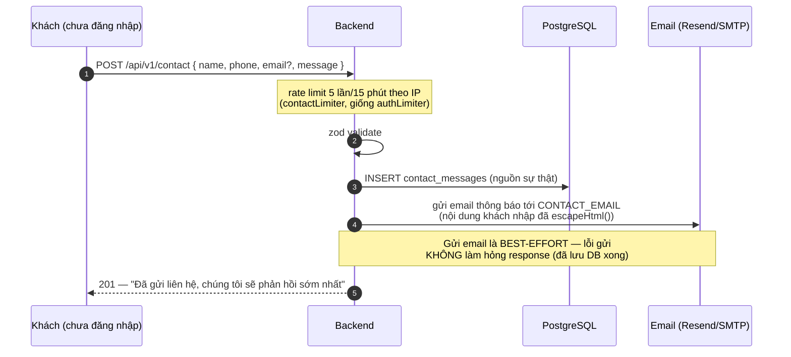

# Module: Contact 🔧 Core

Form Liên hệ công khai trên storefront (tên/SĐT/email tuỳ chọn/lời nhắn) — lưu vào DB và gửi email
thông báo cho chủ shop, admin xem/đánh dấu xử lý trong khu quản trị.

| | |
|---|---|
| **Loại** | 🔧 Core — tính năng chung, hợp cho mọi dự án dùng lại source base này |
| **Backend** | `modules/core/contact/` |
| **Frontend** | `features/core/contact/` · `app/(storefront)/lien-he/` · `app/(dashboard)/admin/contact/` |
| **Bảng DB** | `contact_messages` |
| **Endpoint** | `POST /api/v1/contact` (công khai) · `/api/v1/admin/contact-messages` (cần `contact.manage`) — xem [06 · API §9](../06-api-reference.md#9-contact-) |

---

## 1. Luồng gửi liên hệ

**Vì sao lưu DB trước, gửi email sau và nuốt lỗi gửi mail?** Giống hệt lý do `magic-link`/
`reset-password` đang làm ở `auth.service.ts` (xem [07 · Bảo mật §1](../07-bao-mat.md)) — email có
thể lỗi (SMTP tạm ngưng, vào spam, sai cấu hình `CONTACT_EMAIL`), nhưng DB là nguồn sự thật admin
luôn xem lại được ở `/admin/contact`. Nếu để lỗi gửi email làm hỏng response, khách tưởng gửi thất
bại và gửi lại nhiều lần dù tin nhắn đầu đã lưu thành công.

---

## 2. Escape HTML — khác `sanitizeHtml.ts` của module Products

`name`/`phone`/`email`/`message` do khách **công khai** tự nhập (không cần đăng nhập) được
`escapeHtml()` (xem `shared/utils/escapeHtml.ts`) **trước khi** chèn vào template email
(`contactMessageTemplate`, string interpolation thuần — xem `modules/core/email/email.templates.ts`).

Khác `sanitizeDescriptionHtml()` của [module Products](domain-products.md) — nơi đó CHO PHÉP một số
thẻ định dạng (rich text editor) vào cột `description`. Ở đây **không có lý do chính đáng** nào để
lời nhắn liên hệ chứa HTML thật, nên escape triệt để mọi ký tự `& < > " '` thay vì áp allowlist thẻ —
đơn giản hơn và an toàn hơn cho đúng trường hợp dùng này.

`contact_messages.message` trong DB lưu **nguyên văn** (không escape) — chỉ escape lúc chèn vào email
HTML. Admin panel hiển thị qua React (`{m.message}`, không phải `dangerouslySetInnerHTML`) nên React
tự escape khi render, không cần escape lại ở tầng lưu trữ.

---

## 3. Bảo mật

| Biện pháp | Cài đặt | Chống điều gì |
|---|---|---|
| Rate limit theo IP | `express-rate-limit`, 5 lần/15 phút (giống `authLimiter`) | Spam/abuse form công khai không cần đăng nhập |
| Validate input | zod: `name`/`phone`/`message` bắt buộc, `email` đúng định dạng nếu có, giới hạn độ dài (`message` tối đa 2000 ký tự) | Payload rác, request khổng lồ |
| Escape HTML trước khi gửi email | `escapeHtml()` — xem mục 2 | HTML injection trong email nội bộ (khác web XSS nhưng vẫn là input không tin cậy) |
| Phân quyền xem/xử lý | `GET`/`PATCH /admin/contact-messages` cần `contact.manage` | Người dùng thường đọc được tin nhắn liên hệ của khách khác |

`contact.manage` là permission 🔧 Core (không `🔒 is_restricted`) — gán sẵn cho `admin` **và**
`super_admin` qua `core.seed.ts`, giống `files.manage`.

---

## 4. Frontend

| File | Vai trò |
|---|---|
| `features/core/contact/contact.service.ts` | `submit()` (công khai) · `list()`/`setHandled()` (admin) |
| `features/core/contact/contact.hooks.ts` | `useSubmitContact`, `useContactMessages`, `useSetContactHandled` |
| `app/(storefront)/lien-he/page.tsx` | Client Component — form thật, hiện lỗi validate theo từng field từ `res.body.errors` (422) |
| `app/(dashboard)/admin/contact/page.tsx` | Danh sách + lọc theo trạng thái + nút đánh dấu đã/chưa xử lý |

Trang Liên hệ **cố tình** không dùng `react-hook-form` (khác form đăng nhập/đăng ký) — chỉ 4 field
đơn giản, `useState` thường + đọc thẳng `error.response.data.errors` từ backend là đủ, không cần
thêm thư viện cho form nhỏ này.

---

## 5. Kiểm thử

| Tầng | File | Số test |
|---|---|---|
| Unit | `backend/tests/unit/modules/contact.service.test.ts` | 8 — lưu DB trước khi gửi mail, escape HTML, lỗi gửi mail không chặn response, lọc `isHandled`, audit log |
| Unit | `backend/tests/unit/shared/escapeHtml.test.ts` | 3 |
| Integration | `backend/tests/integration/contact.routes.test.ts` + phần chung trong `rbac.test.ts` | 6 + phần chung — 201, 422, 403 thiếu quyền |

Kiểm chứng thủ công qua trình duyệt thật (Playwright): gửi form Liên hệ thật → đăng nhập
super_admin → thấy tin nhắn ở `/admin/contact` → đánh dấu đã xử lý → badge cập nhật đúng, không lỗi
console.

---

## 6. Việc còn lại

| Việc | Ưu tiên | Mã |
|---|:---:|---|
| Xoá tin nhắn (hiện chỉ có list/update, chưa có `DELETE`) | 🟢 | — |
| Thông tin hotline/địa chỉ/Zalo trên trang Liên hệ đang là **giá trị mẫu** (`0900 000 000`...) — cần thay bằng thông tin thật trước khi triển khai thật | 🟡 | — |
| Giới hạn rate limit hiện tính theo IP process-memory (`express-rate-limit` mặc định) — không chia sẻ giữa nhiều instance nếu scale ngang sau này | 🟢 | — |
