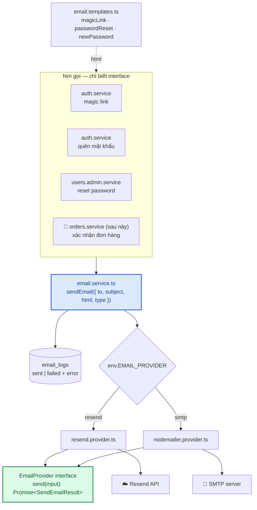
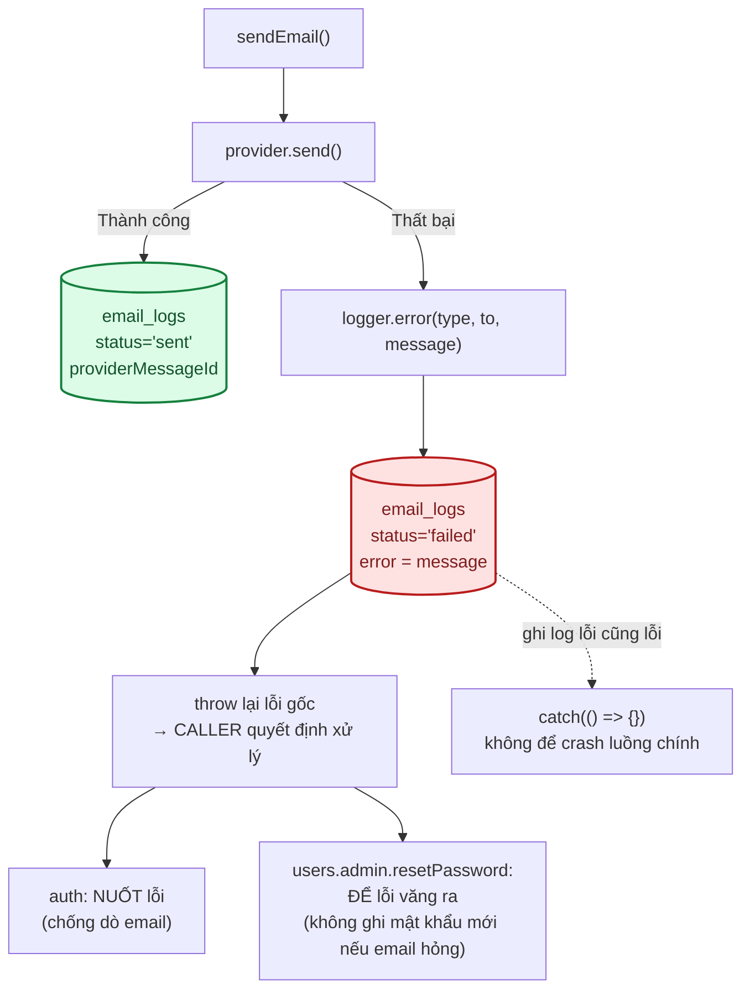

# Module: Email 🔧 Core

Lớp trừu tượng gửi email — business logic **không bao giờ** gọi thẳng Resend/Nodemailer.

| | |
|---|---|
| **Loại** | 🔧 Core |
| **Backend** | `modules/core/email/` |
| **Bảng DB** | `email_logs` |
| **Cấu hình** | `EMAIL_PROVIDER` · `EMAIL_FROM` · `RESEND_API_KEY` · `SMTP_*` |

---

## 1. Kiến trúc



**Đổi provider = đổi một biến môi trường.** Không sửa dòng code nào ở nơi gọi.

---

## 2. Hai phương án

| | **Resend** | **Nodemailer + SMTP** |
|---|---|---|
| Khi dùng | Production, đã có domain riêng | Tạm thời khi chưa có domain |
| Yêu cầu | Domain đã verify DKIM/SPF/DMARC | Tài khoản SMTP (Gmail cần App Password) |
| Tỉ lệ vào hộp thư đến | Cao | Thấp — dễ vào spam |
| Giới hạn | Theo gói dịch vụ | Gmail ~500 email/ngày |
| Chi phí | Có gói miễn phí | Miễn phí |

> **Không thể dùng địa chỉ Gmail cá nhân làm người gửi với Resend** — bắt buộc phải sở hữu domain và
> cấu hình được DNS. Hướng dẫn từng bước: [09 §3.5](../09-moi-truong-va-bien-cau-hinh.md).

---

## 3. Ghi log mọi lần gửi



**Hai nơi gọi xử lý lỗi khác nhau — cả hai đều có chủ đích:**

| Nơi gọi | Xử lý | Vì sao |
|---|---|---|
| `auth.service` (magic link, quên mật khẩu) | `.catch(() => {})` — **nuốt** | Nếu để lỗi văng ra, response 500 sẽ khác nhánh "email không tồn tại" (200) → **lộ email nào có tài khoản** |
| `users.admin.service.resetPassword` | **Để lỗi văng ra** | Gửi email TRƯỚC khi ghi DB — email hỏng thì mật khẩu cũ còn nguyên, tránh đặt mật khẩu mà không ai biết |

**Khi khách báo không nhận được email**, tra bảng `email_logs`:

```sql
SELECT to_email, type, status, error, sent_at
FROM email_logs
WHERE to_email = 'khach@example.com'
ORDER BY sent_at DESC LIMIT 20;
```

---

## 4. Bảo mật

- **Không ghi nội dung email (`html`) vào `email_logs`** — nội dung chứa magic link token và mật khẩu
  mới. Chỉ ghi `to_email`, `type`, `status`, `providerMessageId`, `error`.
- Mật khẩu mới do SuperAdmin reset chỉ tồn tại **trong bộ nhớ** đủ lâu để gửi email —
  không log, không trả về response, không hiển thị lại cho SuperAdmin.
- Template dùng nội suy chuỗi. Hiện chỉ nhận URL và mật khẩu do server sinh (không phải input người
  dùng) nên an toàn. **Nếu sau này nhúng dữ liệu người dùng** (tên khách trong email xác nhận đơn),
  phải escape HTML trước.

---

## 5. Kiểm thử

`backend/tests/unit/modules/email.service.test.ts` — 8 test: chọn provider theo env · ghi `sent`/`failed` ·
ném lại lỗi gốc · lỗi ghi log không làm crash · **không ghi `html` vào log** · template nhúng đúng URL.

---

## 6. Việc còn lại

| Việc | Ưu tiên | Ghi chú |
|---|:---:|---|
| Template đẹp hơn (`react-email` / `mjml`) | 🟢 | Interface `EmailProvider` không đổi |
| Hàng đợi gửi email (BullMQ) | 🟢 | Chỉ khi cần gửi hàng loạt (newsletter, nhắc lịch) |
| Thử lại khi gửi thất bại | 🟢 | Hiện thất bại là mất luôn |
| Escape HTML khi nhúng dữ liệu người dùng | 🟡 | **Bắt buộc** trước khi làm email xác nhận đơn hàng |
| Webhook theo dõi bounce/complaint từ Resend | 🟢 | Giữ danh tiếng domain |
