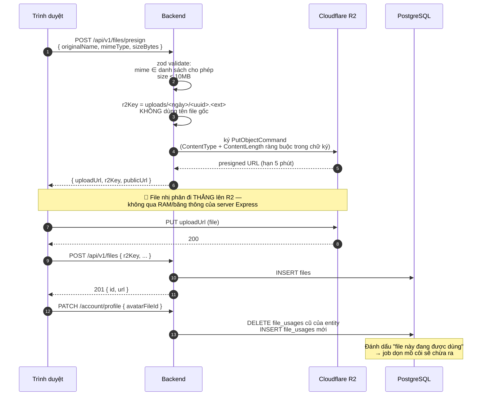
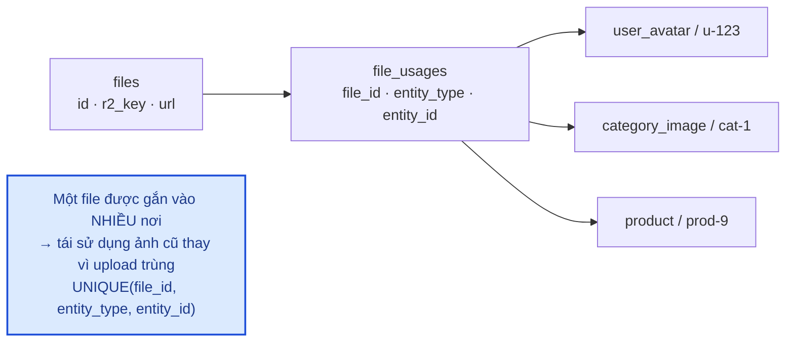
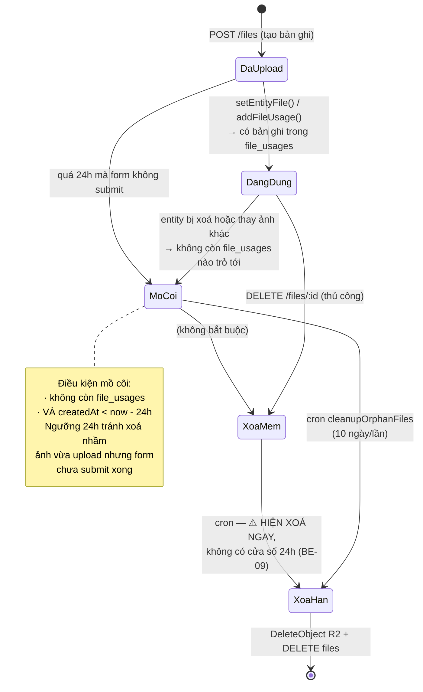
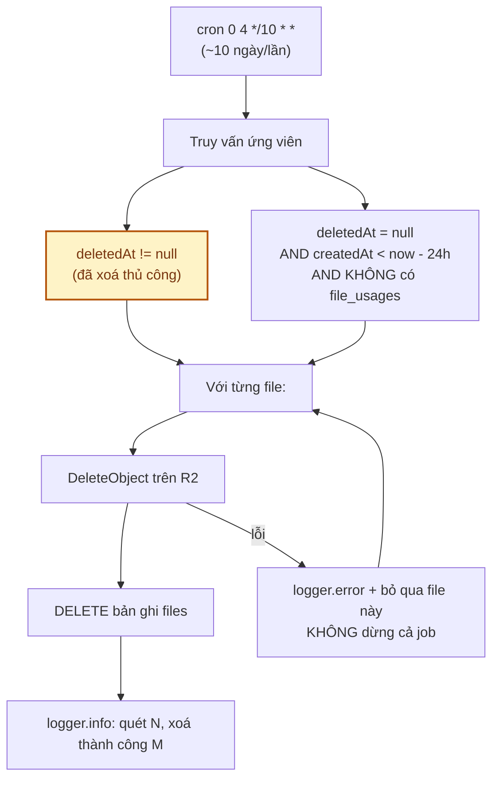

# Module: Files 🔧 Core

Upload và quản lý file/ảnh trên **Cloudflare R2** (S3-compatible), kèm cơ chế đánh dấu tái sử dụng
và dọn file mồ côi.

| | |
|---|---|
| **Loại** | 🔧 Core |
| **Backend** | `modules/core/files/` · `jobs/cleanupOrphanFiles.job.ts` · `config/r2.ts` |
| **Frontend** | `features/core/files/` |
| **Bảng DB** | `files` · `file_usages` · `folders` |
| **Endpoint** | `/api/v1/files/*` — xem [06 · API §6](../06-api-reference.md) |

> **Kế hoạch Phase 4** trong tài liệu cũ là đổi tên `files` → `media` + tách `StorageService`.
> Đánh giá lại ở [12 §5.3](../12-danh-gia-va-de-xuat.md): **hoãn** — hiện `files.service` đã cô lập R2
> đủ tốt, tách thêm lớp nữa là over-engineering khi chưa có kế hoạch đổi nhà cung cấp.

---

## 1. Luồng upload — file KHÔNG đi qua server

**Vì sao presigned URL?** Ảnh hoa có thể vài MB. Nếu đi qua Express, mỗi lượt upload chiếm RAM và
băng thông của API server — với dịp cao điểm nhiều admin cùng đăng sản phẩm, đó là điểm nghẽn không
cần thiết. R2 nhận file trực tiếp còn backend chỉ ký một chuỗi.

---

## 2. Bảng `file_usages` — cơ chế tái sử dụng

| Hàm | Ngữ nghĩa | Dùng khi |
|---|---|---|
| `setEntityFile()` | **Thay thế** — gỡ mọi usage cũ của entity rồi gắn file mới | Ảnh đại diện (1 entity ↔ 1 ảnh): avatar, ảnh danh mục |
| `addFileUsage()` | **Thêm** — `upsert`, không gỡ cái cũ | Bộ sưu tập ảnh (1 entity ↔ nhiều ảnh): thư viện ảnh sản phẩm |

Đổi avatar không xoá ảnh cũ ngay — ảnh cũ chỉ **hết được tính là đang dùng**, job dọn sẽ xử lý sau.
Nghĩa là nếu đổi nhầm, ảnh cũ vẫn còn trên R2 trong ít nhất 24 giờ.

---

## 3. Vòng đời một file

> ⚠️ **Khác biệt giữa comment và code** (`BE-09` ở [12](../12-danh-gia-va-de-xuat.md)):
> `softDeleteFile` nói R2 object bị purge "ở lượt quét sau để có khoảng đệm an toàn", nhưng job xoá
> **mọi** file có `deletedAt != null` bất kể xoá cách đây bao lâu. Xoá nhầm lúc 03:59 thì 04:00 là mất.

---

## 4. Bảo mật

| Biện pháp | Cài đặt | Chống điều gì |
|---|---|---|
| Giới hạn loại file | zod `enum`: jpeg, png, webp, gif, pdf | Upload mã độc / file thực thi |
| Giới hạn dung lượng | 10 MB | Làm đầy dung lượng lưu trữ |
| Ràng buộc trong **chữ ký** | `ContentType` + `ContentLength` nằm trong presigned URL | Client tự đổi loại/kích thước sau khi lấy URL |
| Tên file ngẫu nhiên | `crypto.randomUUID()` | *Path traversal*, trùng tên, đoán được đường dẫn file người khác |
| URL hết hạn ngắn | 5 phút | URL bị chia sẻ lại để upload tuỳ ý |
| Phân quyền | Presign/create: mọi user đã đăng nhập (để tự đổi avatar) List/delete: cần `files.manage` | Người dùng thường xem/xoá kho file chung |

**Còn thiếu** (`BE-10`): `POST /files` nhận `r2Key` bất kỳ mà không kiểm chứng key đó do server ký ra,
cũng không kiểm tra object tồn tại. Tác động hiện tại thấp (UUID khó đoán) nhưng nên siết trước khi
mở màn quản lý tài nguyên.

---

## 5. Job dọn file mồ côi

Job **không dừng** khi một file lỗi — ghi log rồi đi tiếp, để một object hỏng trên R2 không chặn việc
dọn toàn bộ phần còn lại.

---

## 6. Kiểm thử

`backend/tests/unit/modules/files.service.test.ts` — 14 test:
key là UUID không dùng tên gốc · giữ phần mở rộng · TTL 5 phút · `ContentType`/`ContentLength` trong
chữ ký · `publicUrl` · loại trừ file xoá mềm khi liệt kê · `setEntityFile` gỡ usage cũ trước ·
`softDeleteFile` **không** purge R2 ngay.

Kiểm chứng ràng buộc qua HTTP: `backend/tests/integration/rbac.test.ts` — từ chối mime lạ,
từ chối file > 10MB, member được presign nhưng không được liệt kê.

---

## 7. Việc còn lại

| Việc | Ưu tiên | Mã |
|---|:---:|---|
| Kiểm chứng `r2Key` khi tạo bản ghi | 🟡 | `BE-10` |
| Cửa sổ an toàn 24h cho file xoá mềm | 🟡 | `BE-09` |
| CRUD `folders` (bảng đã có, API chưa có) | 🟢 | `BE-19` |
| Màn quản lý tài nguyên (cây thư mục, grid/list) | 🟢 | — |
| Tạo ảnh thumbnail / nhiều kích thước | 🟢 | Quan trọng cho trang danh sách sản phẩm |
| Quét virus với ảnh do khách hàng tải lên (review) | 🟢 | [07 §3](../07-bao-mat.md) |
