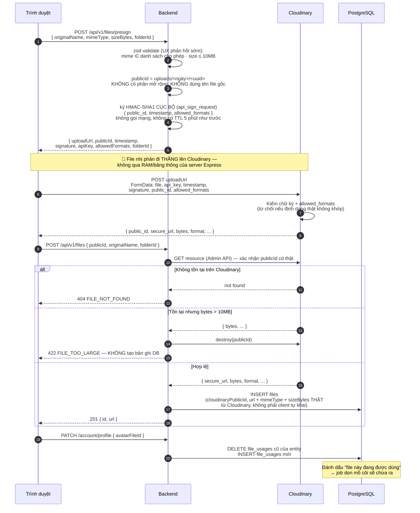
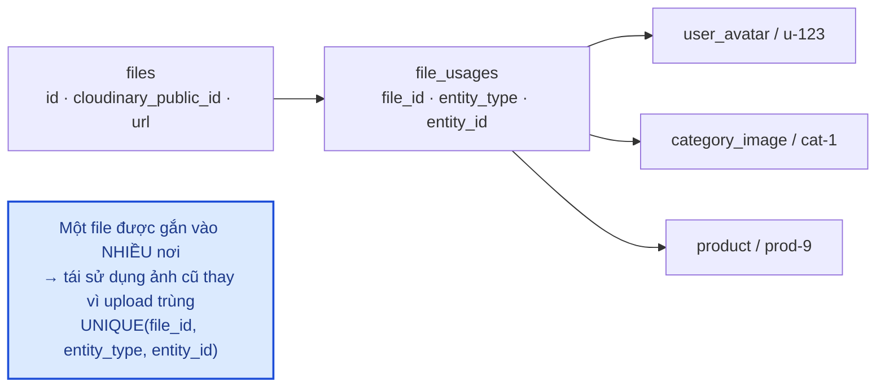
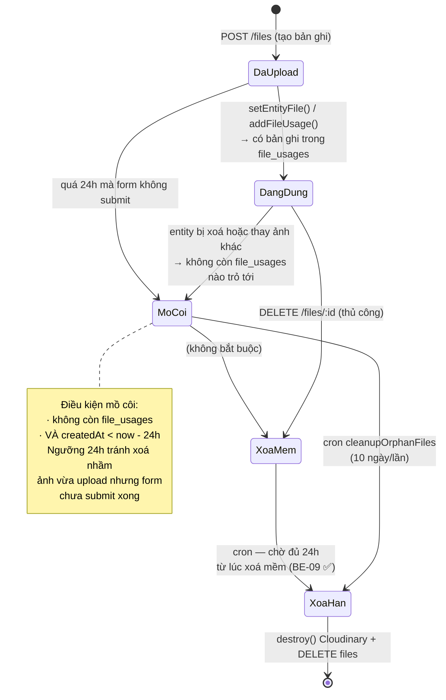
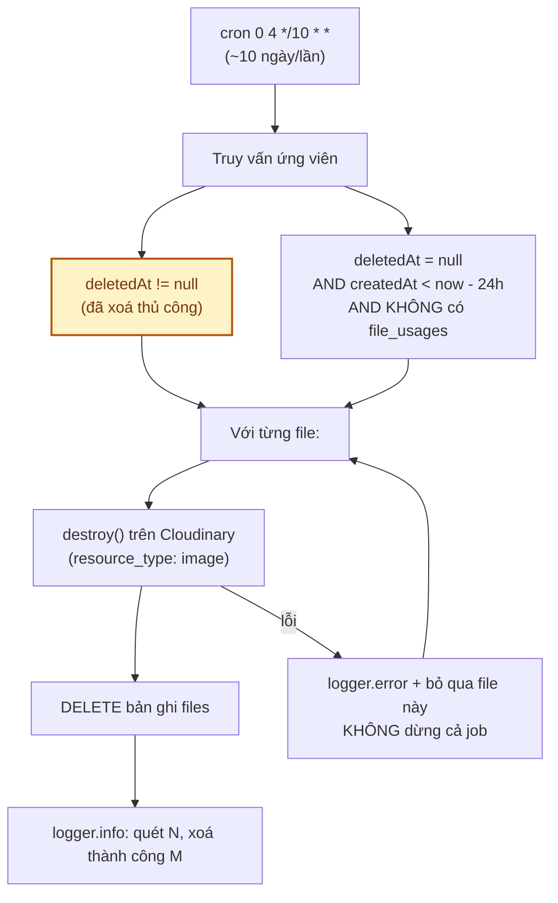
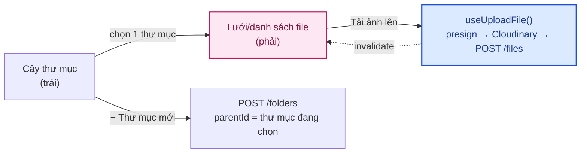

# Module: Files 🔧 Core

Upload và quản lý file/ảnh trên **Cloudinary** (dịch vụ lưu trữ đám mây cho ảnh/file — dùng
`resource_type: "image"` cho module này, và `"raw"` cho backup database, xem
[§5](#5-job-dọn-file-mồ-côi) và [10 · Triển khai §7](../10-trien-khai-van-hanh.md)),
kèm cơ chế đánh dấu tái sử dụng và dọn file mồ côi.

| | |
|---|---|
| **Loại** | 🔧 Core |
| **Backend** | `modules/core/files/` · `jobs/cleanupOrphanFiles.job.ts` · `config/cloudinary.ts` |
| **Frontend** | `features/core/files/` · `app/(dashboard)/admin/resources/page.tsx` |
| **Bảng DB** | `files` · `file_usages` · `folders` |
| **Endpoint** | `/api/v1/files/*` · `/api/v1/folders/*` — xem [06 · API §6/§6b](../06-api-reference.md) |

> **Kế hoạch Phase 4** trong tài liệu cũ là đổi tên `files` → `media` + tách `StorageService`.
> Đánh giá lại ở [12 §5.3](../12-danh-gia-va-de-xuat.md): dự án **đã đổi nhà cung cấp lưu trữ**
> (Cloudflare R2 → Cloudinary, 09/2026) — đúng điều kiện "khi thực sự cần đổi nhà cung cấp" mà tài
> liệu cũ đặt ra để cân nhắc tách `StorageService` — nhưng **vẫn hoãn** việc tách: `files.service.ts`
> là nơi duy nhất chạm Cloudinary, đổi provider chỉ cần sửa đúng 1 file này, không phải sửa business
> logic ở nơi khác. Đây là bằng chứng ủng hộ lập luận cũ (tách thêm lớp là over-engineering khi
> `files.service` đã cô lập nhà cung cấp đủ tốt), không phải phản bác nó.

---

## 1. Luồng upload — file KHÔNG đi qua server

**Vì sao upload trực tiếp lên Cloudinary?** Ảnh hoa có thể vài MB. Nếu đi qua Express, mỗi lượt
upload chiếm RAM và băng thông của API server — với dịp cao điểm nhiều admin cùng đăng sản phẩm, đó
là điểm nghẽn không cần thiết. Cloudinary nhận file trực tiếp còn backend chỉ ký một chuỗi (HMAC-SHA1,
tính cục bộ bằng `cloudinary.utils.api_sign_request`, không gọi mạng lúc ký).

> **Khác biệt bảo mật so với R2 trước đây — viết thật, không tô hồng.** S3 `PutObjectCommand` ràng
> buộc được CẢ content-type VÀ kích thước ngay trong chữ ký — client không lách được. Chữ ký
> `api_sign_request` của Cloudinary **không có tham số tương đương để ràng buộc kích thước**, chỉ
> ràng buộc được định dạng qua `allowed_formats`. Bù lại, kích thước được xác minh **ngay sau khi
> upload xong** (gọi Cloudinary Admin API lấy `bytes` thật), **trước khi** tạo bất kỳ bản ghi DB nào
> — file vượt hạn mức bị xoá luôn trên Cloudinary, không tạo rác lâu dài. Đây là "kiểm chứng sau khi
> upload", không phải "chặn trước khi upload" như S3 — một đánh đổi hợp lý, không phải lỗ hổng bị bỏ
> sót. Xem thêm bảng §4.

---

## 2. Bảng `file_usages` — cơ chế tái sử dụng

| Hàm | Ngữ nghĩa | Dùng khi |
|---|---|---|
| `setEntityFile()` | **Thay thế** — gỡ mọi usage cũ của entity rồi gắn file mới | Ảnh đại diện (1 entity ↔ 1 ảnh): avatar, ảnh danh mục |
| `addFileUsage()` | **Thêm** — `upsert`, không gỡ cái cũ | Bộ sưu tập ảnh (1 entity ↔ nhiều ảnh): thư viện ảnh sản phẩm |

Đổi avatar không xoá ảnh cũ ngay — ảnh cũ chỉ **hết được tính là đang dùng**, job dọn sẽ xử lý sau.
Nghĩa là nếu đổi nhầm, ảnh cũ vẫn còn trên Cloudinary trong ít nhất 24 giờ.

---

## 3. Vòng đời một file

> ✅ **`BE-09` đã xử lý** (10/09/2026, xem [12](../12-danh-gia-va-de-xuat.md)): trước đây comment ở
> `softDeleteFile` nói Cloudinary object bị purge "ở lượt quét sau để có khoảng đệm an toàn", nhưng
> job lại xoá **mọi** file có `deletedAt != null` bất kể xoá cách đây bao lâu — xoá nhầm lúc 03:59 thì
> 04:00 là mất vĩnh viễn. Đã đổi điều kiện query sang `deletedAt: { lt: cutoff }`, dùng chung ngưỡng
> 24h với nhánh mồ côi bên trên.

---

## 4. Bảo mật

| Biện pháp | Cài đặt | Chống điều gì |
|---|---|---|
| Giới hạn loại file | zod `enum` ở bước presign (jpeg/png/webp/gif/pdf, chỉ để phản hồi sớm cho UX) **+** Cloudinary `allowed_formats` ký trong chữ ký HMAC-SHA1 ở bước upload thật (ràng buộc mật mã học, client không lách được) | Upload mã độc / file thực thi |
| Giới hạn dung lượng | zod ở bước presign (UX, **không** phải ràng buộc mật mã học) **+** kiểm chứng lại bằng Cloudinary Admin API ngay sau khi upload — vượt 10MB thì xoá luôn trên Cloudinary, không tạo bản ghi DB | Làm đầy dung lượng lưu trữ |
| Ràng buộc trong **chữ ký** | Chỉ `allowed_formats` nằm trong chữ ký — **khác S3 trước đây**: Cloudinary không có tham số tương đương `ContentLength` để ràng buộc kích thước ngay trong chữ ký | Client tự đổi định dạng sau khi lấy chữ ký (kích thước xử lý bằng kiểm chứng sau upload, xem trên) |
| Tên file ngẫu nhiên | `crypto.randomUUID()` trong `publicId` | *Path traversal*, trùng tên, đoán được đường dẫn file người khác |
| Kiểm chứng `publicId` tồn tại thật | `createFileRecord` luôn gọi Cloudinary Admin API (`cloudinary.api.resource`) trước khi ghi DB — `publicId` không có object thật trả `404 FILE_NOT_FOUND` | Tạo bản ghi DB trỏ tới file không tồn tại/không do server tạo |
| Phân quyền | Presign/create: mọi user đã đăng nhập (để tự đổi avatar) List/delete: cần `files.manage` | Người dùng thường xem/xoá kho file chung |

**Đã xử lý phần lớn** (`BE-10` — trước đây `POST /files` nhận `r2Key` bất kỳ mà không kiểm chứng):
`createFileRecord` giờ luôn gọi Cloudinary Admin API để xác nhận `publicId` có tồn tại thật, và lấy
`mimeType`/`sizeBytes` từ dữ liệu Cloudinary trả về — không tin metadata client tự khai nữa. Còn lại
một điểm chưa mạnh hơn flow cũ: việc này **không** chứng minh được `publicId` đó đúng là do **chính
user gửi request** vừa upload (cả 2 đời flow đều chỉ dựa vào việc UUID khó đoán) — nhưng đã **chặn
hoàn toàn** việc tạo bản ghi DB với metadata bịa đặt hoặc file không tồn tại, đó chính là lỗ hổng gốc
mà `BE-10` mô tả, nên coi là đã đóng.

---

## 5. Job dọn file mồ côi

Job **không dừng** khi một file lỗi — ghi log rồi đi tiếp, để một object hỏng trên Cloudinary không
chặn việc dọn toàn bộ phần còn lại.

---

## 6. Kiểm thử

`backend/tests/unit/modules/files.service.test.ts` — 16 test:
`publicId` là UUID không dùng tên gốc · ký HMAC đúng bộ tham số `public_id`/`timestamp`/
`allowed_formats` · giới hạn định dạng qua `allowed_formats` · `uploadUrl` đúng `cloud_name` +
`resourceType: image` (Cloudinary xem PDF là ảnh) · tra `publicId` qua Admin API trước khi ghi DB
(không tin metadata client khai) · `404 FILE_NOT_FOUND` khi `publicId` không tồn tại trên Cloudinary
(đóng lỗ hổng `BE-10`) · vượt 10MB thì xoá trên Cloudinary và **không** tạo bản ghi DB · loại trừ
file xoá mềm khi liệt kê · **bỏ trống `folderId` → chỉ file cấp gốc, có `folderId` → đúng thư mục đó**
(11/09/2026, §8) · `setEntityFile` gỡ usage cũ trước · `softDeleteFile` **không** purge Cloudinary ngay.

Kiểm chứng ràng buộc qua HTTP: `backend/tests/integration/rbac.test.ts` — từ chối mime lạ và file
vượt quá 10MB **ở bước presign** (zod, phản hồi sớm cho UX — không phải ràng buộc mật mã học cuối
cùng, xem §1/§4), member được presign nhưng không được liệt kê.

---

## 7. Việc còn lại

| Việc | Ưu tiên | Mã |
|---|:---:|---|
| ~~Cửa sổ an toàn 24h cho file xoá mềm~~ | ✅ | `BE-09` (10/09/2026) |
| Chứng minh `publicId` do đúng user gửi request vừa upload (hiện chỉ chứng minh publicId có thật, chưa chứng minh chủ sở hữu — tác động thấp vì UUID khó đoán) | 🟢 | `BE-10` (phần còn lại) |
| ~~CRUD `folders` (bảng đã có, API chưa có)~~ | ✅ | `BE-19` (11/09/2026) — chỉ API, chưa có màn UI |
| ~~Màn quản lý tài nguyên (cây thư mục, grid/list)~~ | ✅ | 11/09/2026 — xem [§8](#8-màn-hình-quản-lý-tài-nguyên-frontend) |
| Tạo ảnh thumbnail / nhiều kích thước | 🟢 | Quan trọng cho trang danh sách sản phẩm |
| Quét virus với ảnh do khách hàng tải lên (review) | 🟢 | [07 §3](../07-bao-mat.md) |

---

## 8. Màn hình quản lý tài nguyên (frontend)

`/admin/resources` — cây thư mục (lazy-load từng cấp, khớp API `GET /folders?parentId=`) bên trái,
xem file của thư mục đang chọn dạng lưới/danh sách bên phải. Quyền `files.manage` (admin + super_admin
đều có, xem `core.seed.ts`) — backend tự kiểm tra lại ở mọi request, sidebar chỉ ẩn/hiện link.

**Bỏ trống `folderId` = cấp gốc, không phải "mọi file".** Trước khi có màn hình này,
`GET /api/v1/files` bỏ trống `folderId` trả về **toàn bộ** file bất kể thư mục nào (khác hẳn
`GET /folders` — bỏ trống `parentId` đã LUÔN nghĩa là cấp gốc từ trước). Endpoint `/files` chưa từng
có người dùng thật nào trước màn hình này (audit dead-code khi xây tính năng), nên sửa lại `folderId`
cho khớp đúng quy ước của `folders` — không phải thay đổi hành vi đang được ai đó phụ thuộc. Xem
`backend/src/modules/core/files/files.service.ts`.

Frontend mới: `features/core/files/folders.service.ts` + `folders.hooks.ts` (trước đây module Files
chỉ có phần file, chưa có phần thư mục ở tầng frontend dù backend đã xong từ `BE-19`).

Kiểm thử: `backend/tests/unit/modules/files.service.test.ts` (2 test mới cho hành vi `folderId`),
`frontend/tests/unit/services.test.ts` + `frontend/tests/components/hooks.test.tsx` (service/hook mới
cho folders, và toast lỗi/thành công cho upload/xoá — trước đây `useUploadFile`/`useDeleteFile` không
có phản hồi lỗi nào cho người dùng). **Đã kiểm chứng thật** bằng Playwright trên dữ liệu thật: tạo thư
mục → tải ảnh thật lên → xem đúng ở dạng lưới và danh sách → đổi tên thư mục → quay về gốc xác nhận
KHÔNG lẫn file của thư mục con (đúng phạm vi lọc).
