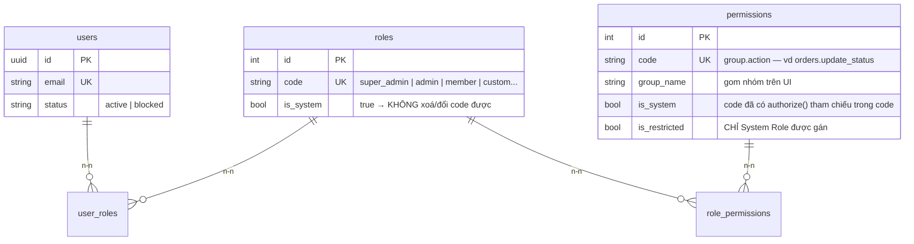
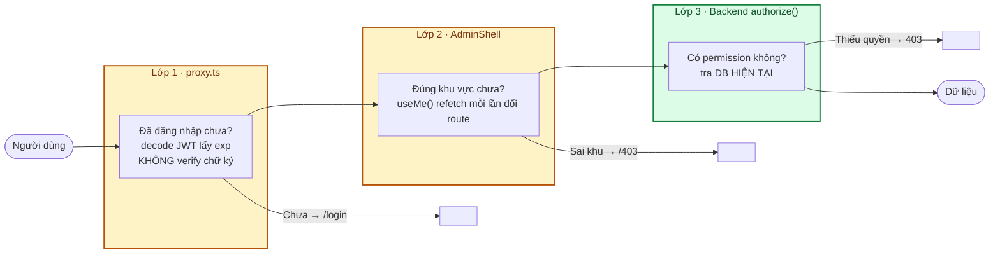
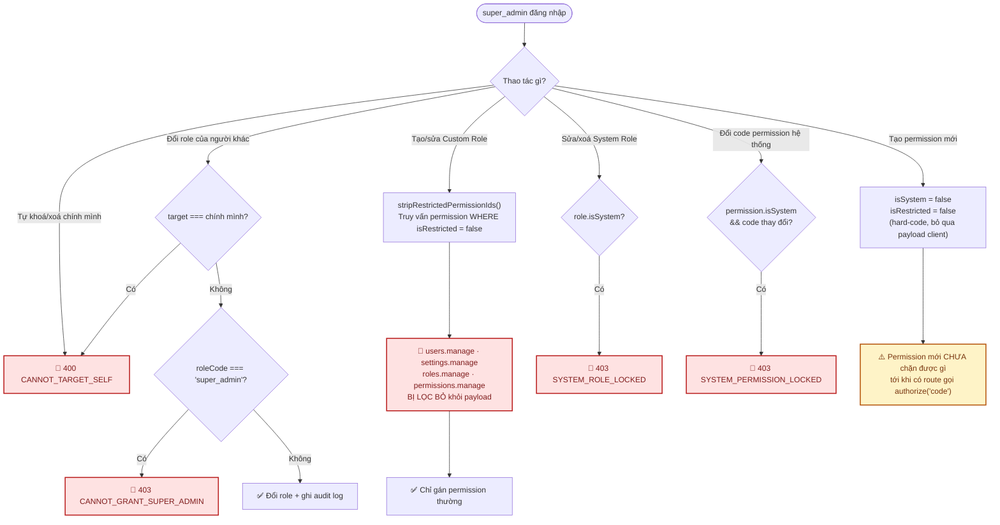

# Module: RBAC 🔧 Core

Phân quyền dựa trên vai trò — gồm 4 module backend phối hợp: `users` (admin), `roles`,
`permissions`, và middleware `authenticate`/`authorize`.

| | |
|---|---|
| **Loại** | 🔧 Core |
| **Backend** | `modules/core/users/` · `modules/core/roles/` · `modules/core/permissions/` · `shared/middleware/` · `shared/utils/rbac.ts` |
| **Frontend** | `features/core/admin-users/` · `admin-roles/` · `admin-permissions/` · `components/admin/AdminShell.tsx` |
| **Bảng DB** | `users` · `roles` · `permissions` · `role_permissions` · `user_roles` |
| **Endpoint** | `/api/v1/superadmin/users|roles|permissions` — xem [06 · API §8–10](../06-api-reference.md) |

---

## 1. Mô hình dữ liệu

**Hai cờ, hai mục đích khác nhau — đừng nhầm:**

| Cờ | Bảo vệ điều gì | Nếu thiếu |
|---|---|---|
| `is_system` | **Tính toàn vẹn của code** — permission đã được `authorize('code')` tham chiếu, đổi/xoá `code` sẽ làm route mất kiểm soát quyền | Route có thể *fail-open* (cho qua hết) hoặc *fail-closed* (chặn hết người hợp lệ) |
| `is_restricted` | **Chống leo thang quyền** — permission chỉ tồn tại ở System Role, không role tự tạo nào gán được | super_admin tạo Custom Role gán `users.manage` → "shadow super_admin" |

---

## 2. Quyết định cốt lõi: tra DB mỗi request

```mermaid
flowchart TD
    subgraph BAD["❌ Cách phổ biến: nhúng vào JWT"]
        B1["Lúc login: nhúng<br/>roles + permissions vào JWT"] --> B2["Mỗi request: đọc từ token<br/>(nhanh, không query)"]
        B2 --> B3["😱 super_admin hạ quyền một nhân viên<br/>lúc 9:00"]
        B3 --> B4["Nhân viên VẪN GIỮ QUYỀN CŨ<br/>tới khi token hết hạn<br/>hoặc tự đăng xuất"]
    end

    subgraph GOOD["✅ Cách của dự án này"]
        G1["JWT chỉ chứa sub (user id)"] --> G2["Mỗi request: authenticate<br/>→ loadUserRolesAndPermissions(userId)<br/>JOIN user_roles ⋈ roles ⋈ role_permissions"]
        G2 --> G3["super_admin hạ quyền lúc 9:00"]
        G3 --> G4["✅ Request TIẾP THEO đã mất quyền<br/>không cần đăng xuất"]
    end

    style B4 fill:#fee2e2,stroke:#b91c1c,stroke-width:2px,color:#7f1d1d
    style G4 fill:#dcfce7,stroke:#15803d,stroke-width:2px,color:#14532d
```

**Cái giá phải trả**: một truy vấn JOIN nhỏ trên mỗi request đã xác thực. Chấp nhận được vì:
- Đã có index trên `user_roles(user_id)` và `role_permissions(role_id)`;
- Đây không phải *hot path* tần suất cực cao (API quản trị, không phải endpoint public);
- Đổi lại là **tính đúng đắn của phân quyền** — thứ không nên đánh đổi để lấy vài mili-giây.

> Chưa cần cache Redis. Chỉ thêm khi đo được nghẽn thật — xem [12 §5.4](../12-danh-gia-va-de-xuat.md).

---

## 3. Ba lớp bảo vệ (chỉ lớp 3 là bảo mật thật)

| Lớp | Mục đích | Bỏ qua được không? |
|---|---|---|
| 1 · `proxy.ts` | Không cho vào trang rồi mới báo lỗi | **Có** — người dùng tự sửa cookie/gọi API trực tiếp |
| 2 · `AdminShell` | Không hiện nội dung khu vực không thuộc về mình | **Có** — chạy ở trình duyệt |
| 3 · `authorize()` | **Ranh giới bảo mật thật** | **Không** — chạy ở server, tra DB |

**Hệ quả thực hành**: mọi tính năng mới phải có kiểm tra ở lớp 3. Ẩn nút trên UI là trải nghiệm,
không phải bảo mật. Test E2E của dự án kiểm chứng điều này bằng cách gọi thẳng API sau khi đăng nhập
bằng tài khoản `member` — xem `frontend/e2e/auth.spec.ts`.

---

## 4. Chống leo thang quyền

**Mọi chốt chặn đều nằm ở tầng service**, không phụ thuộc UI. Test kiểm chứng bằng cách gửi payload
cố tình vi phạm — xem `backend/tests/unit/modules/roles.service.test.ts` và
`backend/tests/integration/superadmin.routes.test.ts`.

> **Ngoại lệ có chủ đích**: `reset-password` **không** chặn chính mình. SuperAdmin tự reset mật khẩu
> của mình là thao tác hợp lệ (khác hẳn tự khoá/tự xoá — hai việc đó sẽ tự khoá mình ra khỏi hệ thống).

### Vì sao `super_admin` cũng cần được gán permission?

`authorize()` **chỉ so khớp permission thật sự được gán** — không có luật ngầm "super_admin là được
làm mọi thứ". Nếu chỉ chạy `seed:core` mà quên `seed:domain`, `super_admin` sẽ bị `403 FORBIDDEN` ở
các API domain. Đây là **chủ đích** (không có đường tắt bỏ qua kiểm tra quyền), nhưng dễ gây bối rối —
vì vậy `domain.seed.ts` gán permission domain cho **cả `admin` lẫn `super_admin`**.

---

## 5. Ma trận vai trò × quyền

Ma trận đầy đủ: [05 · Database §2.4](../05-database-va-rbac.md#24-ma-trận-vai-trò--quyền-mặc-định-seed).
Tóm tắt phần core:

| Permission | super_admin | admin | member | Ghi chú |
|---|:---:|:---:|:---:|---|
| `users.manage` 🔒 | ✅ | – | – | Quản lý tài khoản — đặc quyền tuyệt đối |
| `settings.manage` 🔒 | ✅ | – | – | Bật/tắt phương thức đăng nhập |
| `roles.manage` 🔒 | ✅ | – | – | CRUD Custom Role |
| `permissions.manage` 🔒 | ✅ | – | – | CRUD Permission |
| `audit.view` | ✅ | – | – | Xem nhật ký thao tác |
| `files.manage` | ✅ | ✅ | – | Màn quản lý tài nguyên |

🔒 = `is_restricted = true`

---

## 6. Frontend

| Thành phần | Vai trò |
|---|---|
| `components/admin/AdminShell.tsx` | Kiểm tra role bằng `useMe()` **refetch mỗi lần đổi route**, dựng menu theo quyền, đá về `/403` nếu sai khu |
| `components/admin/PermissionPicker.tsx` | Tick chọn permission khi tạo/sửa role — gọi `?assignable=true` để **không hiện permission `is_restricted`** |
| `features/core/admin-users/` | Danh sách + block/unblock/xoá/reset password/đổi role |
| `features/core/admin-roles/` | CRUD Custom Role |
| `features/core/admin-permissions/` | CRUD Permission |
| `app/403/page.tsx` | Trang báo thiếu quyền — cố tình **khác** `/login` (người dùng đã đăng nhập rồi) và khác trang chủ (không âm thầm chuyển hướng) |

**Vì sao `AdminShell` phải `refetch` chứ không đọc cache?** Cache `useMe()` có `staleTime` 30 giây.
Nếu role vừa bị hạ trong 30 giây đó, cache cũ sẽ cho render nội dung trang thật một nhịp trước khi
phát hiện mất quyền. `authorized` chỉ được tin khi kết quả refetch ứng **đúng `pathname` hiện tại**.

---

## 7. Kiểm thử

| File | Bao phủ |
|---|---|
| `backend/tests/unit/shared/middleware.test.ts` | `authorize` yêu cầu đủ **tất cả** permission; role không thay được permission |
| `backend/tests/unit/shared/authenticate.test.ts` | Tra DB mỗi request, gộp permission từ nhiều role |
| `backend/tests/unit/modules/users.admin.service.test.ts` | 23 test — mọi chốt chặn self-target và leo thang quyền |
| `backend/tests/unit/modules/roles.service.test.ts` | 12 test — lọc `is_restricted` ở cả create lẫn update |
| `backend/tests/unit/modules/permissions.service.test.ts` | 13 test — khoá permission hệ thống |
| `backend/tests/integration/rbac.test.ts` | 33 test — **ma trận 401/403/200 cho mọi endpoint** |
| `frontend/e2e/superadmin.spec.ts` | Kiểm chứng chốt chặn trên hệ thống thật |

---

## 8. Việc còn lại

| Việc | Ưu tiên | Ghi chú |
|---|:---:|---|
| ~~**Row-level check** cho module domain~~ | ✅ | Đã làm 1/2 (`GET /api/v1/account/orders`, 11/09/2026) — còn hàng đợi giao hàng `shipper` chưa làm, xem [12 §5.1](../12-danh-gia-va-de-xuat.md) |
| ~~Transaction cho `roles.update`~~ | ✅ | `BE-06` (10/09/2026) |
| ~~Màn tra cứu Audit Log~~ | ✅ | `/superadmin/audit-logs` (11/09/2026) — lọc theo loại đối tượng/khoảng ngày, chi tiết before/after |
| Gán **nhiều role** cho một user qua UI | 🟢 | Schema `user_roles` đã hỗ trợ n-n, UI hiện chỉ cho 1 role |
