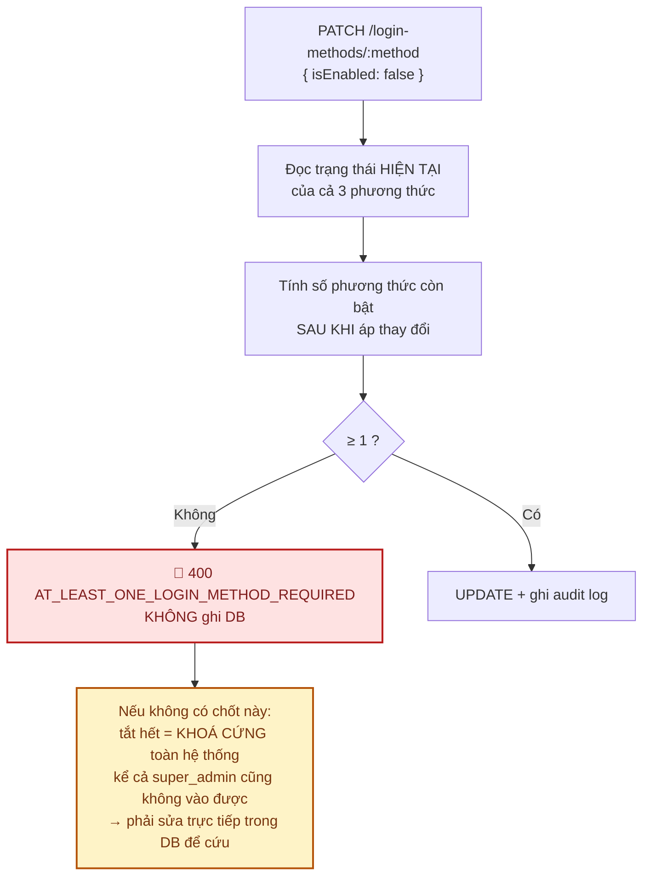
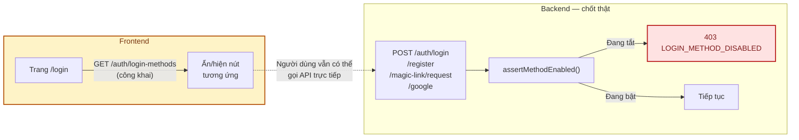
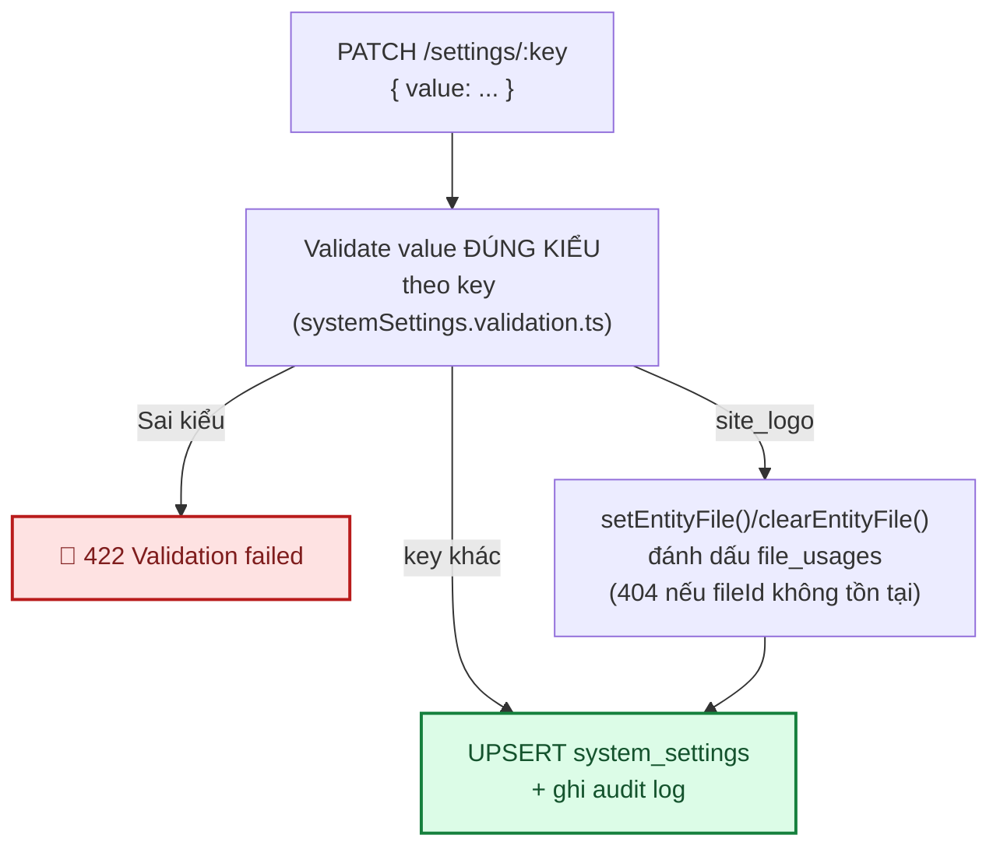
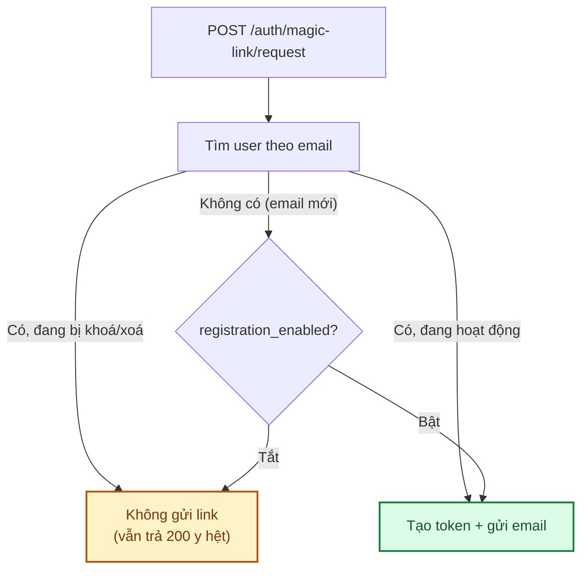

# Module: Settings 🔧 Core

Hai phần: bật/tắt từng phương thức đăng nhập (`login_method_settings`, §1-§3), và cấu hình hệ thống
key-value tổng quát (`system_settings`, §4-§7, docs/12 Phase 4).

| | |
|---|---|
| **Loại** | 🔧 Core |
| **Backend** | `modules/core/settings/` |
| **Frontend** | `features/core/admin-login-methods/` · `features/core/admin-settings/` · `app/(dashboard)/superadmin/login-methods/` · `app/(dashboard)/superadmin/settings/` |
| **Bảng DB** | `login_method_settings` · `system_settings` |
| **Endpoint** | `/api/v1/superadmin/login-methods` · `/api/v1/superadmin/settings` (cả 2 cần `settings.manage` 🔒) |

---

## 1. Chốt chặn quan trọng nhất: luôn còn ≥ 1 phương thức bật

Điểm tinh tế: kiểm tra dựa trên trạng thái **sau khi áp thay đổi**, không phải trước. Đang bật 2, tắt
1 → còn 1 → hợp lệ. Đang bật 1, tắt nốt → còn 0 → chặn.

**Chốt nằm ở tầng service**, không chỉ ở UI. Test kiểm chứng bằng cách gọi thẳng API —
`backend/tests/integration/superadmin.routes.test.ts` và `frontend/e2e/superadmin.spec.ts`.

---

## 2. Ảnh hưởng tới luồng đăng nhập

Ẩn nút trên UI chỉ là trải nghiệm. **Backend luôn kiểm tra lại** ở mỗi luồng đăng nhập.

---

## 3. Kiểm thử

`backend/tests/unit/modules/loginMethods.service.test.ts` — 6 test: chặn tắt phương thức cuối · cho tắt
khi còn phương thức khác · bật lại luôn được · tính trạng thái sau thay đổi · 404 với phương thức lạ ·
audit log kèm before/after.

---

## 4. `system_settings` — key-value tổng quát (✅ 11/09/2026)

Bảng `system_settings` (PK là `key`, `value` JSON-encode) — **KHÔNG gộp chung** với
`login_method_settings` trong lần triển khai này (2 bảng riêng, xem §7). 4 key đã có ý nghĩa thật:

| Key | Kiểu | Enforcement |
|---|---|---|
| `site_name` | string | Chưa nơi nào đọc lại (chuẩn bị cho khi storefront cần) |
| `site_logo` | uuid (fileId) \| null | Chưa nơi nào đọc lại — có đánh dấu `file_usages` để cron mồ côi không xoá nhầm |
| `timezone` | string (IANA) | Chưa nơi nào đọc lại |
| `registration_enabled` | boolean | ✅ Có thật — chặn `POST /auth/register`, nhánh tự tạo tài khoản của `loginWithGoogle()` (Google mới) |

**site_logo lưu fileId, không lưu URL trực tiếp** — giữ đúng quy ước tham chiếu file của phần còn lại
hệ thống (`avatarFileId`, `imageFileId`...), để job dọn file mồ côi (docs/modules/core-files.md §5)
không xoá nhầm logo đang dùng. Đổi lại, response `GET`/`PATCH` phải **join thêm `url`** để frontend
hiển thị ngay (`{ fileId, url } | null`) — khác hẳn body `PATCH` gửi lên (chỉ `fileId` thô). Xem
`backend/src/modules/core/settings/systemSettings.service.ts#resolveDisplayValue`.

**`registration_enabled` khác `login_method_settings` ở đâu?** `login_method_settings` khoá riêng
từng KÊNH ĐĂNG NHẬP (kể cả cho user đã có tài khoản — tắt `email_password` thì user cũ cũng không
đăng nhập được bằng mật khẩu nữa). `registration_enabled` là công tắc TỔNG cho việc TẠO TÀI KHOẢN
MỚI — user đã tồn tại không bị ảnh hưởng dù cờ này tắt.

**Chưa làm — `maintenance_mode`**: cố ý **không** thêm trong lần này. Phải có middleware chặn toàn
site + đường thoát cho `super_admin` (không có sẽ tự khoá mình ra ngoài, đúng loại lỗi chốt chặn ở §1
đang phòng ngừa) — độ phức tạp/rủi ro cao hơn hẳn phần còn lại, cần thiết kế riêng.

---

## 5. Kiểm thử system_settings

`backend/tests/unit/modules/systemSettings.service.test.ts` (13 test) — `list()` giải mã đúng JSON
từng kiểu, `getValue()` trả `undefined` khi key chưa seed (không throw), validate sai kiểu theo từng
key → 422, `site_logo` hợp lệ đánh dấu `file_usages` + trả kèm `url`, `site_logo` trỏ file không tồn
tại → 404, `site_logo = null` gỡ `file_usages`, audit log kèm before/after đã giải mã.

`backend/tests/integration/systemSettings.routes.test.ts` (6 test) — 401/403/422 qua HTTP thật.

`backend/tests/unit/modules/auth.service.test.ts` — test riêng cho `registration_enabled` ở cả 3
đường tạo tài khoản: chặn `register()`, chặn tài khoản Google MỚI (không chặn Google đã tồn tại), và
`requestMagicLink()`/`verifyMagicLink()` (xem §6 — nối lại đăng ký qua magic link).

**Đã kiểm chứng thật**: chạy migration + seed thật, gọi API thật qua `curl` (PATCH đổi `site_name`,
bật/tắt `registration_enabled` rồi thử `POST /auth/register` thật — xác nhận đúng `403
REGISTRATION_DISABLED`), và Playwright mở `/superadmin/settings` thật trong trình duyệt — sửa tên
website, bật/tắt cờ đăng ký, toast xác nhận đúng.

---

## 6. `BE-20` · Nối lại đăng ký qua magic link (✅ 11/09/2026)

**Phát hiện**: `verifyMagicLink()` có nhánh "tự tạo tài khoản" (comment nói *"magic link đóng luôn
vai trò đăng ký nhanh"*, khớp mô tả ở [docs/06 §4](../06-api-reference.md)) nhưng KHÔNG BAO GIỜ chạy
tới được — `requestMagicLink()` chỉ tạo token (và gửi email) khi email **đã có tài khoản**, nên email
chưa từng đăng ký không nhận được link nào cả để chạm tới nhánh tự tạo tài khoản đó.

**Đã sửa** (chọn hướng nối lại tính năng, khớp đúng mô tả tài liệu ban đầu): bỏ điều kiện `user &&` ở
`requestMagicLink()` — giờ gửi link cho **mọi** email chưa bị khoá/xoá mềm, kể cả email chưa từng có
tài khoản (token gắn `userId: undefined` → `null` trong DB, `verifyMagicLink()` tự nhận diện và tạo
tài khoản mới khi xác nhận). Response không đổi (vẫn luôn trả 200, không lộ email nào có thật — xem
[07 §1](../07-bao-mat.md)). Vẫn chặn gửi link khi: email đã có tài khoản nhưng đang bị khoá/xoá mềm
(không cho lách khoá), hoặc email mới mà `registration_enabled` đang tắt.

**Đã kiểm chứng thật**: bật tạm `magic_link` trên DB dev, gọi `POST /auth/magic-link/request` thật với
1 email hoàn toàn mới — xác nhận có bản ghi `magic_link_tokens` với `userId = null` được tạo đúng
thiết kế.

---

## 7. Việc còn lại

| Việc | Ưu tiên | Ghi chú |
|---|:---:|---|
| `maintenance_mode` | 🟡 | Cần middleware chặn toàn site + lối thoát cho `super_admin` — thiết kế riêng, xem §4 |
| Storefront đọc `site_name`/`site_logo`/`timezone` | 🟢 | Hiện 2 key này chỉ lưu được qua UI, chưa nơi nào hiển thị ra ngoài |
| Gộp `login_method_settings` vào `system_settings` | 🟢 | Cân nhắc khi có ≥ 2 lý do thật cần, tránh tách/gộp bảng chỉ vì "cho gọn" — xem docs/02 §1 nguyên tắc chống over-engineering |
