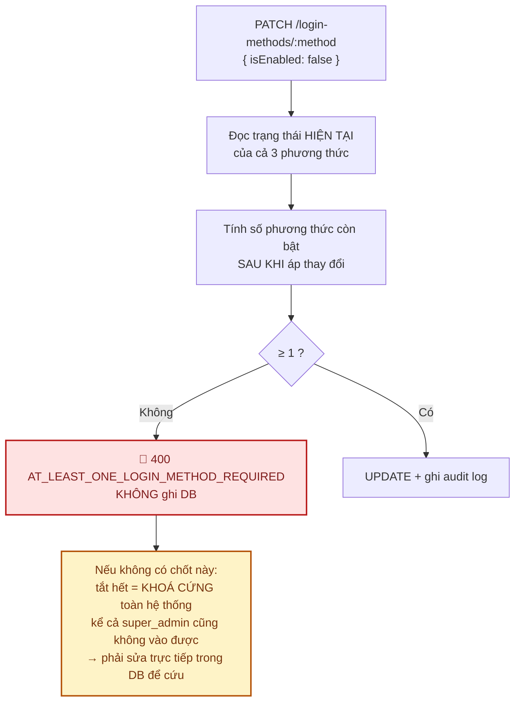
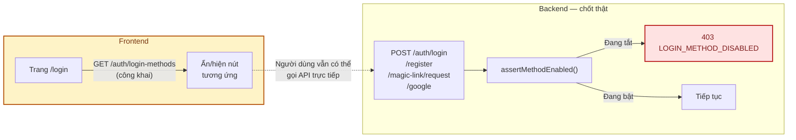

# Module: Settings 🔧 Core

Bật/tắt từng phương thức đăng nhập. Đây là **hạt nhân** của module System Settings tổng quát dự kiến
ở Phase 4.

| | |
|---|---|
| **Loại** | 🔧 Core |
| **Backend** | `modules/core/settings/` |
| **Frontend** | `features/core/admin-login-methods/` · `app/(dashboard)/superadmin/login-methods/` |
| **Bảng DB** | `login_method_settings` |
| **Endpoint** | `/api/v1/superadmin/login-methods` (cần `settings.manage` 🔒) |

---

## 1. Chốt chặn quan trọng nhất: luôn còn ≥ 1 phương thức bật



Điểm tinh tế: kiểm tra dựa trên trạng thái **sau khi áp thay đổi**, không phải trước. Đang bật 2, tắt
1 → còn 1 → hợp lệ. Đang bật 1, tắt nốt → còn 0 → chặn.

**Chốt nằm ở tầng service**, không chỉ ở UI. Test kiểm chứng bằng cách gọi thẳng API —
`backend/tests/integration/superadmin.routes.test.ts` và `frontend/e2e/superadmin.spec.ts`.

---

## 2. Ảnh hưởng tới luồng đăng nhập



Ẩn nút trên UI chỉ là trải nghiệm. **Backend luôn kiểm tra lại** ở mỗi luồng đăng nhập.

---

## 3. Kiểm thử

`backend/tests/unit/modules/loginMethods.service.test.ts` — 6 test: chặn tắt phương thức cuối · cho tắt
khi còn phương thức khác · bật lại luôn được · tính trạng thái sau thay đổi · 404 với phương thức lạ ·
audit log kèm before/after.

---

## 4. Phase 4 — mở rộng thành `system_settings`

Bảng key-value tổng quát, `modules/core/settings/` đảm nhiệm cả hai:

```
site_name · site_logo · timezone · maintenance_mode · registration_enabled
login_email_enabled · login_google_enabled · login_magic_link_enabled
```

**Lưu ý khi thiết kế**: `maintenance_mode` phải có đường thoát cho `super_admin` — nếu không, bật chế
độ bảo trì là tự khoá mình ra ngoài, đúng loại lỗi mà chốt chặn ở §1 đang phòng ngừa.
