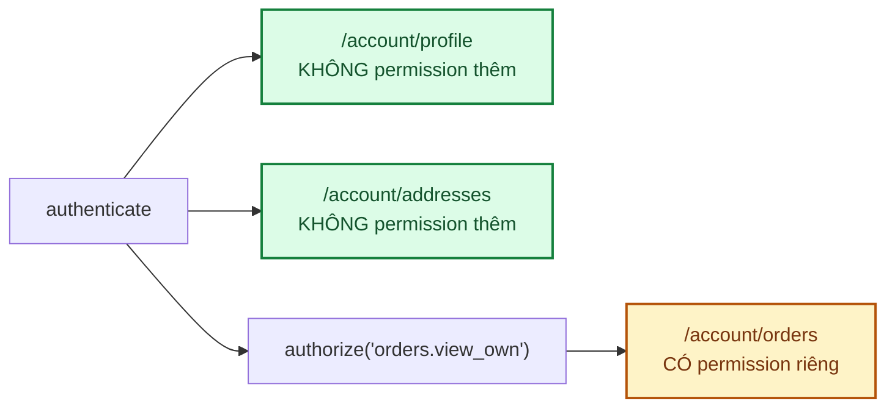
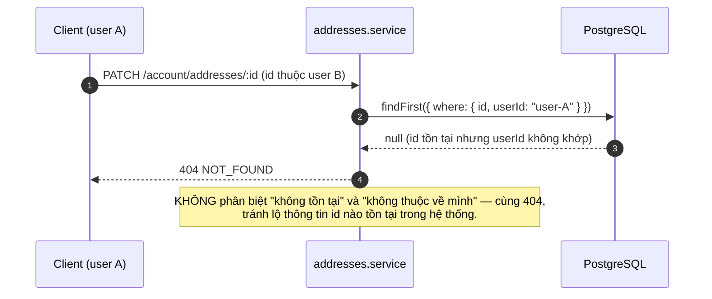
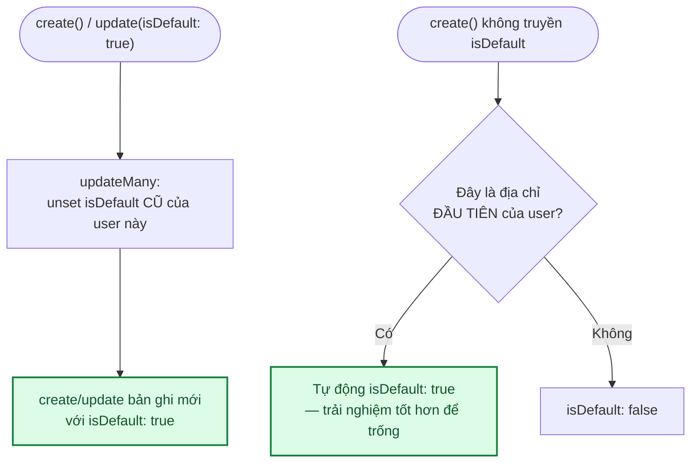

# Module: Addresses (Sổ địa chỉ) 🌸 Domain

Sổ địa chỉ người nhận — khách lưu nhiều địa chỉ giao hoa, chọn nhanh lúc đặt hàng (autofill form
checkout) thay vì gõ lại mỗi lần. Thuần dữ liệu **cá nhân**, không có RBAC riêng — khác hầu hết module
domain khác (categories/products/orders đều có permission riêng), gần với `/account/profile` hơn.

| | |
|---|---|
| **Loại** | 🌸 Domain — viết mới cho từng dự án |
| **Backend** | `modules/domain/addresses/` |
| **Frontend** | `features/core/addresses/` · `app/account/addresses/page.tsx` |
| **Bảng DB** | `addresses` |
| **Endpoint** | `/api/v1/account/addresses` (CHỈ cần đăng nhập — không permission riêng) |

---

## 1. Vì sao KHÔNG có permission riêng — khác `/account/orders`

`/account/orders` cần thêm `orders.view_own` (docs/12 §5.1) vì đó là quyền có thể **thu hồi độc lập**
với việc "là chính mình" — hữu ích nếu sau này cần tạm khoá quyền xem lịch sử đơn của 1 khách cụ thể
mà không khoá cả tài khoản. Sổ địa chỉ **không có kịch bản thu hồi tương tự** — không ai cần "khoá
quyền xem địa chỉ của chính mình nhưng vẫn cho đăng nhập bình thường". Vì vậy addresses đi theo mẫu
`/account/profile`: mount với `authenticate` duy nhất, không `authorize()` thêm.

---

## 2. Row-level check — chống IDOR ở CẢ list lẫn mutation theo id

Giống mẫu `orders.service.ts#listOwn()` (docs/12 §5.1): `list()` lọc `where: { userId }` ngay trong
query, không lấy hết rồi lọc. Nhưng khác `orders` (chỉ có list, không sửa/xoá theo id), addresses có
`update`/`remove` theo **1 bản ghi cụ thể** — đây là chỗ orders KHÔNG có tiền lệ, nên phải tự thêm:
mọi thao tác theo `id` đều `findFirst({ where: { id, userId } })` trước (ownership check), 404 nếu
không khớp — **không bao giờ** `findUnique({ where: { id } })` rồi so sánh `userId` sau, vì giữa 2
bước đó không có gì chặn thao tác nếu code sau này lỡ quên so sánh.

---

## 3. Địa chỉ mặc định — `isDefault`

Chỉ **1** địa chỉ mặc định/user. KHÔNG dùng unique index (Postgres không chặn được nhiều hàng cùng
giá trị `true` trong 1 cột boolean thường — unique index cho phép nhiều `false`/`null` nhưng cũng cho
phép nhiều `true` nếu không kèm điều kiện partial index phức tạp hơn); thay vào đó enforce ở
**service**: trước khi tạo/sửa 1 địa chỉ thành mặc định, `updateMany()` unset địa chỉ mặc định cũ.

**Xoá địa chỉ mặc định KHÔNG tự đôn địa chỉ khác lên** — khách tự chọn lại nếu cần. Đơn giản hơn là
đoán "địa chỉ nào hợp lý nhất" thay khách (vd theo `createdAt` gần nhất chưa chắc là điều khách muốn).

---

## 4. Tích hợp checkout — autofill, không bắt buộc

`app/(storefront)/thanh-toan/page.tsx` gọi `useAddresses(!!me)` — tham số `enabled` để **KHÔNG** gọi
API sổ địa chỉ khi chưa xác nhận đăng nhập (`useMe()` trả `undefined` lúc đang tải HOẶC khách vãng
lai chưa đăng nhập) — trang checkout là storefront công khai, phần lớn lượt ghé là khách KHÔNG đăng
nhập, gọi API thừa rồi nhận `401` cho mọi khách vãng lai là lãng phí không cần thiết.

Khi có `me` VÀ có ít nhất 1 địa chỉ đã lưu, hiện dropdown "Chọn từ sổ địa chỉ" phía trên form — chọn
1 địa chỉ chỉ **autofill** 3 field (`recipientName`, `recipientPhone`, `deliveryAddress` — nối
`addressLine, ward, district, city` bằng dấu phẩy), khách vẫn sửa tay được sau khi autofill. Đặt hàng
xong **không** tự lưu địa chỉ mới nhập vào sổ địa chỉ (đơn giản hoá MVP — xem §6).

---

## 5. Kiểm thử

| Tầng | File | Số test |
|---|---|---|
| Unit | `backend/tests/unit/modules/addresses.service.test.ts` | 13 — row-level filter, ownership check (update/remove), logic địa chỉ mặc định (đầu tiên tự động, unset cũ khi đặt cái mới) |
| Integration | `backend/tests/integration/addresses.routes.test.ts` | 9 — 401 chưa đăng nhập, KHÔNG cần permission thêm, 404 khi thao tác địa chỉ của người khác (IDOR) |
| RBAC chung | `backend/tests/integration/rbac.test.ts` | Thêm `GET /account/addresses` (permission: null) vào bảng `PROTECTED` — cùng nhóm với `/account/me` |

Kiểm chứng thủ công qua trình duyệt thật (Playwright, không lưu trong repo, 12/09/2026): tạo địa chỉ
đầu tiên (tự động mặc định) → tạo địa chỉ thứ 2 (không mặc định) → đặt địa chỉ 2 làm mặc định, xác
nhận địa chỉ 1 tự mất mặc định → sửa tên địa chỉ 1 → sang trang thanh toán, xác nhận dropdown hiện cả
2 địa chỉ, chọn 1 địa chỉ xác nhận autofill đúng tên người nhận + địa chỉ giao hàng → xoá cả 2 địa
chỉ, xác nhận về trạng thái rỗng. Không có lỗi console/network ngoài các lỗi đã biết trước (401 kiểm
tra phiên trước đăng nhập, cảnh báo Google OAuth origin).

---

## 6. Việc còn lại

| Việc | Ưu tiên |
|---|:---:|
| Tự động lưu địa chỉ mới nhập ở checkout vào sổ địa chỉ (tuỳ chọn "Lưu địa chỉ này") | 🟢 |
| Xoá địa chỉ mặc định → tự đôn địa chỉ khác lên (hiện phải tự chọn lại) | 🟢 |
| Giới hạn số địa chỉ tối đa/user (hiện không giới hạn) | 🟢 |
