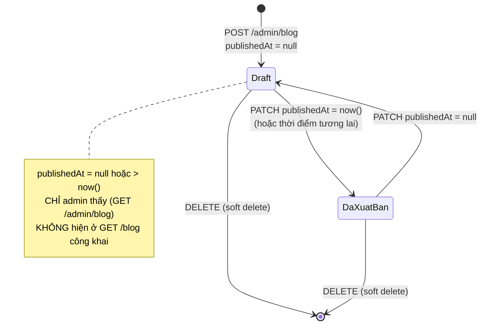

# Module: Blog + Newsletter 🌸 Domain

Hai tính năng "Nội dung" gộp chung 1 module vì dùng LẠI cùng 1 permission (`blog.manage`, đã seed sẵn
từ đầu dự án cho admin/super_admin — xem [05 §2.4](../05-database-va-rbac.md)) và cùng nhóm nghiệp vụ
tiếp thị/nội dung, dù 2 bảng DB (`blog_posts`, `newsletter_subscribers`) không liên quan trực tiếp.

| | |
|---|---|
| **Loại** | 🌸 Domain — viết mới cho từng dự án |
| **Backend** | `modules/domain/blog/` · `modules/domain/newsletter/` |
| **Frontend** | `features/domain/blog/` · `features/domain/newsletter/` · `app/(dashboard)/admin/blog/page.tsx` · `app/(dashboard)/admin/newsletter/page.tsx` · `app/(storefront)/blog/` · `components/storefront/NewsletterSignupForm.tsx` (footer) |
| **Bảng DB** | `blog_posts`, `newsletter_subscribers` |
| **Endpoint** | `GET /api/v1/blog`, `GET /api/v1/blog/:slug` (công khai) · `/api/v1/admin/blog` (CRUD) · `POST /api/v1/newsletter/subscribe`, `POST /api/v1/newsletter/unsubscribe` (công khai) · `/api/v1/admin/newsletter` (xem/xoá) |

---

## 1. Blog — `publishedAt` thay cho cờ `isPublished`

Không dùng `Boolean isPublished` — dùng `DateTime? publishedAt` (null = draft):

**Lợi ích so với `Boolean`**: cùng 1 cột vừa trả lời "đã xuất bản chưa" (`!= null`) vừa cho phép LÊN
LỊCH xuất bản tương lai miễn phí — `listPublic()`/`getPublicBySlug()` chỉ cần lọc
`publishedAt: { lte: now() }`, không cần thêm cột `scheduledAt` riêng. UI quản trị hiện tại (§4) chưa
có ô chọn ngày lên lịch (chỉ toggle "Xuất bản NGAY" hoặc "Draft"), nhưng backend đã sẵn sàng nhận
`publishedAt` bất kỳ khi cần bật tính năng này.

---

## 2. Ràng buộc nghiệp vụ

| Ràng buộc | Mã lỗi | Vì sao |
|---|---|---|
| Bài không tồn tại/chưa xuất bản/đã xoá | `404 NOT_FOUND` | Áp dụng cho cả `getPublicBySlug` và admin update/delete |
| Đổi TIÊU ĐỀ không tự đổi `slug` | — | Tránh gãy link đã chia sẻ — cùng quy tắc `categories`/`products`/`coupons` |
| `content` được sanitize bằng allowlist thẻ trước khi lưu | — | `sanitizeDescriptionHtml()` — DÙNG LẠI ĐÚNG hàm/allowlist của `Product.description`, xem [domain-products.md](domain-products.md) |
| Xoá = soft delete (`deletedAt`) | — | Giống `Product`, khác `Category` (hard delete) |
| Gỡ hẳn `thumbnailFileId` (đặt `null`) | — | Gọi `filesService.clearEntityFile()` — khác `categories.service.ts` hiện KHÔNG xử lý trường hợp này (chỉ gọi `setEntityFile` khi có fileId mới), xem ghi chú trong `blog.service.ts` |

---

## 3. Newsletter — chỉ THU THẬP email, chưa gửi hàng loạt

Phạm vi hiện tại: form đăng ký ở footer (`NewsletterSignupForm.tsx`) → `POST /newsletter/subscribe`
→ lưu vào `newsletter_subscribers`. **CHƯA có** màn soạn + gửi email hàng loạt tới danh sách này
(cần hàng đợi gửi email riêng — xem [core-email.md](core-email.md) — và trình soạn thảo campaign,
đủ lớn để là 1 hạng mục CHECKLIST riêng sau này).

| Hành vi | Ghi chú |
|---|---|
| `subscribe(email)` | Idempotent — email mới thì tạo, email ĐÃ active thì không làm gì, email đã unsubscribe thì bật lại (`isActive: true`, xoá `unsubscribedAt`) |
| `unsubscribe(email)` | Luôn trả **thành công** ở tầng controller dù email có tồn tại hay không (không xác nhận/phủ nhận qua response — thói quen nhất quán với `forgotPassword`, dù mức độ nhạy cảm thấp hơn nhiều vì đây không phải thông tin xác thực) |
| Admin xoá (`DELETE /admin/newsletter/:id`) | Xoá THẬT khỏi DB — khác `unsubscribe` (chỉ đổi `isActive`) — dùng cho yêu cầu xoá dữ liệu cá nhân hẳn |

---

## 4. Frontend — tái sử dụng `RichTextEditor`/`useUploadFile`

Form soạn bài ở `/admin/blog` dùng LẠI nguyên bản 2 khối đã có sẵn cho Products/Categories, không
viết lại:

- **`RichTextEditor`** (`components/ui/RichTextEditor.tsx`) — TipTap, bộ nút CỐ Ý giới hạn khớp đúng
  allowlist thẻ backend chấp nhận (xem §2). Dùng y hệt cách `admin/products/page.tsx` đang dùng cho
  `description`.
- **`useUploadFile()`** (`features/core/files/files.hooks.ts`) — upload ảnh đại diện (thumbnail) lên
  Cloudinary, cùng mẫu inline `<input type="file">` + preview state cục bộ mà `admin/categories/page.tsx`
  đang dùng cho `imageFileId` (không có component `<FileImagePicker>` dùng chung — mỗi trang tự lặp
  lại pattern này).

Form giữ `publishedAt: string | null` trực tiếp trong state (không phải `boolean isPublished`) — bấm
toggle "Xuất bản" chỉ đổi giữa `null` và giá trị hiện có (hoặc `now()` nếu đang từ draft chuyển sang);
sửa các trường KHÁC (tiêu đề, nội dung...) của 1 bài ĐÃ xuất bản sẽ KHÔNG làm trôi ngày xuất bản gốc
về "now" — tránh bug thấy được ngay khi thiết kế: nếu dùng `boolean` rồi tính lại `publishedAt = now()`
mỗi lần lưu thì sửa lỗi chính tả nhỏ cũng đẩy bài lên đầu danh sách (sắp xếp theo `publishedAt desc`).

---

## 5. Kiểm thử

| Tầng | File | Số test |
|---|---|---|
| Unit — blog | `backend/tests/unit/modules/blog.service.test.ts` | 18 — lọc `publishedAt`/`deletedAt`, sinh slug, sanitize content, gán/gỡ thumbnail qua `file_usages`, soft delete |
| Unit — newsletter | `backend/tests/unit/modules/newsletter.service.test.ts` | 11 — chuẩn hoá email, idempotent subscribe/unsubscribe, resubscribe, xoá thật |
| Integration | `backend/tests/integration/blog.routes.test.ts`, `newsletter.routes.test.ts` | 10 + 8 — endpoint công khai, CRUD/xem quản trị, 403 thiếu `blog.manage`, chống dò email qua `unsubscribe` |
| RBAC chung | `backend/tests/integration/rbac.test.ts` | Thêm `GET /admin/blog`, `GET /admin/newsletter` (cùng permission `blog.manage`) |

Kiểm chứng end-to-end qua trình duyệt thật (Playwright, script tạm không lưu trong repo, 12/09/2026):
admin viết 1 bài xuất bản NGAY + 1 bài draft → xác nhận `/blog` công khai CHỈ hiện bài đã xuất bản,
bài draft không hiện (kể cả gõ thẳng URL) → khách đăng ký nhận tin ở footer trang chủ → xác nhận
thông báo thành công → vào `/admin/newsletter` xác nhận email vừa đăng ký hiện trong danh sách. Dữ
liệu test đã xoá sạch sau khi verify qua script `tsx`+`PrismaClient` tạm.

---

## 6. Việc còn lại

| Việc | Ưu tiên |
|---|:---:|
| UI lên lịch xuất bản tương lai (chọn ngày giờ, backend đã sẵn sàng nhận — xem §1) | 🟢 |
| Soạn + gửi email hàng loạt (campaign) tới danh sách `newsletter_subscribers` | 🟡 |
| Unsubscribe qua link trong email (token riêng, không cần nhập lại email) — cần khi bắt đầu gửi campaign thật | 🟡 |
| Phân trang thật ở `/blog` (storefront hiện lấy `limit=24` một lần, chưa có nút "Xem thêm") | 🟢 |
| Tag/chuyên mục cho bài viết | 🟢 |
| Bình luận dưới bài viết | 🟢 |
