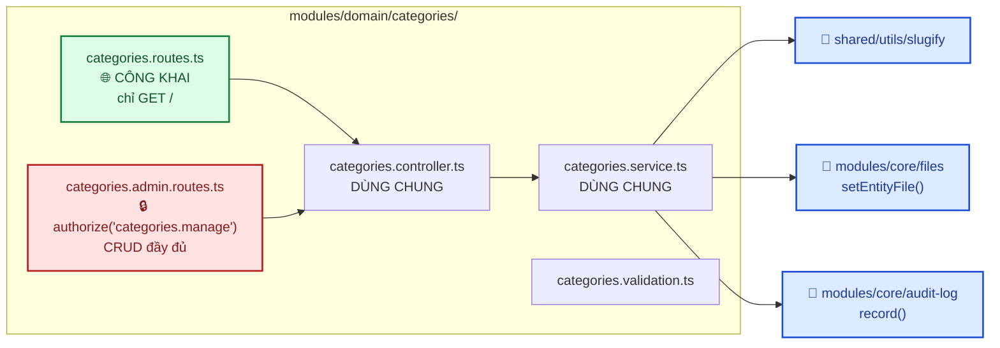
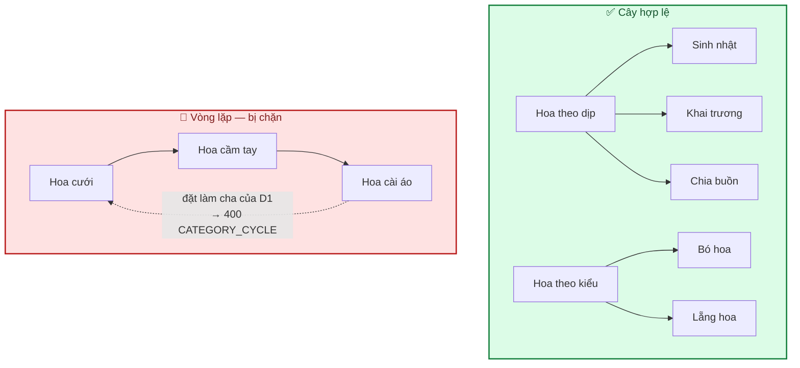
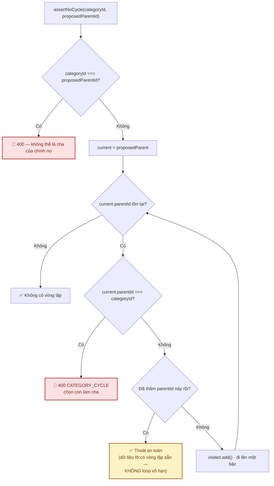
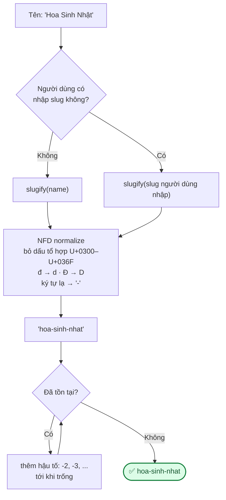

# Module: Categories 🌸 Domain

Danh mục sản phẩm dạng **cây** (danh mục cha–con). Đây là module domain **đầu tiên** được triển khai,
và là **mẫu tham chiếu** cho các module domain tiếp theo (products, orders...).

| | |
|---|---|
| **Loại** | 🌸 Domain — viết mới cho từng dự án |
| **Backend** | `modules/domain/categories/` |
| **Frontend** | `features/domain/categories/` · `app/(dashboard)/admin/categories/` |
| **Bảng DB** | `categories` |
| **Endpoint** | `GET /api/v1/categories` (công khai) · `/api/v1/admin/categories` (cần `categories.manage`) |

---

## 1. Vì sao đáng đọc kỹ module này

Module này minh hoạ **đủ mọi quy ước** mà module domain cần tuân theo:

| Quy ước được minh hoạ | Chi tiết |
|---|---|
| **Tách route công khai và route quản trị** | Hai file `*.routes.ts`, **dùng chung** controller/service |
| **Domain dùng lại core** — không ngược lại | `slugify`, `files`, `audit-log` đều là core; chiều ngược lại bị cấm |
| **Hai hàm đọc dữ liệu khác nhau** | `listPublic()` không lộ trường nội bộ; `list()` cho admin trả đủ |
| **Không repository** | Truy vấn đơn giản → gọi Prisma thẳng trong service, đúng [03 §1](../03-backend.md) |
| **Audit log cho mọi thao tác ghi** | create/update/delete đều ghi |

---

## 2. Cây danh mục & chống vòng lặp

`assertNoCycle()` đi ngược lên cây từ danh mục cha được đề xuất:

> Nhánh `visited` (thoát an toàn khi dữ liệu đã có vòng lặp sẵn) là chi tiết dễ bỏ sót: nếu dữ liệu
> trong DB bị sửa tay tạo ra vòng lặp, vòng `while` sẽ chạy vô hạn và treo request. Có test riêng cho
> trường hợp này.

---

## 3. Slug

**Quy tắc quan trọng: đổi `name` KHÔNG tự đổi `slug`.**

Slug nằm trong URL công khai (`/danh-muc/hoa-sinh-nhat`). Nếu tự đổi theo tên, mọi link đã chia sẻ
lên Facebook/Zalo và mọi kết quả đã được Google lập chỉ mục đều gãy. Slug chỉ đổi khi người dùng
**chủ động** sửa trường slug.

`slugify` dùng **mã số Unicode** (`0x0300`, `0x0111`) thay vì gõ thẳng ký tự có dấu vào source —
tránh rủi ro hỏng encoding khi file đi qua các công cụ trung gian.

---

## 4. Hai hàm đọc dữ liệu

| | `listPublic()` — storefront | `list()` — admin |
|---|---|---|
| Endpoint | `GET /api/v1/categories` | `GET /api/v1/admin/categories` |
| Quyền | Công khai | `categories.manage` |
| Lọc | Chỉ `isActive = true` | Mặc định `isActive = true`; `?includeInactive=true` lấy tất cả |
| Trường trả về | `id, name, slug, description, parentId, imageFile.url` | Đầy đủ + `sortOrder`, `isActive`, timestamps, `_count.children` |

> **Không dùng chung một hàm cho cả hai.** API công khai không nên lộ `sortOrder` (thông tin sắp xếp
> nội bộ) hay timestamps. Đây là mẫu nên lặp lại ở mọi module domain có mặt công khai.

---

## 5. Ràng buộc nghiệp vụ

| Ràng buộc | Mã lỗi | Vì sao |
|---|---|---|
| Không xoá danh mục còn con | `409 CATEGORY_HAS_CHILDREN` | Tránh danh mục con mồ côi, mất khỏi cây |
| Không tạo vòng lặp cha–con | `400 CATEGORY_CYCLE` | Duyệt cây sẽ loop vô hạn |
| Danh mục cha phải tồn tại | `404 PARENT_NOT_FOUND` | |
| Slug là duy nhất | Tự thêm hậu tố | Slug nằm trong URL |
| Ảnh phải tồn tại và chưa xoá | `404 FILE_NOT_FOUND` | Từ `files.setEntityFile()` |

---

## 6. Frontend

| File | Vai trò |
|---|---|
| `features/domain/categories/categories.service.ts` | Gọi `/api/v1/admin/categories` |
| `features/domain/categories/categories.hooks.ts` | `useCategories`, `useCreateCategory`, `useUpdateCategory`, `useDeleteCategory` |
| `app/(dashboard)/admin/categories/page.tsx` | Danh sách + form tạo/sửa |

`queryKey` dùng `['admin','categories', params]`; sau mutation invalidate theo **prefix**
`['admin','categories']` để bắt hết mọi biến thể tham số lọc.

---

## 7. Kiểm thử

| Tầng | File | Số test |
|---|---|---|
| Unit | `backend/tests/unit/modules/categories.service.test.ts` | 19 — slug, vòng lặp, ràng buộc xoá, không lộ trường nội bộ |
| Integration | `backend/tests/integration/categories.routes.test.ts` | 8 — envelope 201, mã lỗi, validate UUID |
| E2E | `frontend/e2e/categories.spec.ts` | 5 — CRUD qua UI, slug bỏ dấu, ràng buộc, API công khai |

---

## 8. Dùng module này làm mẫu cho module domain tiếp theo

Khi viết `products`, `orders`... hãy sao chép các quyết định sau:

- [ ] Tách `*.routes.ts` (công khai) và `*.admin.routes.ts` (quản trị), dùng chung controller/service
- [ ] Hai hàm đọc dữ liệu riêng cho public và admin — **không** lộ trường nội bộ ra API công khai
- [ ] Slug (nếu có) tự sinh, xử lý trùng, **không tự đổi khi đổi tên**
- [ ] Ảnh đi qua `filesService.setEntityFile()` với `entityType` riêng
- [ ] Mọi thao tác ghi đều `auditLog.record()`
- [ ] Ràng buộc quan hệ (không xoá khi còn tham chiếu) trả **409**, không phải 400
- [ ] Permission thêm vào `domain.seed.ts` và gán cho **cả `admin` lẫn `super_admin`**
- [ ] **Mới với `orders`**: thêm *row-level check* — xem [12 §5.1](../12-danh-gia-va-de-xuat.md)

---

## 9. Việc còn lại

| Việc | Ưu tiên |
|---|:---:|
| Kéo–thả sắp xếp thứ tự (`sortOrder`) trên UI | 🟢 |
| Hiển thị dạng cây trên UI admin (hiện là danh sách phẳng) | 🟢 |
| Trang storefront theo danh mục (`/danh-muc/[slug]`) | 🟡 — cần module `products` trước |
| Bảng `occasions` (dịp lễ) — tag chéo với danh mục | 🟡 |
