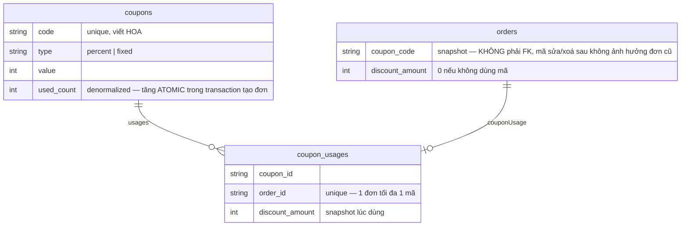
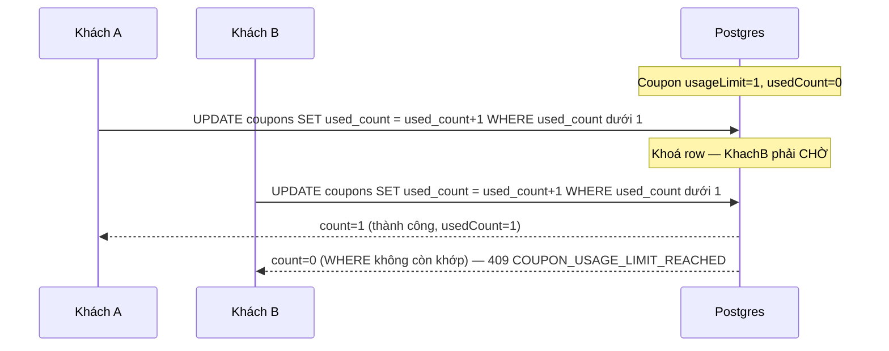
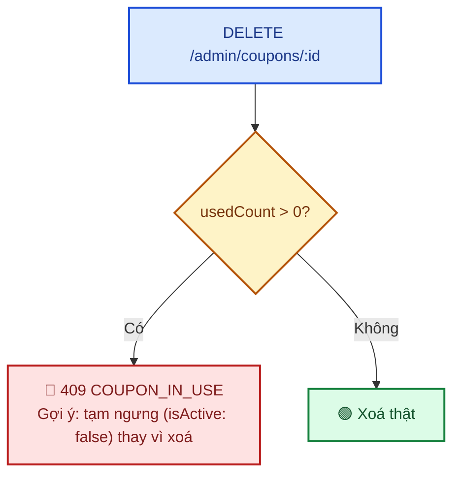

# Module: Coupons (Mã giảm giá) 🌸 Domain

Mã giảm giá áp dụng ở trang thanh toán — **1 đơn dùng được tối đa 1 mã** (không cộng dồn, đơn giản
hoá MVP). Quản trị qua permission `promotions.manage` (đã seed sẵn từ đầu dự án, chỉ admin/super_admin
có — xem [05 §2.4](../05-database-va-rbac.md)), khách áp dụng qua endpoint công khai (guest checkout
cũng dùng được mã).

| | |
|---|---|
| **Loại** | 🌸 Domain — viết mới cho từng dự án |
| **Backend** | `modules/domain/coupons/` |
| **Frontend** | `features/domain/coupons/` · `app/(dashboard)/admin/coupons/page.tsx` · tích hợp ở `app/(storefront)/thanh-toan/page.tsx` |
| **Bảng DB** | `coupons`, `coupon_usages` |
| **Endpoint** | `POST /api/v1/coupons/validate` (công khai) · `/api/v1/admin/coupons` (CRUD, cần `promotions.manage`) |

---

## 1. Dữ liệu — snapshot lịch sử, đếm lượt dùng denormalized



- **`Coupon.usedCount` đếm sẵn** (denormalized) — kiểm tra `usageLimit` bằng 1 phép so sánh số
  nguyên, không cần `COUNT(*)` trên `coupon_usages` mỗi lần validate.
- **`CouponUsage` là bản ghi LỊCH SỬ** (mẫu snapshot đã dùng cho `OrderItem.productName`/`unitPrice`)
  — lưu `discountAmount` tại thời điểm dùng, không phải nơi tính lại số dư lượt dùng.
- **`Order.couponCode`/`discountAmount` cũng là snapshot** trên chính bảng `orders` — trang xác nhận
  đơn và màn quản trị đơn hàng đọc thẳng 2 cột này, không cần join `coupon_usages`.
- **1 đơn tối đa 1 mã**: `CouponUsage.orderId` có unique constraint ở DB — không thể tạo 2 dòng dùng
  mã cho cùng 1 đơn.

---

## 2. Chống race condition khi hết lượt dùng (`usageLimit`)

Vấn đề: 2 khách cùng bấm "Đặt hàng" gần như đồng thời với 1 mã còn ĐÚNG 1 lượt cuối — nếu chỉ
`SELECT` kiểm tra rồi `UPDATE` tăng riêng (check-then-act), cả 2 request đều có thể đọc thấy "còn 1
lượt" TRƯỚC khi request nào kịp tăng `usedCount`, dẫn tới cả 2 đều lọt qua kiểm tra.

**Cách chặn**: tăng `usedCount` bằng 1 câu `UPDATE ... WHERE` có điều kiện, NGAY TRONG transaction tạo
đơn (`orders.service.ts#create()`), không tách riêng bước kiểm tra và bước tăng:

```ts
const guarded = await tx.coupon.updateMany({
  where: {
    id: coupon.id,
    OR: [{ usageLimit: null }, { usedCount: { lt: coupon.usageLimit ?? 0 } }],
  },
  data: { usedCount: { increment: 1 } },
});
if (guarded.count === 0) throw new AppError(..., 409, "COUPON_USAGE_LIMIT_REACHED");
```

Postgres khoá row khi thực thi `UPDATE`, nên 2 transaction cùng nhắm vào 1 dòng `coupons` sẽ tự
tuần tự hoá qua khoá row — transaction thứ 2 chỉ đọc lại `usedCount` (đã tăng bởi transaction thứ
nhất) SAU KHI transaction thứ nhất commit, nên điều kiện `WHERE` của nó không còn khớp và
`updateMany` trả `count: 0`. Không cần transaction isolation level đặc biệt hay lock tay
(`SELECT ... FOR UPDATE`).



**Endpoint `POST /coupons/validate` KHÔNG tăng `usedCount`** — chỉ xem trước, không có tác dụng phụ.
Vì vậy `orders.service.ts#create()` phải **re-validate lại TOÀN BỘ** (tồn tại, `isActive`,
`startDate`/`endDate`, `minOrderValue`, `usageLimit`) trong transaction, không tin kết quả
`/coupons/validate` gọi trước đó ở client — mã có thể đã lỗi thời (bị sửa/hết lượt/hết hạn) giữa
lúc khách xem trước và lúc bấm đặt hàng thật.

---

## 3. Hai tầng route — công khai (validate) / quản trị (CRUD)

Khác `reviews` (3 tầng: công khai/tự viết/duyệt), coupons chỉ cần **2 tầng** — không có "tầng tự
viết" vì khách không tạo mã, chỉ áp dụng mã có sẵn:

| | `validate()` | `listAdmin()`/`create()`/`update()`/`remove()` |
|---|---|---|
| Router | `coupons.routes.ts` | `coupons.admin.routes.ts` |
| Endpoint | `POST /api/v1/coupons/validate` | `/api/v1/admin/coupons` |
| Quyền | Công khai (guest checkout dùng được) | `promotions.manage` |
| Input | `{ code, subtotal }` | CRUD đầy đủ |

---

## 4. Ràng buộc nghiệp vụ

| Ràng buộc | Mã lỗi | Vì sao |
|---|---|---|
| Mã không tồn tại | `404 COUPON_NOT_FOUND` | — |
| Mã đã tạm ngưng (`isActive: false`) | `409 COUPON_INACTIVE` | Admin tạm ngưng thay vì xoá khi mã đã có lịch sử dùng, xem §5 |
| Chưa tới `startDate` | `409 COUPON_NOT_STARTED` | — |
| Đã qua `endDate` | `409 COUPON_EXPIRED` | — |
| Hết `usageLimit` | `409 COUPON_USAGE_LIMIT_REACHED` | Xem §2 — kiểm tra ATOMIC trong transaction tạo đơn |
| Dưới `minOrderValue` | `409 COUPON_MIN_ORDER_NOT_MET` | — |
| Mã trùng khi tạo/sửa | `409 COUPON_CODE_EXISTS` | Unique constraint `code` ở DB, kiểm tra trước để trả lỗi rõ ràng |
| `value` % vượt quá 100 (`type: 'percent'`) | `422` (zod `.refine()`) | — |

**`fixed` không bao giờ giảm vượt subtotal** — `computeDiscount()` dùng `Math.min(value, subtotal)`,
đơn nhỏ hơn giá trị mã fixed vẫn hợp lệ, chỉ giảm tối đa bằng đúng subtotal (không âm tiền đơn).

---

## 5. Xoá mã — chặn khi đã có lịch sử dùng

Mã giảm giá **xoá THẬT** (không soft-delete như `products`/`categories`) — không có nhu cầu hiển thị
công khai cần giữ lại. Nhưng nếu mã ĐÃ TỪNG được dùng (`usedCount > 0`), xoá sẽ CASCADE xoá luôn
`coupon_usages` — mất dấu lịch sử giảm giá của các đơn đã đặt (dù `Order.couponCode`/`discountAmount`
vẫn còn snapshot trên chính đơn, `coupon_usages` mất thì không còn truy vết theo `couponId` được
nữa). Cùng mẫu "chặn xoá khi còn tham chiếu" đã dùng cho `categories` (`CATEGORY_HAS_CHILDREN`) và
`roles`/`permissions` (`ROLE_IN_USE`/`PERMISSION_IN_USE`):



---

## 6. Frontend — xem trước giảm giá không gọi lại API

Trang `/thanh-toan` tính lại số tiền giảm ngay khi giỏ hàng thay đổi bằng `previewDiscount()` (hàm
nội bộ trong `thanh-toan/page.tsx`, mirror ĐÚNG công thức `computeDiscount()` ở backend) dựa trên
`type`/`value` đã có từ lần gọi `/coupons/validate` gần nhất — không gọi lại API mỗi lần cart đổi số
lượng. Đây chỉ là hiển thị tạm; nếu cart đổi khiến mã không còn hợp lệ (vd dưới `minOrderValue`),
backend vẫn phát hiện và chặn ở bước tạo đơn thật (§2), khách thấy lỗi rõ ràng lúc bấm "Đặt hàng".

---

## 7. Kiểm thử

| Tầng | File | Số test |
|---|---|---|
| Unit — coupons | `backend/tests/unit/modules/coupons.service.test.ts` | 21 — `computeDiscount()`, mọi nhánh lỗi validate, CRUD, chặn xoá khi `usedCount > 0` |
| Unit — orders (áp dụng mã) | `backend/tests/unit/modules/orders.service.test.ts` | +4 test — áp dụng mã hợp lệ, 404 mã không tồn tại, 409 hết lượt (race condition), không truyền mã vẫn hoạt động bình thường |
| Integration | `backend/tests/integration/coupons.routes.test.ts` | 11 — endpoint công khai, CRUD quản trị, 403 thiếu `promotions.manage`, 409 |
| RBAC chung | `backend/tests/integration/rbac.test.ts` | Thêm `GET /admin/coupons` (permission `promotions.manage`) |

Kiểm chứng end-to-end qua trình duyệt thật (Playwright, script tạm không lưu trong repo,
12/09/2026): admin tạo mã giảm 10% giới hạn 1 lượt → khách thêm sản phẩm vào giỏ, vào `/thanh-toan`,
áp dụng mã, xác nhận số tiền giảm hiển thị đúng → đặt hàng thành công, trang xác nhận đơn hiện đúng
dòng "Giảm giá" kèm mã và tổng tiền đã trừ → thử áp dụng LẠI cùng mã cho đơn thứ 2 (đã hết lượt) →
xác nhận bị chặn với thông báo "Mã giảm giá đã hết lượt sử dụng" → thử mã không tồn tại → xác nhận
thông báo lỗi rõ ràng. Dữ liệu test (coupon + đơn hàng) đã xoá sạch sau khi verify qua script
`tsx`+`PrismaClient` tạm, không còn sót trong DB.

---

## 8. Việc còn lại

| Việc | Ưu tiên |
|---|:---:|
| Cộng dồn nhiều mã/đơn (hiện chỉ 1 mã/đơn) | 🟢 |
| Mã giảm giá riêng theo danh mục/sản phẩm (hiện áp dụng lên toàn subtotal) | 🟡 |
| Mã giảm giá riêng theo user/nhóm khách (vd chỉ khách mới) | 🟢 |
| Thống kê hiệu quả mã giảm giá (doanh thu, số đơn) ở màn quản trị | 🟢 |
