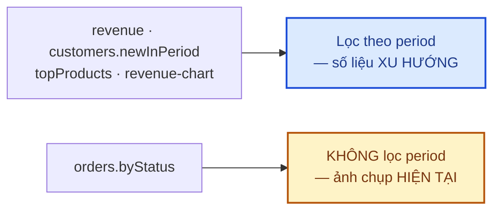

# Module: Dashboard 🌸 Domain

Trang `/admin` (Tổng quan) — trước đây là placeholder tĩnh (3 ô số liệu `'—'` kèm dòng chữ nói về
kiến trúc code `features/domain`, lộ ra ngay UI cho admin thật). Toàn bộ module domain khác (Orders,
Products, Reviews...) đã có sẵn từ lâu — module này chỉ tổng hợp số liệu từ chúng, không thêm bảng
DB mới.

| | |
|---|---|
| **Loại** | 🌸 Domain |
| **Backend** | `modules/domain/dashboard/` |
| **Frontend** | `features/domain/dashboard/` · `app/(dashboard)/admin/page.tsx` |
| **Bảng DB** | Không có bảng riêng — đọc tổng hợp từ `Order`, `OrderItem`, `User`, `Product`, `Review` |
| **Endpoint** | `GET /api/v1/admin/dashboard/overview` · `GET /api/v1/admin/dashboard/revenue-chart` (`reports.view`) |

---

## 1. Tái dùng permission `reports.view`, không tạo mới

`reports.view` đã seed sẵn ở `domain.seed.ts` (mô tả "Xem thống kê doanh thu, báo cáo"), gán cho cả
`admin` lẫn `super_admin` qua vòng lặp `ADMIN_DOMAIN_PERMISSIONS` — chưa module nào dùng tới trước
đây. Trang Tổng quan là người dùng đầu tiên của permission này, không cần sửa seed.

## 2. Vì sao `orders.byStatus` KHÔNG lọc theo `period`

`revenue`/`customers.newInPeriod`/`topProducts`/biểu đồ đều là **số liệu xu hướng** — có ý nghĩa so
sánh với 1 khoảng thời gian trước đó. Nhưng "đơn hàng theo trạng thái" trả lời câu hỏi khác: *"ngay
lúc này có bao nhiêu đơn đang ở mỗi trạng thái?"* — 1 đơn `pending` tạo cách đây 3 tháng vẫn cần admin
xử lý hôm nay, lọc theo `period` sẽ giấu mất nó khỏi dashboard. Vì vậy `prisma.order.groupBy({ by:
["status"] })` cố ý KHÔNG kèm `where.createdAt` — đây là **ảnh chụp hàng đợi vận hành hiện tại**, độc
lập với bộ chọn kỳ 7 ngày/30 ngày/3 tháng ở đầu trang.

## 3. `changePercent`: `null` khác `0`

`previous = 0, current = 0` → `changePercent = 0` (thật sự không đổi). Nhưng `previous = 0, current >
0` → `changePercent = null` — kỳ trước không có doanh thu để tính tỷ lệ % (chia cho 0 vô nghĩa), khác
hẳn ý nghĩa "0%". Frontend hiển thị riêng "Mới so với kỳ trước" cho trường hợp `null`, không cố hiển
thị "∞%" hay "+100%" sai lệch.

## 4. Top sản phẩm bán chạy — nhóm theo snapshot, không JOIN sống

`topProducts` nhóm theo `OrderItem.productName` (snapshot lúc đặt hàng), không JOIN sang bảng
`Product` hiện tại — đúng triết lý snapshot đã áp dụng cho toàn bộ `OrderItem` (lịch sử đơn hàng
không đổi theo tên/giá sản phẩm sau này, kể cả khi sản phẩm gốc đã bị xoá). Loại trừ đơn `cancelled`
— đơn đã huỷ không phản ánh nhu cầu thật.

## 5. Không có widget "Sắp hết hàng"

Hệ thống **không có model tồn kho/stock** cho sản phẩm — quyết định kiến trúc cố ý (hoa tươi làm theo
đơn, xem comment ở `schema.prisma` model `Product`). Bản mô tả gốc yêu cầu widget này không làm được;
thay bằng củng cố khối "⚡ Việc cần xử lý" (đơn chờ xác nhận, đơn giao hôm nay, đánh giá chờ duyệt —
đều là dữ liệu thật, link thẳng tới đúng trang xử lý: `/admin/orders`, `/admin/orders/delivery-queue`,
`/admin/reviews`).

## 6. Frontend — tái dùng tối đa, không tạo hook/route mới ngoài phạm vi

- "Đơn hàng gần đây" → `useOrders({ limit: 5 })` (đã có ở `orders.hooks.ts`), không gọi API riêng.
- "Lịch giao hoa hôm nay" → `useDeliveryQueue(todayIso())` (đã có), lấy 5 đơn đầu + link "Xem lịch
  giao →" tới `/admin/orders/delivery-queue`.
- Click 1 dòng "Đơn hàng gần đây" dẫn tới `/admin/orders` (trang list dùng mở rộng inline, KHÔNG có
  route `/admin/orders/[id]` riêng — không tự tạo route mới ngoài phạm vi dashboard).
- Màu sắc: giữ nguyên design token hiện có (`rose`/`ivory`/`sage`/`border-soft`). Card "Đơn hàng theo
  trạng thái" dùng lại đúng 4 tông của `StatusBadge.tsx` (`success`/`warning`/`danger`/`neutral`) làm
  màu chấm tròn — không bịa bảng màu mới.
- Biểu đồ doanh thu dùng **Recharts** (thêm mới, duy nhất chỗ dùng trong dự án) — 1 chuỗi dữ liệu duy
  nhất nên chỉ cần 1 tông màu (`rose`), không cần chú giải nhiều màu.

## 7. Kiểm thử

`backend/tests/unit/modules/dashboard.service.test.ts` (17 test) — doanh thu loại trừ đơn cancelled,
`changePercent` đúng cả 2 hướng và trường hợp `null`/`0`, `orders.byStatus` đủ 6 trạng thái kể cả
trạng thái không có đơn nào, `topProducts` đúng thứ tự, `revenue-chart` điền đủ mọi ngày (kể cả ngày
không có đơn = 0) và đúng số điểm theo từng `period`.

`backend/tests/integration/dashboard.routes.test.ts` (7 test) — 401 chưa đăng nhập, 403 thiếu
`reports.view`, 200 với đủ quyền, 422 `period` không hợp lệ.

`backend/tests/integration/rbac.test.ts` — thêm `GET /admin/dashboard/overview` vào ma trận
`PROTECTED` (401 → 403 → không 401/403 khi đủ quyền); phát hiện và bổ sung `reports.view` còn thiếu
trong `SUPER_ADMIN_PERMISSIONS` ở `helpers.ts` (permission có seed nhưng chưa từng được test nào dùng
tới trước module này).

**Đã kiểm chứng thật** (Playwright, script throwaway — đã xoá sau khi xong): đăng nhập `super_admin` →
`/admin` → đối chiếu từng số hiển thị (doanh thu, đơn hàng theo trạng thái, khách hàng, sản phẩm, đánh
giá chờ duyệt) với truy vấn Prisma trực tiếp trên DB dev — khớp chính xác. Đổi bộ lọc 7 ngày/30 ngày →
biểu đồ và các thẻ KPI đổi theo đúng, "Đơn hàng theo trạng thái" giữ nguyên (đúng thiết kế §2). Không
có lỗi console/network liên quan tới trang (2 lỗi 401 quan sát được là hành vi có sẵn của trang
`/login` khi kiểm tra phiên cũ, không liên quan module này).

## 8. Việc còn lại

| Việc | Ưu tiên | Ghi chú |
|---|:---:|---|
| Doanh thu theo danh mục, tỷ lệ huỷ đơn, hiệu quả coupon | 🟢 | Ngoài phạm vi lần này, cân nhắc khi có nhu cầu thật |
| Đánh giá mới (khác số đếm chờ duyệt đã có ở "Việc cần xử lý") | 🟢 | |
| Thống kê newsletter (tăng trưởng subscriber) | 🟢 | |
