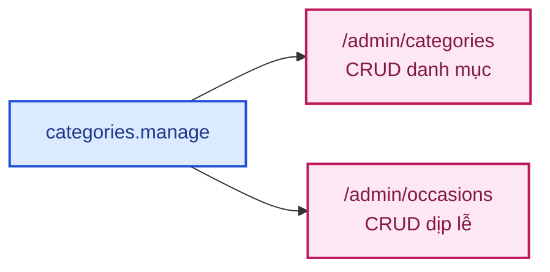
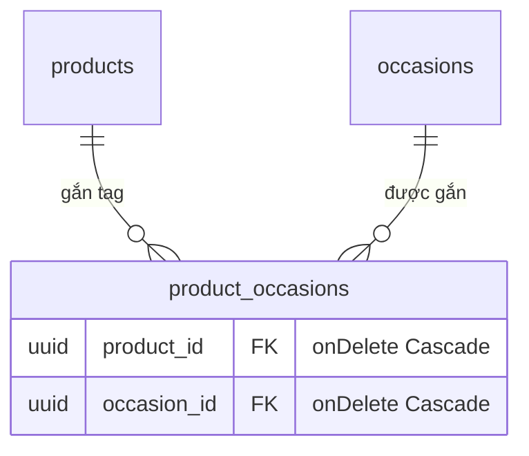

# Module: Occasions 🌸 Domain

Tag **dịp lễ** (Sinh nhật, Valentine, Khai trương, Chia buồn...) gắn lên sản phẩm — khách lọc/duyệt
hoa theo dịp thay vì chỉ theo danh mục. Sao chép hầu hết quy ước từ
[`categories`](domain-categories.md), nhưng **đơn giản hơn**: phẳng (không cây cha-con), không ảnh,
và quan hệ với `products` là **n-n** (1 sản phẩm gắn được nhiều dịp lễ) thay vì 1-n.

| | |
|---|---|
| **Loại** | 🌸 Domain — viết mới cho từng dự án |
| **Backend** | `modules/domain/occasions/` |
| **Frontend** | `features/domain/occasions/` · `app/(dashboard)/admin/occasions/` |
| **Bảng DB** | `occasions` · `product_occasions` (bảng nối n-n) |
| **Endpoint** | `GET /api/v1/occasions` (công khai) · `/api/v1/admin/occasions` (cần `categories.manage`) — xem [06 · API §8b](../06-api-reference.md#8-products-) |

---

## 1. Khác biệt so với `categories` (module mẫu)

| | `categories` | `occasions` |
|---|---|---|
| Cấu trúc | Cây (`parentId` tự tham chiếu) | Phẳng — không có cấp cha-con |
| Ảnh | Có (`imageFileId`) | Không có — chỉ là tag văn bản |
| Quan hệ với `products` | 1-n (`Product.categoryId`) | **n-n** qua bảng nối `product_occasions` |
| Permission | `categories.manage` | **Dùng LẠI** `categories.manage` — không tách `occasions.manage` riêng (xem §2) |
| Xoá | Chặn nếu còn danh mục con (`409 CATEGORY_HAS_CHILDREN`) | **Không chặn** — xoá occasion chỉ gỡ tag khỏi sản phẩm liên quan (xem §3) |

---

## 2. Vì sao dùng lại permission `categories.manage`

Không tạo `occasions.manage` riêng — mô tả permission `categories.manage` trong `domain.seed.ts` đã
cố tình ghi **"Thêm/sửa/xoá danh mục, dịp lễ"** ngay từ bản thiết kế đầu (xem
[05 §2.3](../05-database-va-rbac.md#23-danh-sách-permission-đề-xuất)) — cùng nhóm người quản trị
(admin/super_admin) và cùng độ nhạy cảm (dữ liệu phân loại/hiển thị, không phải dữ liệu giao dịch)
với categories. Tách thêm 1 permission chỉ để phân biệt 2 màn hình gần như giống hệt nhau là
over-engineering không có nhu cầu thật.



---

## 3. Quan hệ n-n với `products` — `product_occasions`

Khác `categories` (1 sản phẩm chỉ thuộc 1 danh mục qua `Product.categoryId`), 1 sản phẩm gắn được
**NHIỀU** dịp lễ cùng lúc (vd "Bó hồng đỏ Passion" vừa hợp Sinh nhật vừa hợp Tỏ tình). Bảng nối
`product_occasions` là bảng nối **thuần** (composite PK `[productId, occasionId]`, không có cột
riêng) — theo đúng khuôn mẫu `role_permissions`/`user_roles` đã dùng trong schema này (composite PK
tường minh), **không dùng** implicit many-to-many của Prisma.



`onDelete: Cascade` cả 2 chiều — xoá sản phẩm hoặc xoá occasion chỉ gỡ dòng nối liên quan, **không**
chặn xoá như `categories` (chặn khi còn danh mục con) hay `product_variants` (giữ `variantId` snapshot
vì `order_items` tham chiếu). Ở đây không có gì "mồ côi": xoá 1 dịp lễ chỉ đơn giản là các sản phẩm
đang gắn dịp lễ đó mất tag, sản phẩm vẫn còn nguyên.

`products.service.ts#replaceOccasions()` đồng bộ theo kiểu **thay thế toàn bộ** danh sách
`occasionIds` gửi lên — validate MỌI id tồn tại trước (404 `OCCASION_NOT_FOUND` nếu không), rồi mới
xoá hết dòng nối cũ và tạo lại theo danh sách mới. Khác `replaceVariants()` (phải giữ nguyên `id` của
biến thể đang sửa vì `order_items.variant_id` tham chiếu), ở đây xoá-hết-rồi-tạo-lại là AN TOÀN vì
`product_occasions` không có `id` riêng để bất kỳ bảng nào khác tham chiếu tới — xem
[domain-products.md §2.5](domain-products.md#25-biến-thể-sizegiá-riêng--product_variants) để so sánh
2 chiến lược đồng bộ.

Lọc sản phẩm theo dịp lễ (`GET /products?occasionId=`) dùng Prisma quan hệ `some`:

```ts
where: { occasions: { some: { occasionId } } }
```

---

## 4. Hai hàm đọc dữ liệu — nhưng dùng CHUNG 1 shape

Khác `categories`/`products` (API công khai phải giấu `sortOrder`/timestamps), `Occasion` **không có
trường nội bộ nào cần giấu** — cả `list()` (admin) lẫn `listPublic()` (storefront) chỉ khác nhau ở bộ
lọc (`includeInactive` hay luôn `isActive: true`), không khác nhau ở field trả về ngoài việc admin có
thêm `sortOrder`/`isActive`/timestamps để sắp xếp/quản lý.

| | `listPublic()` — storefront | `list()` — admin |
|---|---|---|
| Endpoint | `GET /api/v1/occasions` | `GET /api/v1/admin/occasions` |
| Quyền | Công khai | `categories.manage` |
| Lọc | Chỉ `isActive = true` | Mặc định `isActive = true`; `?includeInactive=true` lấy tất cả |
| Trường trả về | `id, name, slug` | Đầy đủ + `sortOrder`, `isActive`, timestamps |

---

## 5. Frontend

| File | Vai trò |
|---|---|
| `features/domain/occasions/occasions.service.ts` | Gọi `/api/v1/admin/occasions` |
| `features/domain/occasions/occasions.hooks.ts` | `useOccasions`, `useCreateOccasion`, `useUpdateOccasion`, `useDeleteOccasion` |
| `app/(dashboard)/admin/occasions/page.tsx` | Danh sách phẳng + form tạo/sửa (không cây, không ảnh — đơn giản hơn `admin/categories`) |
| `app/(dashboard)/admin/products/page.tsx` | Chọn NHIỀU dịp lễ bằng nút dạng pill (bấm để bật/tắt) — gửi `occasionIds: string[]` khi lưu sản phẩm |
| `lib/storefront-api.ts` → `getStorefrontOccasions()`, `getStorefrontOccasionBySlug()` | Cùng mẫu `getStorefrontCategories()` — danh sách đủ nhỏ nên tra slug trên kết quả list, không cần endpoint `/occasions/:slug` riêng |
| `app/(storefront)/dip-le/[slug]/page.tsx` | Trang liệt kê sản phẩm theo dịp lễ — mirror `danh-muc/[slug]/page.tsx`, khác ở chỗ lọc bằng `occasionId` (n-n) thay vì `categoryId` (1-n) |
| `app/(storefront)/san-pham/[slug]/page.tsx` | Hiện chip dịp lễ (link sang `/dip-le/[slug]`) ngay dưới nút "Thêm vào giỏ hàng" |

---

## 6. Kiểm thử

| Tầng | File | Số test |
|---|---|---|
| Unit | `backend/tests/unit/modules/occasions.service.test.ts` | 13 — slug, CRUD, xoá không chặn dù còn sản phẩm gắn tag |
| Unit (phần liên quan) | `backend/tests/unit/modules/products.service.test.ts` | Thêm test cho `replaceOccasions` (gắn/thay thế/404 id lạ) + lọc `occasionId` |
| Integration | `backend/tests/integration/occasions.routes.test.ts` | 7 — envelope 201, mã lỗi, API công khai không lộ trường nội bộ |
| RBAC chung | `backend/tests/integration/rbac.test.ts` | Thêm `GET /admin/occasions` vào bảng `PROTECTED` (dùng chung `categories.manage`) |

Kiểm chứng thủ công qua trình duyệt thật (Playwright, không lưu trong repo, 11/09/2026): tạo dịp lễ →
sửa tên → gắn vào sản phẩm mẫu ở `/admin/products` → xác nhận dòng sản phẩm hiện tên dịp lễ → sang
trang chi tiết storefront xác nhận chip hiện đúng (có đợi qua `revalidate: 60s` — xem lưu ý ở
[storefront-api.ts](../../frontend/src/lib/storefront-api.ts)) → bấm chip sang `/dip-le/:slug` xác
nhận đúng tiêu đề + sản phẩm → xoá dịp lễ, xác nhận **cascade tự gỡ tag khỏi sản phẩm** mà không cần
sửa lại sản phẩm thủ công. Không có lỗi console/network ngoài các lỗi đã biết trước (401 kiểm tra
phiên trước đăng nhập, cảnh báo Google OAuth origin — không liên quan tính năng).

---

## 7. Việc còn lại

| Việc | Ưu tiên |
|---|:---:|
| Liên kết "Dịp lễ" ở nav chính/trang chủ storefront (hiện chỉ vào được `/dip-le/:slug` qua chip ở trang chi tiết sản phẩm hoặc gõ URL trực tiếp) | 🟢 |
| Kéo–thả sắp xếp thứ tự (`sortOrder`) trên UI admin | 🟢 |
| Bộ lọc kết hợp danh mục + dịp lễ trên 1 trang storefront | 🟢 |
