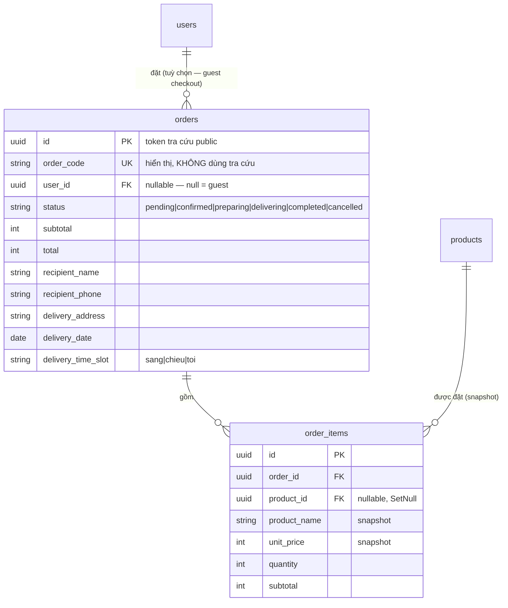
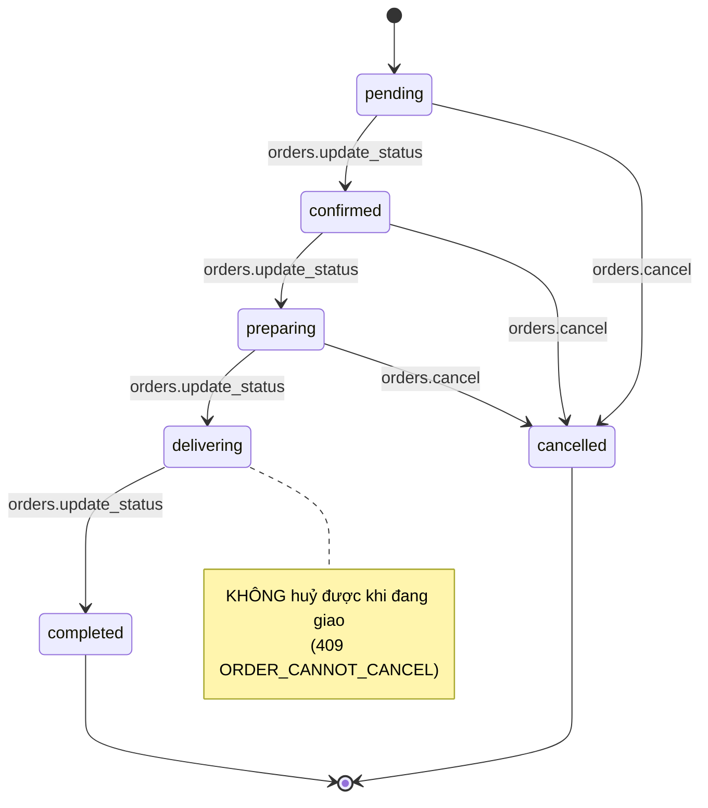
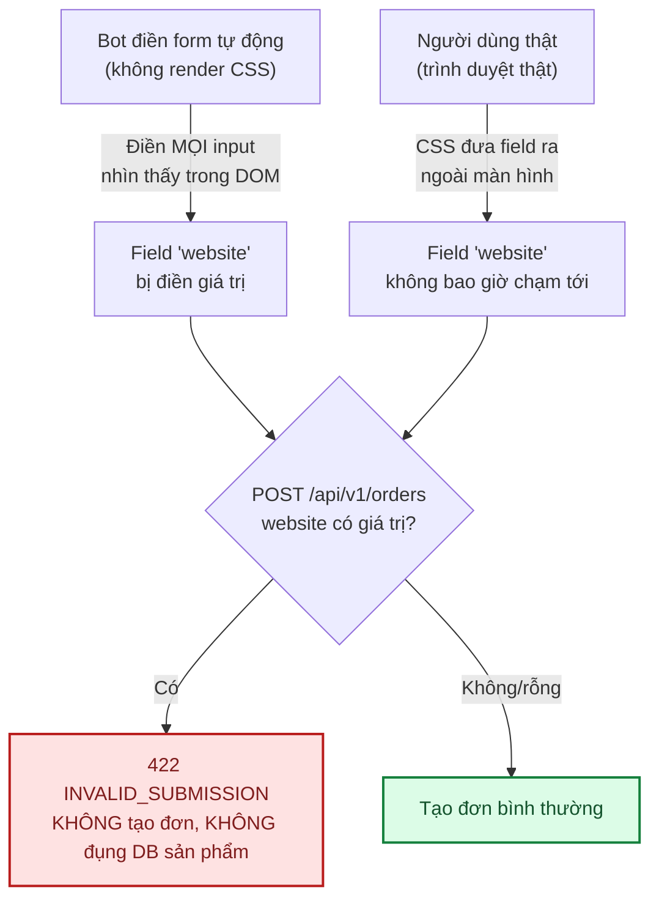

# Module: Orders 🌸 Domain

Giỏ hàng + đặt hàng — **giai đoạn cơ bản**: guest checkout (không cần đăng nhập), thanh toán COD, cửa
hàng gọi điện xác nhận đơn. Chưa có thanh toán online — xem [§8 Việc còn lại](#8-việc-còn-lại).

---

## 1. Quyết định kiến trúc: giỏ hàng ở CLIENT, không phải bảng `carts`

Bản phác thảo ban đầu ở [05 §3.4](../05-database-va-rbac.md#34-nhóm-sản-phẩm) có bảng `carts`/
`cart_items` (server lưu giỏ hàng, hỗ trợ đồng bộ nhiều thiết bị). Module này **cố ý không làm vậy**:
giỏ hàng lưu ở `localStorage` phía trình duyệt (Zustand + middleware `persist`,
`frontend/src/store/useCartStore.ts`), KHÔNG có bảng nào ở backend cho tới khi khách bấm "Đặt hàng".

**Vì sao**: đơn hoa thường chỉ 1-3 sản phẩm, hiếm khi cần đồng bộ giỏ hàng giữa nhiều thiết bị (khác
giỏ hàng thương mại điện tử tổng hợp). Giỏ hàng trước khi đặt chỉ là **trạng thái đang soạn**, không
phải dữ liệu đã chốt — đúng tinh thần "Zustand chỉ giữ UI state" ở `CLAUDE.md` §5. Khi bấm "Đặt hàng",
toàn bộ giỏ được gửi thẳng trong 1 lần gọi `POST /api/v1/orders` — từ đó `Order` (đã lưu DB) mới là
nguồn sự thật.

**Đánh đổi đã chấp nhận**: giỏ hàng không đồng bộ giữa các thiết bị/trình duyệt, mất khi xoá dữ liệu
trình duyệt. Chấp nhận được ở giai đoạn cơ bản — nếu sau này cần đồng bộ (vd khách đăng nhập trên
nhiều thiết bị), xây bảng `carts`/`cart_items` lúc đó, không thiết kế trước cho nhu cầu giả định.

```mermaid
flowchart LR
    A["🩷 Duyệt sản phẩm"] --> B["🩷 Thêm vào giỏ<br/>(Zustand + localStorage)"]
    B --> C["🩷 /gio-hang<br/>sửa số lượng, xoá"]
    C --> D["🩷 /thanh-toan<br/>nhập thông tin giao"]
    D --> E["🔵 POST /api/v1/orders<br/>tạo Order + OrderItem"]
    E --> F["🟢 /don-hang/:id<br/>trang xác nhận (public)"]

    style A fill:#fce7f3,stroke:#be185d,stroke-width:2px,color:#831843
    style B fill:#fce7f3,stroke:#be185d,stroke-width:2px,color:#831843
    style C fill:#fce7f3,stroke:#be185d,stroke-width:2px,color:#831843
    style D fill:#fce7f3,stroke:#be185d,stroke-width:2px,color:#831843
    style E fill:#dbeafe,stroke:#1d4ed8,stroke-width:2px,color:#1e3a8a
    style F fill:#dcfce7,stroke:#15803d,stroke-width:2px,color:#14532d
```

### Bẫy hydration đã gặp khi build

`persist` đọc `localStorage` **bất đồng bộ** (bọc qua 1 microtask để thống nhất API với storage khác,
dù bản thân `localStorage` là I/O đồng bộ) — lần render đầu tiên trên client, `items` LUÔN là `[]` dù
localStorage đã có dữ liệu, tới khi cờ `hasHydrated` (tự thêm vào store) bật lên mới đáng tin. Bug
THẬT đã gặp: trang `/thanh-toan` có `useEffect` điều hướng về `/gio-hang` khi `items.length === 0`
(chặn submit đơn rỗng khi gõ URL tay) — nếu không đợi `hasHydrated`, mới thêm hàng xong rồi vào thẳng
`/thanh-toan` cũng bị đá ngược lại `/gio-hang` vì effect chạy trước khi kịp đọc xong localStorage.

Bug thứ 2 liên quan: sau khi đặt hàng thành công, `clear()` làm `items` về `[]` — effect trên **lại**
tưởng nhầm "vào thẳng URL khi giỏ trống" và gọi `router.replace('/gio-hang')`, giành với
`router.push('/don-hang/:id')` đang điều hướng sang trang xác nhận. Fix bằng 1 `ref` đánh dấu "vừa đặt
hàng xong" để effect bỏ qua lần đó. Xem `frontend/src/app/(storefront)/thanh-toan/page.tsx`.

---

## 2. Schema — rút gọn so với bản phác thảo đầy đủ

| Bảng | Trạng thái | Khác biệt so với [05 §3.7](../05-database-va-rbac.md) |
|---|---|---|
| `orders` | ✅ | Nhúng thẳng field giao hàng (`recipient_name`, `recipient_phone`, `delivery_address`, `delivery_date`, `delivery_time_slot`) thay vì tách bảng `order_deliveries` riêng — chưa cần `shipper_id` vì chưa có màn phân công. `subtotal`/`total` kiểu `Int` (VND, giống `products.base_price`) thay vì `decimal`. KHÔNG có `discount`/`shipping_fee`/`payment_status` (chưa có coupon/phí ship/thanh toán online). |
| `order_items` | ✅ | Snapshot `product_name`/`unit_price` tại thời điểm đặt — sản phẩm đổi tên/giá sau đó không ảnh hưởng đơn cũ. Chưa có `variant_id` (chưa có `product_variants`) hay `card_message` (dùng chung `orders.note`). |
| `order_deliveries` | ⬜ | Tách ra khi làm màn phân công shipper thật — xem §8. |
| `payments` | ⬜ | Chỉ COD ở giai đoạn này (`orders.payment_method = 'cod'`, cố định). |
| `order_status_history` | — (dùng lại) | KHÔNG có bảng riêng — mỗi lần đổi trạng thái ghi vào `AuditLog` chung (`action: 'order.update_status'`), đúng cách `categories`/`products`/`contact` đang làm, không xây cơ chế lịch sử song song. |
| `carts`/`cart_items` | — (không làm) | Xem §1 — giỏ hàng ở client. |

### `Order.id` (UUID) vs `orderCode` — chống IDOR

`GET /api/v1/orders/:id` **công khai**, không cần đăng nhập — ai có link đều xem được (tên/SĐT người
nhận, địa chỉ, món hàng). `id` dạng UUID (122-bit entropy) đủ khó đoán để đóng vai trò **token tra
cứu** — đúng mô hình "sở hữu link = có quyền xem" mà nhiều nền tảng thương mại điện tử dùng cho trang
xác nhận đơn khách vãng lai. `orderCode` (vd `HX2609100001`, ngắn để đọc qua điện thoại) **CHỈ để hiển
thị**, không bao giờ dùng làm khoá tra cứu — nếu dùng, kẻ tấn công có thể dò tuần tự
(`HX2609100001`, `HX2609100002`...) để xem đơn của người khác. Xem [07 · Bảo mật §2](../07-bao-mat.md).

### Bug timezone đã gặp: `deliveryDate` bị lùi 1 ngày

`deliveryDate` là cột `@db.Date` (chỉ có ý nghĩa NGÀY, không có múi giờ). Lúc đầu tạo
`new Date(`${input.deliveryDate}T00:00:00`)` — không neo múi giờ (`Z`) nghĩa là JS hiểu theo múi giờ
**LOCAL của server** (`Asia/Saigon`, UTC+7). 00:00 giờ VN ngày 25/12 = 17:00 UTC ngày 24/12 → Postgres
lưu NHẦM thành ngày 24/12. Test thủ công qua `curl` bắt được ngay: gửi `"2026-12-25"`, DB trả về
`"2026-12-24T00:00:00.000Z"`. Fix: LUÔN neo `.000Z` (UTC) khi tạo `Date` cho cột chỉ có ý nghĩa ngày —
`new Date(`${input.deliveryDate}T00:00:00.000Z`)`. Áp dụng đối xứng ở frontend khi **hiển thị** lại
(`lib/date.ts` → `formatDeliveryDate()`, luôn `timeZone: 'UTC'`), tránh lặp lại lỗi tương tự theo
chiều ngược lại ở máy khách có múi giờ khác server.

---

## 3. Quyền theo GIÁ TRỊ, không phải 1 permission cố định cho route

`PATCH /api/v1/admin/orders/:id/status` là route DUY NHẤT trong dự án mà quyền cần phụ thuộc **nội
dung body** thay vì cố định theo route — đúng ma trận đã chốt ở
[05 §2.4](../05-database-va-rbac.md#24-ma-trận-vai-trò--quyền-mặc-định-seed):

| `status` gửi lên | Permission cần |
|---|---|
| `cancelled` | `orders.cancel` |
| Bất kỳ giá trị khác | `orders.update_status` |

Vì vậy route KHÔNG dùng `authorize('...')` chung cho cả router như `products`/`categories`/`contact`
đang làm — 2 route đọc (`GET /`, `GET /:id`) vẫn dùng `authorize('orders.view_all')` bình thường,
riêng `PATCH .../status` bỏ qua `authorize()` ở tầng route, tự kiểm tra permission NGAY TRONG SERVICE
(`orders.service.ts` → `updateStatus()`, nhận `actorPermissions: string[]` làm tham số thay vì đọc
`req` — service không đụng `req`/`res`, xem `CLAUDE.md` §5).

`completed`/`cancelled` là trạng thái CUỐI — mọi thay đổi tiếp theo bị chặn (`409 ORDER_STATUS_FINAL`),
kể cả actor có đủ quyền.

### Bug thật tìm thấy khi build: admin thiếu `orders.update_status`

`domain.seed.ts`'s `ADMIN_DOMAIN_PERMISSIONS` (mảng cấp quyền cho `admin`/`super_admin`) đã thiếu
`orders.update_status` từ trước — dù ma trận ở 05 §2.4 ghi rõ cả 2 role đều có quyền này. Hậu quả: kể
cả `super_admin` cũng bị `403 FORBIDDEN` khi đổi trạng thái đơn sang bất kỳ giá trị nào ngoài
`cancelled`. Phát hiện khi build tính năng này và test thủ công qua `curl` thật. Đã sửa + chạy lại
`npm run seed:domain`. Bài học: đối chiếu kỹ mảng seed với bảng ma trận mỗi lần thêm permission mới,
đừng chỉ tin permission "trông có vẻ" đủ.

`florist`/`shipper`/`sales_staff` đã có sẵn permission đúng ma trận (seed từ trước, module Orders chưa
tồn tại lúc đó) — module này chỉ cần VIẾT ĐÚNG code để dùng permission đã có, không cần sửa seed cho 3
role đó.

---

## 4. Frontend

| File | Vai trò |
|---|---|
| `store/useCartStore.ts` | Giỏ hàng (Zustand + `persist` → localStorage), `hasHydrated` flag (xem §1) |
| `features/domain/orders/orders.service.ts` | Gọi API — `create`, `listAdmin`, `updateStatus`; export `ORDER_STATUS_LABELS`/`ORDER_TIME_SLOT_LABELS` dùng chung |
| `features/domain/orders/orders.hooks.ts` | `useCreateOrder`, `useOrders`, `useUpdateOrderStatus` |
| `lib/storefront-api.ts` → `getOrderById()` | Trang xác nhận đơn (Server Component, `fetch` gốc) — KHÔNG qua `orders.service.ts` (axios, dành cho Client Component) |
| `lib/date.ts` → `formatDeliveryDate()` | Format `dd/MM/yyyy`, LUÔN `timeZone: 'UTC'` — xem §2 |
| `components/storefront/AddToCartControls.tsx` | Stepper số lượng + nút thêm giỏ ở trang chi tiết sản phẩm |
| `app/(storefront)/gio-hang/page.tsx` | Trang giỏ hàng |
| `app/(storefront)/thanh-toan/page.tsx` | Form giao hàng + tóm tắt đơn, gọi `POST /orders` |
| `app/(storefront)/don-hang/[id]/page.tsx` | Trang xác nhận (public, Server Component) |
| `app/(dashboard)/admin/orders/page.tsx` | Danh sách + lọc theo trạng thái + mở rộng dòng xem chi tiết/đổi trạng thái |

`ProductCard`/trang chi tiết sản phẩm đã nối nút "Thêm vào giỏ" thật (trước đó chỉ là nút trang trí,
không có `onClick`) — tiện thể sửa luôn 1 lỗi có sẵn: lớp phủ gọi/Zalo hover trên `ProductCard` thiếu
`pointer-events-none` lúc ẩn, khiến nó che mất click vào ảnh sản phẩm ngay cả khi chưa hover.

---

## 5. Ràng buộc nghiệp vụ

| Ràng buộc | Mã lỗi | Vì sao |
|---|---|---|
| Sản phẩm trong giỏ phải đang tồn tại + `isActive` + chưa xoá mềm | `409 PRODUCT_UNAVAILABLE` | Giỏ hàng client có thể cũ hơn dữ liệu server |
| Ngày giao phải từ hôm nay trở đi | `422` (validate ở tầng zod) | Không nhận đơn giao ngày đã qua |
| Không đổi trạng thái khi đơn đã `completed`/`cancelled` | `409 ORDER_STATUS_FINAL` | Trạng thái cuối |
| Không huỷ đơn đang `delivering` | `409 ORDER_CANNOT_CANCEL` | Hoa đã ra khỏi cửa hàng |
| Đổi `status` cần đúng permission theo giá trị (xem §3) | `403 FORBIDDEN` | Ma trận 05 §2.4 |
| Field honeypot `website` có giá trị (kể cả khoảng trắng) | `422 INVALID_SUBMISSION` | Chống bot — xem §9 |

---

## 6. Kiểm thử

| Tầng | File | Số test |
|---|---|---|
| Unit | `backend/tests/unit/modules/orders.service.test.ts` | 20 — snapshot giá, gộp trùng sản phẩm, sinh `orderCode` không trùng, ràng buộc trạng thái, quyền theo giá trị `status`, honeypot |
| Integration | `backend/tests/integration/orders.routes.test.ts` | 17 — guest checkout công khai, tra cứu công khai, quyền admin theo permission cụ thể, honeypot |
| RBAC chung | `backend/tests/integration/rbac.test.ts` | Thêm `GET /admin/orders` vào bảng `PROTECTED` dùng chung 3 tầng (401/403/200) |

Kiểm chứng thủ công qua `curl` + trình duyệt thật (Playwright, không lưu trong repo): thêm giỏ → sửa
số lượng → đặt hàng → trang xác nhận → đăng nhập `super_admin` → `/admin/orders` → mở rộng dòng → đổi
trạng thái liên tiếp `pending → confirmed → preparing` — bắt được cả 2 bug (timezone §2, race điều
hướng §1) đúng ở bước test thủ công này, không phải qua test tự động (test tự động mock DB nên không
lộ hành vi cột `@db.Date` thật, và race điều hướng chỉ lộ ra khi chạy trong trình duyệt thật).

---

## 7. Không phải state machine đầy đủ

Nút gợi ý "Chuyển sang ..." ở `/admin/orders` (frontend) chỉ đề xuất trạng thái kế tiếp HỢP LÝ cho
luồng thường gặp (`pending → confirmed → preparing → delivering → completed`), KHÔNG phải state
machine đầy đủ — backend (`orders.service.ts`) mới là nơi validate thật (permission theo giá trị,
chặn đổi khi đã ở trạng thái cuối). Frontend không chặn admin gọi API đổi sang trạng thái "nhảy cóc"
(vd `pending → completed` thẳng) — backend cũng không chặn việc này ở giai đoạn cơ bản, chỉ chặn state
CUỐI và huỷ-khi-đang-giao. Nếu cần state machine chặt hơn (chỉ cho đổi tuần tự từng bước), xây ở
`orders.service.ts` khi có nhu cầu thật.

---

## 8. Việc còn lại

| Việc | Ưu tiên | Ghi chú |
|---|:---:|---|
| Thanh toán online (VNPay/Momo) — bảng `payments`, webhook verify HMAC | 🟡 | Hiện chỉ COD |
| Tách `order_deliveries` riêng + `shipper_id` khi làm màn phân công shipper | 🟡 | Hiện nhúng thẳng field giao hàng vào `orders` (xem §2) |
| ~~`GET /api/v1/account/orders` — khách xem lịch sử đơn khi đăng nhập~~ | ✅ | Đã làm (11/09/2026, docs/12 §5.1) — chỉ API, **chưa có trang UI** hiển thị danh sách này ở frontend |
| Hàng đợi soạn hoa/giao hàng riêng cho `florist`/`shipper` (`orders.view_delivery_queue`/`view_shipping_queue`) | 🟢 | Permission đã seed sẵn, chưa có UI/route dùng tới |
| Phân công shipper (`orders.assign_shipper`) | 🟢 | Permission đã seed sẵn, chưa có UI |
| State machine chặt hơn (chặn nhảy cóc trạng thái) | 🟢 | Xem §7 |
| `product_variants`, `card_message` riêng cho thiệp chúc | 🟢 | Hiện dùng chung `orders.note` |
| Coupon/mã giảm giá, phí ship | 🟢 | Chưa có `discount`/`shipping_fee` |
| Giới hạn theo `recipientPhone` (không chỉ theo IP) | 🟡 | Chặn trường hợp bot đổi IP nhưng dùng lại số điện thoại — xem §9 |
| CAPTCHA (Cloudflare Turnstile) | 🟢 | Chỉ cần khi honeypot + rate limit không đủ — thêm 1 bước cho khách thật nên để dự phòng |

---

## 9. Chống spam form (honeypot)

`POST /api/v1/orders` công khai (guest checkout), không CAPTCHA, nên là mục tiêu dễ bị bot spam form
(script điền + gửi hàng loạt). Đơn spam không tự mất tiền/hàng thật (mọi đơn đều `pending` chờ cửa
hàng gọi xác nhận), nhưng làm nhiễu `/admin/orders` — nhân viên mất công lọc rác. 2 lớp phòng thủ hiện
có:

1. **Rate limit theo IP** — `createOrderLimiter` (10 lần/15 phút), xem `orders.routes.ts`. Chặn được
   spam đơn giản, không chặn được người đổi IP (wifi khác, 4G, VPN).
2. **Honeypot** — field ẩn `website` (`components/ui/HoneypotField.tsx`), gắn vào `/thanh-toan`.

Chi tiết kỹ thuật đáng chú ý:

- Field ẩn bằng **CSS đưa ra ngoài màn hình** (`absolute -left-[9999px]`), KHÔNG dùng `type="hidden"`
  — nhiều bot spam đã học cách lọc bỏ `type="hidden"` trước khi điền, nhưng input `type="text"` bị che
  bằng CSS thì phần lớn bot (không render CSS, chỉ đọc DOM) vẫn điền vào bình thường.
- `aria-hidden="true"` + `tabIndex={-1}` — người dùng dùng trình đọc màn hình hoặc điều hướng bằng
  Tab KHÔNG bao giờ gặp field này, tránh trường hợp họ vô tình điền nhầm (false positive).
- Server kiểm tra **giá trị thô, KHÔNG `.trim()` trước** — chỉ khoảng trắng cũng bị coi là bot, vì
  người dùng thật không chạm vào field này nên giá trị luôn đúng y hệt mặc định (`''`); bất kỳ sai
  khác nào, dù nhỏ, đều là tín hiệu bot chứ không phải input hợp lệ vô tình.
- Trả lỗi **chung chung** (`422`, thông điệp không nhắc gì tới honeypot) — không "dạy" bot biết chính
  xác vì sao bị chặn, tránh bot thích nghi (bỏ qua đúng field `website` khi phát hiện bị chặn).
- Check nằm NGAY ĐẦU `orders.service.ts` → `create()`, trước mọi truy vấn DB — vừa chặn spam vừa đỡ
  tải khi bị bot dội request hàng loạt.

**Không phải phòng thủ tuyệt đối**: chỉ chặn bot "ngây thơ" điền mọi field nhìn thấy trong DOM mà
không kiểm tra CSS — không chặn được kẻ tấn công có chủ đích đọc thẳng bundle JS công khai để biết
tên field `website` cần bỏ trống khi gọi thẳng API. Với đối tượng đó, lớp phòng thủ tiếp theo là giới
hạn theo `recipientPhone` hoặc CAPTCHA — xem §8.
