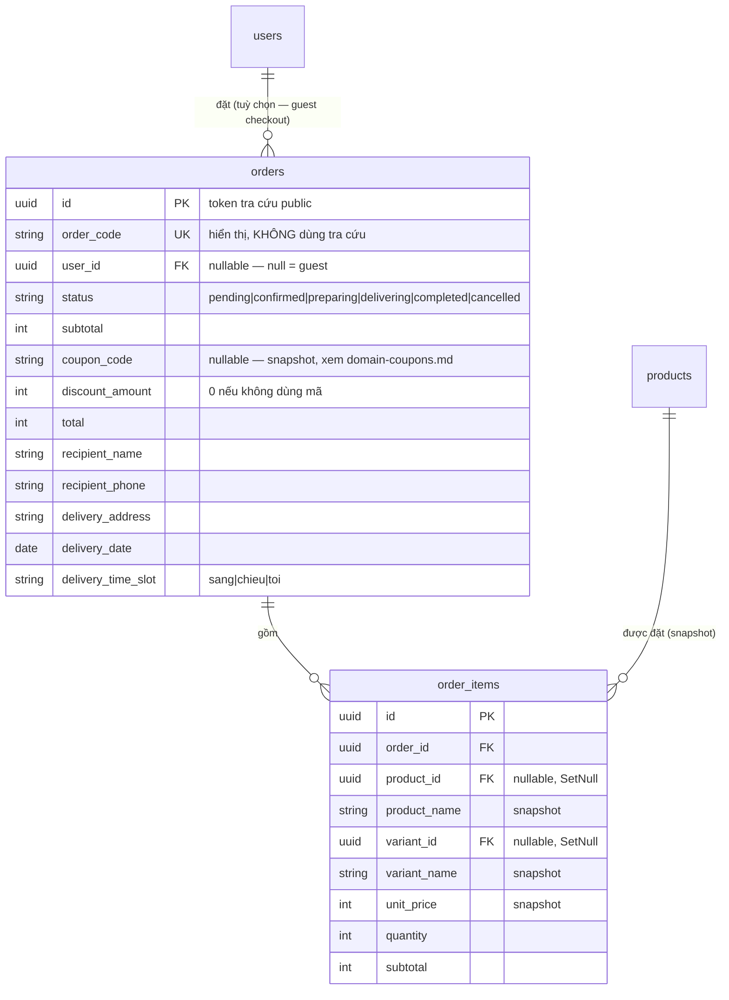
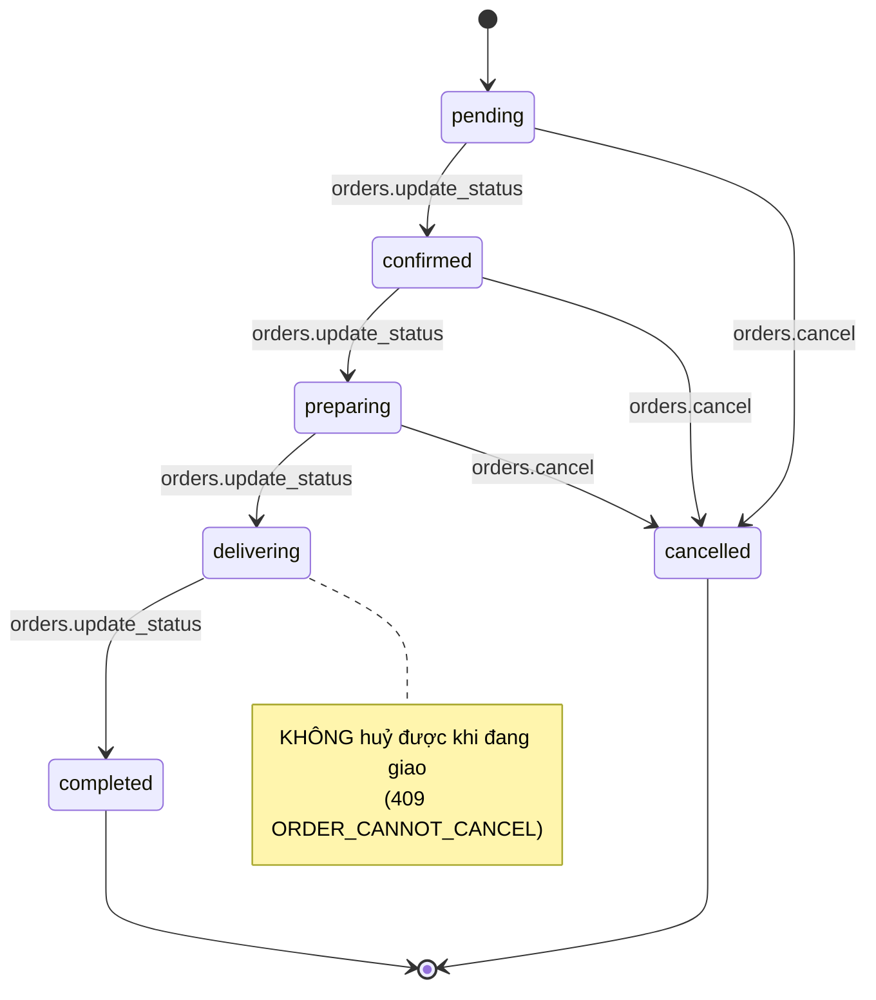
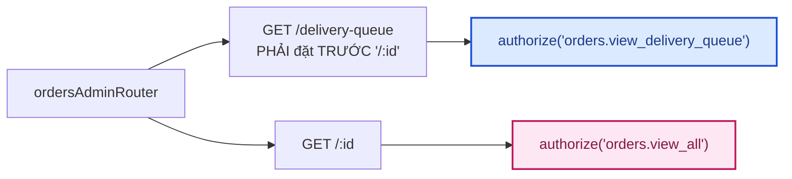
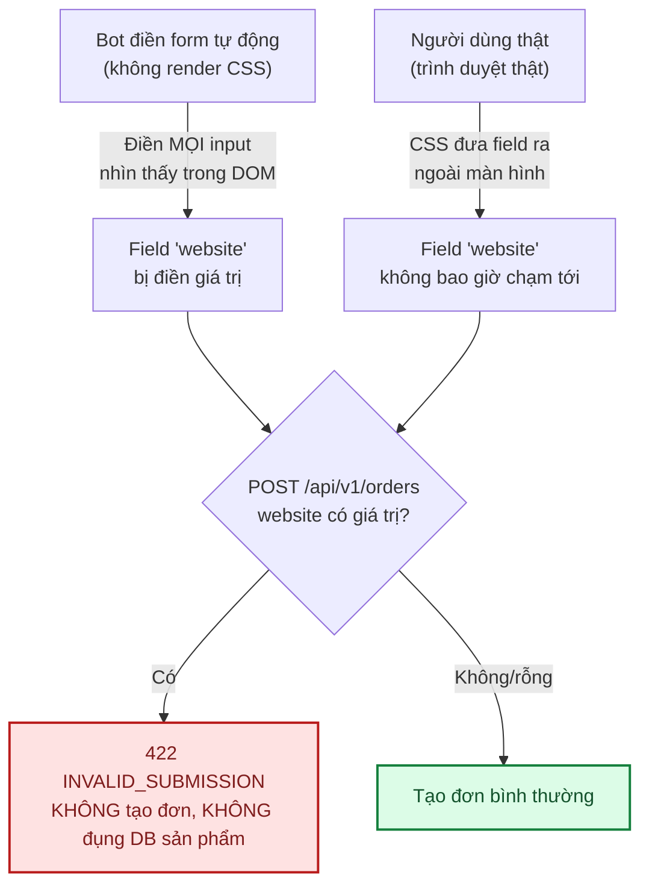
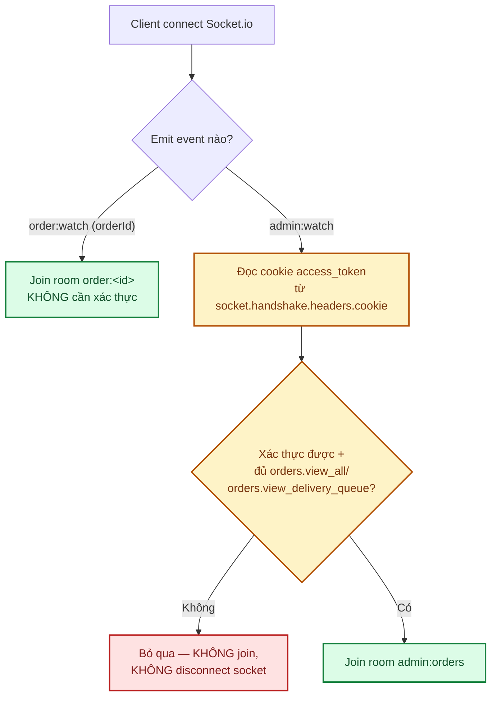
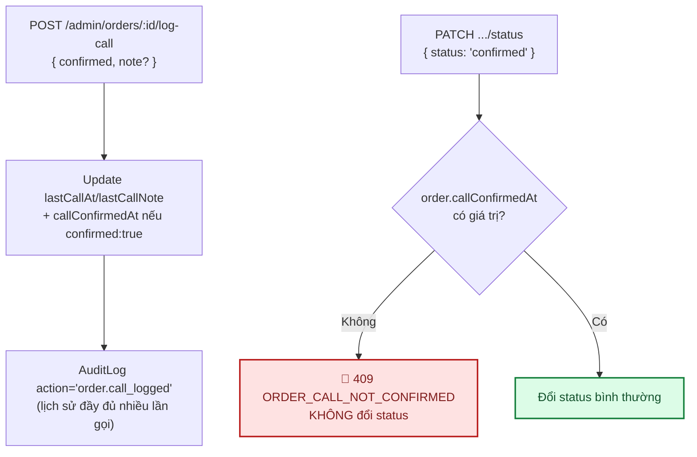

# Module: Orders 🌸 Domain

Giỏ hàng + đặt hàng — **giai đoạn cơ bản**: guest checkout (không cần đăng nhập), thanh toán COD, cửa
hàng gọi điện xác nhận đơn. Chưa có thanh toán online — xem [§8 Việc còn lại](#8-việc-còn-lại).

---

## 1. Quyết định kiến trúc: giỏ hàng ở CLIENT, không phải bảng `carts`

Bản phác thảo ban đầu ở [05 §3.4](../05-database-va-rbac.md#34-nhóm-sản-phẩm) có bảng `carts`/
`cart_items` (server lưu giỏ hàng, hỗ trợ đồng bộ nhiều thiết bị). Module này **cố ý không làm vậy**:
giỏ hàng lưu ở `localStorage` phía trình duyệt (Zustand + middleware `persist`,
`frontend/src/store/useCartStore.ts`), KHÔNG có bảng nào ở backend cho tới khi khách bấm "Đặt hàng".

**Vì sao**: đơn hoa thường chỉ 1-3 sản phẩm, hiếm khi cần đồng bộ giỏ hàng giữa nhiều thiết bị (khác
giỏ hàng thương mại điện tử tổng hợp). Giỏ hàng trước khi đặt chỉ là **trạng thái đang soạn**, không
phải dữ liệu đã chốt — đúng tinh thần "Zustand chỉ giữ UI state" ở `CLAUDE.md` §5. Khi bấm "Đặt hàng",
toàn bộ giỏ được gửi thẳng trong 1 lần gọi `POST /api/v1/orders` — từ đó `Order` (đã lưu DB) mới là
nguồn sự thật.

**Đánh đổi đã chấp nhận**: giỏ hàng không đồng bộ giữa các thiết bị/trình duyệt, mất khi xoá dữ liệu
trình duyệt. Chấp nhận được ở giai đoạn cơ bản — nếu sau này cần đồng bộ (vd khách đăng nhập trên
nhiều thiết bị), xây bảng `carts`/`cart_items` lúc đó, không thiết kế trước cho nhu cầu giả định.

```mermaid
flowchart LR
    A["🩷 Duyệt sản phẩm"] --> B["🩷 Thêm vào giỏ<br/>(Zustand + localStorage)"]
    B --> C["🩷 /gio-hang<br/>sửa số lượng, xoá"]
    C --> D["🩷 /thanh-toan<br/>nhập thông tin giao"]
    D --> E["🔵 POST /api/v1/orders<br/>tạo Order + OrderItem"]
    E --> F["🟢 /don-hang/:id<br/>trang xác nhận (public)"]

    style A fill:#fce7f3,stroke:#be185d,stroke-width:2px,color:#831843
    style B fill:#fce7f3,stroke:#be185d,stroke-width:2px,color:#831843
    style C fill:#fce7f3,stroke:#be185d,stroke-width:2px,color:#831843
    style D fill:#fce7f3,stroke:#be185d,stroke-width:2px,color:#831843
    style E fill:#dbeafe,stroke:#1d4ed8,stroke-width:2px,color:#1e3a8a
    style F fill:#dcfce7,stroke:#15803d,stroke-width:2px,color:#14532d
```

### Bẫy hydration đã gặp khi build

`persist` đọc `localStorage` **bất đồng bộ** (bọc qua 1 microtask để thống nhất API với storage khác,
dù bản thân `localStorage` là I/O đồng bộ) — lần render đầu tiên trên client, `items` LUÔN là `[]` dù
localStorage đã có dữ liệu, tới khi cờ `hasHydrated` (tự thêm vào store) bật lên mới đáng tin. Bug
THẬT đã gặp: trang `/thanh-toan` có `useEffect` điều hướng về `/gio-hang` khi `items.length === 0`
(chặn submit đơn rỗng khi gõ URL tay) — nếu không đợi `hasHydrated`, mới thêm hàng xong rồi vào thẳng
`/thanh-toan` cũng bị đá ngược lại `/gio-hang` vì effect chạy trước khi kịp đọc xong localStorage.

Bug thứ 2 liên quan: sau khi đặt hàng thành công, `clear()` làm `items` về `[]` — effect trên **lại**
tưởng nhầm "vào thẳng URL khi giỏ trống" và gọi `router.replace('/gio-hang')`, giành với
`router.push('/don-hang/:id')` đang điều hướng sang trang xác nhận. Fix bằng 1 `ref` đánh dấu "vừa đặt
hàng xong" để effect bỏ qua lần đó. Xem `frontend/src/app/(storefront)/thanh-toan/page.tsx`.

---

## 2. Schema — rút gọn so với bản phác thảo đầy đủ

| Bảng | Trạng thái | Khác biệt so với [05 §3.7](../05-database-va-rbac.md) |
|---|---|---|
| `orders` | ✅ | Nhúng thẳng field giao hàng (`recipient_name`, `recipient_phone`, `delivery_address`, `delivery_date`, `delivery_time_slot`) thay vì tách bảng `order_deliveries` riêng — chưa cần `shipper_id` vì chưa có màn phân công. `subtotal`/`total` kiểu `Int` (VND, giống `products.base_price`) thay vì `decimal`. CÓ `coupon_code`/`discount_amount` (snapshot mã giảm giá — xem [domain-coupons.md](domain-coupons.md)). KHÔNG có `shipping_fee`/`payment_status` (chưa có phí ship/thanh toán online). |
| `order_items` | ✅ | Snapshot `product_name`/`unit_price` tại thời điểm đặt — sản phẩm đổi tên/giá sau đó không ảnh hưởng đơn cũ. Có `variant_id` (nullable, `onDelete: SetNull`) + `variant_name` (snapshot) khi dòng đơn chọn biến thể — xem [domain-products.md §2.5](domain-products.md#25-biến-thể-sizegiá-riêng--product_variants). Chưa có `card_message` riêng (dùng chung `orders.note`). |
| `order_deliveries` | ⬜ | Tách ra khi làm màn phân công shipper thật — xem §8. |
| `payments` | ⬜ | Chỉ COD ở giai đoạn này (`orders.payment_method = 'cod'`, cố định). |
| `order_status_history` | — (dùng lại) | KHÔNG có bảng riêng — mỗi lần đổi trạng thái ghi vào `AuditLog` chung (`action: 'order.update_status'`), đúng cách `categories`/`products`/`contact` đang làm, không xây cơ chế lịch sử song song. |
| `carts`/`cart_items` | — (không làm) | Xem §1 — giỏ hàng ở client. |

### `Order.id` (UUID) vs `orderCode` — chống IDOR

`GET /api/v1/orders/:id` **công khai**, không cần đăng nhập — ai có link đều xem được (tên/SĐT người
nhận, địa chỉ, món hàng). `id` dạng UUID (122-bit entropy) đủ khó đoán để đóng vai trò **token tra
cứu** — đúng mô hình "sở hữu link = có quyền xem" mà nhiều nền tảng thương mại điện tử dùng cho trang
xác nhận đơn khách vãng lai. `orderCode` (vd `HX2609100001`, ngắn để đọc qua điện thoại) **CHỈ để hiển
thị**, không bao giờ dùng làm khoá tra cứu — nếu dùng, kẻ tấn công có thể dò tuần tự
(`HX2609100001`, `HX2609100002`...) để xem đơn của người khác. Xem [07 · Bảo mật §2](../07-bao-mat.md).

### Bug timezone đã gặp: `deliveryDate` bị lùi 1 ngày

`deliveryDate` là cột `@db.Date` (chỉ có ý nghĩa NGÀY, không có múi giờ). Lúc đầu tạo
`new Date(`${input.deliveryDate}T00:00:00`)` — không neo múi giờ (`Z`) nghĩa là JS hiểu theo múi giờ
**LOCAL của server** (`Asia/Saigon`, UTC+7). 00:00 giờ VN ngày 25/12 = 17:00 UTC ngày 24/12 → Postgres
lưu NHẦM thành ngày 24/12. Test thủ công qua `curl` bắt được ngay: gửi `"2026-12-25"`, DB trả về
`"2026-12-24T00:00:00.000Z"`. Fix: LUÔN neo `.000Z` (UTC) khi tạo `Date` cho cột chỉ có ý nghĩa ngày —
`new Date(`${input.deliveryDate}T00:00:00.000Z`)`. Áp dụng đối xứng ở frontend khi **hiển thị** lại
(`lib/date.ts` → `formatDeliveryDate()`, luôn `timeZone: 'UTC'`), tránh lặp lại lỗi tương tự theo
chiều ngược lại ở máy khách có múi giờ khác server.

---

## 3. Quyền theo GIÁ TRỊ, không phải 1 permission cố định cho route

`PATCH /api/v1/admin/orders/:id/status` là route DUY NHẤT trong dự án mà quyền cần phụ thuộc **nội
dung body** thay vì cố định theo route — đúng ma trận đã chốt ở
[05 §2.4](../05-database-va-rbac.md#24-ma-trận-vai-trò--quyền-mặc-định-seed):

| `status` gửi lên | Permission cần |
|---|---|
| `cancelled` | `orders.cancel` |
| Bất kỳ giá trị khác | `orders.update_status` |

Vì vậy route KHÔNG dùng `authorize('...')` chung cho cả router như `products`/`categories`/`contact`
đang làm — 2 route đọc (`GET /`, `GET /:id`) vẫn dùng `authorize('orders.view_all')` bình thường,
riêng `PATCH .../status` bỏ qua `authorize()` ở tầng route, tự kiểm tra permission NGAY TRONG SERVICE
(`orders.service.ts` → `updateStatus()`, nhận `actorPermissions: string[]` làm tham số thay vì đọc
`req` — service không đụng `req`/`res`, xem `CLAUDE.md` §5).

`completed`/`cancelled` là trạng thái CUỐI — mọi thay đổi tiếp theo bị chặn (`409 ORDER_STATUS_FINAL`),
kể cả actor có đủ quyền.

### Bug thật tìm thấy khi build: admin thiếu `orders.update_status`

`domain.seed.ts`'s `ADMIN_DOMAIN_PERMISSIONS` (mảng cấp quyền cho `admin`/`super_admin`) đã thiếu
`orders.update_status` từ trước — dù ma trận ở 05 §2.4 ghi rõ cả 2 role đều có quyền này. Hậu quả: kể
cả `super_admin` cũng bị `403 FORBIDDEN` khi đổi trạng thái đơn sang bất kỳ giá trị nào ngoài
`cancelled`. Phát hiện khi build tính năng này và test thủ công qua `curl` thật. Đã sửa + chạy lại
`npm run seed:domain`. Bài học: đối chiếu kỹ mảng seed với bảng ma trận mỗi lần thêm permission mới,
đừng chỉ tin permission "trông có vẻ" đủ.

`florist`/`shipper`/`sales_staff` đã có sẵn permission đúng ma trận (seed từ trước, module Orders chưa
tồn tại lúc đó) — module này chỉ cần VIẾT ĐÚNG code để dùng permission đã có, không cần sửa seed cho 3
role đó.

---

## 4. Frontend

| File | Vai trò |
|---|---|
| `store/useCartStore.ts` | Giỏ hàng (Zustand + `persist` → localStorage), `hasHydrated` flag (xem §1) |
| `features/domain/orders/orders.service.ts` | Gọi API — `create`, `listAdmin`, `updateStatus`; export `ORDER_STATUS_LABELS`/`ORDER_TIME_SLOT_LABELS` dùng chung |
| `features/domain/orders/orders.hooks.ts` | `useCreateOrder`, `useOrders`, `useUpdateOrderStatus` |
| `lib/storefront-api.ts` → `getOrderById()` | Trang xác nhận đơn (Server Component, `fetch` gốc) — KHÔNG qua `orders.service.ts` (axios, dành cho Client Component) |
| `lib/date.ts` → `formatDeliveryDate()` | Format `dd/MM/yyyy`, LUÔN `timeZone: 'UTC'` — xem §2 |
| `components/storefront/AddToCartControls.tsx` | Stepper số lượng + nút thêm giỏ ở trang chi tiết sản phẩm |
| `app/(storefront)/gio-hang/page.tsx` | Trang giỏ hàng |
| `app/(storefront)/thanh-toan/page.tsx` | Form giao hàng + tóm tắt đơn, gọi `POST /orders` |
| `app/(storefront)/don-hang/[id]/page.tsx` | Trang xác nhận (public, Server Component) |
| `app/(dashboard)/admin/orders/page.tsx` | Danh sách + lọc theo trạng thái + mở rộng dòng xem chi tiết/đổi trạng thái |
| `app/(dashboard)/admin/orders/delivery-queue/page.tsx` | Lịch giao hoa theo ngày (dashboard florist) — xem §4b |

`ProductCard`/trang chi tiết sản phẩm đã nối nút "Thêm vào giỏ" thật (trước đó chỉ là nút trang trí,
không có `onClick`) — tiện thể sửa luôn 1 lỗi có sẵn: lớp phủ gọi/Zalo hover trên `ProductCard` thiếu
`pointer-events-none` lúc ẩn, khiến nó che mất click vào ảnh sản phẩm ngay cả khi chưa hover.

---

## 4b. Lịch giao hoa theo ngày (dashboard florist)

`GET /api/v1/admin/orders/delivery-queue?date=YYYY-MM-DD` — permission **RIÊNG**
`orders.view_delivery_queue` (đã seed sẵn cho `florist` từ trước, xem §3), KHÁC `orders.view_all` (chỉ
admin/super_admin/sales_staff). Không phân trang — trả thẳng mảng đơn của ĐÚNG 1 ngày, sắp theo khung
giờ giao (sáng → chiều → tối), loại trừ đơn đã huỷ.

**Cạm bẫy thứ tự route**: `/delivery-queue` phải khai báo TRƯỚC `/:id` trong
`orders.admin.routes.ts` — Express khớp route theo thứ tự đăng ký, đặt sau sẽ bị `:id` "nuốt" mất
(rồi validate UUID thất bại vì `"delivery-queue"` không phải UUID) — cùng cạm bẫy đã gặp ở
`products.routes.ts` (`/:slug` đặt sau `/`).

### Florist vào được ĐÚNG 1 trang trong `/admin/*`, không hơn

`florist` KHÔNG có `orders.view_all` nên KHÔNG dùng được `/admin/orders` bình thường — nhưng
`AdminShell.tsx` (frontend) mặc định chỉ cho role `admin`/`super_admin` vào TOÀN BỘ `/admin/*`. Giải
pháp: mở NGOẠI LỆ đúng 1 đường dẫn (`FLORIST_ALLOWED_PATH = '/admin/orders/delivery-queue'`) cho role
`florist`, và đổi hẳn sidebar thành rút gọn (chỉ 1 link "Lịch giao hoa") khi user CHỈ có role florist
(không kiêm admin/super_admin) — sidebar đầy đủ sẽ toàn dẫn tới trang `403` vì florist không có
permission nào khác, gây rối chứ không hữu ích. Đây vẫn chỉ là lớp UX (giống mọi kiểm tra role khác ở
`AdminShell.tsx`) — ranh giới bảo mật thật sự luôn ở `authorize('orders.view_delivery_queue')` phía
backend.

Nút đổi trạng thái ở trang này **không có** nút "Huỷ đơn" (khác `/admin/orders`) — florist chỉ có
`orders.update_status`, không có `orders.cancel` (đúng mô tả role ở docs/05: "KHÔNG truy cập thông tin
thanh toán... chỉ được cập nhật đơn đang ở trạng thái đang chuẩn bị").

---

## 5. Ràng buộc nghiệp vụ

| Ràng buộc | Mã lỗi | Vì sao |
|---|---|---|
| Sản phẩm trong giỏ phải đang tồn tại + `isActive` + chưa xoá mềm | `409 PRODUCT_UNAVAILABLE` | Giỏ hàng client có thể cũ hơn dữ liệu server |
| Ngày giao phải từ hôm nay trở đi | `422` (validate ở tầng zod) | Không nhận đơn giao ngày đã qua |
| Không đổi trạng thái khi đơn đã `completed`/`cancelled` | `409 ORDER_STATUS_FINAL` | Trạng thái cuối |
| Không huỷ đơn đang `delivering` | `409 ORDER_CANNOT_CANCEL` | Hoa đã ra khỏi cửa hàng |
| Đổi `status` cần đúng permission theo giá trị (xem §3) | `403 FORBIDDEN` | Ma trận 05 §2.4 |
| Field honeypot `website` có giá trị (kể cả khoảng trắng) | `422 INVALID_SUBMISSION` | Chống bot — xem §9 |

---

## 6. Kiểm thử

| Tầng | File | Số test |
|---|---|---|
| Unit | `backend/tests/unit/modules/orders.service.test.ts` | 45 — snapshot giá, gộp trùng theo khoá `(productId, variantId)`, giá lấy từ biến thể khi có `variantId`, `409` khi `variantId` không tồn tại hoặc không thuộc `productId` gửi lên, sinh `orderCode` không trùng, ràng buộc trạng thái, quyền theo giá trị `status`, honeypot, lịch giao hoa theo ngày (§4b), áp dụng mã giảm giá + chống race condition hết lượt dùng (xem [domain-coupons.md](domain-coupons.md)), gate + ghi nhận cuộc gọi xác minh (§11) |
| Integration | `backend/tests/integration/orders.routes.test.ts` | 32 — guest checkout công khai, tra cứu công khai, quyền admin theo permission cụ thể, honeypot, `/delivery-queue` không bị `/:id` nuốt mất, gate + route `log-call` (§11) |
| RBAC chung | `backend/tests/integration/rbac.test.ts` | `GET /admin/orders` + `POST /admin/orders/:id/log-call` trong bảng `PROTECTED` dùng chung 3 tầng (401/403/200) |

Kiểm chứng thủ công qua `curl` + trình duyệt thật (Playwright, không lưu trong repo): thêm giỏ → sửa
số lượng → đặt hàng → trang xác nhận → đăng nhập `super_admin` → `/admin/orders` → mở rộng dòng → đổi
trạng thái liên tiếp `pending → confirmed → preparing` — bắt được cả 2 bug (timezone §2, race điều
hướng §1) đúng ở bước test thủ công này, không phải qua test tự động (test tự động mock DB nên không
lộ hành vi cột `@db.Date` thật, và race điều hướng chỉ lộ ra khi chạy trong trình duyệt thật).

---

## 7. Không phải state machine đầy đủ

Nút gợi ý "Chuyển sang ..." ở `/admin/orders` (frontend) chỉ đề xuất trạng thái kế tiếp HỢP LÝ cho
luồng thường gặp (`pending → confirmed → preparing → delivering → completed`), KHÔNG phải state
machine đầy đủ — backend (`orders.service.ts`) mới là nơi validate thật (permission theo giá trị,
chặn đổi khi đã ở trạng thái cuối). Frontend không chặn admin gọi API đổi sang trạng thái "nhảy cóc"
(vd `pending → completed` thẳng) — backend cũng không chặn việc này ở giai đoạn cơ bản, chỉ chặn state
CUỐI và huỷ-khi-đang-giao. Nếu cần state machine chặt hơn (chỉ cho đổi tuần tự từng bước), xây ở
`orders.service.ts` khi có nhu cầu thật.

---

## 8. Việc còn lại

| Việc | Ưu tiên | Ghi chú |
|---|:---:|---|
| Thanh toán online (VNPay/Momo) — bảng `payments`, webhook verify HMAC | 🟡 | Hiện chỉ COD |
| Tách `order_deliveries` riêng + `shipper_id` khi làm màn phân công shipper | 🟡 | Hiện nhúng thẳng field giao hàng vào `orders` (xem §2) |
| ~~`GET /api/v1/account/orders` — khách xem lịch sử đơn khi đăng nhập~~ | ✅ | Đã làm (11/09/2026, docs/12 §5.1) — chỉ API, **chưa có trang UI** hiển thị danh sách này ở frontend |
| ~~Hàng đợi soạn hoa riêng cho `florist` (`orders.view_delivery_queue`)~~ | ✅ | Đã làm (12/09/2026) — xem §4b |
| Hàng đợi giao hàng riêng cho `shipper` (`orders.view_shipping_queue`) | 🟢 | Permission đã seed sẵn, chưa có UI/route dùng tới — có thể sao chép mẫu §4b |
| Phân công shipper (`orders.assign_shipper`) | 🟢 | Permission đã seed sẵn, chưa có UI |
| State machine chặt hơn (chặn nhảy cóc trạng thái) | 🟢 | Xem §7 |
| `card_message` riêng cho thiệp chúc | 🟢 | Hiện dùng chung `orders.note` |
| ~~Coupon/mã giảm giá~~ | ✅ | Đã làm (12/09/2026) — xem [domain-coupons.md](domain-coupons.md) |
| Phí ship (`shipping_fee`) | 🟢 | Chưa có |
| Giới hạn theo `recipientPhone` (không chỉ theo IP) | 🟡 | Chặn trường hợp bot đổi IP nhưng dùng lại số điện thoại — xem §9 |
| CAPTCHA (Cloudflare Turnstile) | 🟢 | Chỉ cần khi honeypot + rate limit không đủ — thêm 1 bước cho khách thật nên để dự phòng |
| ~~Xác minh đơn qua cuộc gọi điện thoại (admin ghi nhận)~~ | ✅ | Đã làm (14/09/2026) — xem §11 |
| OTP SMS tự động khi đặt hàng | 🟢 | Cần dịch vụ SMS gateway trả phí bên ngoài — cố ý chưa làm, xem §11 |

---

## 9. Chống spam form (honeypot)

`POST /api/v1/orders` công khai (guest checkout), không CAPTCHA, nên là mục tiêu dễ bị bot spam form
(script điền + gửi hàng loạt). Đơn spam không tự mất tiền/hàng thật (mọi đơn đều `pending` chờ cửa
hàng gọi xác nhận), nhưng làm nhiễu `/admin/orders` — nhân viên mất công lọc rác. 2 lớp phòng thủ hiện
có:

1. **Rate limit theo IP** — `createOrderLimiter` (10 lần/15 phút), xem `orders.routes.ts`. Chặn được
   spam đơn giản, không chặn được người đổi IP (wifi khác, 4G, VPN).
2. **Honeypot** — field ẩn `website` (`components/ui/HoneypotField.tsx`), gắn vào `/thanh-toan`.

Chi tiết kỹ thuật đáng chú ý:

- Field ẩn bằng **CSS đưa ra ngoài màn hình** (`absolute -left-[9999px]`), KHÔNG dùng `type="hidden"`
  — nhiều bot spam đã học cách lọc bỏ `type="hidden"` trước khi điền, nhưng input `type="text"` bị che
  bằng CSS thì phần lớn bot (không render CSS, chỉ đọc DOM) vẫn điền vào bình thường.
- `aria-hidden="true"` + `tabIndex={-1}` — người dùng dùng trình đọc màn hình hoặc điều hướng bằng
  Tab KHÔNG bao giờ gặp field này, tránh trường hợp họ vô tình điền nhầm (false positive).
- Server kiểm tra **giá trị thô, KHÔNG `.trim()` trước** — chỉ khoảng trắng cũng bị coi là bot, vì
  người dùng thật không chạm vào field này nên giá trị luôn đúng y hệt mặc định (`''`); bất kỳ sai
  khác nào, dù nhỏ, đều là tín hiệu bot chứ không phải input hợp lệ vô tình.
- Trả lỗi **chung chung** (`422`, thông điệp không nhắc gì tới honeypot) — không "dạy" bot biết chính
  xác vì sao bị chặn, tránh bot thích nghi (bỏ qua đúng field `website` khi phát hiện bị chặn).
- Check nằm NGAY ĐẦU `orders.service.ts` → `create()`, trước mọi truy vấn DB — vừa chặn spam vừa đỡ
  tải khi bị bot dội request hàng loạt.

**Không phải phòng thủ tuyệt đối**: chỉ chặn bot "ngây thơ" điền mọi field nhìn thấy trong DOM mà
không kiểm tra CSS — không chặn được kẻ tấn công có chủ đích đọc thẳng bundle JS công khai để biết
tên field `website` cần bỏ trống khi gọi thẳng API. Với đối tượng đó, lớp phòng thủ tiếp theo là giới
hạn theo `recipientPhone` hoặc CAPTCHA — xem §8.

---

## 10. Realtime trạng thái đơn (Socket.io)

Trang xác nhận đơn công khai (`/don-hang/:id`) và 2 màn quản trị (`/admin/orders`,
`/admin/orders/delivery-queue`) tự cập nhật khi trạng thái đơn đổi — **không cần F5**. Hạ tầng
Socket.io TÁCH RIÊNG core (dùng lại được cho domain khác) và domain (logic cụ thể của orders):

| | |
|---|---|
| **Core (hạ tầng chung)** | `modules/core/realtime/realtime.service.ts` — `initSocket()`/`getIO()`, không biết gì về "đơn hàng" |
| **Domain (logic orders)** | `modules/domain/orders/orders.realtime.ts` — room, event, kiểm tra quyền join room quản trị |

### 10.1. Hai loại room — công khai theo id vs quản trị cần xác thực

- **`order:<id>`** — join KHÔNG cần đăng nhập, biết đúng UUID coi như có quyền theo dõi đơn đó, đúng
  NGUYÊN mô hình bảo mật đã có của `GET /orders/:id` công khai (id đóng vai trò token, xem §2).
- **`admin:orders`** — PHẢI xác thực + đủ quyền mới join được. Socket.io **không đi qua Express
  middleware** (không có `cookie-parser`/`authenticate` chạy trước) — `orders.realtime.ts` tự đọc
  thẳng header `Cookie` thô lúc handshake, tự `verifyAccessToken()` + `loadUserRolesAndPermissions()`
  (đúng 2 hàm `authenticate` middleware dùng cho HTTP, gọi lại trực tiếp thay vì tái sử dụng
  middleware vì middleware nhận `req`/`res` của Express, không áp dụng cho Socket.io). Sai/thiếu
  quyền → im lặng bỏ qua, KHÔNG disconnect cả socket (socket đó có thể vẫn đang theo dõi 1 đơn công
  khai khác qua `order:watch`).

### 10.2. Emit ở đâu

`orders.service.ts` gọi 2 hàm sau NGAY SAU khi ghi DB thành công (không gói trong transaction — phát
event là tác dụng phụ, không phải một phần tính đúng đắn của giao dịch):

| Hàm | Gọi sau | Phát tới |
|---|---|---|
| `emitOrderCreated(order)` | `create()` | CHỈ `admin:orders` — khách vừa đặt được điều hướng thẳng sang trang xác nhận, không cần biết "đơn của mình vừa tạo" qua socket |
| `emitOrderStatusChanged(order)` | `updateStatus()` | CẢ `admin:orders` LẪN `order:<id>` — dashboard quản trị tự refetch, khách đang mở trang xác nhận thấy badge đổi ngay |

Cả 2 hàm dùng `getIO()?.to(...)` — `getIO()` trả `null` khi `initSocket()` chưa chạy (vd trong unit
test, không có `http.Server` thật) → phát event trở thành no-op, KHÔNG throw, không cần mock gì thêm
ở test.

### 10.3. Frontend — chỉ invalidate cache, không tự merge dữ liệu

- **`useLiveOrderStatus(orderId, initialStatus)`** — dùng ở `OrderConfirmationView` (Client Component,
  được `don-hang/[id]/page.tsx` — Server Component — render ra với `order` đã fetch sẵn). CHỈ theo dõi
  `status`, mọi field khác (địa chỉ, sản phẩm, tổng tiền...) là snapshot cố định tại thời điểm đặt
  hàng, không cần realtime.
- **`useAdminOrdersRealtime()`** — dùng ở 2 trang quản trị, nhận event `order:created`/
  `order:status_changed` rồi `queryClient.invalidateQueries(['admin','orders'])` +
  `invalidateQueries(['admin','delivery-queue'])` để React Query tự refetch — KHÔNG tự merge dữ liệu
  realtime vào state client (tránh lệch với filter/phân trang hiện tại của từng trang).
- 1 kết nối WebSocket duy nhất cho toàn app (`lib/socket.ts`, singleton) — nhiều hook cùng lúc chỉ
  thêm/gỡ listener trên CÙNG 1 socket, không mở nhiều kết nối trùng lặp.

---

## 11. Xác minh đơn qua cuộc gọi điện thoại (✅ 14/09/2026)

Nợ bảo mật "SĐT giả" (`docs/07-bao-mat.md`) — trước đây "cửa hàng gọi điện xác nhận đơn" chỉ là quy
trình ngoài đời, **không được số hoá**: admin chuyển `pending → confirmed` hoàn toàn dựa trên "niềm
tin" là đã gọi, hệ thống không lưu vết đã gọi hay chưa. Đã cân nhắc OTP SMS tự động nhưng cần dịch vụ
SMS gateway trả phí bên ngoài (vướng vấn đề "cần chuẩn bị" giống cổng thanh toán online, xem §8) —
chọn hướng nhẹ hơn: **admin tự gọi, hệ thống chỉ hỗ trợ ghi nhận + chặn** thật ở backend.

**Chỉ 3 field "mới nhất"** trên `Order` (`callConfirmedAt`/`lastCallAt`/`lastCallNote`) — KHÔNG có
bảng lịch sử cuộc gọi riêng. Nhiều lần gọi (kể cả không bắt máy) đi qua `AuditLog` chung
(`action: "order.call_logged"`), xem lại qua `/superadmin/audit-logs` — đúng quyết định đã chốt ở §2
("order_status_history — dùng lại AuditLog").

**Không dùng permission mới** — `POST .../log-call` dùng LẠI `orders.update_status` (ghi nhận cuộc
gọi là 1 bước trong đúng nhóm "cập nhật tiến trình đơn"), tránh phình permission cho 1 hành động phụ.

**Rò rỉ dữ liệu đã tránh được lúc code**: `getById()` (hàm service) dùng CHUNG cho cả
`GET /orders/:id` công khai (id = token tra cứu, ai có link cũng xem được) lẫn
`GET /admin/orders/:id`. Nếu đưa 3 field trên vào `ORDER_SELECT` gốc sẽ **lộ ghi chú nội bộ admin ra
trang tra cứu đơn công khai**. Đã tách riêng `ADMIN_ORDER_SELECT` (mở rộng `ORDER_SELECT` +3 field),
chỉ dùng cho những truy vấn CHẮC CHẮN chỉ admin gọi (`listAdmin`, `listDeliveryQueue`, `logCall`).
`updateStatus()` **cố ý** vẫn giữ `ORDER_SELECT` gốc dù cũng là route admin — vì kết quả của nó còn
được emit qua Socket.io tới room công khai `order:<id>` (§10.2), dùng `ADMIN_ORDER_SELECT` ở đây sẽ
leak field admin ra thẳng trình duyệt khách qua realtime, dù type tham số của hàm emit chỉ khai
`{id, status}` (TypeScript không tự lược field thừa lúc serialize JSON runtime).

**Phạm vi cố ý KHÔNG làm**: không thêm field `email` vào checkout (không đụng guest checkout hiện
có) · không gate các transition khác ngoài `pending → confirmed` · không tự động huỷ đơn khi
`confirmed: false` nhiều lần (admin tự quyết định qua nút "Huỷ đơn" sẵn có, permission `orders.cancel`
riêng) · không thêm Socket.io event mới cho việc ghi nhận cuộc gọi (thao tác nội bộ admin, không cần
đồng bộ realtime giữa nhiều tab ngay lập tức).

**Kiểm thử**: `orders.service.test.ts` (gate `ORDER_CALL_NOT_CONFIRMED` + `logCall()`) ·
`orders.routes.test.ts` (401/403/404/200/409 qua HTTP thật) · thêm route vào `rbac.test.ts`. Đã kiểm
chứng thật bằng Playwright: đăng nhập admin → mở đơn `pending` → nút "Chuyển sang Đã xác nhận" bị
disable + hiện lý do → ghi nhận cuộc gọi → nút bật lại → chuyển trạng thái thành công; gọi thẳng API
`PATCH .../status` khi chưa gọi → xác nhận `409 ORDER_CALL_NOT_CONFIRMED` thật.

### 10.4. Kiểm thử

| Tầng | File | Số test |
|---|---|---|
| Unit | `backend/tests/unit/modules/orders.realtime.test.ts` | 7 — `resolveAdminAccess()`: không cookie, cookie sai tên, token giả mạo, thiếu quyền, đủ quyền (cả 2 permission), đọc đúng cookie giữa nhiều cookie khác |
| Unit | `backend/tests/unit/modules/orders.service.test.ts` | +2 — `emitOrderCreated`/`emitOrderStatusChanged` được gọi đúng sau khi tạo đơn/đổi trạng thái thành công |

Kiểm chứng end-to-end qua trình duyệt thật (Playwright, 2 browser context riêng biệt mô phỏng khách +
admin, script tạm không lưu trong repo, 12/09/2026): (1) khách mở trang xác nhận đơn, admin đổi trạng
thái qua API ở context KHÁC → badge khách tự đổi trong vài giây, KHÔNG F5; (2) admin mở `/admin/orders`,
đặt 1 đơn mới qua API công khai → danh sách tự hiện đơn mới, KHÔNG F5. Dữ liệu test đã xoá sạch sau
khi verify qua script `tsx`+`PrismaClient` tạm.

### 10.5. Việc còn lại

| Việc | Ưu tiên |
|---|:---:|
| Thông báo đẩy (browser push notification) khi đơn đổi trạng thái, không chỉ cập nhật UI đang mở | 🟢 |
| Chỉ báo "đang kết nối realtime" cho khách biết trang đang theo dõi live (hiện im lặng, không có dấu hiệu UI nào) | 🟢 |
| Scale ngang nhiều instance API — Socket.io cần Redis adapter để broadcast xuyên instance (hiện 1 instance, chưa cần) | 🟡 |
