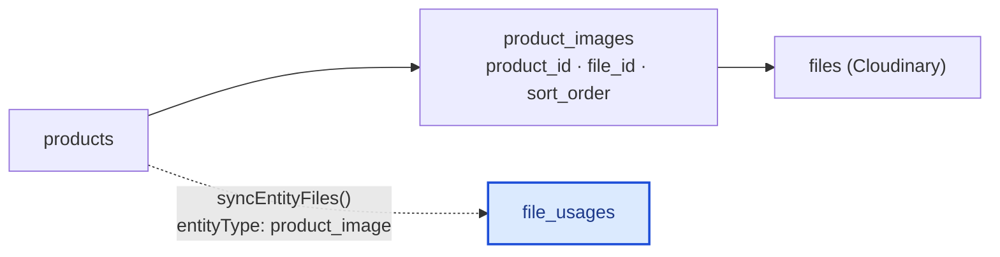
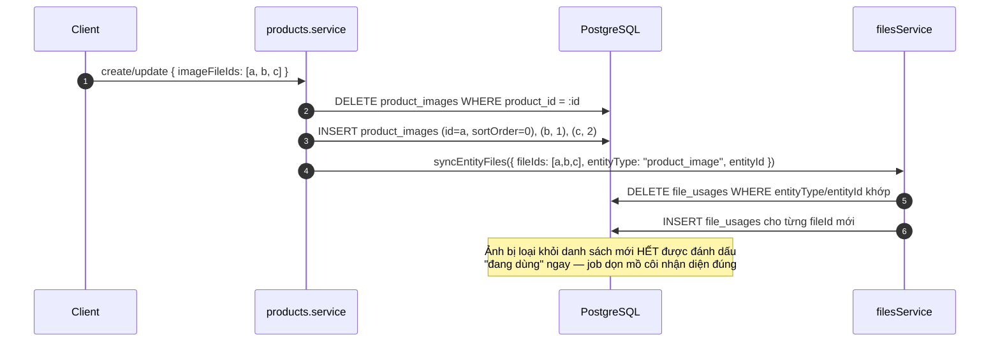
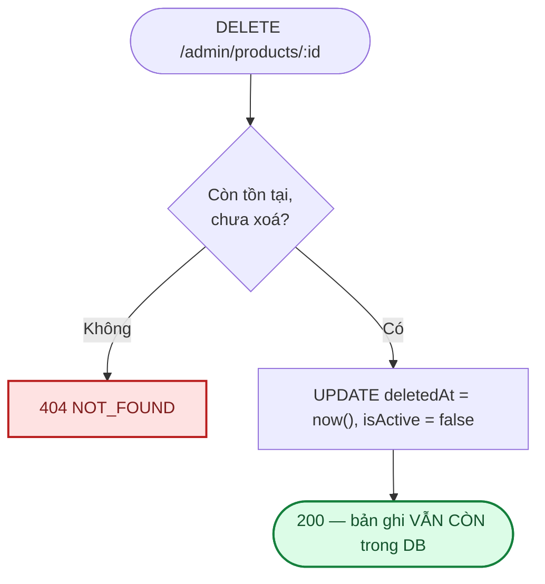
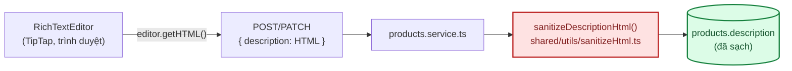

# Module: Products 🌸 Domain

Sản phẩm hoa: tên, giá, danh mục, và một **thư viện nhiều ảnh** (khác `categories` chỉ có 1 ảnh đại
diện). **Không có tồn kho** — hoa tươi làm theo đơn/theo mẫu tại thời điểm đặt, không phải hàng lưu
kho theo SKU cố định; ẩn tạm sản phẩm dùng `isActive`, không phải "hết hàng". Là module domain
**thứ hai**, sao chép hầu hết quy ước từ [`categories`](domain-categories.md) — đọc file đó trước
nếu chưa quen mẫu chung.

| | |
|---|---|
| **Loại** | 🌸 Domain — viết mới cho từng dự án |
| **Backend** | `modules/domain/products/` |
| **Frontend** | `features/domain/products/` · `app/(dashboard)/admin/products/` |
| **Bảng DB** | `products` · `product_images` |
| **Endpoint** | `GET /api/v1/products` (công khai) · `/api/v1/admin/products` (cần `products.manage`) — xem [06 · API §8](../06-api-reference.md#8-products-) |

---

## 1. Khác biệt so với `categories` (module mẫu)

| | `categories` | `products` |
|---|---|---|
| Ảnh | 1 ảnh đại diện (`imageFileId` trên chính bảng) | **Nhiều ảnh** — bảng riêng `product_images` |
| Xoá | **Hard delete**, chặn nếu còn danh mục con | **Soft delete** (`deletedAt`) — `order_items` sẽ tham chiếu sau này |
| Cấu trúc | Cây tự tham chiếu (`parentId`) | Phẳng, chỉ 1 FK tới `categories` (không tự tham chiếu) |
| Permission | 1 permission gộp (`categories.manage`) | 1 permission gộp (`products.manage`) — **giống nhau**, khác bản thiết kế đầu ở [05 §2.3](../05-database-va-rbac.md#23-danh-sách-permission-đề-xuất) từng định tách 4 permission `view/create/update/delete` |
| Giá | — | `basePrice` (Int, VND) ngay trên sản phẩm, **không có tồn kho** — **chưa có** `product_variants` (size/giá riêng), xem [05 §3.4](../05-database-va-rbac.md#34-nhóm-sản-phẩm) |

---

## 2. Thư viện nhiều ảnh — `product_images` + `file_usages`

`imageFileIds` trong request là **TOÀN BỘ** bộ ảnh mong muốn, đúng thứ tự — không phải "thêm vào":

- `imageFileIds` **không truyền** (undefined) ở `PATCH` → không đụng gì tới bộ ảnh hiện có.
- `imageFileIds: []` (mảng rỗng) → xoá hết ảnh khỏi sản phẩm.
- `filesService.syncEntityFiles()` là hàm **mới thêm** khi làm module này (không có sẵn từ
  `categories`, vốn chỉ cần `setEntityFile()` cho 1 ảnh) — xem
  [modules/core-files.md](core-files.md).

---

## 3. Soft delete — khác `categories`

`categories.remove()` xoá cứng (`prisma.category.delete`) vì không gì tham chiếu danh mục sau khi xoá.
`products.remove()` **không** xoá cứng — khi module `orders` triển khai, `order_items` sẽ giữ
`product_id` trỏ tới sản phẩm đã ngừng bán, đơn hàng cũ vẫn cần hiển thị đúng tên/giá tại thời điểm
đặt. Mọi truy vấn `list`/`listPublic` đều lọc `deletedAt: null`.

Ảnh của sản phẩm đã soft-delete **không** bị gỡ khỏi `file_usages` — vẫn tính "đang dùng" chừng nào
bản ghi sản phẩm còn tồn tại (dù đã xoá mềm), tránh job dọn mồ côi xoá nhầm ảnh của sản phẩm cũ.

---

## 4. Hai hàm đọc dữ liệu (giống mẫu `categories`)

| | `listPublic()` — storefront | `list()` — admin |
|---|---|---|
| Endpoint | `GET /api/v1/products` | `GET /api/v1/admin/products` |
| Quyền | Công khai | `products.manage` |
| Lọc | `deletedAt: null` + `isActive: true` | Mặc định `isActive: true`; `?includeInactive=true` bỏ lọc `isActive` — `deletedAt: null` LUÔN áp dụng dù `includeInactive` |
| Phân trang | Có (`page`/`limit`, mặc định 24, tối đa 100) — khác `categories` (không phân trang, danh sách nhỏ) | Có |
| Trường trả về | `id, name, slug, description, basePrice, category, images` | Đầy đủ + `categoryId`, `isActive`, `createdAt`, `updatedAt` — hai select riêng (`PRODUCT_PUBLIC_SELECT` vs `PRODUCT_SELECT`), giống cách `categories` tách `CATEGORY_SELECT` |

`getPublicBySlug(slug)` — `GET /api/v1/products/:slug`, dùng cho trang chi tiết. Cùng bộ lọc
(`deletedAt: null` + `isActive: true`) và cùng `PRODUCT_PUBLIC_SELECT` với `listPublic()`, nhưng là
endpoint RIÊNG chứ không lọc trên kết quả `listPublic()` như `categories` đang làm với
`getStorefrontCategoryBySlug()` — vì danh sách sản phẩm có phân trang, không thể tải hết để tìm 1
slug. `404 NOT_FOUND` khi không khớp slug (gộp chung 2 trường hợp "không tồn tại" và "đã ẩn/xoá",
không phân biệt để tránh dò xem sản phẩm nào từng tồn tại).

---

## 5. Ràng buộc nghiệp vụ

| Ràng buộc | Mã lỗi | Vì sao |
|---|---|---|
| Danh mục (`categoryId`) phải tồn tại nếu có truyền | `404 CATEGORY_NOT_FOUND` | Giống `PARENT_NOT_FOUND` ở categories |
| Sản phẩm phải tồn tại và chưa xoá mềm | `404 NOT_FOUND` | Áp dụng cho cả `update` lẫn `remove` |
| Slug là duy nhất (trong các sản phẩm CHƯA xoá) | Tự thêm hậu tố `-2`, `-3`... | Sản phẩm đã xoá mềm không chặn slug mới trùng |

---

## 6. Frontend

| File | Vai trò |
|---|---|
| `features/domain/products/products.service.ts` | Gọi `/api/v1/admin/products` |
| `features/domain/products/products.hooks.ts` | `useProducts`, `useCreateProduct`, `useUpdateProduct`, `useDeleteProduct` |
| `app/(dashboard)/admin/products/page.tsx` | Danh sách + form tạo/sửa, upload nhiều ảnh (`input[multiple]`, loop `useUploadFile` từng file) |
| `lib/currency.ts` | `formatVnd()` — `Intl.NumberFormat('vi-VN')`, dùng chung cho mọi nơi hiển thị giá |
| `lib/storefront-api.ts` → `getStorefrontProductBySlug()` | Gọi `GET /api/v1/products/:slug` bằng `fetch` gốc (không phải axios — xem comment đầu file) |
| `app/(storefront)/san-pham/[slug]/page.tsx` | Trang chi tiết — breadcrumb, gallery, mô tả (render `dangerouslySetInnerHTML`, an toàn vì đã sanitize ở backend lúc lưu — xem §9), CTA gọi/Zalo, sản phẩm liên quan (cùng `categoryId`, loại trừ chính nó) |
| `components/storefront/ProductGallery.tsx` | Client Component — đổi ảnh chính khi bấm thumbnail (`useState`), dữ liệu ảnh do trang cha (Server Component) fetch sẵn |
| `lib/contact-info.ts` | `HOTLINE`/`ZALO_LINK` dùng chung giữa `ProductCard` (overlay hover) và trang chi tiết (CTA chính) — giá trị mẫu, xem TODO trong file |

`ProductForm`/`ImageGallery` là component **tách riêng ở module-scope** (không định nghĩa lồng trong
`ProductsPage`) — định nghĩa component bên trong component khác khiến React tạo lại nó (và mất state)
mỗi lần render cha, bị `eslint-plugin-react-hooks` (`react-hooks/static-components`) chặn từ bản mới.

---

## 7. Kiểm thử

| Tầng | File | Số test |
|---|---|---|
| Unit | `backend/tests/unit/modules/products.service.test.ts` | 24 — slug, soft delete, đồng bộ bộ ảnh, ràng buộc danh mục, sanitize mô tả HTML, `getPublicBySlug` |
| Unit | `backend/tests/unit/shared/sanitizeHtml.test.ts` | 5 — giữ thẻ trong allowlist, xoá `<script>`, xoá mọi attribute, hạ cấp thẻ lạ |
| Integration | `backend/tests/integration/products.routes.test.ts` + phần chung trong `rbac.test.ts` | 11 + phần chung — envelope 201, mã lỗi, 403 thiếu quyền, `GET /:slug` công khai + 404 |

Kiểm chứng thủ công qua trình duyệt thật (Playwright, không phải test tự động lưu trong repo): đăng
nhập super_admin → tạo sản phẩm kèm 2 ảnh → sửa giá + gỡ 1 ảnh → xoá — toàn bộ chạy đúng trên
Cloudinary + Postgres thật, không có lỗi console.

---

## 8. Việc còn lại

| Việc | Ưu tiên | Mã |
|---|:---:|---|
| `product_variants` (size/giá riêng: Nhỏ/Vừa/Lớn) | 🟡 | — |
| Giỏ hàng + đặt hàng (nút "Thêm vào giỏ" ở `ProductCard` hiện chưa nối logic) | 🟡 | — |
| Tìm kiếm/lọc theo giá, `occasions` (chưa có bảng) | 🟢 | — |
| Kéo–thả sắp xếp `sortOrder` cho ảnh trên UI (hiện chỉ theo thứ tự upload) | 🟢 | — |
| Tách permission `products.view` riêng cho `sales_staff` xem (không sửa) | 🟢 | Xem [12 §BE-10](../12-danh-gia-va-de-xuat.md) |

---

## 9. Mô tả dạng rich text

`description` là **HTML**, không phải văn bản thuần — soạn qua rich text editor
(`components/ui/RichTextEditor.tsx`, dựng trên [TipTap](https://tiptap.dev)) thay vì ô nhập 1 dòng,
để viết được đoạn mô tả có định dạng (thành phần hoa, kích thước, dịp phù hợp...) dài hơn 1 câu.

**Chặn XSS lưu trữ (stored XSS) bằng allowlist, sanitize lúc GHI chứ không phải lúc HIỂN THỊ** — xem
[07 · Bảo mật §3](../07-bao-mat.md#3-bảo-mật-tầng-api-express). `ALLOWED_TAGS` trong
`sanitizeHtml.ts` cố tình khớp **đúng** bộ nút trên toolbar (`p, br, strong, em, ul, ol, li, h2, h3,
blockquote`) — không cho phép **bất kỳ** attribute nào, kể cả `href`, vì mô tả sản phẩm không cần
link. Frontend cũng tắt các extension TipTap không nằm trong allowlist (code, codeBlock, strike,
horizontalRule) để người dùng không định dạng xong rồi bị âm thầm xoá mất lúc lưu — nhưng đây chỉ là
UX, **ranh giới bảo mật thật sự là sanitize ở backend**, không tin riêng việc frontend giới hạn nút gì.

Danh sách sản phẩm (`app/(dashboard)/admin/products/page.tsx`) hiển thị **văn bản thuần rút gọn**
(`lib/html.ts#stripHtml` — bỏ mọi thẻ bằng regex) cho dòng preview ngắn, không render HTML đầy đủ ở
đó; định dạng đầy đủ chỉ hiện lại khi mở form sửa (nạp ngược vào `RichTextEditor`).

> Module nào sau này cũng cho người dùng nhập rich text (vd blog) nên theo đúng mẫu này: sanitize
> bằng allowlist ở backend lúc ghi, không dựa vào sanitize phía client hay sanitize lúc hiển thị.
