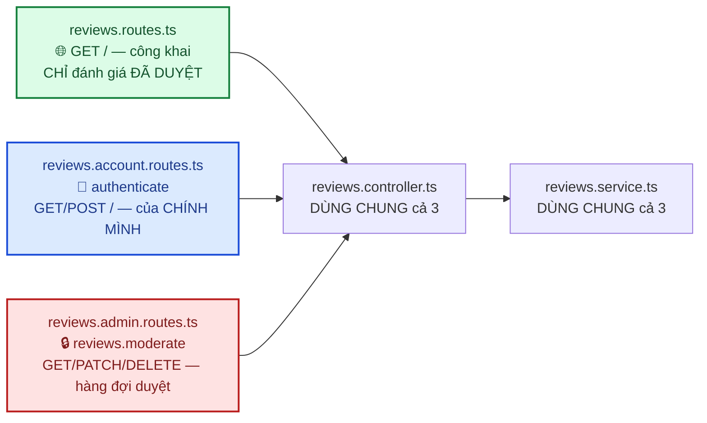
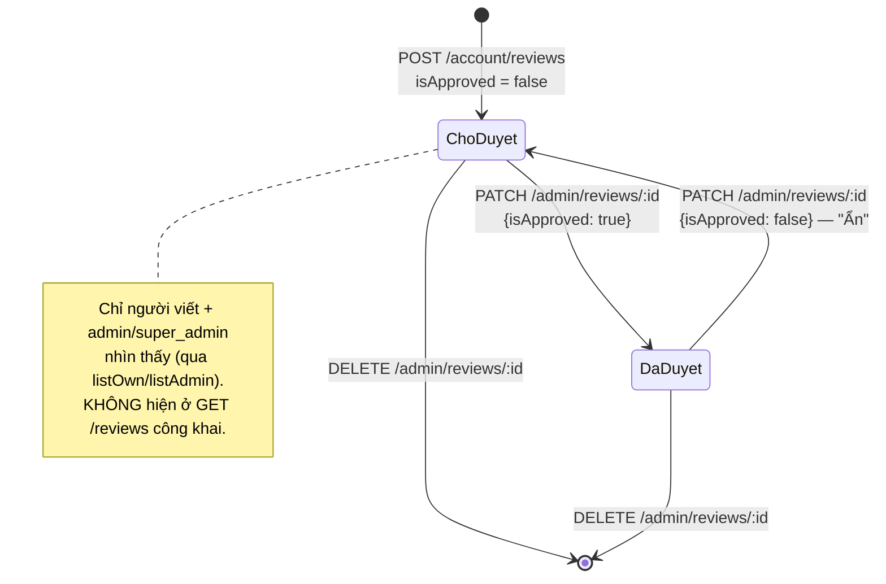

# Module: Reviews (Đánh giá) 🌸 Domain

Đánh giá sản phẩm (1-5 sao + nhận xét) — **cần duyệt trước khi hiện công khai** (`isApproved`). Khác
`addresses`/`wishlist` (thuần dữ liệu cá nhân, không ai khác cần xem), review vừa là dữ liệu cá nhân
(người viết xem lại được) vừa là **nội dung công khai có kiểm duyệt** — permission `reviews.moderate`
chỉ dành cho admin/super_admin (seed sẵn từ đầu dự án, xem [05 §2.4](../05-database-va-rbac.md)).

| | |
|---|---|
| **Loại** | 🌸 Domain — viết mới cho từng dự án |
| **Backend** | `modules/domain/reviews/` |
| **Frontend** | `features/domain/reviews/` · `components/storefront/ProductReviews.tsx` · `app/(dashboard)/admin/reviews/page.tsx` |
| **Bảng DB** | `reviews` |
| **Endpoint** | `GET /api/v1/reviews` (công khai) · `/api/v1/account/reviews` (viết, chỉ cần đăng nhập) · `/api/v1/admin/reviews` (duyệt, cần `reviews.moderate`) |

---

## 1. Ba tầng route — công khai / tự viết / duyệt

Khác các module 2 tầng (categories: công khai + admin), reviews có **3 router riêng** trong cùng 1
module vì 3 mức truy cập khác hẳn nhau:

| | `listPublic()` | `listOwn()` | `listAdmin()` |
|---|---|---|---|
| Endpoint | `GET /api/v1/reviews` | `GET /api/v1/account/reviews` | `GET /api/v1/admin/reviews` |
| Quyền | Công khai | Chỉ cần đăng nhập | `reviews.moderate` |
| Lọc | LUÔN `isApproved: true`, bắt buộc `productId` | `userId` = chính mình (mọi trạng thái) | Mặc định CẢ 2 trạng thái, lọc được `isApproved`/`productId` |
| Trường trả về | `id, rating, comment, createdAt, user.fullName` | + `productId, isApproved, product.{id,name,slug}` | Giống `listOwn()` |

---

## 2. Vòng đời 1 đánh giá — mặc định CHỜ DUYỆT

Không có trạng thái "từ chối vĩnh viễn" riêng — `isApproved: false` dùng chung cho cả "chưa duyệt"
lẫn "đã ẩn sau khi từng duyệt" (đơn giản hoá, đủ dùng cho MVP).

---

## 3. Ràng buộc nghiệp vụ

| Ràng buộc | Mã lỗi | Vì sao |
|---|---|---|
| Sản phẩm phải tồn tại và chưa xoá mềm | `404 PRODUCT_NOT_FOUND` | Giống `CATEGORY_NOT_FOUND` ở products |
| Mỗi user chỉ đánh giá 1 lần/sản phẩm | `409 REVIEW_ALREADY_EXISTS` | Unique constraint `[productId, userId]` ở DB — service kiểm tra TRƯỚC để trả lỗi rõ ràng, không để Postgres tự throw lỗi unique violation chung chung |
| `rating` từ 1 đến 5 | `422` (zod) | — |

**KHÔNG** yêu cầu "đã mua sản phẩm mới được đánh giá" (verified purchase) — đơn giản hoá MVP, xem §7.

---

## 4. Frontend — `ProductReviews.tsx` và bẫy hydration mismatch

`ProductReviews` là Client Component NHÚNG vào trang chi tiết sản phẩm (Server Component) — hiện
điểm trung bình (tính TRÊN CLIENT từ danh sách đang tải, không phải aggregate từ backend — xem §7),
danh sách đánh giá đã duyệt, và 1 trong 3 trạng thái tuỳ `me`: mời đăng nhập / đã đánh giá rồi / form
viết đánh giá.

> ⚠️ **Bug thật đã gặp và đã sửa (12/09/2026)**: 3 nhánh trên đổi HẲN loại thẻ gốc (`
` vs `
`)
> tuỳ `me` (từ `useMe()`, một `useQuery`). Khi khách đã đăng nhập F5 lại trang, `me` có thể khác nhau
> giữa lần render SSR đầu tiên và lần render đầu tiên phía client (axios phía server không có cookie
> trình duyệt) → React báo lỗi **"Hydration failed"** và phải render lại toàn bộ khối này ở client.
> **Cách sửa**: thêm cờ `mounted` (bật qua `useEffect` sau khi mount) — luôn hiện 1 khối placeholder
> "Đang tải..." GIỐNG NHAU ở SSR và lần render đầu client, chỉ rẽ nhánh theo `me` thật SAU khi
> `mounted`. Đây là mẫu chuẩn để né hydration mismatch cho bất kỳ Client Component nào hiển thị khác
> nhau tuỳ trạng thái đăng nhập trên 1 trang Server Component — áp dụng lại nếu gặp cảnh báo tương tự
> ở component khác.

---

## 5. Kiểm thử

| Tầng | File | Số test |
|---|---|---|
| Unit | `backend/tests/unit/modules/reviews.service.test.ts` | 14 — lọc theo trạng thái duyệt, không lộ trường nội bộ ở API công khai, 409 trùng đánh giá, audit log |
| Integration | `backend/tests/integration/reviews.routes.test.ts` | 12 — 3 tầng route, 403 thiếu `reviews.moderate`, 404/409 |
| RBAC chung | `backend/tests/integration/rbac.test.ts` | Thêm `GET /admin/reviews` (permission `reviews.moderate`), `GET /account/reviews` (permission: null), endpoint công khai `GET /reviews` |

Kiểm chứng thủ công qua trình duyệt thật (Playwright, không lưu trong repo, 12/09/2026): khách chưa
đăng nhập thấy lời mời đăng nhập ở mục đánh giá → đăng nhập, viết đánh giá 4 sao + nhận xét → xác nhận
hiện "đang chờ duyệt", KHÔNG hiện công khai (F5 lại trang xác nhận) → vào `/admin/reviews`, xác nhận
hàng đợi hiện đúng đánh giá → bấm "Duyệt" → xác nhận đánh giá hiện công khai trên trang sản phẩm kèm
điểm trung bình. Phát hiện và sửa luôn bug hydration mismatch nêu ở §4 trong lúc kiểm chứng. Không có
lỗi console/network khác ngoài các lỗi đã biết trước (401 kiểm tra phiên trước đăng nhập, cảnh báo
Google OAuth origin).

---

## 6. Sự khác biệt so với bản thiết kế ban đầu (docs/05 §3.4)

| Thiết kế ban đầu | Đã làm | Vì sao |
|---|---|---|
| `images` (ảnh kèm đánh giá) | ⬜ Chưa làm | Đơn giản hoá MVP — xem §7 |
| — | ✅ `reviews.moderate` dùng permission RIÊNG (không gộp vào `products.manage`) | Duyệt nội dung khác hẳn quản lý sản phẩm — đúng nguyên tắc 1 permission = 1 loại thao tác |

---

## 7. Việc còn lại

| Việc | Ưu tiên |
|---|:---:|
| Ảnh kèm đánh giá (`images` — có trong thiết kế ban đầu) | 🟢 |
| Yêu cầu "đã mua sản phẩm" mới được đánh giá (verified purchase) | 🟡 |
| Điểm trung bình tính SẴN ở backend (hiện tính trên client từ trang đầu, không chính xác nếu nhiều trang) | 🟢 |
| Trả lời đánh giá (chủ shop phản hồi công khai) | 🟢 |
| Sửa/xoá đánh giá của chính mình (hiện chỉ admin xoá được) | 🟢 |
