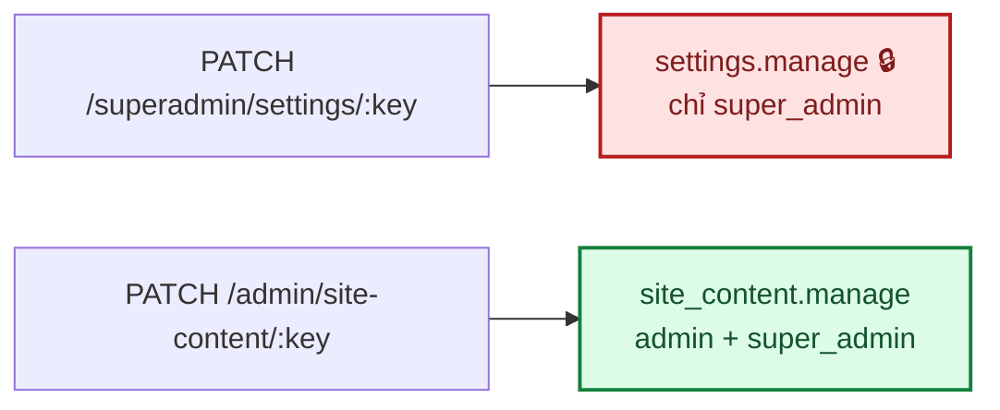
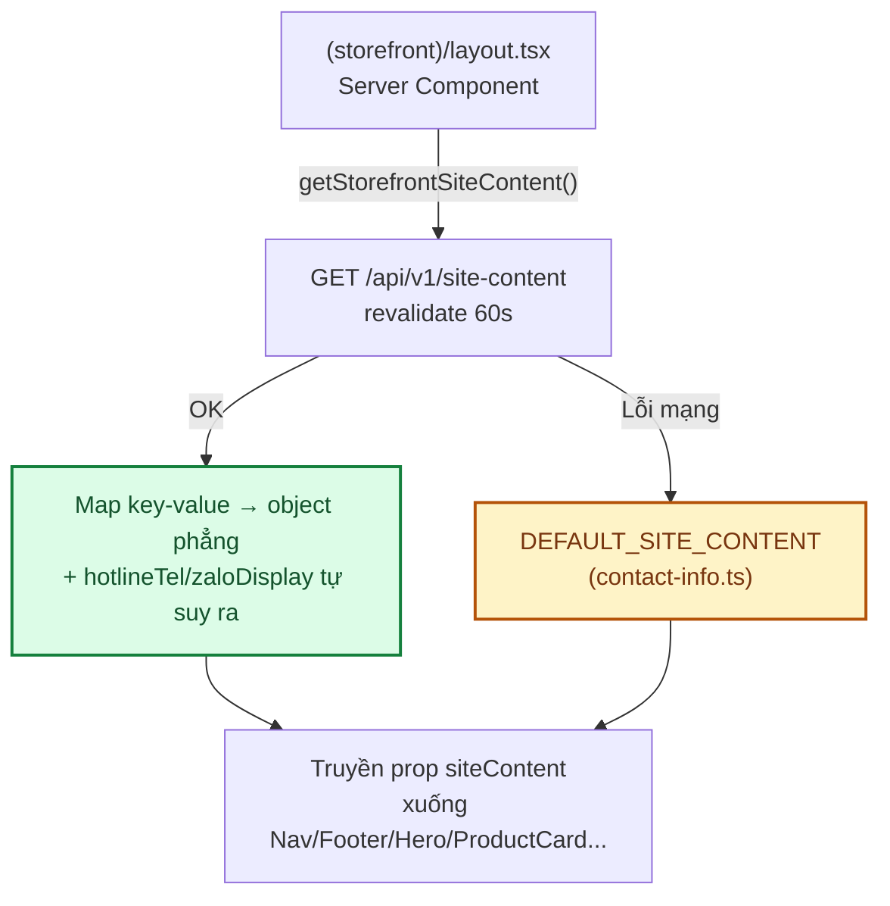

# Module: Site Content 🌸 Domain

Nội dung storefront admin/super_admin tự sửa (banner trang chủ, hotline, Zalo, địa chỉ, giờ mở cửa) —
trước đây hard-code trong `frontend/src/lib/contact-info.ts`.

| | |
|---|---|
| **Loại** | 🌸 Domain |
| **Backend** | `modules/domain/siteContent/` |
| **Frontend** | `features/domain/siteContent/` · `app/(dashboard)/admin/site-content/` |
| **Bảng DB** | `system_settings` (dùng chung với [core-settings](core-settings.md), khác namespace key) |
| **Endpoint** | `GET /api/v1/site-content` (công khai) · `PATCH /api/v1/admin/site-content/:key` (`site_content.manage`) |

---

## 1. Vì sao permission RIÊNG, không tái dùng `settings.manage`

`settings.manage` (`system_settings` ở core) chỉ gán cho `super_admin` — hợp lý cho cấu hình hệ thống
thật sự nhạy cảm (`timezone`, bật/tắt đăng ký tài khoản...). Nhưng banner/hotline/Zalo/địa chỉ/giờ mở
cửa là **nội dung cửa hàng**, việc admin thường (role `admin`) cần chủ động sửa mà không phải nhờ
super_admin. Vì router hiện tại gán 1 permission cho **cả router** (`router.use(authorize(...))`,
không tách theo từng key), tách hẳn 2 permission là cách đơn giản nhất — không phải thêm logic
authorize theo key hay tách nhỏ router `/superadmin/settings` đang chạy ổn.

`site_content.manage` seed ở `domain.seed.ts` (không phải `core.seed.ts`), gán cho **cả** `admin` lẫn
`super_admin` (vòng lặp `ADMIN_DOMAIN_PERMISSIONS` đã seed sẵn permission domain khác theo đúng cách
này — xem [docs/05 §2.4](../05-database-va-rbac.md)).

## 2. Vì sao dùng chung bảng `system_settings`

Không migration riêng — 5 key mới (`hero_banner`, `hotline`, `zalo_link`, `address`, `open_hours`)
chèn thẳng vào bảng key-value đã có, chỉ khác namespace so với 4 key của core (`site_name`,
`site_logo`, `timezone`, `registration_enabled`). `siteContent.service.ts#list()` **lọc theo đúng
key-set của module này** (`where: { key: { in: SITE_CONTENT_KEYS } }`) để không lỡ trả lẫn key của
core ra route public. `hero_banner` theo đúng pattern `site_logo` ở core-settings: lưu `fileId`, đánh
dấu `file_usages` (`entityType: "site_content"`, `entityId: "hero_banner"`) qua
`filesService.setEntityFile`/`clearEntityFile` để cron dọn file mồ côi không xoá nhầm, response
join thêm `url` để frontend hiển thị ngay.

## 3. Route public đọc CHUNG cho cả storefront lẫn trang quản trị

`GET /api/v1/site-content` không yêu cầu đăng nhập — dữ liệu vốn hiển thị công khai (hotline, địa
chỉ... khách nào cũng thấy được), nên **không có route `GET /admin/site-content` riêng**: trang quản
trị (`app/(dashboard)/admin/site-content/page.tsx`) cũng gọi thẳng route public này để đọc giá trị
hiện tại, chỉ `PATCH` mới cần `authenticate` + `site_content.manage`. Đỡ 1 controller/route trùng lặp
logic với `list()`.

## 4. Storefront đọc dữ liệu — không dùng React Context

`frontend/src/lib/storefront-api.ts#getStorefrontSiteContent()` fetch qua route public (cùng pattern
`getStorefrontCategories`, `revalidate: 60`, nuốt lỗi mạng trả về `DEFAULT_SITE_CONTENT` — storefront
không bao giờ trống thông tin liên hệ). Mỗi Server Component cần dữ liệu này (layout, trang chủ, trang
Liên hệ, trang sản phẩm...) **tự gọi lại hàm này** rồi truyền xuống Client Component con qua prop —
Next.js dedupe cùng 1 URL fetch trong 1 request, không tốn thêm round-trip mạng thật. Cân nhắc dùng
React Context nhưng bỏ: dữ liệu này hoàn toàn tĩnh trong 1 lần render (không đổi giữa lúc trang đang
mở), prop-drilling đơn giản hơn và khớp đúng cách `categories` đang được truyền sẵn trong codebase —
xem [docs/02 nguyên tắc chống over-engineering](../02-kien-truc-tong-quan.md).

Các component nhận `siteContent` qua prop (mặc định `DEFAULT_STOREFRONT_SITE_CONTENT` khi cha chưa tự
fetch, vd `app/account/layout.tsx` dùng lại `<Footer />` không kèm props):
`Hero.tsx` · `Footer.tsx` · `ProductCard.tsx` · `OrderConfirmationView.tsx` · `ContactPageView.tsx`
(tách khỏi `lien-he/page.tsx` — Server Component fetch — theo đúng pattern
`don-hang/[id]/page.tsx` → `OrderConfirmationView`).

`heroBannerUrl: null` (chưa upload banner) → `Hero.tsx` tự fallback ảnh tĩnh `/images/hero-bouquet.png`
có sẵn trong `public/`, không bắt buộc admin phải upload ngay khi mới cài đặt.

## 5. Kiểm thử

`backend/tests/unit/modules/siteContent.service.test.ts` (12 test) — validate đúng/sai từng key,
`hero_banner` hợp lệ đánh dấu `file_usages` + trả kèm `url`, trỏ file không tồn tại → 404, `null` gỡ
`file_usages`, `list()` chỉ lọc đúng key-set của module, audit log action `site_content.update`.

`backend/tests/integration/siteContent.routes.test.ts` (7 test) — `GET` công khai không cần token;
`PATCH` 401 chưa đăng nhập, 403 thiếu permission, 200 với cả `admin` lẫn `super_admin`, 422 sai kiểu.

`backend/tests/integration/rbac.test.ts` — thêm `PATCH /admin/site-content/hotline` vào ma trận
`PROTECTED` (401 chưa đăng nhập → 403 thiếu quyền → không 401/403 khi đủ quyền), và
`GET /api/v1/site-content` vào danh sách endpoint công khai.

**Đã kiểm chứng thật** (Playwright, throwaway spec — xoá sau khi xong): đăng nhập `super_admin` →
`/admin/site-content` → đổi hotline + giờ mở cửa → lưu → toast xác nhận → reload vẫn đúng giá trị →
chờ Next.js fetch cache hết hạn (~60s) → trang chủ (Hero + CTA đáy trang), Footer, trang `/lien-he` đều
hiển thị đúng giá trị mới, không có lỗi JS, CTA không bị che. `PATCH` không token → 401 qua HTTP thật.

## 6. Việc còn lại

| Việc | Ưu tiên | Ghi chú |
|---|:---:|---|
| Nhiều ảnh banner (slide/carousel) | 🟢 | Hiện cố tình chỉ 1 ảnh, giống `site_logo` — mở rộng khi có nhu cầu thật, tránh over-engineering |
| Banner Hero kích thước lớn/full-bleed | 🟢 | Đã bàn và chốt giữ khung nhỏ như thiết kế gốc — xem lịch sử trao đổi lúc thêm ảnh banner |
