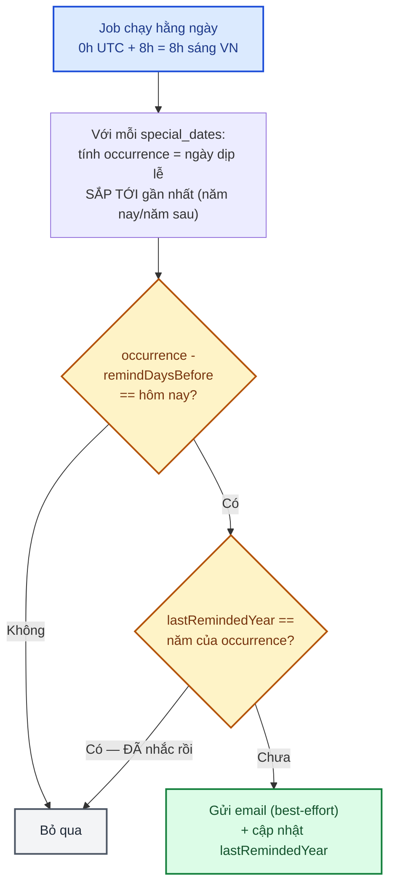

# Module: Special Dates — Nhắc lịch sinh nhật/kỷ niệm 🌸 Domain

Khách lưu lại ngày sinh nhật/kỷ niệm quan trọng, hệ thống tự gửi email nhắc trước N ngày để kịp đặt
hoa. Thuần dữ liệu cá nhân — permission như `addresses`/`wishlist` (chỉ cần đăng nhập, KHÔNG permission
riêng — xem [05 §2.4](../05-database-va-rbac.md)).

| | |
|---|---|
| **Loại** | 🌸 Domain — viết mới cho từng dự án |
| **Backend** | `modules/domain/specialDates/` · `jobs/sendSpecialDateReminders.job.ts` |
| **Frontend** | `features/domain/specialDates/` · `app/account/special-dates/page.tsx` |
| **Bảng DB** | `special_dates` |
| **Endpoint** | `/api/v1/account/special-dates` (CRUD, chỉ cần đăng nhập) |

---

## 1. `date` chỉ THÁNG-NGÀY có ý nghĩa — lặp lại hằng năm

Cột `date` là `@db.Date` đầy đủ (có năm), nhưng **năm lưu trong đó không mang ý nghĩa gì** — job chỉ
đọc `getUTCMonth()`/`getUTCDate()`, bỏ qua năm hoàn toàn. Khách chọn qua `<input type="date">` (bắt
buộc phải có năm vì đó là kiểu HTML chuẩn), nhưng UI chỉ hiển thị lại "dd/mm" (xem
`formatMonthDay()` ở `special-dates/page.tsx`) để không gây hiểu nhầm "chỉ nhắc đúng năm đã chọn".

**Cạm bẫy đã biết, CHƯA xử lý riêng**: ngày 29/2 ở năm không nhuận sẽ tự cuộn thành 1/3 khi
`Date.UTC(year, 1, 29)` chạy trên năm không nhuận (hành vi chuẩn của `Date.UTC`, không phải bug) —
hiếm gặp, chấp nhận được cho MVP này.

---

## 2. Job nền — tính "ngày nhắc" và chống gửi trùng

- **`occurrence`** = ngày dịp lễ (chỉ tháng-ngày) sắp tới gần nhất tính từ hôm nay — năm NAY nếu chưa
  qua trong năm nay, năm SAU nếu đã qua. Tự động xử lý đúng khi dịp lễ vừa qua (vd hôm nay 10/5, dịp
  lễ 1/1 → occurrence = 1/1 NĂM SAU, không phải 1/1 năm nay đã qua).
- **`lastRemindedYear`** chống gửi trùng khi job chạy BÙ nhiều lần trong đúng ngày cần nhắc (vd server
  restart giữa ngày) — so `lastRemindedYear` với năm của `occurrence`, không phải năm hiện tại (khác
  nhau khi dịp lễ rơi vào đầu năm sau nhưng ngày nhắc lại rơi vào cuối năm nay, vd dịp lễ 2/1,
  remindDaysBefore=5 → ngày nhắc là 28/12 năm TRƯỚC dịp lễ).
- Sửa `date`/`remindDaysBefore` ở `specialDates.service.ts#update()` **reset `lastRemindedYear` về
  null** — coi như dịp MỚI chưa từng được nhắc, tránh mất lượt nhắc năm nay nếu khách sửa ngày sau
  khi đã lỡ nhận nhắc theo ngày cũ.
- Gửi email là **best-effort** (giống `contact.service.ts`) — lỗi gửi mail (`.catch(() => {})`)
  KHÔNG chặn việc cập nhật `lastRemindedYear`, cũng không throw ra ngoài job.

---

## 3. Kiểm thử

| Tầng | File | Số test |
|---|---|---|
| Unit — service | `backend/tests/unit/modules/specialDates.service.test.ts` | 12 — row-level check, neo giờ UTC, mặc định `remindDaysBefore`, reset `lastRemindedYear` khi sửa ngày/số-ngày-nhắc, chống IDOR |
| Unit — job | `backend/tests/unit/jobs/sendSpecialDateReminders.job.test.ts` | 8 — dùng `vi.useFakeTimers()` cố định "hôm nay" để test chính xác từng ngày lệch; dịp lễ đã qua → tính sang năm sau; `remindDaysBefore=0`; chống gửi trùng qua `lastRemindedYear`; gửi thất bại không chặn cập nhật; nhiều dịp cùng lúc chỉ gửi đúng dịp khớp |
| Integration | `backend/tests/integration/specialDates.routes.test.ts` | 9 — CRUD, 401/404, chống IDOR (2 khách khác nhau lọc đúng userId riêng) |
| RBAC chung | `backend/tests/integration/rbac.test.ts` | Thêm `GET /account/special-dates` (permission: null, giống `addresses`/`wishlist`) |

Kiểm chứng end-to-end qua trình duyệt thật (Playwright, script tạm không lưu trong repo, 12/09/2026):
thêm/sửa/xoá 1 ngày đặc biệt qua `/account/special-dates`. Riêng job (phụ thuộc "hôm nay" thật, khó
test qua trình duyệt) được kiểm chứng bằng script `tsx`+`PrismaClient` tạm: tạo 1 `special_date` khớp
đúng hôm nay (`remindDaysBefore: 0`) → chạy job → xác nhận gửi đúng 1 email + ghi `email_logs` + set
`lastRemindedYear` → chạy job LẦN 2 ngay → xác nhận KHÔNG gửi thêm (chống trùng đúng) → dọn sạch dữ
liệu test.

---

## 4. Việc còn lại

| Việc | Ưu tiên |
|---|:---:|
| Xử lý đúng 29/2 ở năm không nhuận (hiện tự cuộn thành 1/3, xem §1) | 🟢 |
| Kênh nhắc khác ngoài email (SMS, thông báo trong app) | 🟢 |
| Gợi ý sản phẩm/CTA "Đặt hoa ngay" kèm link trực tiếp trong email nhắc (hiện chỉ nhắc chung, chưa có nút bấm) | 🟡 |
| Cho khách chọn GIỜ nhận email nhắc (hiện cố định 8h sáng giờ VN cho mọi người) | 🟢 |
