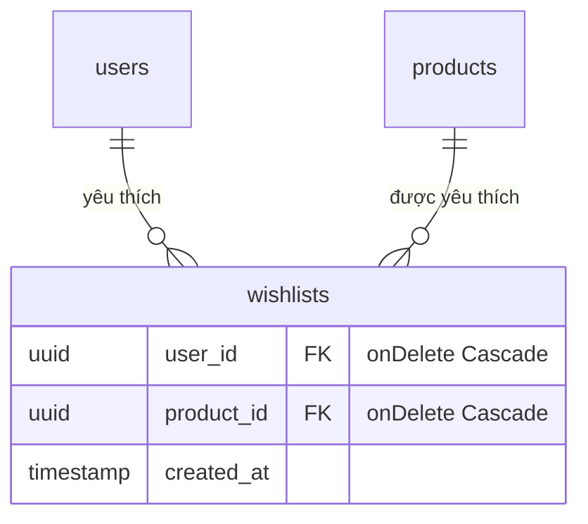
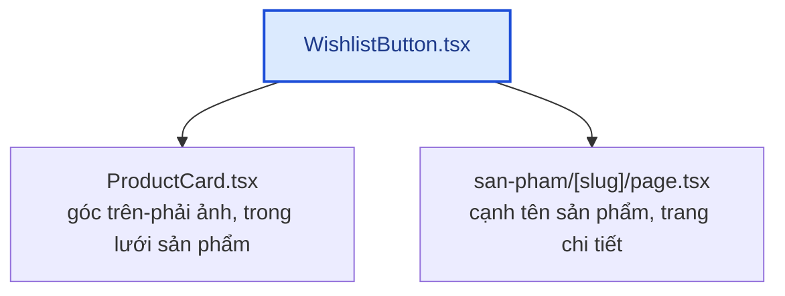

# Module: Wishlist (Yêu thích) 🌸 Domain

Danh sách sản phẩm yêu thích — khách lưu sản phẩm để xem lại sau, không nhất thiết mua ngay. Bảng nối
n-n thuần giữa `User` và `Product`, thuần dữ liệu cá nhân — không permission riêng, giống
[`addresses`](domain-addresses.md).

| | |
|---|---|
| **Loại** | 🌸 Domain — viết mới cho từng dự án |
| **Backend** | `modules/domain/wishlist/` |
| **Frontend** | `features/domain/wishlist/` · `components/storefront/WishlistButton.tsx` · `app/account/wishlist/page.tsx` |
| **Bảng DB** | `wishlists` (bảng nối n-n thuần, composite PK) |
| **Endpoint** | `/api/v1/account/wishlist` (CHỈ cần đăng nhập — không permission riêng) |

---

## 1. Bảng nối n-n thuần — không có `id` riêng

Giống `product_occasions` (xem
[domain-occasions.md §3](domain-occasions.md#3-quan-hệ-n-n-với-products--product_occasions)):
composite PK `[userId, productId]`, KHÔNG dùng implicit many-to-many của Prisma. Khác `addresses`
(mỗi địa chỉ có `id` riêng, sửa được từng trường), 1 dòng wishlist chỉ có 2 trạng thái: **có** hoặc
**không có** — không có gì để "sửa", chỉ thêm (`POST`) hoặc xoá (`DELETE`).

---

## 2. Idempotent — thêm/xoá 2 lần không báo lỗi

Khác `addresses`/`reviews` (thao tác theo `id` cụ thể, cần ownership check trả 404 khi sai), wishlist
**không cần** phân biệt "chưa từng thêm" và "đã xoá rồi":

- `POST` (thêm) khi sản phẩm **đã có** trong wishlist → trả về dòng hiện có, KHÔNG tạo trùng, KHÔNG
  báo lỗi 409.
- `DELETE` khi sản phẩm **chưa từng có** trong wishlist → `deleteMany()` khớp 0 dòng, vẫn trả 200.

Lý do: giao diện là 1 nút tim BẤM-BẬT/TẮT (`WishlistButton.tsx`) — khách bấm nhanh 2 lần (double-click,
hoặc 2 tab cùng lúc) không nên thấy lỗi. `add()` vẫn validate sản phẩm tồn tại (`404
PRODUCT_NOT_FOUND`) trước khi tự động idempotent ở bước kiểm tra trùng.

---

## 3. Frontend — `WishlistButton` dùng chung 2 nơi

`components/storefront/WishlistButton.tsx` là 1 nút tim tái sử dụng ở **cả 2 nơi**:

Điểm kỹ thuật cần chú ý:

- **`e.preventDefault()` + `e.stopPropagation()` BẮT BUỘC** ở `ProductCard` — nút tim nằm LỒNG trong
  `<Link>` bọc ảnh sản phẩm; thiếu 2 dòng này sẽ vừa toggle yêu thích vừa điều hướng nhầm sang trang
  chi tiết.
- **Khách CHƯA đăng nhập** bấm tim → điều hướng sang `/login` thay vì gọi API (sẽ nhận `401`) — trải
  nghiệm rõ ràng hơn nút không phản ứng gì.
- **`useWishlist(!!me)`** — chỉ gọi API khi ĐÃ xác nhận đăng nhập (`useMe()` trả về user thật), tránh
  gọi API thừa (`401`) cho mọi khách vãng lai ghé trang sản phẩm — cùng mẫu `useAddresses(!!me)` ở
  trang thanh toán (xem [domain-addresses.md §4](domain-addresses.md#4-tích-hợp-checkout--autofill-không-bắt-buộc)).

---

## 4. Kiểm thử

| Tầng | File | Số test |
|---|---|---|
| Unit | `backend/tests/unit/modules/wishlist.service.test.ts` | 7 — row-level filter, idempotent thêm/xoá, 404 khi sản phẩm không tồn tại |
| Integration | `backend/tests/integration/wishlist.routes.test.ts` | 7 — 401 chưa đăng nhập, KHÔNG cần permission thêm, row-level theo user |

Kiểm chứng thủ công qua trình duyệt thật (Playwright, không lưu trong repo, 12/09/2026): bấm tim lúc
CHƯA đăng nhập → điều hướng `/login` → đăng nhập → bấm tim trên trang chi tiết → xác nhận hiện trong
`/account/wishlist` → gỡ từ trang đó → xác nhận trống → bấm tim trên `ProductCard` ở trang chủ, xác
nhận KHÔNG điều hướng nhầm sang trang chi tiết. Không có lỗi console/network ngoài các lỗi đã biết
trước (401 kiểm tra phiên trước đăng nhập, cảnh báo Google OAuth origin).

---

## 5. Việc còn lại

| Việc | Ưu tiên |
|---|:---:|
| Thông báo "sản phẩm yêu thích hết hàng/ngừng bán" (hiện không có khái niệm hết hàng — hoa tươi làm theo đơn) | — (không áp dụng) |
| Gợi ý sản phẩm dựa trên wishlist (marketing) | 🟢 |
