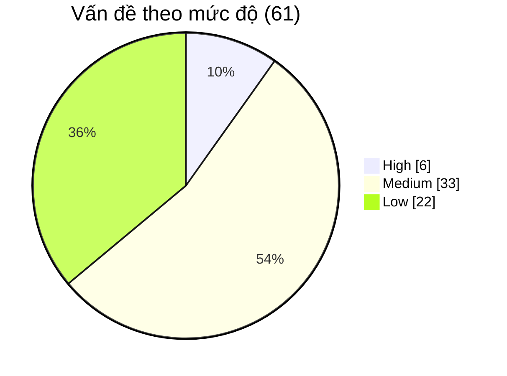

# 00 · Mục lục & tóm tắt review — FLOWER (Hoa Xinh)

| | |
|---|---|
| **Ngày review** | 24/09/2026 |
| **Chế độ** | Đầy đủ (chưa có báo cáo nào trước đó trong `review-source/`) |
| **Mốc code** | Commit `bdf8d99`: HEAD của `main` và `review` lúc checkout (reflog: `24/09/2026 09:05:51 checkout: moving from main to review`) |
| **Phạm vi loại trừ** | Mọi thay đổi **chưa commit** trong working tree tại thời điểm review. Chúng không được đọc hay chấm, và không làm thay đổi điểm |
| **Người review** | Claude (vai trò giảng viên kiêm Software Architect), theo skill `review-fullstack-js` |

> **Cách đọc bằng chứng**: mọi `file:dòng` trong bộ báo cáo là số dòng **tại commit `bdf8d99`**. Xem
> đúng nội dung được review bằng `git show bdf8d99:<đường-dẫn>`. Code được đọc từ bản xuất
> `git archive bdf8d99`, không đọc từ working tree.
>
> **Hệ mã của báo cáo này** (`SEC-01`, `FE-01`, `BE-01`...) **độc lập** với hệ mã trong
> `docs/12-danh-gia-va-de-xuat.md`. Nơi nào trùng chủ đề đều ghi rõ "docs/12 liên quan".

---

## 1. Tóm tắt một đoạn

FLOWER là một dự án **vượt xa mức bài tập**. Đây là website bán hoa đã chạy production
(`thuymaiflower.click`), đồng thời được thiết kế làm *source base* (bộ khung tái sử dụng) PERN cho
các dự án khác. Kiến trúc backend modular rõ ràng, phân quyền **RBAC** (*Role-Based Access Control*
— phân quyền theo vai trò) tra DB mỗi request, zod ở biên, khoảng 930 test backend chạy trong CI kèm
Testcontainers và Playwright, tài liệu rất dày. Điểm yếu tập trung ở **quản lý phiên đăng nhập xuyên
hai phía**:

- reuse detection báo nhầm (SEC-01);
- trạng thái phiên phía client không được dọn khi phiên chết (FE-01, ERR-01);
- luồng quay lại sau đăng nhập sai (FE-02).

Cả ba đều đã được **tái hiện thực tế**. Ngoài ra còn một số lỗ hổng bảo mật cục bộ (SEC-03
pre-hijacking, SEC-04 backup) và tình trạng **tài liệu lệch code** có tính hệ thống (DOC-02). Không
có lỗi Critical nào được xác nhận.

**Điểm tổng: 7,25/10 — Khá** (6,75 từ rubric + 0,5 ghi nhận phần vượt yêu cầu; chi tiết ở
[09](09-NHAN-XET-HOC-VIEN.md)).

---

## 2. Stack nhận diện được

| Hạng mục | Backend | Frontend |
|---|---|---|
| Ngôn ngữ | TypeScript, `strict` + `noUncheckedIndexedAccess` (`backend/tsconfig.json:9-10`) | TypeScript, `strict` (`frontend/tsconfig.json:7`) |
| Module system | **CommonJS** (`"module": "CommonJS"`, `moduleResolution: Node`); không có `"type"` | ESM (`module: esnext`, `moduleResolution: bundler`) |
| Framework | Express 4 + helmet + cors + cookie-parser + express-rate-limit + Socket.io | **Next.js 16 App Router** (dùng `proxy.ts` thay `middleware.ts`) + React 19 + Tailwind 4 |
| Database & ORM | PostgreSQL + Prisma 5 (16 migration) | — |
| State & data | — | **TanStack Query** (server state) · **Zustand** (cart/toast/confirm — chỉ UI state) · axios có interceptor refresh |
| Form & validation | **Zod v3** qua middleware `validate()` | react-hook-form + **Zod v4** (một phần), còn lại tự quản bằng `useState` |
| Cấu trúc repo | Hai thư mục `backend/` + `frontend/` trong một repo; **không** có `package.json` gốc/workspaces | |
| Test | Vitest + Supertest + Testcontainers (Postgres thật) | Vitest + Testing Library + Playwright E2E |
| Hạ tầng | Docker multi-stage (non-root), docker-compose (postgres/backend/worker/frontend/caddy), Caddy HTTPS + HSTS, GitHub Actions (4 job), Loki, UptimeRobot, backup `pg_dump` → Cloudinary | |
| Dịch vụ ngoài | Cloudinary (upload ký HMAC), Resend/SMTP, Google Identity (ID token) | |

---

## 3. Thống kê vấn đề

### Theo mức độ và nhãn

| Mức độ | `[NGUYÊN TẮC]` | `[CHUẨN]` | Tổng |
|---|:---:|:---:|:---:|
| 🟥 Critical | 0 | 0 | **0** |
| 🔴 High | 6 | 0 | **6** |
| 🟡 Medium | 29 | 4 | **33** |
| 🟢 Low | 16 | 6 | **22** |
| **Tổng** | **51** | **10** | **61** |

### Theo nhóm chấm điểm

| Nhóm | Số vấn đề | Mã High trong nhóm |
|---|:---:|---|
| Kiến trúc backend | 5 | — |
| Kiến trúc frontend | 12 | FE-01, FE-02 |
| Bảo mật & phân quyền | 12 | SEC-01, SEC-03, SEC-04 |
| Database & dữ liệu | 7 | — |
| Validation & xử lý lỗi | 10 | ERR-01 |
| Clean Code & quy ước | 6 | — |
| Kiểm thử | 3 | — |
| Tài liệu & vận hành | 6 | — |

### Ba vấn đề nghiêm trọng nhất

1. **SEC-01**: reuse detection coi mọi phiên bị thu hồi là token bị đánh cắp. Một thao tác hợp lệ
   ("Đăng xuất thiết bị") dẫn tới việc thu hồi **toàn bộ** phiên của người dùng và gửi email cảnh
   báo giả, lặp lại ở mỗi lần tải trang (do SEC-02).
2. **FE-01 + ERR-01**: phiên chết nhưng header vẫn hiện tên người dùng, request xếp hàng chờ refresh
   treo vĩnh viễn. Đây chính là lỗi được báo cáo, đã tái hiện bằng Playwright.
3. **SEC-03 / SEC-04** (xếp ngang nhau): chiếm trước tài khoản qua đăng ký không xác minh email; và
   backup DB có thể bị lộ công khai nếu production chưa cấu hình khoá mã hoá (chưa đủ dữ liệu về cấu
   hình thật; nếu chưa cấu hình thì đây là **Critical**).

---

## 4. Điểm tổng

| Nhóm | Trọng số | Điểm nhóm | Đóng góp |
|---|:---:|:---:|:---:|
| Hoàn thành nghiệp vụ | 10 | 8 | 8,00 |
| Kiến trúc backend | 15 | 8 | 12,00 |
| Kiến trúc frontend | 15 | 5,5 | 8,25 |
| Bảo mật & phân quyền | 15 | 5 | 7,50 |
| Database & dữ liệu | 10 | 7 | 7,00 |
| Validation & xử lý lỗi | 10 | 5,5 | 5,50 |
| Clean Code & quy ước | 10 | 7 | 7,00 |
| Kiểm thử | 8 | 8 | 6,40 |
| Tài liệu & vận hành | 7 | 7 | 4,90 |
| **Tổng** | **100** | | **66,55 → 6,75/10** |
| Ghi nhận phần vượt yêu cầu | | | **+0,5** |
| **Điểm cuối** | | | **7,25/10 — Khá** |

Lý do từng nhóm: [09 · Nhận xét học viên](09-NHAN-XET-HOC-VIEN.md).

---

## 5. Mục lục

| File | Nội dung |
|---|---|
| [01 · Tổng quan & kiến trúc](01-TONG-QUAN-VA-KIEN-TRUC.md) | Mục tiêu, actor, luồng nghiệp vụ, luồng dữ liệu FE → API → DB, điểm lỗi đơn |
| [02 · Vấn đề & rủi ro](02-VAN-DE-VA-RUI-RO.md) | **Bảng tổng hợp 61 vấn đề** + chi tiết theo mã |
| [03 · Backend](03-BACKEND.md) | Hiện trạng so với chuẩn, cây thư mục đích |
| [04 · Frontend](04-FRONTEND.md) | Hiện trạng so với chuẩn (nhánh Next.js App Router), cây thư mục đích |
| [05 · Bảo mật & database](05-BAO-MAT-VA-DATABASE.md) | Auth/phiên, RBAC, IDOR, upload, backup; mô hình dữ liệu, transaction, index |
| [06 · Clean code & validation](06-CLEAN-CODE-VA-VALIDATION.md) | DRY/SRP/KISS, comment, công cụ; zod hai phía, kiểm tra từng form |
| [07 · Kiểm thử, tài liệu, vận hành](07-KIEM-THU-TAI-LIEU-VAN-HANH.md) | Hiện trạng test, lỗ hổng test, tài liệu theo đối tượng, CI/Docker |
| [08 · Lộ trình cải thiện](08-LO-TRINH-CAI-THIEN.md) | Ngay · trước deploy · phiên bản sau · khi tăng trưởng · không nên làm |
| [09 · Nhận xét học viên](09-NHAN-XET-HOC-VIEN.md) | Nhận xét sư phạm + bảng điểm chi tiết |

Công việc cụ thể được đưa vào [`CHECKLIST.md`](../CHECKLIST.md), phần **"Lộ trình cải thiện theo
review-source"** ở cuối file.

---

## 6. Phần chưa thể xác minh

| Nội dung | Vì sao | Ảnh hưởng tới kết luận |
|---|---|---|
| Production đã cấu hình `BACKUP_ENCRYPTION_PUBLIC_KEY` chưa | Không truy cập được môi trường thật | Quyết định SEC-04 là High hay Critical |
| Production đã chạy `seed:domain` (coupon mẫu) chưa | Như trên | Mức độ thực tế của SEC-07 |
| Log lỗi 500 trên production có mất stack không (ERR-03) | Suy luận từ cơ chế pino, chưa chạy thử để giữ đúng nguyên tắc chỉ đọc | ERR-03 ghi "Rủi ro tiềm ẩn" |
| Hành vi khi scale nhiều instance (ARCH-02) | Hiện chạy 1 instance | Hậu quả là rủi ro tiềm ẩn |
| Đề bài gốc và trình độ học viên | Không có đề bài riêng; suy ra từ `docs/01`, `CHECKLIST.md`, `CLAUDE.md` | Nhóm "Hoàn thành nghiệp vụ" chấm theo phạm vi dự án tự công bố |

**Nguồn bằng chứng đặc biệt**: FE-01, FE-02, ERR-01, SEC-02 và ARCH-03 được **tái hiện thực tế**
trong cùng phiên làm việc ngày 24/09/2026 (Playwright điều khiển Chrome, backend mock/backend thật
với TTL token rút ngắn, chạy thử `axios.ts` với React Query). Đoạn code được tái hiện trùng với
commit `bdf8d99`.
