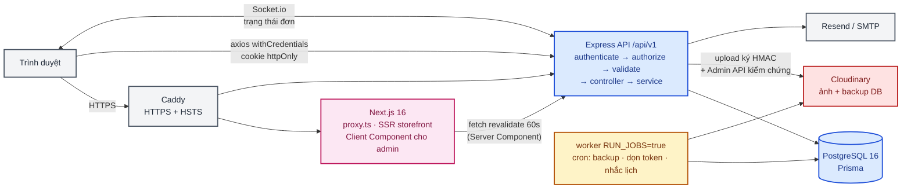
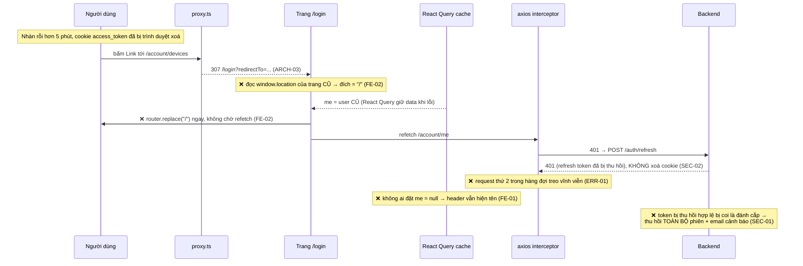

# 01 · Tổng quan hệ thống & kiến trúc

> Mốc review: commit `bdf8d99`. Mã vấn đề tham chiếu [02 · Vấn đề & rủi ro](02-VAN-DE-VA-RUI-RO.md).

## 1. Mục tiêu và actor

Dự án có **hai mục tiêu song song** (`docs/01-tong-quan-san-pham.md §1`):

1. **Sản phẩm**: cửa hàng hoa online. Khách đặt hoa giao theo **ngày và khung giờ cụ thể**, có thiệp
   chúc, người đặt khác người nhận. Thanh toán COD, admin gọi điện xác minh đơn.
2. **Source base**: phần 🔧 *core* (auth, RBAC, files, email, audit, settings) được thiết kế để mang
   sang dự án PERN khác mà "không phải sửa code".

| Actor | Phạm vi | Truy cập chính |
|---|---|---|
| Khách vãng lai | Storefront | Xem sản phẩm/danh mục/dịp lễ/blog, giỏ hàng (lưu localStorage), đặt hàng không cần tài khoản, tra đơn qua link UUID |
| `member` | Core | Hồ sơ, thiết bị đăng nhập, sổ địa chỉ, yêu thích, đánh giá, ngày đặc biệt, lịch sử đơn |
| `admin` | Core | Nghiệp vụ cửa hàng: danh mục, sản phẩm, đơn, coupon, blog, newsletter, nội dung trang, tổng quan |
| `super_admin` | Core | Như admin, cộng thêm quản lý user/role/permission/phương thức đăng nhập/cấu hình/audit log |
| `florist` | Domain | Chỉ hàng đợi giao hoa (`/admin/orders/delivery-queue`) |
| `sales_staff`, `shipper` | Domain | Role đã seed nhưng giao diện chuyên biệt chưa có |

## 2. Quy mô code tại mốc review

| | Backend | Frontend |
|---|---|---|
| File nguồn TS | 191 file, khoảng 10.000 dòng | 153 file, khoảng 14.700 dòng |
| Module | 10 core + 13 domain | 4 route group: `(auth)`, `(dashboard)`, `(storefront)`, `account` |
| Test | 68 file (khoảng 617 unit + 227 integration + 6 DB thật) | 15 file Vitest (khoảng 137 case) + 4 file E2E (29 kịch bản) |

## 3. Kiến trúc triển khai và luồng dữ liệu

Cloudinary được tô đỏ vì nó vừa chứa ảnh sản phẩm, vừa chứa **backup DB**, trên cùng một tài khoản
và ở chế độ công khai (SEC-04).

### Luồng nghiệp vụ chính: đặt hàng (end-to-end)

1. **Storefront (Server Component)**: `lib/storefront-api.ts` gọi `fetch` với `revalidate: 60` để
   lấy sản phẩm, danh mục và nội dung trang.
2. **Giỏ hàng**: `useCartStore` (Zustand, persist localStorage) lưu *snapshot* tên, giá, ảnh.
3. **Checkout**: `thanh-toan/page.tsx` là form `useState` tự quản (VAL-03). `POST /api/v1/orders` đi
   qua `attachUserIfPresent` và `createOrderLimiter`.
4. **Backend**: `orders.service.ts#create` (187 dòng, CODE-03):
   - lấy giá **từ DB** (không tin giá client — đúng);
   - kiểm coupon lại trong `$transaction`, tăng `usedCount` bằng `updateMany` có điều kiện (chống
     race — đúng);
   - tạo order, items và couponUsage; ghi audit; emit Socket.io.
   - Còn hở: không bắt buộc biến thể; không hoàn lượt coupon khi huỷ; không có máy trạng thái
     (ERR-05).
5. **Xác minh**: admin gọi điện rồi ghi nhận (`log-call`). Chưa ghi nhận thì không chuyển được sang
   `confirmed` (chặn ở backend — đúng).
6. **Theo dõi**: khách mở `/don-hang/<uuid>`. UUID đóng vai trò khoá tra cứu; trang nghe Socket.io.

### Luồng xác thực và phiên (nơi tập trung lỗi)

- Access token JWT sống **5 phút**, cookie `httpOnly`, path `/`, `maxAge` đúng bằng TTL, nên trình
  duyệt tự xoá cookie khi hết hạn.
- Refresh token là chuỗi ngẫu nhiên, DB chỉ lưu `sha256`, cookie path `/api/v1`, sống 30 ngày, xoay
  vòng mỗi lần dùng.
- `proxy.ts` chặn route cần đăng nhập chỉ dựa vào `access_token`; phân quyền thật nằm ở backend
  `authorize()` (tra DB mỗi request — thiết kế đúng).

Chuỗi này đã được **tái hiện thực tế**: trình duyệt ghi nhận `window.location.search=""` và gọi
`router.replace("/")`; backend trả 401 cho cả `/me` lẫn `/refresh`; header vẫn hiện "Super Admin".
Các lỗi xuất phát từ nhiều tầng khác nhau, nên sửa một chỗ không đủ. docs/12 FE-08 là ví dụ: đã sửa
2 lần nhưng vẫn ghi "đã xử lý" trong khi lỗi còn.

## 4. Điểm mạnh kiến trúc

- **Phân tầng backend nhất quán**:
  - 22 controller đều mỏng, dùng `ok()/created()/paginated()`;
  - không service nào chạm `req`/`res`;
  - `authorize('permission.code')` ở mọi route quản trị;
  - không có `requireRole` hard-code.
- **Quyền tra DB mỗi request**: JWT chỉ chứa `sub`, nên đổi quyền có hiệu lực ngay (`authenticate.ts:33-34`).
- **Giá luôn lấy từ DB, tiền lưu `Int` VND** kèm lý do (`schema.prisma:307-309`).
- **Upload trực tiếp Cloudinary** với chữ ký server và kiểm chứng metadata thật qua Admin API.
- **Frontend tách tầng đúng**:
  - không component nào gọi axios trực tiếp;
  - service không import React;
  - Zustand chỉ giữ UI state;
  - storefront dùng Server Component + `generateMetadata`.
- **Vận hành**:
  - worker cron tách khỏi API (`RUN_JOBS`);
  - Docker non-root;
  - Caddy HTTPS/HSTS;
  - env validate bằng zod, *fail-fast* ở production.

## 5. Điểm nghẽn và điểm lỗi đơn (*single point of failure*)

| Thành phần | Rủi ro | Mã |
|---|---|---|
| Một container PostgreSQL, không replica | Hỏng VPS là mất dịch vụ; phụ thuộc hoàn toàn vào backup | SEC-04 (backup chưa chắc an toàn), CHECKLIST: "Diễn tập khôi phục backup" chưa làm |
| Cloudinary chung cho ảnh và backup | Lộ/khoá tài khoản ảnh hưởng cả dữ liệu lẫn ảnh | SEC-04 |
| Một worker cron | Worker chết thì không có backup, không nhắc lịch; cron không có `.catch` | ERR-04 |
| Rate limit và Socket.io trong bộ nhớ | Không scale ngang được như tài liệu khẳng định | ARCH-02 |
| `/health` không kiểm DB | Orchestrator tưởng backend khoẻ trong khi DB đã chết | OPS-03 |
| Mỗi request đã đăng nhập: 1 truy vấn quyền (2 lần với `/account/*`) | Chấp nhận được ở quy mô hiện tại; nên sửa lần gọi trùng | BE-03 |
| Khách vãng lai: 2 request thừa mỗi trang (`/me` 401 + `/refresh` 401) | Tải vô ích vào giờ cao điểm dịp lễ | ARCH-03 |
