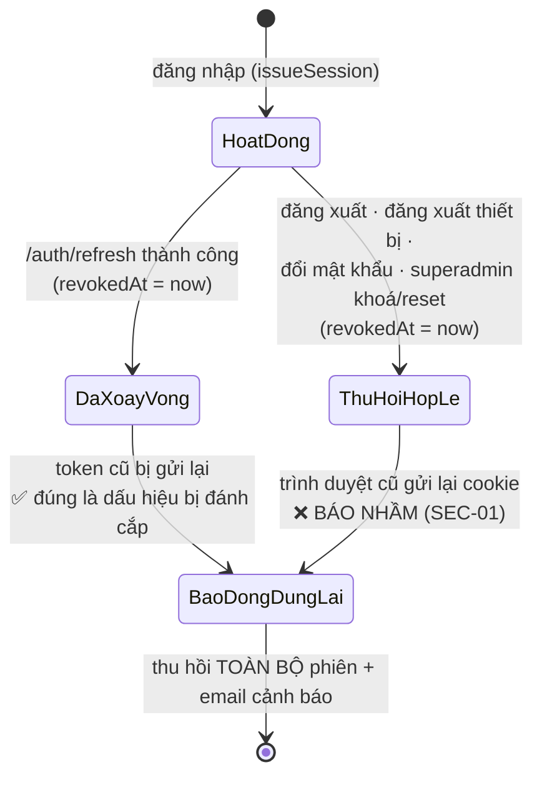

# 05 · Bảo mật & Database

> Mốc review: commit `bdf8d99`. Mã vấn đề: [02](02-VAN-DE-VA-RUI-RO.md).

## Phần A — Bảo mật & phân quyền

### A1. Bí mật và cấu hình

| Kiểm tra | Kết quả |
|---|---|
| `.env` bị commit? | **Không.** `git ls-tree bdf8d99` chỉ có `.env.example` (gốc) và `backend/.env.example` |
| Secret trong `NEXT_PUBLIC_*` | Không có. Chỉ có `NEXT_PUBLIC_API_URL`, `NEXT_PUBLIC_GOOGLE_CLIENT_ID` |
| Env validate khi khởi động | ✅ `config/env.ts` (zod). Production từ chối `COOKIE_SECRET` mặc định và 2 JWT secret trùng nhau |
| Chưa ép | Khoá mã hoá backup (SEC-04), cờ `DISABLE_RATE_LIMIT` (SEC-06), `SUPER_ADMIN_PASSWORD` (SEC-07) |
| Mật khẩu mặc định | Có giá trị fallback trong `core.seed.ts:144`, được in ra console (`:159-161`) và lặp lại trong 4 tài liệu/file test. Báo cáo này **không chép** giá trị |

### A2. Xác thực và phiên đăng nhập

**Làm tốt**:

- **Cookie**: `httpOnly`, `secure` ở production, `sameSite: lax`, có `domain` cấu hình được
  (`cookie.util.ts:4-11`).
- **Access token** sống 5 phút và chỉ chứa `sub`.
- **Refresh token** là chuỗi ngẫu nhiên 32 byte; DB chỉ lưu `sha256`; xoay vòng mỗi lần dùng.
- **Mật khẩu** dùng bcrypt cost 12.
- **Khoá tạm sau 5 lần đăng nhập sai**: tăng bộ đếm nguyên tử, backoff theo luỹ thừa, tối đa 30 phút.
- **Google login** từ chối `email_verified !== true`.
- **Token magic link và reset mật khẩu** được tiêu thụ nguyên tử (`auth.repository.ts:121-146`).
- **Đổi mật khẩu thu hồi các phiên khác**, chừa phiên hiện tại.

**Lỗ hổng** (xếp theo mức độ):

| Mã | Mức | Vấn đề |
|---|---|---|
| SEC-01 | High | Reuse detection dựa vào `revokedAt`, trong khi `revokedAt` bị ghi bởi 8 luồng thu hồi, 7 luồng trong đó là hợp lệ. Hệ quả: báo động giả, thu hồi toàn bộ phiên, gửi email cảnh báo sai |
| SEC-03 | High | Đăng ký không xác minh email; Google/magic link gắn vào tài khoản chưa xác minh (pre-hijacking) |
| SEC-02 | Medium | Refresh thất bại không xoá cookie, nên SEC-01 lặp lại ở mỗi lần tải trang |
| SEC-09 | Low | User bị khoá vẫn dùng được access token tới 5 phút (`authenticate` không kiểm `status`) |
| SEC-10 | Low | Email không chuẩn hoá chữ thường; login trả kết quả sớm khi email không tồn tại (timing oracle) |

Vòng đời một refresh token, và vị trí của SEC-01:

Sơ đồ cho thấy vấn đề cốt lõi: hai trạng thái `DaXoayVong` và `ThuHoiHopLe` **không phân biệt được
trong DB**, vì cả hai đều chỉ là `revokedAt != null`.

### A3. Phân quyền (RBAC) và IDOR

**IDOR** (*Insecure Direct Object Reference* — truy cập tài nguyên của người khác bằng cách đoán hoặc
đổi ID) được kiểm soát tốt ở các module dữ liệu cá nhân:

| Module | Cách kiểm quyền sở hữu | Bằng chứng | Kết quả |
|---|---|---|---|
| Sổ địa chỉ | `findFirst({ id, userId })` | `addresses.service.ts:23, 61, 89` | ✅ |
| Yêu thích | `where: { userId, ... }` | `wishlist.service.ts:27, 51` | ✅ |
| Ngày đặc biệt | `findFirst({ id, userId })` | `specialDates.service.ts:18, 41, 62` | ✅ |
| Đánh giá của tôi | `where: { userId }`; `userId` lấy từ `req.user` | `reviews.service.ts:90`; `reviews.controller.ts:18` | ✅ |
| Đơn của tôi | `where: { userId }` + permission `orders.view_own` | `orders.service.ts:284`; `orders.routes.ts:42-47` | ✅ |
| Phiên đăng nhập | `session.userId !== userId` → 404 | `users.service.ts:97-100` | ✅ (có E2E chống IDOR) |
| File / avatar | **Không kiểm `uploadedBy`** | `files.service.ts:113-123` | ❌ SEC-05 |
| Tra đơn công khai | UUID v4 làm khoá tra cứu, nhưng trả kèm `userId` | `orders.routes.ts:34`; `orders.service.ts:24` | 🟡 SEC-08 |

- **Phân quyền**: mọi route quản trị dùng `authorize('permission.code')`, không có role hard-code.
  Custom Role không được gán permission `is_restricted` (`roles.service.ts:8-17`). Admin không tự thao
  tác lên chính mình và không gán được `super_admin` (`users.admin.service.ts:15-19, 167-173`).
- **Ngoại lệ**: `PATCH /admin/orders/:id/status` kiểm quyền ở service, **sau** khi đã đọc đơn (SEC-09).

### A4. Upload, HTML và tầng HTTP

- **Upload**: chữ ký server, `allowed_formats`, kích thước và định dạng thật được kiểm chứng qua
  Admin API (tốt). Hở ở chỗ tin `publicId` của client và không kiểm chủ sở hữu (SEC-05).
- **HTML người dùng**: `sanitize-html` với allowlist cho sản phẩm và blog (tốt). Category
  `description` không sanitize; frontend render bằng `dangerouslySetInnerHTML` và không có CSP (SEC-12).
- **Rate limit**: có ở các endpoint auth quan trọng, contact, newsletter, tạo đơn. Thiếu ở refresh,
  magic-link verify, `/coupons/validate`, tra đơn, presign, đổi mật khẩu (SEC-06).
- **Không có injection**: không có `$queryRaw*`/`$executeRaw*`; `pg_dump` được gọi bằng `spawn` với
  mảng tham số (không qua shell).

### A5. Backup (SEC-04)

- **Đúng về thuật toán**: AES-256-GCM + RSA-OAEP-SHA256 (`backupEncryption.ts:15, 24-36`), có script
  giải mã.
- **Sai về mặc định an toàn**:
  - thiếu khoá thì vẫn upload bản rõ;
  - upload với delivery type công khai;
  - tên file đoán được;
  - chung tài khoản Cloudinary với ảnh.
- Cấu hình production thực tế: **chưa đủ dữ liệu**. Nếu production chưa đặt khoá, đây là lỗi
  **Critical**.

---

## Phần B — Database

### B1. Mô hình dữ liệu

- **Core**: `User`, `Role`, `Permission`, `RolePermission`, `UserRole`, `AuthAccount`, `Session`,
  `MagicLinkToken`, `PasswordResetToken`, `LoginMethodSetting`, `SystemSetting`, `Folder`, `File`,
  `FileUsage`, `AuditLog`, `EmailLog`, `ContactMessage`.
- **Domain**: `Category` (cây), `Product`, `ProductVariant`, `ProductImage`, `Occasion`,
  `ProductOccasion`, `Order`, `OrderItem`, `Address`, `Wishlist`, `Review`, `Coupon`, `CouponUsage`,
  `BlogPost`, `NewsletterSubscriber`, `SpecialDate`.

| Tiêu chí | Hiện trạng | Đánh giá |
|---|---|---|
| Migration có version | 16 migration, `migration_lock.toml` | ✅ — 13/16 đặt tên tay, có 1 migration NOT NULL không default, CI không kiểm drift (DB-06) |
| Khoá ngoại và `onDelete` | Được cân nhắc: Cascade cho bảng nối, SetNull cho quan hệ lịch sử (order → user), RESTRICT cho ảnh sản phẩm | ✅ — bảng token thiếu FK (DB-07) |
| Unique | `email`, `slug`, `orderCode`, `code` coupon, `tokenHash`, `[productId, userId]` của review... | ✅ — slug + xoá mềm xung đột (DB-02) |
| Enum / CHECK | **Không có enum nào**; trạng thái là `String` tự do | 🟡 DB-01 |
| Index | Có cho `orders.user_id/status/delivery_date`, `products.category_id`, `sessions.user_id`, `audit_logs.created_at`... | 🟡 Thiếu `orders.created_at`, `expires_at`, `email_logs`... (DB-05) |
| Tiền tệ | `Int` VND ở mọi cột tiền, có comment lý do | ✅ Rất tốt |
| Snapshot giá | `OrderItem.unitPrice`, `productName` lưu tại thời điểm đặt | ✅ |
| Transaction | Chỉ 3 `$transaction` (đơn hàng, role, đổi role user) | 🟡 DB-03 |
| Xoá mềm | Chỉ `User`, `File`, `Product`, `BlogPost`; các model khác xoá cứng | 🟡 Chưa có chính sách ghi rõ (DB-07); dọn file chạm dữ liệu đang dùng (DB-04) |
| Seed | Tách `core` và `domain`; seed permission/role dùng upsert | 🟡 Seed mẫu có thể lọt vào production (SEC-07) |
| Test với DB thật | Testcontainers: migrate + seed + 3 test constraint | ✅ Hiếm thấy ở dự án học viên — nhưng chưa test transaction (TEST-02) |

### B2. Transaction và tính toàn vẹn — điểm đáng học

`orders.service.ts:168-249` là ví dụ **đúng** để học viên tham khảo:

- kiểm coupon lại bên trong transaction;
- tăng `usedCount` bằng `updateMany({ where: { usedCount: { lt: usageLimit } } })` (kiểm và ghi
  trong cùng một câu lệnh, không có khe hở race);
- tạo order, items và couponUsage cùng một transaction.

Ngược lại, `products.service.ts` tạo sản phẩm rồi mới validate occasion id, nên sản phẩm có thể bị
tạo dở (DB-03). Đây là lỗi "validate sau khi ghi" kinh điển.
