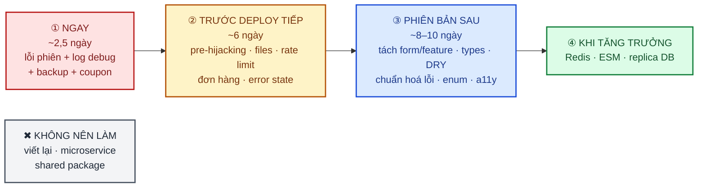

# 08 · Lộ trình cải thiện

> Mốc review: commit `bdf8d99`. Ước lượng tính cho 1 người đã quen codebase, **đã gồm viết test**.
> Công việc cụ thể và tiêu chí hoàn thành nằm ở [`CHECKLIST.md`](../CHECKLIST.md), phần "Lộ trình cải
> thiện theo review-source".

## ① Làm ngay (khoảng 2,5 ngày)

Mục tiêu: chặn các lỗi đang ảnh hưởng người dùng thật và dọn "rác" đã vào `main`.

| Thứ tự | Mã | Việc | Ước lượng |
|---|---|---|---|
| 1 | CODE-01 | Xoá 7 `console.log` DEBUG; thêm rule `no-console` | 15 phút |
| 2 | OPS-01 | Bật branch protection (CI xanh mới được merge); từ nay làm trên nhánh tính năng | 30 phút |
| 3 | SEC-01, SEC-02, TEST-02 | Cột `rotatedAt` + migration; reuse detection chỉ xét token đã xoay vòng; refresh lỗi 401/403 thì xoá cookie; test phân biệt thu hồi hợp lệ và xoay vòng | 4 giờ |
| 4 | ERR-01, FE-01, FE-02, TEST-01 | Hàng đợi reject đúng; đặt `me = null` khi phiên chết; `useSearchParams` + chỉ điều hướng khi `/me` mới; điều hướng cứng sau đăng nhập; E2E bấm Link sau khi token hết hạn. **Mở lại docs/12 FE-08** | 1 ngày |
| 5 | SEC-04 | Ép khoá mã hoá backup ở production; upload `type: "authenticated"`; kiểm tra ngay cấu hình production và các file backup đã upload | 2 giờ + thao tác vận hành |
| 6 | VAL-01 | Validate coupon sau khi merge; kẹp discount ≤ subtotal | 1 giờ |
| 7 | DOC-01 | `frontend/.env.example` + `!.env.example` trong `.gitignore` | 30 phút |

## ② Trước lần deploy tiếp theo (khoảng 6 ngày)

| Mã | Việc | Ước lượng |
|---|---|---|
| SEC-03 | Liên kết Google/magic link vào tài khoản chưa xác minh thì xoá mật khẩu + thu hồi phiên; cân nhắc xác minh email khi đăng ký | 1 ngày |
| SEC-05 | Kiểm tiền tố `publicId`, `uploadedBy`, MIME; rate limit presign | 3 giờ |
| SEC-06 | Factory rate limiter; thêm limiter cho refresh/verify/coupons/tra đơn/presign/đổi mật khẩu; chặn `DISABLE_RATE_LIMIT` ở production | 3 giờ |
| SEC-07 | Tách seed bắt buộc và seed mẫu; không in mật khẩu | 2 giờ |
| ERR-02, ERR-03, ERR-04 | Body-parser → 400/413; log `{ err }`; handler cấp tiến trình + `io.close()` + `.catch` cho cron | 4 giờ |
| ERR-05 | Bắt buộc `variantId`; bảng chuyển trạng thái; hoàn lượt coupon khi huỷ; sinh mã đơn trong transaction | 1 ngày |
| DB-02, DB-04 | Sửa kiểm slug; chặn xoá file đang dùng, job xoá DB trước | 4 giờ |
| FE-04, FE-09 | `QueryState` cho mọi danh sách; `confirmDialog` cho thao tác phá huỷ | 6 giờ |
| ARCH-03 | Cookie gợi ý phiên cho proxy, hoặc refresh chủ động; chỉ gọi `useMe` công khai khi có gợi ý | 1 ngày |
| DOC-02 | Rà và sửa các tài liệu lệch đã liệt kê; bỏ số test khỏi README | 4 giờ |

## ③ Phiên bản sau (khoảng 8–10 ngày, làm dần)

Làm theo nguyên tắc: **động vào feature nào thì chuẩn hoá feature đó**, không làm một lần cho tất cả.

- **Backend**:
  - CODE-02 (gom `slug`/`pagination`/`tree`/rate limiter)
  - CODE-03 (tách `orders.create`)
  - BE-02 (danh mục mã lỗi + shape lỗi)
  - ARCH-01 (dọn ranh giới core/domain)
  - DB-01 (enum), DB-03 (transaction), DB-05 (index), DB-06 (kiểm drift), DB-07
  - VAL-02, ERR-06, BE-03, SEC-08 → SEC-12
- **Frontend**:
  - FE-03 (tách form theo feature, bắt đầu từ products)
  - VAL-03 (RHF + zod, bắt đầu từ checkout)
  - FE-05 (types), FE-06 + FE-07 (key factory + invalidate chéo)
  - FE-08 (a11y + bật `jsx-a11y`)
  - FE-10, FE-11, ERR-07
- **Chung**: TEST-03 (E2E luồng mua hàng), CODE-04/05/06, OPS-02, OPS-03, DOC-03.

## ④ Khi tăng trưởng (chỉ làm khi có tín hiệu thật)

| Tín hiệu | Việc | Mã |
|---|---|---|
| Cần chạy >1 instance API | Redis adapter cho Socket.io + Redis store cho rate limit (lúc đó mới cần Redis) | ARCH-02 |
| Codebase ổn định, test phủ tốt | Chuyển backend sang ESM (`NodeNext`) trong một PR riêng | BE-01 |
| Dữ liệu và doanh thu lớn lên | Postgres managed/replica; diễn tập khôi phục backup định kỳ; tài khoản lưu trữ backup riêng | SEC-04, OPS-03 |
| Có tích hợp thanh toán online | Xác thực email trước khi thanh toán, CSP nghiêm ngặt | SEC-03, SEC-11 |

## ✖ Không nên làm lúc này (và vì sao)

| Đề xuất | Lý do loại |
|---|---|
| Viết lại backend/frontend hoặc đổi framework (NestJS, NextAuth...) | Kiến trúc hiện tại đã gần chuẩn; lỗi nằm ở chi tiết, không nằm ở cấu trúc |
| Tách microservice, thêm message queue | Quy mô 1 cửa hàng, 1 instance — YAGNI |
| Thêm Redis ngay | Chưa scale; chỉ cần sửa comment "scale an toàn" (ARCH-02) |
| Tạo `packages/shared` để dùng chung zod schema FE/BE | Chuẩn khoá học không khuyến nghị; hai phía có mục đích khác nhau |
| Viết `useCrudPage`/`BaseService` generic ngay lập tức | Tách tay 3 trang đầu trước (rule-of-three), nếu không sẽ trừu tượng hoá sai |
| Đặt mục tiêu coverage % | Ưu tiên test đúng điều kiện thật cho luồng rủi ro cao (xem TEST-01) |
| Chuyển Zustand/React Query sang giải pháp khác | Đang dùng đúng vai trò |
